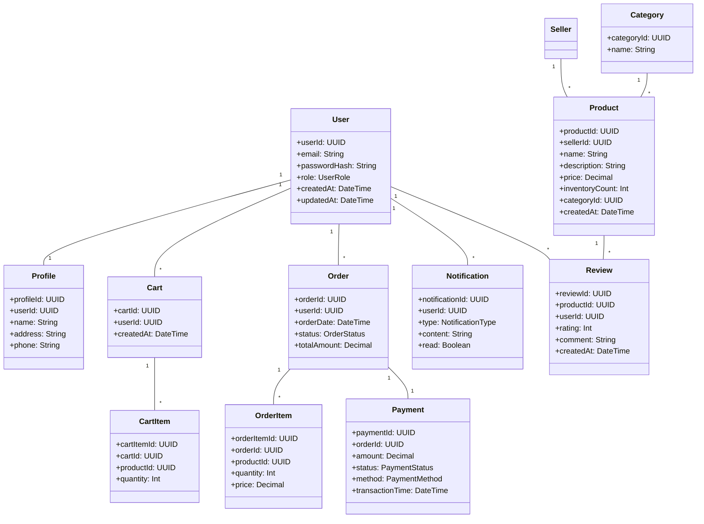

# High-Level Design (HLD) & Domain Model: Online Shopping Platform

## 1. Validation Report

**Requirements Coverage:**
- Registration/Login: Covered
- Product Catalog: Covered
- Search & Filter: Covered
- Shopping Cart: Covered
- Secure Checkout: Covered
- Order Tracking: Covered
- RBAC: Covered
- Seller/Admin Dashboards: Covered
- Notifications: Covered (Should Have)
- Multiple Payment Methods: Covered (Should Have)
- Reviews & Refunds: Covered (Should Have)
- Recommendations, Wishlist, Logistics Integration: Not Core (Nice to Have)

**Compliance & Security:**
- PCI DSS: Addressed for payments
- Encryption: AES-256 at rest, TLS 1.3 in transit
- RBAC for all roles (Consumer, Seller, Admin)
- Audit Logging for sensitive actions
- Accessibility: WCAG 2.1 AA
- Data retention, consent management, data lineage, compliance reporting included
- Error handling: retries, logging, circuit breaker patterns

**Non-Functional:**
- Performance, scalability, availability, accessibility: Addressed

**Gaps/Assumptions:**
- Custom payment gateway and direct logistics are out of scope.
- Native mobile apps out of scope.

## 2. Domain Model (UML/ERD)



## 3. High-Level Design Document

### 3.1 Architecture Overview

```
+-------------------+       +---------------------+       +---------------------+
|  Web/Mobile Client| <---> |  API Gateway        | <---> |  Microservices      |
+-------------------+       +---------------------+       +---------------------+
                                               |---> Auth Service
                                               |---> Product Catalog Service
                                               |---> Cart Service
                                               |---> Order Service
                                               |---> Payment Service
                                               |---> Notification Service
                                               |---> Review Service
                                               |---> Admin Dashboard
                                               |---> Seller Dashboard
                                               |---> Compliance/Audit Service
```

- **API Gateway**: Enforces input validation, RBAC/ABAC, rate-limiting.
- **Microservices**: Individual domain services for modularity & scalability.
- **Data Store**: Encrypted (AES-256), RDBMS/NoSQL, audit logs.
- **Integration**: External payment gateway (PCI DSS), email/SMS, analytics.

### 3.2 Major Components
- **Authentication & RBAC**: JWT tokens, RBAC enforcement, OAuth2/SAML integration possible.
- **Product Catalog**: Search, filter, recommendations, inventory updates.
- **Shopping Cart**: Persistent cart, real-time updates.
- **Order Management**: Order placement, tracking, status updates.
- **Payment Service**: Secure payment, PCI DSS compliance, 3DS, refunds, audit logs.
- **Notification Service**: Email/SMS/push notifications.
- **Dashboards**: Seller and admin analytics, management tools.
- **Review & Refund**: Customer feedback, refund processing.
- **Compliance/Audit**: Data retention, consent management, audit logs, lineage, reporting.

### 3.3 Integration Points
- Payment Gateway (PCI DSS)
- Notification providers (Email/SMS)
- Analytics/Reporting tools

### 3.4 Security & Compliance Features
- **Encryption**: AES-256 at rest, TLS 1.3 in transit
- **RBAC/ABAC**: Enforced at gateway & service level
- **Audit Logging**: All critical actions
- **Secrets Management**: Vault/KMS integration
- **Input Validation & Output Filtering**: API gateway & services
- **Fraud Detection**: Anomaly detection service
- **Data Retention & Consent**: GDPR/CCPA compliant
- **Accessibility**: WCAG 2.1 AA

### 3.5 Data Flow
1. User registers/logins via encrypted channel.
2. Browses product catalog, adds items to cart.
3. Proceeds to checkout; payment processed via PCI DSS-compliant gateway.
4. Orders tracked; notifications sent.
5. Refunds/returns handled securely.
6. All actions logged for audit/compliance.

### 3.6 Error Handling
- **Retries**: For transient failures (payment, notifications).
- **Logging**: Centralized error logging, monitoring.
- **Circuit Breaker**: For integration points (e.g., payment gateway outages).

---

## 4. Output
- **Domain Model**: See UML class diagram above (Mermaid syntax).
- **High-Level Design**: Architecture, components, security, and compliance features as detailed.
- **Validation Report**: See above checklist.
