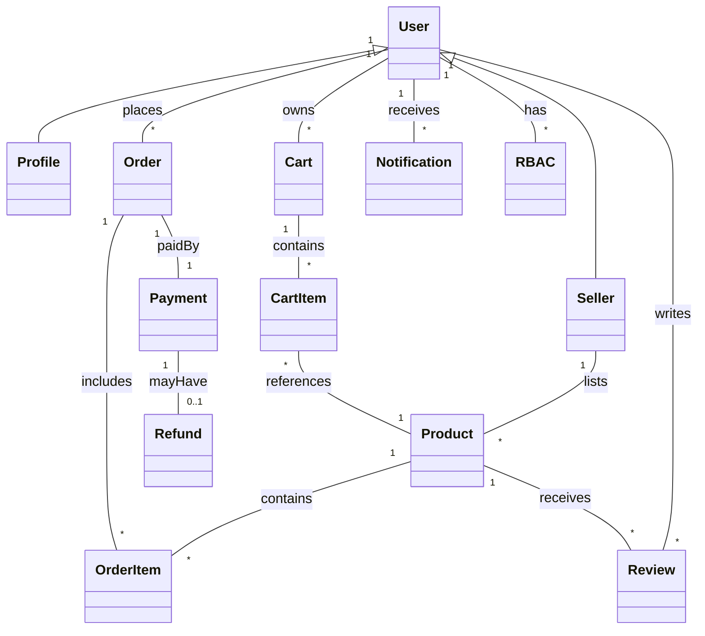

# Online Shopping Platform – High-Level Design (HLD) and Domain Model

## 1. Validation Report

### Completeness & Clarity
- Core features (registration, login, product catalog, search, filter, cart, checkout, order tracking, dashboards) are clearly specified.
- Non-functional requirements (performance, security, scalability, uptime, accessibility) are well defined.
- Target users and business objectives are articulated.
- Acceptance criteria and key risks are enumerated.

### Compliance
- PCI DSS, privacy, and accessibility (WCAG 2.1 AA) requirements are noted.
- Risk management for fraud, outages, and privacy is addressed.

### Error Handling
- Payment failure, order processing issues, and scalability bottlenecks are considered.

---

## 2. Domain Model (UML/ERD)

### Entities and Attributes

**User**
- user_id (PK)
- username
- email
- password_hash
- role (Consumer, Seller, Admin)
- registration_date
- status

**Profile**
- profile_id (PK)
- user_id (FK)
- name
- address
- contact_number

**Product**
- product_id (PK)
- seller_id (FK)
- name
- description
- price
- category
- inventory_count
- status
- image_url

**Order**
- order_id (PK)
- user_id (FK)
- order_date
- status
- total_amount
- payment_id (FK)

**OrderItem**
- order_item_id (PK)
- order_id (FK)
- product_id (FK)
- quantity
- price_at_purchase

**Cart**
- cart_id (PK)
- user_id (FK)

**CartItem**
- cart_item_id (PK)
- cart_id (FK)
- product_id (FK)
- quantity

**Payment**
- payment_id (PK)
- order_id (FK)
- payment_method
- amount
- payment_status
- transaction_date

**Review**
- review_id (PK)
- product_id (FK)
- user_id (FK)
- rating
- comment
- review_date

**Notification**
- notification_id (PK)
- user_id (FK)
- content
- status
- sent_at

**Refund**
- refund_id (PK)
- payment_id (FK)
- amount
- status
- requested_at
- processed_at

**RBAC (Role-Based Access Control)**
- role_id (PK)
- role_name
- permissions

#### Relationships
- User 1---1 Profile
- User 1---* Cart
- User 1---* Order
- User 1---* Review
- User 1---* Notification
- User 1---* RBAC
- Seller (User) 1---* Product
- Product 1---* Review
- Product 1---* OrderItem
- Order 1---* OrderItem
- Order 1---1 Payment
- Payment 1---0..1 Refund
- Cart 1---* CartItem
- CartItem *---1 Product

---

## 3. High-Level Architecture Overview

### Architecture Diagram (Textual)

- **Web Frontend** (React/Vue)
    - User registration, catalog browsing, checkout, dashboards
    - Accessibility (WCAG 2.1 AA)
- **API Gateway** (REST/GraphQL)
- **Authentication Service** (OAuth2/JWT, MFA)
- **User Management Service** (RBAC/ABAC)
- **Product Catalog Service**
- **Order Management Service**
- **Cart Service**
- **Payment Service** (PCI DSS Compliant, supports multiple payment methods)
- **Review & Notification Service**
- **Refund Service**
- **Admin/Seller Dashboards**
- **Database Layer** (RDBMS/NoSQL)
- **Audit Logging & Monitoring**
- **Integration Points**
    - Payment Gateway (PCI DSS)
    - Email/SMS Gateway
    - Optional: Third-party Logistics (future)

### Major Components
- **Frontend**: Web SPA, responsive, accessible.
- **Backend Microservices**: Each core feature as a service.
- **API Gateway**: Central ingress, rate limiting, input validation.
- **Database**: Encrypted at rest (AES-256), access via RBAC.
- **Integration**: Payment gateway, notification systems.

### Data Flow (User Journey)
1. User registers/login (Authentication Service)
2. Browses catalog (Product Service)
3. Adds items to cart (Cart Service)
4. Proceeds to checkout (Order, Payment Service)
5. Payment processed securely (PCI DSS, TLS 1.3)
6. Order tracked, notifications sent
7. Refund/Review if needed

---

## 4. Security & Compliance

- **Input Validation**: All endpoints, strict schema validation
- **Output Filtering**: Sensitive data masked or omitted
- **Encryption**: AES-256 at rest, TLS 1.3 in transit
- **RBAC/ABAC**: Role and attribute-based access
- **Audit Logging**: All admin and sensitive actions logged
- **Secrets Management**: Vault or KMS for API keys, DB credentials
- **PCI DSS Compliance**: Payment data isolated, tokenization
- **Data Retention**: Per privacy law, configurable retention periods
- **Consent Management**: Explicit user consent for data processing
- **Data Lineage**: Track flow of PII and payment data
- **Compliance Reporting**: Automated reports for audits
- **Accessibility**: WCAG 2.1 AA compliance, regular audits

---

## 5. Error Handling Patterns
- **Retries**: For payment, notification, and integration failures (exponential backoff)
- **Logging**: Centralized, structured logs for traceability
- **Circuit Breaker**: For unreliable integrations (e.g., payment gateways)
- **Graceful Degradation**: Fallbacks for non-critical services
- **User Feedback**: Clear, actionable error messages

---

## 6. Diagram: Domain Model (UML/ERD Textual)

---

## 7. Appendix
- This HLD is aligned with enterprise architecture standards and regulatory requirements (PCI DSS, GDPR/privacy, accessibility).
- All critical business, security, and compliance features are addressed.
- Future extensibility (e.g., logistics integration) is architected.
