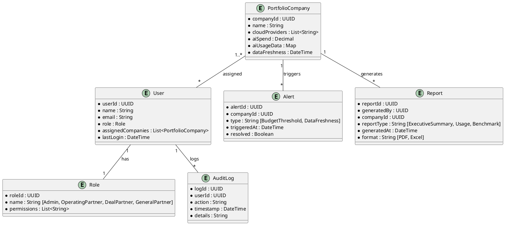

## 2. Domain Model (UML Class Diagram)



---
## 3. Architecture Overview

### Architecture Diagram
```
[User] -> [SSO/Auth Service] -> [AI Dashboard UI]
[AI Dashboard UI] <-> [Dashboard API Gateway]
[Dashboard API Gateway] <-> [Portfolio Data Aggregator]
[Portfolio Data Aggregator] <-> [Cloud Provider Integrations (AWS, Azure, GCP)]
[Portfolio Data Aggregator] <-> [Data Lake / Storage]
[Dashboard API Gateway] <-> [Alerting Engine]
[Dashboard API Gateway] <-> [Reporting Engine]
[Dashboard API Gateway] <-> [RBAC/ABAC Service]
[Dashboard API Gateway] <-> [Audit Logging Service]
```

### Major Components
- **AI Dashboard UI**: Web app (WCAG 2.1 AA compliant)
- **SSO/Auth Service**: Integrates with enterprise SSO (OIDC/SAML)
- **Dashboard API Gateway**: Central entry point for all dashboard features
- **Portfolio Data Aggregator**: ETL microservice for automated AI usage collection from cloud APIs
- **Cloud Provider Integrations**: Secure connectors for AWS, Azure, GCP
- **Data Lake / Storage**: Encrypted data store for aggregated portfolio data
- **Alerting Engine**: Monitors spend, data freshness, triggers alerts
- **Reporting Engine**: Generates and exports reports
- **RBAC/ABAC Service**: Role and attribute-based access control
- **Audit Logging Service**: Tracks access and actions for compliance

### Integration Points
- Cloud AI APIs (AWS, Azure, GCP)
- Enterprise SSO (OIDC/SAML)
- PDF/Excel export libraries
- Monitoring and logging frameworks

---
## 4. Security & Compliance Features

### Security
- Input validation and output filtering at API boundaries
- AES-256 encryption at rest, TLS 1.3 in transit
- RBAC/ABAC for user access
- Audit logging (every access, permission change)
- Secure secrets management (vault, KMS)
- Automated failover, daily data backups

### Compliance
- Data retention per regulatory policy (GDPR, CCPA, SOX)
- Consent management for portfolio company data
- Data lineage tracking (source, transformation, destination)
- Compliance reporting for audit and regulator review
- Accessibility (WCAG 2.1 AA)

---
## 5. Data Flow (Sequence)

1. User authenticates via SSO
2. Dashboard UI requests aggregated AI usage via API Gateway
3. Data Aggregator fetches portfolio AI data from cloud providers
4. Data is stored encrypted in Data Lake
5. Dashboard UI displays real-time and historical analytics
6. Alerting Engine triggers notifications for budget/data issues
7. Reporting Engine exports requested data
8. Audit Logging Service records all access/actions

---
## 6. Error Handling Patterns
- Circuit breaker for external API integrations
- Retries with exponential backoff for cloud data fetches
- Logging of errors and user actions for traceability
- Notification to admins for unresolved issues or missing data

---
## 7. HLD Summary
- Cloud-native, microservices architecture
- Security, compliance, and accessibility prioritized
- Real-time analytics, alerts, and reporting for actionable insights
- Scalable to 200 companies, 1,000 users
- Automated, auditable, and user-friendly
---
