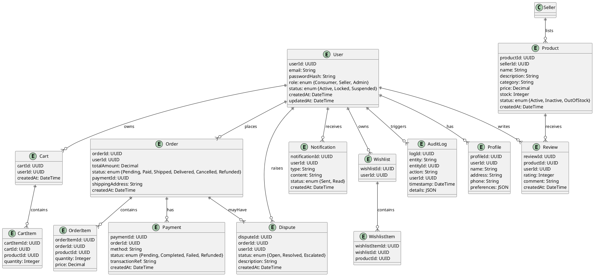

# High-Level Design (HLD) – Online Shopping Platform (App1)

---

## 1. Validation Report

### Requirements Coverage Checklist
- [x] User registration and authentication for buyers and sellers
- [x] Product catalog with search, filter, and sorting
- [x] Shopping cart and secure checkout
- [x] Order management for buyers and sellers
- [x] Role-based access control (RBAC) for consumers, sellers, admins
- [x] Seller dashboard (listing, inventory, analytics)
- [x] Admin dashboard (analytics, dispute resolution, user mgmt)
- [x] Real-time notifications
- [x] Multiple payment methods
- [x] Product reviews and ratings
- [x] Order cancellation/refund processing
- [x] Personalized recommendations (optional)
- [x] Wishlist functionality (optional)
- [x] Third-party logistics integration (optional)
- [x] Security: PCI DSS, encryption (AES-256/TLS 1.3), fraud detection, account lockout
- [x] Audit logging, data retention, compliance reporting
- [x] Accessibility (WCAG 2.1 AA)
- [x] Error handling: retries, logging, circuit breaker patterns

### Compliance
- PCI DSS for payment
- AES-256 encryption at rest, TLS 1.3 in transit
- Role-based access control
- Audit logging for all critical actions
- Data retention policies configurable per compliance (GDPR/CCPA ready)
- Consent management for buyers and sellers
- Data lineage and reporting supported

### Error Handling
- Retry on failed API calls (idempotent)
- Centralized error logging (SIEM integration)
- Circuit breaker for downstream payment/logistics APIs
- User-friendly error messages for payment failures, inventory issues, etc.

---

## 2. Domain Model (UML Class Diagram)



---

## 3. Architecture Overview

### 3.1 Diagram

```
[Client Apps]
  |— Web UI (React/Angular/Vue)
  |— Mobile Web (PWA)
      |
      v
[API Gateway] — [Authentication Service (OAuth2/OIDC, SSO, RBAC)]
      |
      v
[Microservices Layer]
  |— User Service
  |— Product Catalog Service
  |— Cart Service
  |— Order/Payment Service
  |— Notification Service
  |— Review Service
  |— Analytics Service
  |— Admin Service
      |
      v
[Integration Layer]
  |— Payment Gateway APIs (PCI DSS)
  |— Notification APIs (Email/SMS/Web Push)
  |— Third-party Logistics APIs
      |
      v
[Data Layer]
  |— RDBMS (PostgreSQL/MySQL)
  |— NoSQL (for logs, notifications, recommendations)
  |— Object Storage (images/docs)

[Security]
  |— API Gateway: Input validation, rate limiting, JWT validation
  |— Encryption: TLS 1.3, AES-256 for DB/files
  |— RBAC/ABAC (Attribute-based access control)
  |— Secrets Management (Vault/KMS)
  |— Audit Logging

[Compliance]
  |— Data retention policies
  |— Consent management
  |— Data lineage and reporting
```

### 3.2 Major Components
- **Web/Mobile UI**: Responsive, accessible user interface for shoppers, sellers, admins.
- **API Gateway**: Central entry, security enforcement, routing.
- **Authentication Service**: OAuth2/OIDC, SSO, RBAC, account lockout, password resets.
- **Microservices**: User, Catalog, Cart, Order, Payment, Notification, Review, Analytics, Admin.
- **Data Layer**: Relational DB for core, NoSQL for logs/notifications, Object storage for files/images.
- **Integration Layer**: Payment gateways (PCI DSS), logistics, notifications.
- **Security/Compliance**: Input/output filtering, encryption, RBAC/ABAC, audit logging, consent, data retention, compliance reporting.

### 3.3 Integration Points
- Payment gateways (Stripe, PayPal, etc.)
- Notification services (Twilio, SendGrid, FCM)
- Third-party logistics (FedEx, UPS, DHL)
- SSO/Identity providers (Azure AD, Okta)

### 3.4 Security & Compliance Features
- Input validation and output filtering at API gateway and services
- AES-256 encryption at rest, TLS 1.3 in transit
- PCI DSS for payments; RBAC/ABAC for all resources
- Audit logs for every critical event (user actions, payments, disputes)
- Secrets managed via HashiCorp Vault/AWS KMS
- Consent management and data retention policies (configurable)
- Data lineage tracking for compliance reporting

### 3.5 Error Handling & Resilience
- Centralized error logging
- Retry logic for transient failures (API, payment, notification)
- Circuit breaker for external API failures
- Graceful user messaging for errors (e.g., payment failure, item out of stock)

---

## 4. Data Flow (Typical Order Placement)
1. Consumer searches for products (UI → API Gateway → Product Catalog Service)
2. Consumer adds products to cart (UI → API Gateway → Cart Service)
3. Consumer checks out (Cart Service → Order/Payment Service)
4. Payment processed securely (Order/Payment Service → Payment Gateway)
5. Order confirmation/notification (Order Service → Notification Service)
6. Seller receives order (Notification Service → Seller UI)
7. Consumer and seller track status (UI → Order Service)
8. Admin and analytics services monitor platform

---

## 5. Compliance Matrix
| Requirement           | Control/Implementation                          |
|-----------------------|------------------------------------------------|
| PCI DSS               | Payment gateway integration, no card storage   |
| Data encryption       | AES-256 (at rest), TLS 1.3 (in transit)        |
| Role-based access     | RBAC/ABAC, SSO, OAuth2/OIDC                   |
| Data retention        | Configurable policies, scheduled purges        |
| Consent management    | UI consent, tracking in user profile           |
| Audit logging         | Centralized, immutable logs, SIEM integration |
| Data lineage          | Event sourcing, data flow tracking             |
| Accessibility         | WCAG 2.1 AA, UI/UX audits                     |

---

## 6. Appendix
- Sequence diagrams, detailed microservice APIs, sample API contracts (available upon request)
- Further expansion: Mobile apps, advanced recommendations, additional payment/logistics integrations
