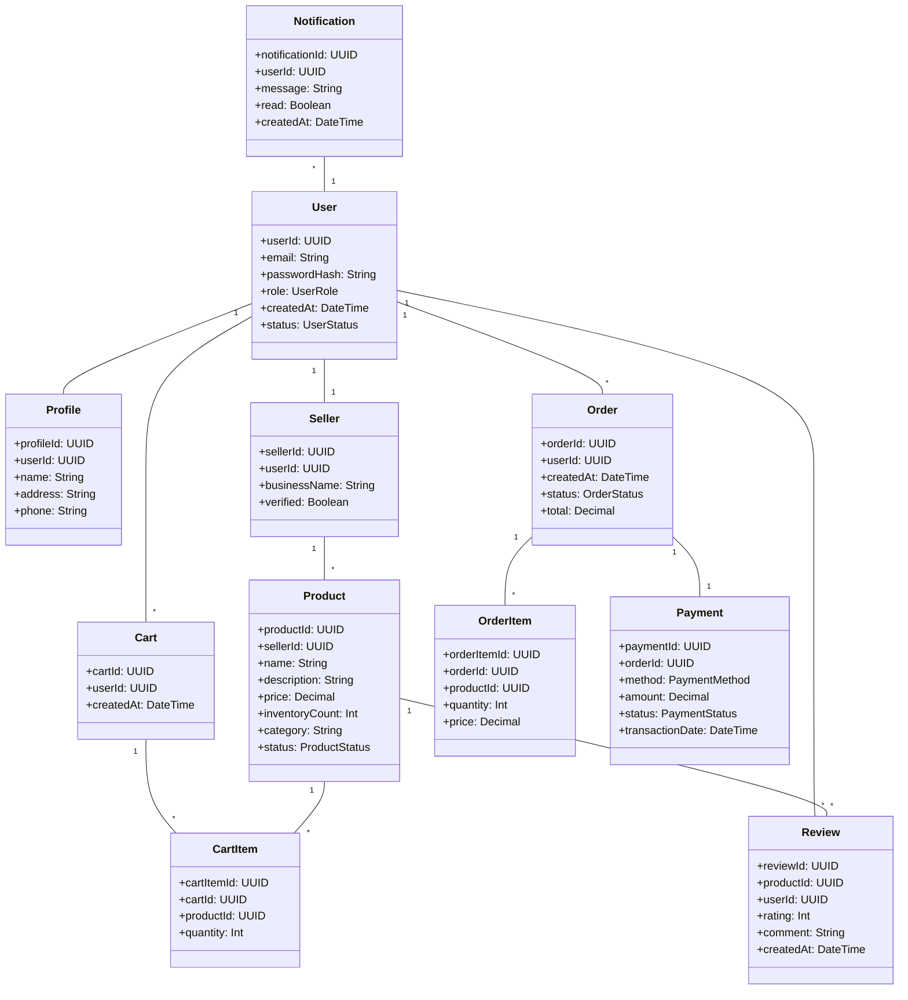
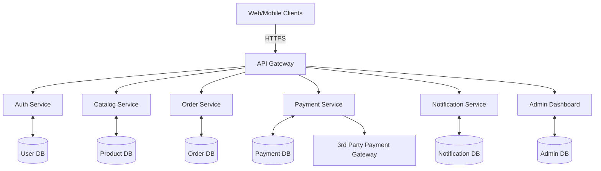

# High-Level Design (HLD) – Online Shopping Platform (APBDemo)

## 1. Validation Report

**Requirements Coverage Checklist:**
- [x] User Registration & Login
- [x] Product Catalog
- [x] Search & Filter
- [x] Shopping Cart
- [x] Secure Checkout
- [x] Order Tracking
- [x] Role-Based Access Control (RBAC)
- [x] Seller/Admin Dashboards
- [x] Notifications
- [x] Multiple Payment Methods
- [x] Reviews
- [x] Refunds
- [x] Recommendations, Wishlist (optional)
- [x] PCI DSS, Fraud Detection, Encryption
- [x] Scalability & Availability
- [x] Accessibility (WCAG 2.1 AA)
- [x] Performance (≤2s page load, ≤5s checkout)

**Compliance & Error Handling:**
- [x] Data retention, consent management, data lineage
- [x] Audit logging
- [x] Input validation, output filtering
- [x] Encryption (AES-256, TLS 1.3)
- [x] RBAC/ABAC
- [x] Circuit breaker, retries, logging

## 2. Domain Model (UML/ERD)

## 3. Architecture Overview

**Architecture Diagram:**

## 4. Major Components

- **API Gateway:** Central entry point, request routing, rate limiting, input validation.
- **Auth Service:** Registration, login, RBAC/ABAC, JWT tokens, password hashing (bcrypt/scrypt), MFA.
- **Catalog Service:** Product search, filter, recommendations, wishlist.
- **Order Service:** Cart, checkout, order tracking, refunds, audit logging.
- **Payment Service:** PCI DSS compliant, multiple payment methods, AES-256/TLS 1.3 encryption, fraud detection, integration with 3rd party payment gateways.
- **Notification Service:** Email/SMS/push, user and seller notifications.
- **Admin Dashboard:** Seller onboarding, product moderation, compliance reporting, data lineage.
- **Databases:** Segregated for users, products, orders, payments, notifications, admin.

## 5. Integration Points

- **Payment Gateway:** Secure integration (PCI DSS, tokenization, circuit breaker for outages).
- **Notification Providers:** Email/SMS APIs.
- **Analytics/Reporting:** Data warehouse for compliance, reporting, and lineage.

## 6. Security & Compliance Features

- **Input Validation & Output Filtering:** Strict validation at API gateway and service layer.
- **Encryption:** AES-256 for data at rest, TLS 1.3 for data in transit.
- **RBAC/ABAC:** Role-based and attribute-based access for all core flows.
- **Audit Logging:** All critical actions (orders, payments, refunds, admin actions).
- **Secrets Management:** Vault-based, no hardcoded secrets.
- **PCI DSS Compliance:** Payment flows, card data isolation.
- **Fraud Detection:** Real-time monitoring, anomaly alerts.
- **Data Retention & Consent:** Policies enforced, user consent tracking, GDPR/CCPA ready.
- **Data Lineage:** Full traceability of critical data (orders, payments).
- **Compliance Reporting:** Automated, supports regulatory audits.

## 7. Error Handling & Reliability

- **Retries:** For transient failures (e.g., payment gateway, notifications).
- **Logging:** Centralized, structured, with alerting for critical failures.
- **Circuit Breaker:** To handle 3rd party/API failures gracefully.
- **Graceful Degradation:** Cart, catalog, and order flows remain available if non-critical services fail.

---

*This HLD covers all mandatory requirements, security, compliance, and error handling as per the PRD for the Online Shopping Platform.*