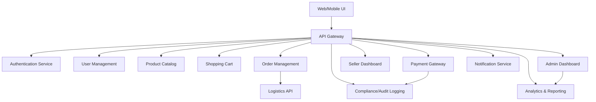

# High-Level Design (HLD): Online Shopping Platform

## Domain Model (UML/ERD)

**Entities:**
- User (user_id, name, email, password_hash, role, registration_date, last_login, status)
- Profile (profile_id, user_id [FK], address, phone, preferences, accessibility_settings)
- Role (role_id, name, permissions)
- Product (product_id, seller_id [FK], name, description, price, category, images, stock_quantity, status, rating)
- Seller (seller_id, user_id [FK], business_name, contact_info, onboarding_date, status)
- ShoppingCart (cart_id, user_id [FK], created_at, updated_at)
- CartItem (cart_item_id, cart_id [FK], product_id [FK], quantity)
- Order (order_id, user_id [FK], seller_id [FK], created_at, status, payment_id [FK], total_amount)
- OrderItem (order_item_id, order_id [FK], product_id [FK], quantity, price)
- Payment (payment_id, order_id [FK], payment_method, status, transaction_id, amount, timestamp)
- Notification (notification_id, user_id [FK], message, type, created_at, read_status)
- Review (review_id, product_id [FK], user_id [FK], rating, comment, created_at)
- Refund (refund_id, order_id [FK], amount, status, processed_at)
- Dispute (dispute_id, order_id [FK], user_id [FK], seller_id [FK], description, status, resolution, created_at)

**Relationships:**
- User 1---* Profile
- User 1---* ShoppingCart
- User 1---* Order
- User 1---* Notification
- User 1---* Review
- Seller 1---* Product
- Product 1---* Review
- Order 1---* OrderItem
- Order 1---1 Payment
- Order 1---0..1 Refund
- Order 1---* Dispute
- ShoppingCart 1---* CartItem
- CartItem *---1 Product

---

## Architecture Overview

**Major Components:**
- Web App (React/Angular/Vue)
- Mobile Web (Responsive UI)
- API Gateway
- Authentication Service (OAuth2/JWT)
- User Management Module
- Product Catalog Service
- Shopping Cart Service
- Order Management Service
- Payment Integration (PCI DSS compliant)
- Notification Service (Email/SMS/Push)
- Seller Dashboard
- Admin Dashboard
- Analytics & Reporting
- Compliance & Audit Logging

**Integration Points:**
- Third-Party Payment Gateways (Stripe, PayPal, etc.)
- Email/SMS Providers (Twilio, SendGrid)
- Logistics APIs (shipping/tracking)
- Cloud Hosting/CDN (AWS/Azure/GCP)

**Architecture Diagram:**

---

## Component Descriptions

- **Web/Mobile UI:** Responsive, accessible (WCAG 2.1 AA), supports keyboard/screen reader.
- **API Gateway:** Central entry point, TLS 1.3, input validation, output filtering, circuit breaker.
- **Authentication Service:** OAuth2/JWT, password hashing (bcrypt), account lockout, MFA.
- **User Management:** Registration, profile updates, RBAC/ABAC, consent management, audit logging.
- **Product Catalog:** Search, filter, sort, product reviews, recommendations.
- **Shopping Cart:** Add/remove items, persistent carts, error handling.
- **Order Management:** Status tracking, cancellation/refunds, dispute resolution, data lineage.
- **Payment Integration:** PCI DSS, AES-256/TLS 1.3, multiple methods, error/retry logic.
- **Notification Service:** Real-time order/inventory alerts, retry/failure logging.
- **Seller Dashboard:** Product listing, inventory management, analytics.
- **Admin Dashboard:** Platform analytics, dispute management, fraud detection.
- **Analytics & Reporting:** KPIs, compliance reporting, data retention.
- **Compliance/Audit Logging:** GDPR/CCPA, consent, retention, access logs.

---

## Security & Compliance Features

- **Input Validation:** All endpoints, strict schema, reject malformed data.
- **Output Filtering:** Prevent data leaks, sanitize responses.
- **Encryption:** AES-256 for data at rest, TLS 1.3 for data in transit.
- **RBAC/ABAC:** Role- and attribute-based access control, least privilege.
- **Audit Logging:** User actions, admin changes, payment/refund events.
- **Secrets Management:** Vault, KMS, environment isolation.
- **Data Retention:** Configurable per regional law, automatic purging.
- **Consent Management:** User consent tracking, opt-out, compliance reports.
- **Data Lineage:** Track data origin and changes (orders, payments, refunds).
- **Compliance Reporting:** Exportable logs, automated periodic reports.

---

## Error Handling & Reliability

- **Retries:** Payment, notification, third-party API calls (exponential backoff).
- **Logging:** Errors, warnings, security events, compliance failures.
- **Circuit Breaker:** API Gateway and external integrations.
- **Failover:** Automated backup, disaster recovery (RTO < 30 min).
- **Accessibility:** WCAG 2.1 AA, keyboard/screen reader support, logical navigation.

---

## Validation Report

### Requirements Coverage Checklist

- [x] User registration/authentication (FR1, AC1)
- [x] Product catalog/search/filter (FR2, AC2)
- [x] Shopping cart/checkout/payment (FR3, AC3)
- [x] Order management/status tracking (FR4, AC4)
- [x] Role-based access (FR5)
- [x] Seller dashboard/listing/inventory (FR6, AC5)
- [x] Admin dashboard/disputes/analytics (FR7, AC8)
- [x] Notifications/alerts (FR8)
- [x] Multiple payment methods (FR9)
- [x] Product reviews/ratings (FR10)
- [x] Order cancellation/refund (FR11, AC7)
- [x] Recommendations/wishlist (FR12, FR13)
- [x] Logistics integration (FR14)
- [x] Accessibility (WCAG 2.1 AA, AC9)
- [x] Scalability/reliability (AC10)

### Compliance Checklist

- [x] PCI DSS (payments)
- [x] GDPR/CCPA (data privacy)
- [x] Data retention/lineage/consent
- [x] Audit logging
- [x] Exportable compliance reports

### Error Handling Checklist

- [x] Input validation/output filtering
- [x] Logging (errors, retries, failures)
- [x] Circuit breaker for APIs
- [x] Payment failure (AC6)
- [x] Order cancellation/refund (AC7)
- [x] Automated failover/disaster recovery

---

## Output Summary

- **Domain Model:** UML entities/relationships (see above)
- **HLD:** Architecture diagram, component descriptions, security/compliance
- **Validation Report:** Requirements/compliance/error handling checklist
