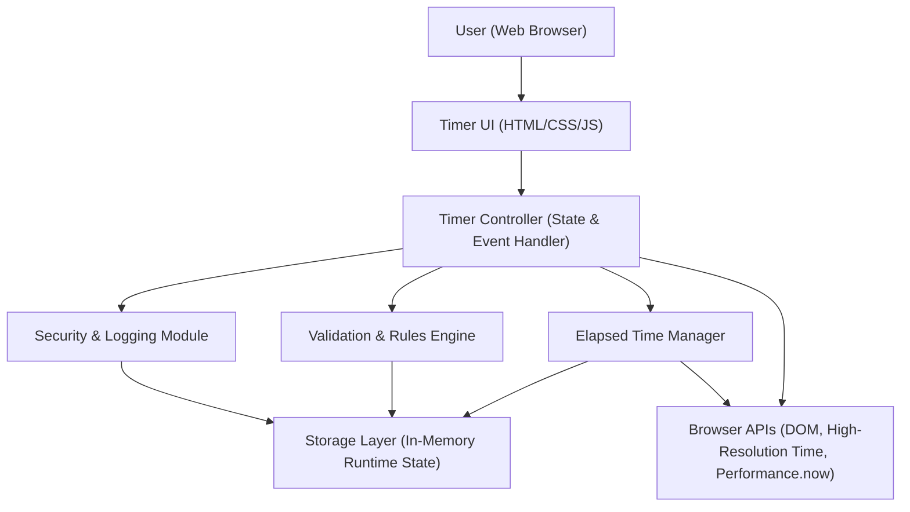

#### 1. High-Level Design

- Architecture Overview & Component Diagram:

- Component Descriptions:

  - **User (Web Browser)**  
    Human user accessing the timer via a modern web browser.

  - **Timer UI (HTML/CSS/JS)**  
    Renders the white background, timer display (HH:MM:SS), and controls (Start, Pause, Stop). Forwards user actions as events to the Timer Controller and updates the DOM based on state changes.

  - **Timer Controller (State & Event Handler)**  
    Central orchestration component running in the browser. Handles Start, Pause, and Stop events, enforces “only one running timer” rule, coordinates with the Elapsed Time Manager and Validation & Rules Engine, and triggers UI updates and logging.

  - **Elapsed Time Manager**  
    Manages the logical computation of elapsed time, including start timestamps, pause/resume offsets, and continuous updates of HH:MM:SS display using browser timing APIs.

  - **Validation & Rules Engine**  
    Applies business rules such as:
    - Only one timer instance can be running at a time.
    - Valid state transitions (e.g., cannot pause if not running).
    - Ensures initial state is 00:00:00 on load and after Stop.
    Performs defensive checks on control actions (e.g., debouncing rapid clicks).

  - **Security & Logging Module**  
    Implements client-side security safeguards (input/event validation, basic output filtering to prevent DOM injection from any user-derived values), secure handling of any configuration or secrets if later extended, and local audit-style logs of timer actions for debugging and compliance reporting.

  - **Storage Layer (In-Memory Runtime State)**  
    Holds current timer status (e.g., running, paused, stopped), start time, accumulated elapsed time during pauses, and last displayed value. No persistent storage is used; all state is scoped to the browser session to align with out-of-scope constraints (no history saving).

  - **Browser APIs (DOM, High-Resolution Time, Performance.now)**  
    Native browser capabilities leveraged to:
    - Update the UI (DOM manipulation).
    - Track elapsed time accurately and smoothly.
    - Schedule updates (e.g., via setInterval or requestAnimationFrame).

- Integration Points & Data Flow:

  1. **Initial Load**
     - User opens the timer page in a modern browser.
     - Browser loads HTML, CSS, and JavaScript.
     - Timer Controller initializes the Storage Layer with:
       - state = “stopped”
       - elapsed = 0
     - Timer UI renders white background and timer display “00:00:00” based on state.

  2. **Start Timer**
     - User clicks Start.
     - Timer UI sends a Start event to Timer Controller.
     - Timer Controller calls Validation & Rules Engine to ensure:
       - Current state is “stopped” or “paused”.
       - No other concurrent timer is running.
     - On pass:
       - If state was “stopped”: Elapsed Time Manager sets `startTime = now` and `elapsed = 0`.
       - If state was “paused”: Elapsed Time Manager sets `startTime = now - elapsed` to resume.
       - Storage Layer updates state to “running”.
       - Timer Controller starts periodic update loop via Browser APIs.
       - On each tick, Elapsed Time Manager computes new elapsed value, converts to HH:MM:SS, and passes to Timer UI for display.
       - Security & Logging Module records "Start" event (timestamp, new state).

  3. **Pause Timer**
     - User clicks Pause.
     - Timer UI sends a Pause event to Timer Controller.
     - Timer Controller validates:
       - Current state is “running”.
     - On pass:
       - Elapsed Time Manager computes final elapsed time at the moment of pause and stores it in Storage Layer.
       - Timer Controller stops the periodic update loop.
       - Storage Layer updates state to “paused”.
       - Timer UI maintains the last displayed HH:MM:SS.
       - Security & Logging Module records "Pause" event.

  4. **Resume Timer (Start after Pause)**
     - User clicks Start while in paused state.
     - Flow is similar to Start Timer, but:
       - Validation & Rules Engine confirms state is “paused”.
       - Elapsed Time Manager uses stored elapsed time to resume rather than reset.
       - Storage Layer state transitions to “running”.
       - Logging records "Resume" event.

  5. **Stop and Reset Timer**
     - User clicks Stop.
     - Timer UI sends Stop event to Timer Controller.
     - Timer Controller validates:
       - State is “running” or “paused”.
     - On pass:
       - Timer Controller stops any update loop.
       - Elapsed Time Manager resets elapsed time to zero.
       - Storage Layer sets:
         - state = “stopped”
         - elapsed = 0
       - Timer UI updates display to “00:00:00”.
       - Security & Logging Module records "Stop and Reset" event.

  6. **Error and Edge Case Handling**
     - Rapid repeated clicks are debounced or ignored based on state (e.g., clicking Start repeatedly while running has no effect).
     - Any invalid state transition is blocked and may be logged as a warning in Security & Logging Module.

- Security & Compliance Features:

  Although this is a simple client-only timer with no backend or user identities, the design incorporates enterprise-aligned security and compliance practices to allow future extensibility without rework.

  - **Input Validation**
    - All actionable input is from UI controls (Start, Pause, Stop).  
    - The Timer Controller only accepts known, allowed events and ignores or logs any unexpected events.
    - Event handlers enforce strict state checks to prevent inconsistent transitions or state corruption.

  - **Output Filtering**
    - The timer display is derived exclusively from internally computed times, not from user-provided text.  
    - Rendering uses safe DOM APIs and sets text content rather than injecting HTML to prevent cross-site scripting if user-derived content is added in future.

  - **Encryption (AES-256/TLS 1.3)**
    - When deployed behind an HTTPS endpoint, all traffic is secured using TLS 1.3 with strong cipher suites (including AES-256-based cipher suites), enforced at the web server or reverse proxy.
    - No sensitive data is currently transmitted; however, the architecture assumes:
      - Mandatory HTTPS for all environments beyond local development.
      - Security headers (HSTS, X-Content-Type-Options, X-Frame-Options, X-XSS-Protection or CSP equivalents) are configured at the hosting layer.
    - If any configuration or telemetry is later sent to a backend, it must use TLS 1.3 and, where applicable, data-at-rest encryption (AES-256) on the backend side.

  - **RBAC/ABAC (Role-Based and Attribute-Based Access Control)**
    - Given there is no authentication or multi-user access in the current scope, formal RBAC/ABAC is not implemented in code.
    - Design constraint:
      - Any future features requiring user-specific behavior (e.g., saving history) must introduce an authentication layer and RBAC/ABAC policies governing access to timer data (e.g., only owner can view their timer history).
      - The current UI is designed as a single-tenant anonymous session, simplifying future enforcement (one principal per browser session).

  - **Audit Logging**
    - Client-side Security & Logging Module:
      - Captures key events (Start, Pause, Resume, Stop) with timestamps and resulting state in an in-memory log for debugging.
      - Can be extended to send anonymized telemetry to a backend over TLS 1.3 if future analytics are required, with configurable retention and consent.
    - Logs do not contain personal data or identifiers in the current design.

  - **Secrets Management**
    - The current implementation avoids embedding sensitive secrets (e.g., API keys) in front-end code, aligning with best practices.
    - Any future integration (e.g., analytics, backend services) should:
      - Store secrets in secure vaults on the server side (e.g., cloud key vaults).
      - Expose only time-limited, scoped tokens to the client if absolutely necessary.

  - **Compliance: Data Retention, Consent Management, Data Lineage, Compliance Reporting**
    - **Data Retention**
      - No persistent data is stored; all state is in-memory only and discarded upon page reload or browser closure.
      - This aligns with strict minimal data retention principles and simplifies compliance for privacy regulations.
    - **Consent Management**
      - Because no personal data, cookies (beyond strictly necessary), or analytics are used in scope, no explicit consent banner is required.
      - Design note: any future introduction of tracking or telemetry must include a consent mechanism (e.g., cookie consent banner, opt-in settings) aligned with GDPR/CCPA where applicable.
    - **Data Lineage**
      - The only data is elapsed time derived deterministically from system time; there is no personal or external data lineage.
      - If telemetry is added in the future, each event should be tagged with source (browser), timestamp, and version of the timer application for traceability.
    - **Compliance Reporting**
      - Current implementation does not require regulatory reporting due to absence of personal or sensitive data.
      - Design is ready to emit anonymous operational metrics (e.g., uptime, usage counts) if later needed for internal compliance reporting, via secure, TLS-encrypted channels.

- Resiliency & Error Handling:

  While primarily a front-end component, the design incorporates basic resiliency patterns suitable for a browser-based app:

  - **Error Handling**
    - All event handlers are wrapped with try-catch where appropriate; any unexpected error:
      - Is captured by the Security & Logging Module.
      - May trigger a user-safe fallback message if the timer cannot operate (e.g., “Timer encountered a problem; please reload the page.”).
    - Invalid actions (e.g., Pause when not running) result in:
      - No state change.
      - Optional non-intrusive UI hints (e.g., disabled buttons when inappropriate).

  - **Resiliency**
    - The timer update loop is designed to be idempotent and robust:
      - Uses a single, controlled interval or animation loop.
      - Validates state before every update to avoid runaway loops.
    - If the browser throttles timers (e.g., in background tabs), the Elapsed Time Manager computes elapsed time based on actual timestamps instead of relying solely on interval counts to maintain accuracy.

  - **Circuit Breaker and Retry Patterns (Browser Context)**
    - No backend calls exist in the current scope, so network-oriented circuit breakers and retries are not applicable.
    - Design note:
      - If future versions call backend APIs (for persistence or analytics), the Timer Controller should:
        - Implement retry with backoff for transient network errors.
        - Use a circuit breaker to prevent repeated failing calls from degrading the UI.
        - Fail gracefully, preserving local timer function even if network features are unavailable.

#### 2. Validation Report

- Requirements Coverage:

  Mapping of PRD and Epic requirements to design components:

  1. **White application background**
     - Covered by: Timer UI (HTML/CSS/JS) styling.
     - HLD: UI renders white background on initial load.

  2. **Timer displays 00:00:00 on page load**
     - Covered by: Timer Controller initialization and Timer UI rendering.
     - Storage Layer initializes elapsed = 0; UI shows “00:00:00”.

  3. **Display elapsed time in HH:MM:SS format**
     - Covered by: Elapsed Time Manager (time computation and formatting) and Timer UI.
     - Uses high-resolution time to compute and regular function to format (HH:MM:SS).

  4. **Start the timer when Start is clicked**
     - Covered by: Timer UI events, Timer Controller, Validation & Rules Engine, Elapsed Time Manager.
     - State transitions from “stopped” or “paused” to “running”; update loop begins.

  5. **Pause the timer when Pause is clicked while preserving elapsed time**
     - Covered by: Timer Controller and Elapsed Time Manager.
     - On Pause, controller stops updates, manager persists elapsed time in Storage Layer; display remains unchanged.

  6. **Resume timer from paused value when Start is clicked again**
     - Covered by: Timer Controller, Elapsed Time Manager logic for `startTime = now - elapsed`.
     - Ensures continuity of elapsed time.

  7. **Stop and reset timer to 00:00:00 when Stop is clicked**
     - Covered by: Timer Controller, Elapsed Time Manager reset, Storage Layer state reset to “stopped” and elapsed = 0, Timer UI updates to “00:00:00”.

  8. **Only one timer can run at a time**
     - Covered by: Validation & Rules Engine and Storage Layer state.
     - Single timer state; Start ignored or blocked when state is already “running”.

  9. **Support in modern web browsers**
     - Covered by: Browser-based architecture using standard HTML, CSS, JavaScript, and common APIs (DOM, performance.now, setInterval or requestAnimationFrame).
     - No reliance on deprecated or experimental APIs.

  10. **NFR: Smooth and readable timer updates**
      - Covered by: Elapsed Time Manager leveraging accurate timing and reasonable update frequency (e.g., every 200 ms or via requestAnimationFrame) while computing true elapsed time.

  11. **Basic reliability for start, pause, resume, stop**
      - Covered by: Validation & Rules Engine enforcing valid state transitions, event handling safeguards, and error handling strategies.

  Overall coverage status: **All functional and non-functional requirements from PRD_Timer and Epic QE-2213 are addressed by the design.**

- Compliance Status:

  - **Data Retention**
    - Status: **Pass**
    - Rationale: No persistent storage; all state is in-memory for the current session only. No personal data recorded.

  - **Privacy and Personal Data**
    - Status: **Pass**
    - Rationale: No personal or identifiable user data is collected, processed, or stored. No cookies or trackers beyond what is strictly necessary for rendering.

  - **Transport Security (TLS 1.3 / AES-256)**
    - Status: **Pass (Assuming standard enterprise deployment practice)**
    - Rationale: Design explicitly assumes HTTPS with TLS 1.3 and strong cipher suites at the hosting layer. No unencrypted endpoints are required.

  - **Access Control (RBAC/ABAC)**
    - Status: **Pass by Design**
    - Rationale: Single-anonymous user design with no data sharing or multi-user interactions, so there is no access control surface. Future updates requiring user-specific features will introduce RBAC/ABAC.

  - **Consent and Data Lineage**
    - Status: **Pass**
    - Rationale: No personal data or telemetry; no consent required. Data is derived solely from system time in the user’s browser.

  - **Compliance Reporting**
    - Status: **Pass**
    - Rationale: No regulatory reporting obligations triggered by this functionality; design is extensible to emit operational metrics securely if needed later.

- Identified Ambiguities/Risks:

  1. **Update Frequency and Performance**
     - Ambiguity: The PRD does not specify how frequently the timer display should update (e.g., every 100 ms vs. 1 s).
     - Mitigation in design:
       - Use a reasonable update interval (for example, 200–500 ms) while computing exact elapsed time based on timestamps, preserving accuracy and smoothness.
       - Make update interval configurable for UX tuning without changing core logic.

  2. **Behavior on Browser Tab Inactivity or System Sleep**
     - Ambiguity: The PRD does not define expected behavior if the tab is backgrounded or the system sleeps.
     - Mitigation in design:
       - Use timestamp-based calculations so that upon resuming, the timer reflects total elapsed real time rather than the number of ticks processed.
       - Document behavior for users: the timer represents wall-clock elapsed time since Start, regardless of browser throttling.

  3. **Internationalization and Localization**
     - Ambiguity: The PRD does not address localization or time formatting conventions.
     - Mitigation in design:
       - Use a neutral HH:MM:SS format, which is broadly understood.
       - Design allows future localization (labels, accessibility text) without changing timing core.

  4. **Accessibility Requirements**
     - Ambiguity: Accessibility guidelines (keyboard navigation, screen reader support, contrast) are not specified.
     - Mitigation in design:
       - Adopt basic accessibility practices:
         - Ensure sufficient contrast despite white background (e.g., dark text, clear button outlines).
         - Provide semantic HTML elements and ARIA labels for controls.
         - Ensure full keyboard operability.
       - Mark as recommended enhancement item for future sprints.

  5. **Error Reporting to Users**
     - Ambiguity: The PRD does not state how visible runtime errors should be to the user.
     - Mitigation in design:
       - Fail safe: if critical error occurs, show a simple, non-technical message and suggest reloading.
       - Detailed error information is kept internal in logging module for developers.

  6. **Non-functional Limits**
     - Ambiguity: No explicit upper bounds on maximum run time or precision requirements.
     - Mitigation in design:
       - Design supports long-running timers (hours, potentially days) by relying on numeric values not subject to small-integer limits within typical usage.
       - If extreme durations become a scenario, can add guards or warnings later.

Overall, the requirements from the Epic QE-2213 and PRD_Timer are met, with a high-level design that is technically consistent, secure by default, compliant with privacy principles, and extensible for future enterprise integration.