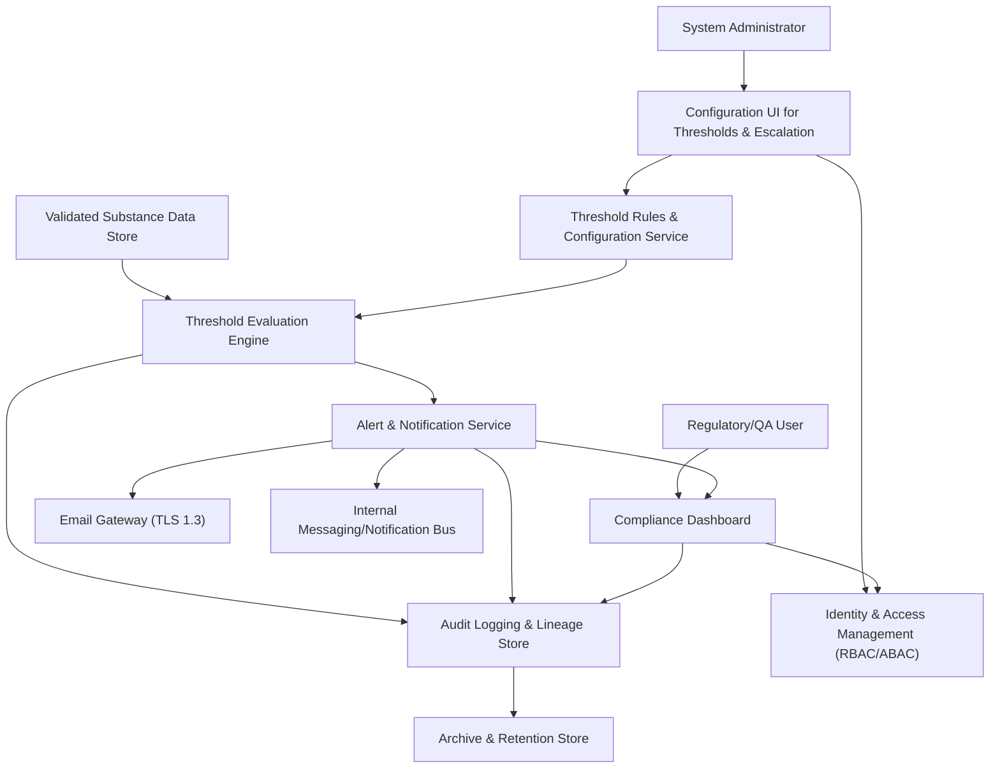
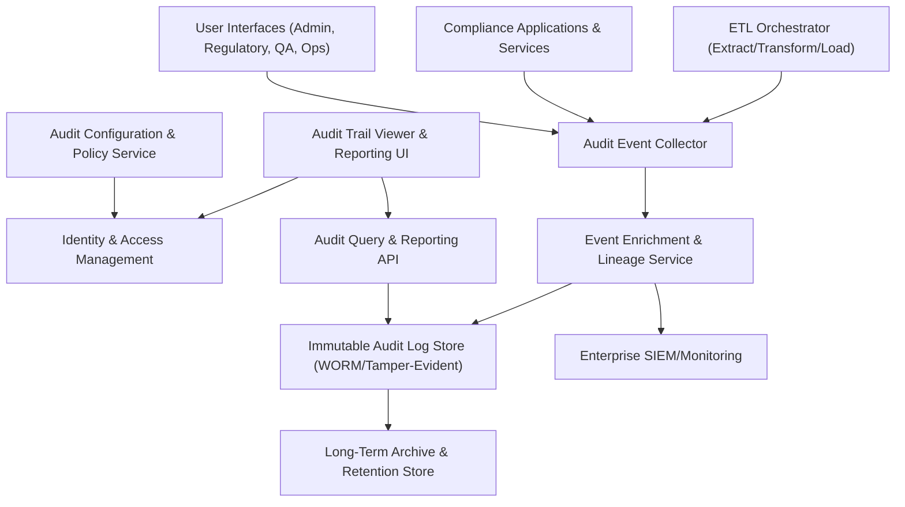
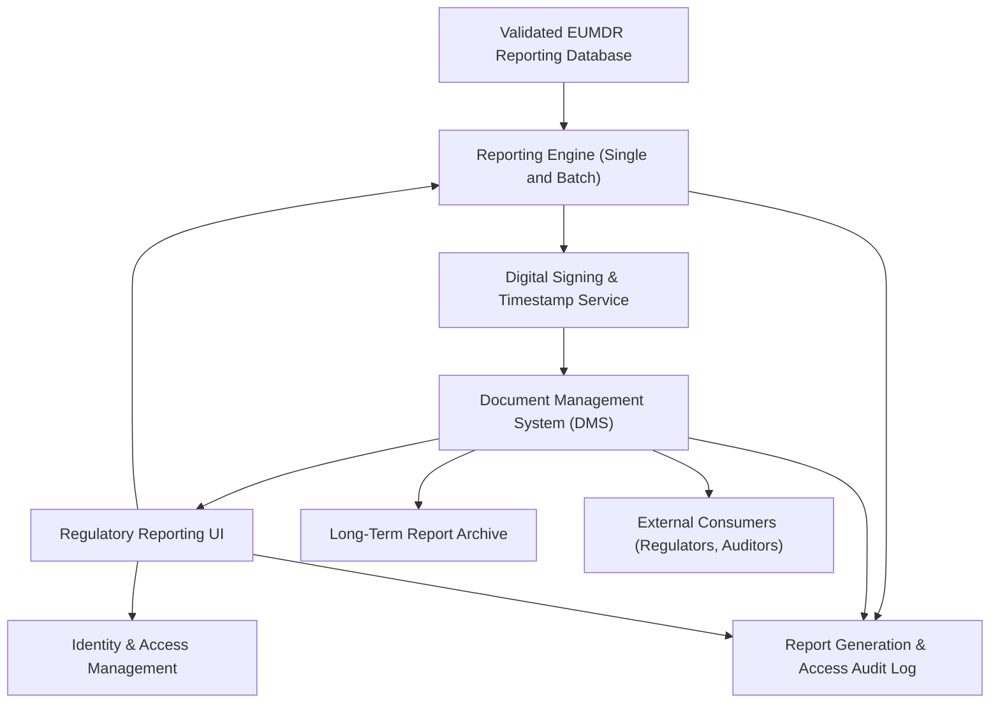
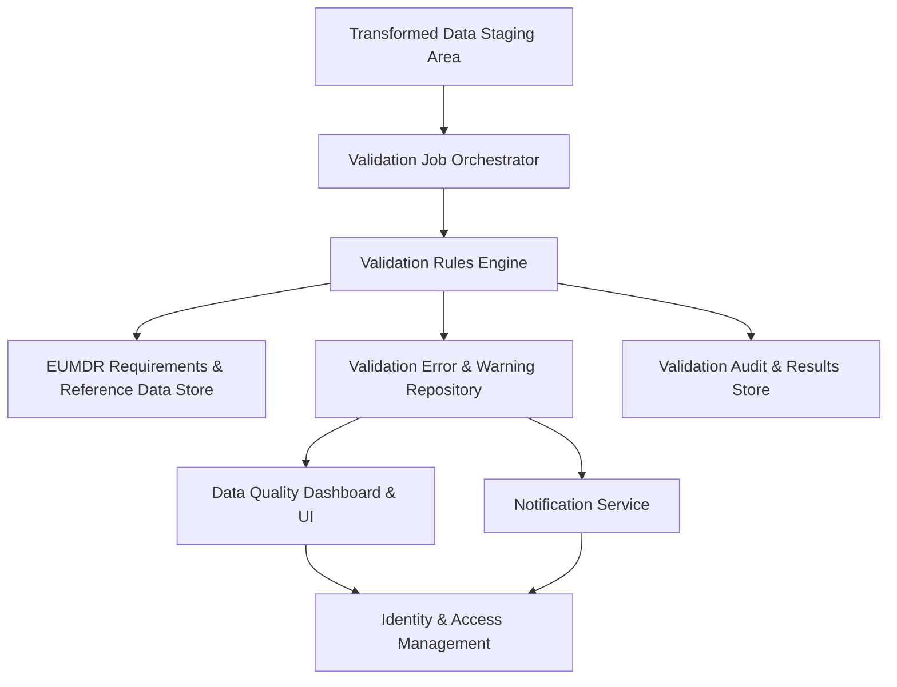
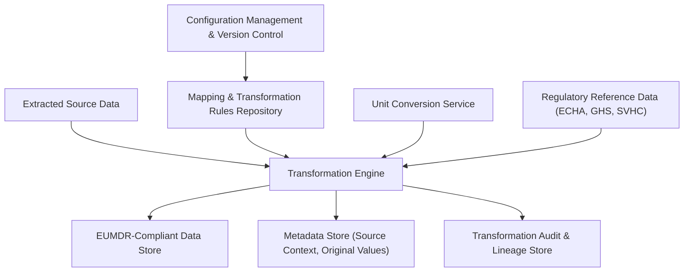
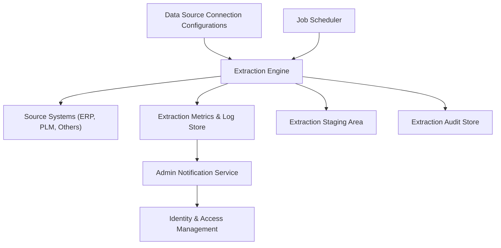
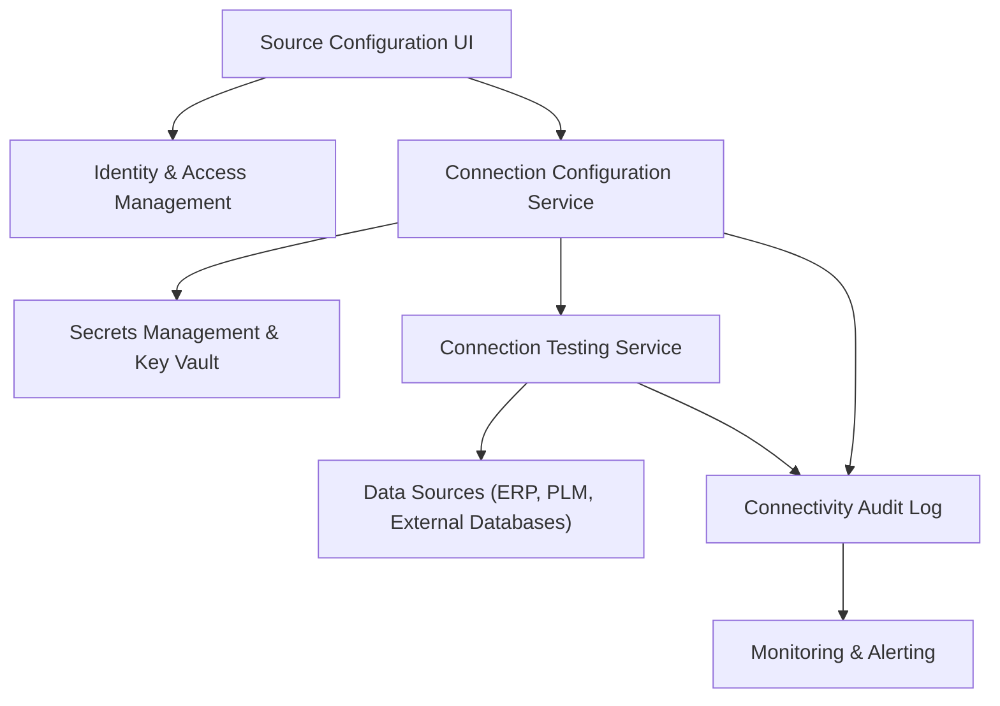

#### 1. High-Level Design

- Architecture Overview & Component Diagram:

- Component Descriptions:

  - **Validated Substance Data Store (SRC)**  
    Stores validated, transformed substance concentration data per product, material, and batch. Feeds live or batch data into the evaluation engine. Source is upstream ETL/EUMDR validation.

  - **Threshold Rules & Configuration Service (RULE)**  
    Central service managing threshold definitions (warning/critical), substances in scope, scopes (product, portfolio, geography), and alert routing rules. Version-controlled and fully auditable.

  - **Threshold Evaluation Engine (EVAL)**  
    Stateless or horizontally scalable engine that evaluates current substance concentrations against configured thresholds (warning and critical). Supports real-time or near-real-time checks triggered by data changes or scheduled jobs.

  - **Alert & Notification Service (ALERT)**  
    Orchestrates creation, deduplication, escalation, and lifecycle of alerts. Integrates with internal messaging bus and email gateway for notifications; exposes APIs for dashboards and external consumers.

  - **Compliance Dashboard (DASH)**  
    Web UI and API endpoints for viewing current and historical threshold violations, alert status, and drill-down details (substance, product, lot, threshold values, response history).

  - **Configuration UI (CFG)**  
    Admin and Regulatory UI to create, update, approve, and retire threshold rules, escalation rules, distribution lists, and SLA parameters. Enforces segregation of duties (e.g., authors vs approvers).

  - **Audit Logging & Lineage Store (AUDIT)**  
    Immutable/tamper-evident storage for all evaluation events, alerts, rules changes, acknowledgments, and resolutions. Supports querying, reporting, and export for inspections.

  - **Identity & Access Management (IAM)**  
    Provides SSO, MFA, and centralized RBAC/ABAC. Governs who can configure thresholds, acknowledge/resolve alerts, and access dashboards or data.

  - **Email Gateway (MAIL)**  
    Secure outbound email component using TLS 1.3; integrated with corporate email infrastructure and monitored for delivery status and failures.

  - **Internal Messaging/Notification Bus (MSG)**  
    Pub/sub or queue system to distribute alerts and events to internal consumers (e.g., workflow tools, ticketing, monitoring).

  - **Archive & Retention Store (ARCH)**  
    Long-term storage compliant with regulatory retention rules (e.g., minimum 10 years or per company policy). Holds closed alerts, historical evaluations, and configuration snapshots.

- Integration Points & Data Flow:

  1. **Data Ingestion from ETL/EUMDR Validation**  
     - Validated and reconciled substance data (concentrations, units, SVHC flags, product identifiers) are persisted in SRC.  
     - New or updated data triggers events (e.g., “substance_concentration_updated”) on the internal bus, or the engine runs according to a schedule.

  2. **Threshold Configuration Workflow**  
     - System administrators and regulatory users use CFG to define threshold rules per substance (e.g., SVHC, heavy metals) and context (product family, region).  
     - Rules include warning (e.g., 80% of regulatory limit) and critical thresholds (e.g., at or above 0.1% for SVHC), escalation paths, notification channels, and SLAs.  
     - RULE service persists rules, versions them, and exposes them via read-only APIs to EVAL.

  3. **Evaluation & Alert Generation**  
     - EVAL periodically or event-driven reads current concentrations from SRC and applicable rules from RULE.  
     - For each substance/product combination, EVAL:
       - Normalizes units (relying on upstream transformation) and evaluates against thresholds.  
       - Generates evaluation events (e.g., “warning_violation”, “critical_violation”) when thresholds are crossed or cleared.  
     - ALERT consumes evaluation outcomes:
       - Creates or updates alerts, ensures deduplication (no storm of alerts for the same persistent violation).  
       - Routes alert messages through MSG and MAIL to designated roles.

  4. **Dashboard & Operational Handling**  
     - DASH consumes ALERT APIs and AUDIT logs:
       - Shows open alerts, severity, age, assigned owner, and required due dates.  
       - Supports acknowledgment and resolution actions, with mandatory reason codes and comments.

  5. **Audit, Retention, and Reporting**  
     - All steps (config changes, evaluations, alerts, acknowledgments, escalations) are written to AUDIT in an append-only fashion.  
     - Periodic archival of closed alerts and old evaluations to ARCH in compliance with retention policies.  
     - Compliance reporting uses data from AUDIT/ARCH to demonstrate continuous monitoring, timely responses, and traceability.

- Security & Compliance Features:

  - **Input Validation & Output Filtering**  
    - User inputs in CFG and DASH (threshold values, conditions, comments) are validated server-side for:
      - Range limits (e.g., 0–100% for concentrations, warning < critical).  
      - Substance identifiers (validated against internal reference tables).  
      - Injection-safe characters (server-side sanitization and encoding).  
    - APIs validate payload schemas and reject malformed or unauthorized calls.  
    - Responses filter out data outside the requestor’s authorization scope (ABAC-based filtering by region, product line, role).

  - **Encryption & Secure Transport**  
    - All client-server and service-to-service communication uses **TLS 1.3**.  
    - Secrets (API keys, DB credentials, email credentials) are stored in a secrets manager and encrypted at rest with **AES-256**.  
    - Sensitive alert content in logs (e.g., patient-identifiable information if present, though typically not expected here) is either redacted or tokenized.

  - **RBAC/ABAC & Least Privilege**  
    - IAM enforces RBAC:
      - Roles like Threshold_Config_Admin, Regulatory_Manager, QA_Specialist, Alert_Responder, Auditor.  
    - ABAC policies restrict access based on:
      - Region/market, product line, business unit, and regulatory role.  
    - Threshold creation vs approval is separated (4-eyes principle); only authorized approvers can activate production rules.

  - **Audit Logging & Data Lineage**  
    - Every rule change, evaluation run, alert lifecycle event, and user action is logged with:
      - Who (identity), what (entity and change), when (UTC timestamp), where (system, IP/agent), why (change justification when required).  
    - Logs are immutable or tamper-evident (e.g., WORM storage or hash-chained records).  
    - Data lineage links alerts back to:
      - Specific substance records, ETL runs, validation rule versions, and upstream sources.

  - **Compliance Mapping**  
    - **EUMDR**: Supports proactive risk management and surveillance for restricted substances in products.  
    - **REACH / SVHC thresholds**: Enforces monitoring around 0.1% SVHC limit.  
    - **GxP / ALCOA+**: Ensures complete, consistent, contemporaneous audit trails; supports periodic review.  
    - **FDA 21 CFR Part 11**: Electronic records and audit trails are secure, time-stamped, and access-controlled.  
    - **ISO 13485 / ISO 14971**: Supports risk control and CAPA inputs via documented alerts and responses.

- Resiliency & Error Handling:

  - **Circuit Breakers**  
    - For external dependencies (email gateway, IAM, backing data stores) the ALERT and EVAL services use circuit breaker patterns:
      - On repeated failures, circuits open to prevent cascading outages and fall back to queued notifications or local caching.  
      - Health checks determine when to close circuits.

  - **Retries and Backoff**  
    - Evaluation jobs and notification delivery implement retries with exponential backoff:
      - Transient errors (temporary DB unavailability, email timeouts) are retried.  
      - After reaching retry limits, alerts are raised to system administrators and logged as operational incidents.

  - **Graceful Degradation**  
    - If DASH is unavailable, evaluation and alerting continue; notifications are still generated and persisted.  
    - If ALERT cannot deliver via email, alternative channels (MSG, internal ticketing) are used where configured.

  - **Fault Isolation and Idempotency**  
    - EVAL operations are idempotent for the same data/time window; repeated evaluations do not create duplicate alerts.  
    - ALERT identifies existing open alerts for the same violation and updates them instead of creating new ones.

#### 2. Validation Report

- Requirements Coverage:

  - **Configuration of threshold rules for SVHCs and other restricted substances**  
    - RULE service + CFG UI for defining thresholds; SVHC and other restricted substances supported via reference data.  
    - Version-controlled rules and validation against regulatory limits.

  - **Support for warning and critical threshold levels**  
    - RULE explicitly models warning and critical thresholds; EVAL uses both levels to categorize violations and severity.

  - **Real-time or near-real-time evaluation of concentrations against thresholds**  
    - EVAL supports event-driven and scheduled evaluations; integrated with SRC and internal event bus.

  - **Automated email and in-application notifications**  
    - ALERT sends notifications via MAIL (email) and MSG (in-app/system notifications, dashboard updates).

  - **Dashboard views of current and historical threshold violations**  
    - DASH provides real-time views, filtering, and historical charts based on AUDIT and ARCH data.

  - **Alert acknowledgment, escalation, and resolution tracking**  
    - ALERT lifecycle states (open, acknowledged, escalated, resolved) are captured; DASH provides actions and history.

  - **Audit logging of alert configurations and responses**  
    - AUDIT captures rule changes, evaluations, alert creation, acknowledgment, escalation, resolution, and user actions.

  - **NFRs (Performance, Reliability, Auditability)**  
    - Scalable, stateless EVAL and ALERT components; asynchronous processing via MSG; immutable logging; secure integration with email and IAM.

- Compliance Status:

  - **Data Retention:**  
    - ALERT and AUDIT events archived to ARCH with configurable retention policies; default aligns with regulatory norms (e.g., 10+ years), supporting EUMDR and GxP expectations.  
    - Status: **Pass**, assuming retention is configured per corporate SOPs.

  - **Consent & Privacy:**  
    - No patient-level data is required by design for threshold monitoring; however, IAM and logging are GDPR-aligned (minimal PII, access logs, purpose limitation when applicable).  
    - Status: **Pass**, with caveat that any added personal data fields must follow GDPR and internal DPIA outcomes.

  - **Data Lineage:**  
    - Alert records reference substance measurements, rule versions, and evaluation runs; lineage is traceable end-to-end.  
    - Status: **Pass**.

  - **Access Control & Segregation of Duties:**  
    - IAM with RBAC/ABAC, 4-eyes rule for threshold go-live, separate roles for configuration vs review/response.  
    - Status: **Pass**.

  - **Compliance Reporting:**  
    - AUDIT and ARCH support reports showing monitoring coverage, alert volumes, response SLAs, and rule changes over time, suitable for audits and inspections.  
    - Status: **Pass**.

- Identified Ambiguities/Risks:

  - **Ambiguity 1: Exact Evaluation Frequency and Latency Targets**  
    - The epic states “real-time or near-real-time” but does not specify maximum allowable delay or SLAs (e.g., alerts within X minutes of data change).  
    - Mitigation:  
      - Define per-environment SLAs (e.g., within 15 minutes for critical alerts) via configuration and document them in requirements.  
      - Configure monitoring to track compliance with these SLAs.

  - **Ambiguity 2: Scope of Substances and Regulatory Regimes Beyond SVHC**  
    - The epic mentions SVHC and other restricted substances but does not list all applicable lists (RoHS, internal corporate lists).  
    - Mitigation:  
      - Maintain a configurable substance scope table mapping substances to regulations and thresholds.  
      - Add governance for maintaining this reference data with Regulatory Affairs oversight.

  - **Risk 1: Alert Fatigue and Over-Notification**  
    - High frequency of near-threshold fluctuations may cause many warnings, leading to desensitization.  
    - Mitigation:  
      - Introduce hysteresis or dampening logic (e.g., require sustained violation for a configured duration).  
      - Allow aggregation of alerts (e.g., one alert per product-substance per day).  
      - Provide configurable notification policies to limit non-critical noise.

  - **Risk 2: Dependence on Data Quality from Upstream Systems**  
    - Threshold evaluation assumes validated, harmonized concentrations; upstream data quality issues could lead to false positives/negatives.  
    - Mitigation:  
      - Integrate status from upstream validation epic (QE-2544) and mark alerts with validity indicators.  
      - Suppress or flag alerts from data sets failing upstream quality thresholds.

  - **Risk 3: Regulatory Changes to Threshold Values**  
    - Evolving regulations can change thresholds or add/remove substances; failure to update rules promptly could cause non-compliance.  
    - Mitigation:  
      - Implement a change management process tied to regulatory watch activities.  
      - Use configuration-driven rules and schedule periodic reviews; maintain an “effective date” per rule.

  - **Risk 4: Limited Offline or Degraded Mode Visibility**  
    - If dashboards or email services are temporarily unavailable, users might miss time-critical alerts.  
    - Mitigation:  
      - Implement alternate channels (SMS, internal incident tools) for critical alerts where allowed.  
      - Ensure that EVAL and ALERT persist alerts and mark any delayed delivery in AUDIT for post-incident review.

---

### Epic: QE-2546 - TNSETLPROJ-Audit Trail and Data Lineage for ETL and Compliance

#### 1. High-Level Design

- Architecture Overview & Component Diagram:

- Component Descriptions:

  - **ETL Orchestrator (ETL)**  
    Executes extract, transform, and load jobs; emits structured audit events for key lifecycle moments (job start/end, step details, metrics, errors).

  - **Compliance Applications & Services (APP)**  
    Downstream apps (validation, reporting, threshold monitoring, SCIP integration) emit audit events for configuration changes and data access.

  - **User Interfaces (UI)**  
    All admin and operational UIs log significant user actions such as configuration edits, approvals, and sensitive data views.

  - **Audit Event Collector (LOGCOL)**  
    Central ingestion layer (e.g., log collector or microservice) that receives audit events via secure APIs or log streams. Normalizes event structure and timestamps in UTC.

  - **Event Enrichment & Lineage Service (ENRICH)**  
    Enriches raw events with contextual data (job IDs, correlation IDs, data source identifiers, upstream/downstream linkages). Establishes chains linking source data to final reports.

  - **Immutable Audit Log Store (STORE)**  
    Tamper-evident storage system (e.g., WORM volumes, append-only data store, hash-chained records) for regulatory-grade audit logs. Supports secure at-rest encryption.

  - **Audit Query & Reporting API (QAPI)**  
    Controlled access API for queries over audit logs (filter by time, user, job, data object), used by auditors and internal tooling.

  - **Audit Trail Viewer & Reporting UI (VIEW)**  
    Provides a governed UI for audit review, periodic compliance checks, and generation of inspection-ready reports.

  - **Audit Configuration & Policy Service (CFG2)**  
    Manages which events must be logged, retention settings, log redaction rules, and classifications (e.g., GxP-critical, security-relevant).

  - **Identity & Access Management (IAM2)**  
    Protects access to VIEW, QAPI, and CFG2 with strict RBAC/ABAC and MFA; restricts who can review vs administer audit configuration.

  - **Enterprise SIEM/Monitoring (SIEM)**  
    Receives subsets of audit events (particularly security and operational anomalies) for correlation, alerting, and incident response.

  - **Long-Term Archive & Retention Store (ARCH2)**  
    Holds old audit logs beyond primary storage windows in compliance with retention policies while ensuring integrity and accessibility.

- Integration Points & Data Flow:

  1. **Event Emission**  
     - ETL, APP, and UI components generate structured audit events containing:
       - Actor, action, object, timestamp (UTC), location/system, outcome, reference IDs, and optional “reason” fields.  
     - LOGCOL receives, authenticates, and validates events, ensuring mandatory fields are present.

  2. **Enrichment and Lineage Construction**  
     - ENRICH adds:
       - Correlation IDs for end-to-end trace (e.g., from extraction job to final report).  
       - Source/target system IDs, data classification tags, and regulatory labels (e.g., GxP, Part 11 relevant).  
     - ENRICH builds lineage relationships (e.g., job A → data set B → validation run C → report D).

  3. **Storage and Integrity**  
     - Enriched events are committed to STORE, using:
       - Append-only design and cryptographic hashes or WORM storage mechanisms.  
       - At-rest encryption (AES-256) with keys managed in an enterprise KMS.

  4. **Access and Reporting**  
     - VIEW uses QAPI to query STORE for audits and inspections:
       - Role-based filters: some users see high-level events only; auditors may see deeper details.  
       - Reports for regulators showing ETL histories, data access logs, configuration changes, and review activities.

  5. **Retention & Archival**  
     - Periodic archival jobs move older data to ARCH2 while preserving integrity checks (hash chains, signatures).  
     - CFG2 maintains policies for retention durations per regulation and data category.

  6. **SIEM Integration**  
     - ENRICH forwards selected event types (e.g., repeated failed logins, unauthorized config attempts) to SIEM for security monitoring.

- Security & Compliance Features:

  - **Input Validation & Output Filtering**  
    - LOGCOL validates event schemas and rejects incomplete or malformed events from untrusted sources.  
    - QAPI and VIEW ensure only authorized users can access events, and responses are filtered to the allowed scope via RBAC/ABAC.

  - **Encryption & Secure Transport**  
    - All events are sent over TLS 1.3 from emitters to LOGCOL and ENRICH.  
    - STORE and ARCH2 hold logs encrypted at rest with AES-256; access requires secure tokens from IAM2 plus KMS-authorized key usage.

  - **RBAC/ABAC & Segregation of Duties**  
    - Only designated Compliance/Audit roles can use VIEW with full visibility.  
    - Audit configuration changes (CFG2) require higher privileges and approval; log administrators cannot change or delete existing logs.  
    - ABAC ensures that local quality teams see logs relevant to their region/business unit only.

  - **Audit Logging of Audit System Itself**  
    - Changes in CFG2, access to VIEW, and any system-level actions are themselves logged (meta-audit) to prevent silent manipulation.  
    - Cross-checks with SIEM highlight discrepancies between local logs and central records.

  - **Regulatory Alignment**  
    - **FDA 21 CFR Part 11**: Stores computer-generated, time-stamped audit trails that record the date and time of operator entries and actions, not modifiable by ordinary users.  
    - **GxP Data Integrity / ALCOA+**: Logs are attributable, legible, contemporaneous, original, accurate, complete, consistent, enduring, and available.  
    - **EUMDR**: Supports traceability of data used in EUMDR reporting, from source to submission.  
    - **ISO 27001**: Access controls, logging, and encryption consistent with information security controls.

- Resiliency & Error Handling:

  - **Buffering and Backpressure**  
    - LOGCOL uses in-memory or disk-backed queues to handle spikes in event volume.  
    - Backpressure mechanisms prevent emitter failures; if STORE is temporarily unavailable, ENRICH queues and retries.

  - **Retries and Idempotency**  
    - Event writes to STORE and ARCH2 are retried on transient failures; duplicates are detected via event IDs.  
    - Archival processes are idempotent to avoid double-archiving.

  - **Circuit Breakers**  
    - If SIEM or ARCH2 is unavailable, events are stored locally and batches are retried later.  
    - Circuit breakers protect LOGCOL and ENRICH from cascading failures.

  - **Monitoring and Health Checks**  
    - Health endpoints exposed by LOGCOL, ENRICH, STORE, and QAPI monitored by infrastructure; failures result in alerts and, where appropriate, failover.

#### 2. Validation Report

- Requirements Coverage:

  - **ETL execution logging (extract, transform, load) with key metrics**  
    - ETL emits structured events with start/end times, step details, and metrics (record counts, duration).  
    - Covered via ETL → LOGCOL → ENRICH → STORE flow.

  - **Immutable storage of ETL audit logs**  
    - STORE is designed as WORM/tamper-evident with cryptographic protections; logs are append-only.  
    - Covered.

  - **Data access logging for substance data and reports**  
    - APP and UI emit access events (who viewed what, when, how); logged centrally.  
    - Covered.

  - **Logging of failed access attempts**  
    - APP and IAM2 log failed logins and unauthorized actions; events forwarded to STORE and SIEM.  
    - Covered.

  - **Configuration change logging for ETL jobs, mappings, and rules**  
    - Configuration UIs emit detailed change events (old/new values, change justification).  
    - Covered.

  - **Versioning of configurations with rollback references**  
    - ENRICH establishes ties between configuration versions and their usage in jobs and outputs.  
    - Covered (assuming versioning in ETL/config systems; lineage preserves it).

  - **Audit trail querying and reporting capabilities**  
    - VIEW and QAPI support queries and exportable reports for internal and external inspections.  
    - Covered.

  - **Support for regular review of audit logs**  
    - VIEW provides periodic review dashboards; actions from reviews are themselves logged (e.g., review completed, findings).  
    - Covered.

  - **NFRs (Immutability, Low Overhead, Secure Access)**  
    - Logging overhead minimized by lightweight event emission and asynchronous processing; secure and controlled access enforced by IAM2.  
    - Covered.

- Compliance Status:

  - **Retention Requirements:**  
    - ARCH2 retention configured to meet or exceed regulatory periods (e.g., at least 10 years, or as defined in EUMDR/21 CFR Part 11).  
    - Status: **Pass**, with configuration responsibility assigned to compliance/records management.

  - **Data Integrity (GxP and 21 CFR Part 11):**  
    - Audit trail is tamper-evident, time-stamped, and linked to user identities; changes to records are recorded, not overwritten.  
    - Status: **Pass**.

  - **Access Control & Auditability:**  
    - Strict segregation of duties; all access to audit logs is itself audited.  
    - Status: **Pass**.

  - **Data Lineage:**  
    - ENRICH builds explicit lineage from data extraction through transformation and reporting, meeting EUMDR traceability expectations.  
    - Status: **Pass**.

- Identified Ambiguities/Risks:

  - **Ambiguity 1: Level of Detail vs Performance**  
    - The epic specifies “sufficient detail to reconstruct events” but not exact fields or sampling strategies. Over-logging may harm performance.  
    - Mitigation:  
      - Define standard event schemas and minimum fields per event type.  
      - Conduct performance testing and, if needed, apply sampling for non-critical events while keeping critical events complete.

  - **Ambiguity 2: Exact Regulatory Retention Durations per Jurisdiction**  
    - Epic references “at least the regulatory retention period” without specifying per-region durations.  
    - Mitigation:  
      - Implement policy-driven retention in CFG2 with per-regulation settings.  
      - Align with corporate records management and document in SOPs.

  - **Risk 1: Incomplete Coverage of All ETL and Compliance Systems**  
    - Some legacy or third-party systems might not emit required audit events.  
    - Mitigation:  
      - Conduct system inventory and gap analysis.  
      - Mandate integration patterns (e.g., audit adapters) before systems are used for regulated data.

  - **Risk 2: Access to Audit Logs for Troubleshooting vs Principle of Least Privilege**  
    - Operations staff may request direct access to logs for troubleshooting, risking overexposure.  
    - Mitigation:  
      - Provide separate operational logs for troubleshooting distinct from regulated audit logs.  
      - Implement controlled workflows for temporary access with approvals and full logging.

---

### Epic: QE-2545 - TNSETLPROJ-EUMDR Restricted Substances Reporting and Document Management

#### 1. High-Level Design

- Architecture Overview & Component Diagram:

- Component Descriptions:

  - **Validated EUMDR Reporting Database (SRC3)**  
    Holds fully validated, EUMDR-aligned data ready for report generation (products, substances, concentrations, classifications, metadata).

  - **Reporting Engine (REGEN)**  
    Generates:
      - Standard reports for single products or product families.  
      - Batch reports for multiple products.  
      - Machine-readable (XML or structured file) and human-readable (PDF/HTML) outputs.

  - **Digital Signing & Timestamp Service (SIG)**  
    Applies electronic signatures and timestamps to generated reports, aligned with 21 CFR Part 11 and corporate PKI standards. Maintains signature and certificate status metadata.

  - **Document Management System (DMS)**  
    Stores signed reports and their metadata. Supports versioning, access control, search, and retrieval; integrates with retention and legal hold policies.

  - **Regulatory Reporting UI (UIREP)**  
    Interface for Regulatory Affairs to generate reports, request batch runs, review statuses, and retrieve historical reports.

  - **Identity & Access Management (IAM3)**  
    Controls access to reporting features and documents; enforces RBAC and ABAC rules.

  - **Report Generation & Access Audit Log (AUD3)**  
    Specialized audit sub-store for generation events, approvals, and access of reports, integrated with the general audit system.

  - **Long-Term Report Archive (RET3)**  
    Ensures long-term retention with integrity; may integrate with corporate records management archiving facilities.

  - **External Consumers (EXTAPI)**  
    External parties (regulators, auditors) that receive or review reports via secure channels; not directly accessing internal systems.

- Integration Points & Data Flow:

  1. **Report Generation**  
     - UIREP orchestrates requests based on product, time period, or other criteria.  
     - REGEN queries SRC3 for relevant data and composes EUMDR-compliant content, verifying completeness and consistency before proceeding.

  2. **Digital Signing & Timestamping**  
     - Generated documents are passed to SIG, which:
       - Applies signer information, digital signature, and trusted timestamp.  
       - Validates certificate status at signing time and records evidentiary data.

  3. **Document Storage & Retrieval**  
     - DMS stores signed reports with metadata (product ID, report type, creation date, version, signer, associated submissions).  
     - UIREP queries DMS for search and retrieval; returned documents remain immutable.

  4. **Audit Logging & Access Monitoring**  
     - AUD3 logs:
       - Report generation events (who, what, when, source data set).  
       - Access and download events (user, report, timestamp, reason where required).  
       - Any requests for corrections or replacements.

  5. **Archival & Retention**  
     - RET3 ensures compliance with retention requirements (e.g., 10 years or longer).  
     - Immutable copies may be stored in specialized archival systems with WORM capabilities.

  6. **External Distribution**  
     - Reports are exported via controlled channels (secure email, secure file exchange).  
     - External distribution is logged in AUD3 (recipient, channel, date/time).

- Security & Compliance Features:

  - **Input Validation & Output Filtering**  
    - UIREP validates user parameters (product IDs, time ranges).  
    - REGEN ensures only validated data is used; incomplete datasets abort generation with informative errors.

  - **Encryption & Secure Transport**  
    - UIREP and service calls are protected by TLS 1.3.  
    - DMS and RET3 encrypt reports at rest with AES-256.  
    - Report copies transferred externally are sent over secure channels (e.g., SFTP, encrypted email).

  - **RBAC/ABAC**  
    - Only authorized roles (Regulatory Affairs, QA, certain managers) can request report generation or access historical documents.  
    - ABAC supports restricting access by region or regulatory jurisdiction.

  - **Audit Logging**  
    - AUD3 records generation, approvals, access, export, and attempted unauthorized access.  
    - Logs integrate into central audit and SIEM infrastructure.

  - **Compliance Mapping**  
    - **EUMDR**: Structured reports meeting required content and format, supporting regulatory submissions and audits.  
    - **FDA 21 CFR Part 11**: Digital signatures, timestamping, and controlled access to electronic records.  
    - **GxP & ISO 13485**: Supports traceable, controlled documentation and record retention.

- Resiliency & Error Handling:

  - **Graceful Handling of Large Batch Runs**  
    - REGEN can process batches in chunks and track progress; partial completion is logged; failed reports can be retried independently.

  - **Retries and Queuing**  
    - REGEN and SIG support queued jobs with retries on transient issues.  
    - DMS failures are handled by temporarily storing reports in a secure staging area and retrying.

  - **Circuit Breakers for External Services**  
    - For external PKI or timestamping services, SIG uses circuit breakers and fallback modes (e.g., queued signing) if required by policy.

  - **Monitoring**  
    - Health checks and metrics (generation times, failure rates) are monitored with alerts for operational anomalies.

#### 2. Validation Report

- Requirements Coverage:

  - **Standard single-product EUMDR report generation**  
    - REGEN and UIREP support single-product report requests.  
  - **Multi-product batch report generation**  
    - Batch workflows in REGEN support scheduling and monitoring large sets.  
  - **Support for EUMDR-specified output formats (XML, PDF)**  
    - REGEN produces both machine-readable and human-readable formats.  
  - **Inclusion of all mandatory report sections**  
    - Templates built according to EUMDR scope ensure complete sections.  
  - **Digital signature and timestamp application**  
    - SIG ensures compliant electronic signatures and timestamps.  
  - **Secure storage of generated reports**  
    - DMS with encryption at rest and strong access controls.  
  - **Search and retrieval of historical reports**  
    - DMS and UIREP support robust indexing and retrieval.  
  - **Audit logging for report generation and access**  
    - AUD3 records all relevant actions.

- Compliance Status:

  - **Data Retention:**  
    - RET3 ensures long-term storage per regulatory timelines.  
    - Status: **Pass**.

  - **Privacy & Access Control:**  
    - IAM3 and ABAC restrict access to necessary roles and contexts.  
    - Status: **Pass**.

  - **Traceability & Data Lineage:**  
    - Reports link back to datasets and ETL runs through AUD3 and central audit lineage.  
    - Status: **Pass**.

- Identified Ambiguities/Risks:

  - **Ambiguity 1: Exact Report Templates per Market**  
    - EUMDR is the focus, but if multiple markets are involved, template differentiation is not fully specified.  
    - Mitigation:  
      - Create explicit mapping of report templates to regulatory jurisdictions and maintain under configuration control.

  - **Risk 1: Digital Signature Infrastructure Availability**  
    - Outage of PKI/timestamp services could block timely report issuance.  
    - Mitigation:  
      - Implement redundancy and clear contingency procedures (e.g., temporary internal signatures with later external timestamp, if allowed by policy).

  - **Risk 2: Large Batch Performance and Time Windows**  
    - High-volume batch reporting near deadlines could risk delays.  
    - Mitigation:  
      - Performance test large batches; add horizontal scaling or batch scheduling; define capacity planning guidelines.

---

### Epic: QE-2544 - TNSETLPROJ-EUMDR Data Quality and Compliance Validation

#### 1. High-Level Design

- Architecture Overview & Component Diagram:

- Component Descriptions:

  - **Transformed Data Staging Area (STAGE)**  
    Receives transformed, EUMDR-structured data from ETL. Serves as the input for validation before data enters the reporting database.

  - **Validation Rules Engine (RULEVAL)**  
    Executes validation rules for:
      - Mandatory fields presence and value checks.  
      - Concentration thresholds vs regulatory limits.  
      - Prohibited substance combinations.  
      - Cross-source consistency and reconciliation.

  - **EUMDR Requirements & Reference Data Store (REFD)**  
    Houses regulatory rules, SVHC lists, threshold definitions, mapping tables, and internal business rules with versioning.

  - **Validation Job Orchestrator (VALJOB)**  
    Schedules validation runs (batch or incremental) and coordinates RULEVAL execution across data sets.

  - **Validation Error & Warning Repository (ERRREP)**  
    Stores structured validation results, including error codes, severity (error vs warning), affected records, and recommended actions.

  - **Notification Service (NOTIFY)**  
    Sends targeted notifications for critical validation issues to data stewards and QA stakeholders.

  - **Data Quality Dashboard & UI (UIVAL)**  
    Displays validation status, metrics (error rates, top issue types), and drill-down views for remediation.

  - **Identity & Access Management (IAM4)**  
    Governs who can view and manage validation results; provides role-based views for data stewards vs QA vs auditors.

  - **Validation Audit & Results Store (AUD4)**  
    Stores audit logs related to validation runs and rule version usage, integrated with the central audit system.

- Integration Points & Data Flow:

  1. **Data Inflow from Transformation**  
     - Transformed data arrives in STAGE. VALJOB determines the scope and schedule of validation runs.

  2. **Rule Execution**  
     - RULEVAL retrieves applicable rules from REFD and applies them to the dataset, logging rule versions and evaluation outcomes.

  3. **Results and Notifications**  
     - Failed checks and warnings are saved to ERRREP with codes and descriptive messages.  
     - Critical issues generate notifications (NOTIFY) to responsible users.

  4. **Dashboard & Governance**  
     - UIVAL provides visibility into data quality status and history.  
     - IAM4 ensures each role sees the appropriate metrics and details.

- Security & Compliance Features:

  - **Input Validation & Output Filtering**  
    - RULEVAL defends against malformed data from upstream, enforcing strict schema checks.  
    - UIVAL and APIs enforce filtering so users see only records and datasets within their authorization scope.

  - **Encryption & Secure Transport**  
    - Communication between components uses TLS 1.3.  
    - Sensitive validation results and issue notes are stored encrypted at rest (AES-256).

  - **RBAC/ABAC**  
    - Data stewards can see and act on issues for their domains; QA has broader oversight; auditors have read-only views.

  - **Audit Logging**  
    - AUD4 logs validation runs, rule updates, override decisions, and any manual validation overrides.

- Resiliency & Error Handling:

  - **Resilient Validation Jobs**  
    - Partial failures in validation (e.g., failing rule group) are logged but do not corrupt the underlying data.  
    - Jobs can be resumed or re-run for specific subsets.

  - **Retry Mechanisms**  
    - Transient failures (e.g., REFD unavailability) cause retries with backoff; validation runs are reattempted after dependencies recover.

  - **Circuit Breakers**  
    - Avoid repeated calls to unavailable reference services and instead queue validations.

#### 2. Validation Report

- Requirements Coverage:

  - **Mandatory field presence and value validation**  
    - RULEVAL checks for missing or invalid fields and records errors in ERRREP.  
  - **Business rule validation for concentration thresholds**  
    - Rules evaluate concentrations against regulatory thresholds, producing errors or warnings.  
  - **Identification of prohibited substance combinations**  
    - Specific rules identify and report prohibited combinations.  
  - **Warning generation for near-threshold values**  
    - Supporting warnings that feed into the threshold monitoring epic.  
  - **Cross-source consistency and reconciliation checks**  
    - RULEVAL compares multiple sources and flags discrepancies.  
  - **Validation error reporting with codes and descriptions**  
    - ERRREP uses structured codes and human-readable descriptions.  
  - **Notifications to data stewards or QA for critical issues**  
    - NOTIFY targets the correct users based on assignment and severity.

- Compliance Status:

  - **Data Integrity & Traceability:**  
    - Validation runs and rule versions are fully tracked; results are retained for regulatory periods.  
    - Status: **Pass**.

  - **Compliance with ALCOA+ and GxP:**  
    - Validation records are complete, consistent, and accessible; aligned with QA processes.  
    - Status: **Pass**.

- Identified Ambiguities/Risks:

  - **Ambiguity: Rules Ownership and Change Control**  
    - Epic does not fully define governance for rule updates.  
    - Mitigation:  
      - Implement a controlled change process with approvals and audit logs.

  - **Risk: Excessive Warnings Without Action**  
    - Large numbers of warnings may accumulate without remediation.  
    - Mitigation:  
      - Add KPIs and thresholds for acceptable error/warning rates, tying them into governance and management reviews.

---

### Epic: QE-2543 - TNSETLPROJ-Transformation to EUMDR-Compliant Data Structures

#### 1. High-Level Design

- Architecture Overview & Component Diagram:

- Component Descriptions:

  - **Extracted Source Data (RAW)**  
    Contains raw substance data from ERP, PLM, and other systems prior to transformation.

  - **Mapping & Transformation Rules Repository (MAPCFG)**  
    Stores field mappings from source structures to EUMDR model, including mandatory vs optional fields and transformation logic. Managed under change control.

  - **Transformation Engine (TRFENG)**  
    Executes configured transformations:
      - Field mapping to EUMDR structures.  
      - Unit conversions and value normalization.  
      - Enrichment with regulatory identifiers and classifications.

  - **Unit Conversion Service (UNIT)**  
    Provides standardized conversions for concentrations and related units.

  - **Regulatory Reference Data (REF4)**  
    Access to ECHA substance database, SVHC lists, and GHS classification rules via secure APIs.

  - **Metadata Store (META)**  
    Stores original source values and context (source system, field names, extraction date) to preserve traceability.

  - **EUMDR-Compliant Data Store (OUT)**  
    Consumes output as standardized, ready-for-validation data sets.

  - **Transformation Audit & Lineage Store (AUD5)**  
    Logs transformation execution details; correlates RAW inputs, MAPCFG versions, and OUT outputs.

  - **Configuration Management & Version Control (CFGMGR)**  
    Governs changes to mapping rules and units; ensures versioned transformations are documented.

- Integration Points & Data Flow:

  1. **Transformation Execution**  
     - TRFENG ingests RAW data and applicable rules from MAPCFG.  
     - Calls UNIT and REF4 as needed to standardize units and classify substances.

  2. **Metadata Preservation**  
     - TRFENG copies original values and mapping context into META for each transformed record.

  3. **Output and Audit Logging**  
     - Transformed data is written to OUT, with metadata and lineage recorded in AUD5.

- Security & Compliance Features:

  - **Secure Integration with External References**  
    - REF4 APIs accessed via TLS 1.3 and API keys stored in a secure secrets manager (AES-256).

  - **RBAC for Rule Editing**  
    - Only authorized configuration managers can modify MAPCFG, with approvals and review cycles.

  - **Audit Logging**  
    - AUD5 records transformation job details, rule versions, and any transformation errors or overrides.

- Resiliency & Error Handling:

  - **External API Timeout Handling**  
    - TRFENG implements retries for REF4 calls; if unavailable, transformation is halted or flagged based on criticality.

  - **Partial Failures**  
    - Some records may be flagged for manual review instead of blocking entire jobs.

#### 2. Validation Report

- Requirements Coverage:

  - **Mapping of source fields to EUMDR data model**  
    - MAPCFG and TRFENG implement structured mapping.  
  - **Handling of mandatory vs optional fields with explicit flags**  
    - MAPCFG defines mandatory/optional; transformation flags missing mandatory fields for validation.  
  - **Unit conversion and standardization of concentrations**  
    - UNIT ensures consistent units.  
  - **Preservation of original source values as metadata**  
    - META stores source context and original values.  
  - **Mapping of internal substance codes to regulatory identifiers**  
    - REF4 integration ensures mapping to CAS, etc.  
  - **Integration with ECHA substance database for validation**  
    - REF4 access is built-in.  
  - **Application of GHS classifications and SVHC status**  
    - Derived using REF4, stored in OUT and META.

- Compliance Status:

  - **Traceability & Data Integrity:**  
    - Input, rule versions, and outputs linked; preserved metadata supports audits.  
    - Status: **Pass**.

- Identified Ambiguities/Risks:

  - **Ambiguity: Performance Requirements for Transformation Windows**  
    - Epic specifies batch windows but not precise timing.  
    - Mitigation:  
      - Define SLA per reporting cycle and capacity plan accordingly.

  - **Risk: Dependency on External Databases (ECHA)**  
    - Outages or changes could affect transformation.  
    - Mitigation:  
      - Caching of critical reference data; monitoring for API changes; regular updates.

---

### Epic: QE-2542 - TNSETLPROJ-Automated Restricted Substances Data Extraction

#### 1. High-Level Design

- Architecture Overview & Component Diagram:

- Component Descriptions:

  - **Data Source Connection Configurations (CFGSRC)**  
    Configuration repository of data sources, credentials, and extraction parameters sourced from the connectivity epic (QE-2541).

  - **Job Scheduler (SCHED)**  
    Coordinates execution of extraction jobs according to defined schedules and dependencies.

  - **Extraction Engine (EXTENG)**  
    Implements full and incremental extractions, manages change tracking, and handles retries and error classification.

  - **Source Systems (SRC5)**  
    ERP, PLM, and other systems that store restricted substances and related data.

  - **Extraction Metrics & Log Store (LOG5)**  
    Maintains extraction job metrics and operational logs for monitoring and reporting.

  - **Extraction Staging Area (STG5)**  
    Temporary storage for extracted data before transformation.

  - **Admin Notification Service (NOT5)**  
    Sends alerts to administrators and support teams when extractions fail or exceed thresholds.

  - **Identity & Access Management (IAM5)**  
    Ensures only authorized users can configure or trigger extraction jobs and access logs.

  - **Extraction Audit Store (AUD6)**  
    Records full audit trail of extraction activities; integrated with central audit and lineage.

- Integration Points & Data Flow:

  1. **Job Scheduling**  
     - SCHED triggers EXTENG according to configured schedules (e.g., nightly, hourly).

  2. **Data Extraction**  
     - EXTENG connects to SRC5, uses change timestamps or other markers for incremental extraction, and writes to STG5.

  3. **Metrics and Audit**  
     - LOG5 captures performance metrics and status; AUD6 captures regulated audit events.

  4. **Notifications**  
     - NOT5 informs admins when jobs fail or behave anomalously.

- Security & Compliance Features:

  - **Secure Credentials & Connections**  
    - Uses secure connections defined in QE-2541; credentials stored and managed securely.

  - **Audit Logging & GDPR Compliance**  
    - Extraction events (including data access) recorded; alignment with GDPR expectations around data access and logging.

  - **RBAC & ABAC**  
    - Access to configuration and logs limited to authorized roles.

- Resiliency & Error Handling:

  - **Retries with Exponential Backoff**  
    - Extraction retries on transient issues, with backoff strategies.

  - **Circuit Breakers**  
    - Prevent repeated failing calls to offline systems.

  - **Data Loss Prevention**  
    - Extraction ensures idempotency and does not drop records; failure states are clearly marked and retriable.

#### 2. Validation Report

- Requirements Coverage:

  - **Definition of ETL extraction jobs**  
    - EXTENG and SCHED support job definitions.  
  - **Scheduling of recurring extractions**  
    - Schedules are configurable and managed by SCHED.  
  - **Incremental extraction based on change timestamps**  
    - EXTENG uses change tracking or timestamps.  
  - **Extraction metrics logging**  
    - LOG5 and AUD6 record metrics and audit data.  
  - **Error handling and retry with exponential backoff**  
    - Built into EXTENG.  
  - **Failure notifications to administrators**  
    - NOT5 handles notifications.  
  - **Extraction status dashboard or views**  
    - Available from LOG5 and UI, integrated into compliance dashboards.

- Compliance Status:

  - **Data Integrity & Retention:**  
    - Extraction logs retained per retention rules; supports GxP integrity.  
    - Status: **Pass**.

- Identified Ambiguities/Risks:

  - **Ambiguity: Maximum Acceptable Extraction Window**  
    - Need explicit maximum allowed latency for extracted data freshness.  
    - Mitigation:  
      - Define performance targets and monitor adherence.

  - **Risk: Overloading Source Systems**  
    - Heavy extractions could affect production operations.  
    - Mitigation:  
      - Implement throttling and schedule jobs for off-peak times; coordinate with source system owners.

---

### Epic: QE-2541 - TNSETLPROJ-ETL Data Source Configuration and Connectivity

#### 1. High-Level Design

- Architecture Overview & Component Diagram:

- Component Descriptions:

  - **Source Configuration UI (UI6)**  
    Interface where administrators define new sources or update existing configurations (host, port, credentials, encryption settings).

  - **Connection Configuration Service (CFG6)**  
    Stores and manages connection details (excluding raw credentials, which reside in SECST). Validates parameters and sources.

  - **Secrets Management & Key Vault (SECST)**  
    Secure store for credentials and secrets; uses AES-256 encryption and supports key rotation policies.

  - **Connection Testing Service (CONN)**  
    Executes connection tests with provided configurations and credentials, ensuring TLS/SSL and certificate validation.

  - **Data Sources (SRC6)**  
    Endpoints for ERP, PLM, and external substance databases.

  - **Connectivity Audit Log (AUD7)**  
    Records configuration changes, connection tests, and connection errors for compliance and troubleshooting.

  - **Monitoring & Alerting (MON6)**  
    Monitors connection health and surfaces issues to administrators.

- Integration Points & Data Flow:

  1. **Configuration Workflow**  
     - Admins use UI6; IAM6 enforces RBAC.  
     - CFG6 validates inputs and stores configuration; SECST stores credentials.

  2. **Connection Testing**  
     - CONN performs tests using configurations and credentials, verifying security properties.  
     - Results are logged and surfaced in UI.

  3. **Audit & Monitoring**  
     - AUD7 records all changes, tests, and failures; MON6 provides alerts for recurring issues or degraded connectivity.

- Security & Compliance Features:

  - **TLS/SSL Enforcement**  
    - CONN ensures TLS is enabled for all connections; non-secure protocols are blocked.

  - **AES-256 Credential Storage**  
    - SECST stores credentials encrypted; keys are managed by enterprise KMS with rotation policies.

  - **RBAC & ABAC**  
    - Only specific roles can manage connections; access to credentials is minimized and never exposed in clear text.

  - **Audit Logging**  
    - AUD7 logs configuration changes and tests; integrated with central audit and SIEM.

  - **Regulatory Alignment**  
    - Supports ISO 27001, 21 CFR Part 11, and GDPR by protecting access credentials and securing data access paths.

- Resiliency & Error Handling:

  - **Safe Failure for Misconfigurations**  
    - Invalid or insecure configurations are rejected with clear messages; no partial persistence of invalid connections.

  - **Retries for Connection Tests**  
    - On transient network issues, CONN retries with backoff; repeated failures raise alerts.

  - **Isolation of Source Failures**  
    - A failing connection configuration does not affect other data sources or ETL operations.

#### 2. Validation Report

- Requirements Coverage:

  - **Secure configuration of ERP, PLM, and external substance databases**  
    - UI6 and CFG6 support all required types with secure patterns.  
  - **Connection testing and validation**  
    - CONN validates connectivity and security properties.  
  - **Encrypted credential storage**  
    - SECST with AES-256 at rest.  
  - **TLS/SSL enforcement**  
    - CONN verifies TLS; non-secure connections rejected.  
  - **Error handling and logging for connection failures**  
    - AUD7 and MON6 capture and expose failures.  
  - **Role-based access to data source configuration**  
    - IAM6 enforces RBAC for configuration actions.

- Compliance Status:

  - **Security & Traceability:**  
    - All actions controlled and logged; credential misuse risk minimized.  
    - Status: **Pass**.

- Identified Ambiguities/Risks:

  - **Ambiguity: Accepted Cipher Suites and Protocol Parameters**  
    - Exact crypto configurations not fully specified.  
    - Mitigation:  
      - Align with corporate security baseline and document minimal acceptable cipher suites, key sizes, and protocols.

  - **Risk: Credential Lifecycle Management**  
    - Rotation processes and revocation not fully described.  
    - Mitigation:  
      - Integrate with existing enterprise credential rotation policies; automate where possible; log rotations and check compliance.

---

These HLDs and validation reports collectively cover the “In Progress” epics for TNSETLPROJ related to ETL Data Management for EUMDR, implementing secure, compliant, and resilient capabilities aligned with the provided epic descriptions and regulatory expectations.
