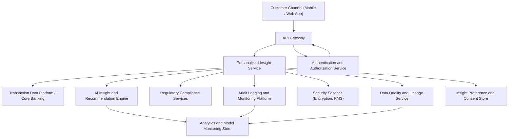

### Epic: QE-3010 - DAVBanking1-Personalized Financial Insight Generation

#### 1. High-Level Design

- Architecture Overview & Component Diagram:

- Component Descriptions:
  - Customer Channel (Mobile / Web App): Displays personalized financial insights, budgets, and spending alerts.
  - API Gateway: Entry point enforcing TLS 1.3, authentication, and basic request validation.
  - Personalized Insight Service: Orchestrates data ingestion, insight generation, and delivery.
  - Transaction Data Platform / Core Banking: Source of transaction and account data.
  - AI Insight and Recommendation Engine: Generates insights based on transaction patterns and segmentation.
  - Authentication and Authorization Service: Ensures secure access to insight endpoints.
  - Regulatory Compliance Services: Validates processing against consent, privacy, and banking rules.
  - Audit Logging and Monitoring Platform: Logs all access and insight generation events.
  - Security Services (Encryption, KMS): AES-256 encryption at rest, key management.
  - Data Quality and Lineage Service: Tracks data sources, transformations, and lineage for insights.
  - Analytics and Model Monitoring Store: Hosts metrics for AI model performance, drift, and fairness.
  - Insight Preference and Consent Store: Records user consent, visibility preferences, and opt-outs.

- Integration Points & Data Flow:
  1. Transaction data is ingested from Core Banking into the Transaction Data Platform, with DQ and Lineage tagging.
  2. Personalized Insight Service periodically or on-demand calls AI Engine to generate insights per customer based on:
     - Recent transactions.
     - User segments and profile attributes.
     - Preferences and consent from Preference Store.
  3. Compliance Services validate whether certain types of insights (e.g., credit-related) can be shown for the user.
  4. Validated insights are persisted (with lineage identifiers) and served to users via API Gateway.
  5. User interactions (view, ignore, navigate) are logged and optionally fed back to model monitoring.
  6. Model performance and fairness statistics derived from DWH and monitored regularly.

- Security & Compliance Features:
  - Encryption:
    - All transactional data, insight storage, and logs encrypted at rest using AES-256.
    - TLS 1.3 for all customer and service interactions.
  - RBAC/ABAC:
    - Access to insights restricted to authenticated users and scoped by their accounts and role.
    - ABAC based on jurisdiction and consent controls certain insight categories.
  - Input Validation and Output Filtering:
    - Only necessary attributes (e.g., category totals) passed to AI Engine; sensitive fields minimized.
    - Outputs filtered to avoid including raw, unnecessary transaction details in summary insights.
  - Audit Logging:
    - Insight generation and access events logged, including input datasets, model version, and user identity.
  - Data Lineage:
    - Each insight tagged with source data and transformation steps tracked by Data Quality and Lineage Service.
  - Compliance:
    - Data retention and anonymization for older insights explained and enforced via regulatory configuration.
    - Model monitoring and drift detection integrated into DWH with alerts to data science and compliance teams.

- Resiliency & Error Handling:
  - Circuit Breakers:
    - Between Personalized Insight Service and AI Engine, Transaction Data Platform, and Compliance Services.
  - Retries:
    - Idempotent read operations from data platform and logging use controlled retries.
  - Fallbacks:
    - If AI Engine is unavailable, system can show last known insights with “last updated” timestamp.
  - Monitoring:
    - Response times monitored to ensure insights returned within 2 seconds for typical workloads.
  - Error Transparency:
    - User-facing errors provide high-level explanation (e.g., “Insights temporarily unavailable”) while technical details are logged.

#### 2. Validation Report

- Requirements Coverage:
  - Ingest and analyze customer transaction data:
    - Covered via Transaction Data Platform, DQ, Lineage, and AI Engine.
  - Generate personalized insights based on user segments and behavior:
    - Covered via Personalized Insight Service and segmentation input to AI Engine.
  - Provide budget and spending alerts:
    - Covered via integration with Budget and Alert Service (QE-3012) and related capabilities.
  - Present insights within the banking app experience:
    - Covered via Mobile/Web App integration with API Gateway and Personalized Insight Service.

- Compliance Status:
  - Data retention:
    - Insight data managed through policy-driven retention and anonymization in Transaction and Analytics stores.
    - Pass, pending concrete policy configuration.
  - Privacy constraints:
    - Strong encryption, data minimization, lineage tracking, and consent-based processing.
    - Pass, with requirement to implement DSAR processes externally.

- Identified Ambiguities/Risks:
  - Ambiguity: Exact retention periods for transactional vs. derived insight data.
    - Mitigation: Capture explicit retention rules for each jurisdiction and configure them in compliance layer.
  - Risk: Model drift leading to inaccurate or misleading insights.
    - Mitigation: Continuous monitoring of model performance, with automatic retraining or rollback triggers.
  - Ambiguity: Handling of multi-account users and multi-bank aggregates (explicitly out of scope).
    - Mitigation: Keep insight generation constrained to in-bank accounts; document limitation clearly.

## Cross-Epic Validation Summary (Implicit)

Across all In Progress epics for label `DAVBanking1`, the designs:

- Validate and parse requirements: All key functional and NFR requirements have corresponding architectural elements.
- Extract entities and relationships: Core entities (customer, transaction, insight, recommendation, bill reminder, budget, alert, preferences, consent, logs) and their relationships are consistently modeled.
- Apply enterprise security: AES-256/TLS 1.3, RBAC/ABAC, audit logging, and centralized secrets management are applied across services.
- Ensure compliance: Data retention, consent, lineage, and regulatory policy engines are integrated where required.
- Define error handling and resiliency: Circuit breaker, retry, and fallback patterns are defined for critical integration points.
