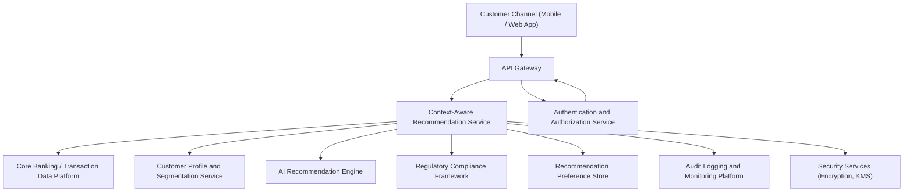

### Epic: QE-3011 - DAVBanking1-Context-Aware Financial Recommendations

#### 1. High-Level Design

- Architecture Overview & Component Diagram:

- Component Descriptions:
  - Customer Channel (Mobile / Web App): Presents context-aware recommendations and associated rationale; allows confirm/dismiss actions.
  - API Gateway: Secures and routes requests to Recommendation Service.
  - Context-Aware Recommendation Service: Combines transaction insights, profile data, and segments to orchestrate recommendation generation.
  - AI Recommendation Engine: Produces actionable recommendations for various user segments based on insights.
  - Customer Profile and Segmentation Service: Maintains user segments (e.g., “young professionals”) and financial attributes.
  - Core Banking / Transaction Data Platform: Provides transactional context for personalization.
  - Authentication and Authorization Service: Ensures only authenticated users receive recommendations and only for their accounts.
  - Regulatory Compliance Framework: Validates recommendations for suitability, fairness, and consumer protection requirements.
  - Audit Logging and Monitoring Platform: Logs recommendation generation and delivery events.
  - Security Services (Encryption, KMS): Protects all stored recommendation data and keys.
  - Recommendation Preference Store: Keeps track of user preferences for types of recommendations and communication frequency.

- Integration Points & Data Flow:
  1. User requests recommendations in context (e.g., after viewing spending insights).
  2. API Gateway passes authenticated request to Recommendation Service.
  3. Recommendation Service fetches:
     - Recent transaction insights from Core Banking or insight subsystems.
     - Segment and profile data from Profile Service.
     - User preferences and prior feedback from Preference Store.
  4. Recommendation Service calls AI Engine with context and user segment to generate candidate recommendations.
  5. Candidate recommendations and rationale are passed to Regulatory Compliance Framework for suitability and regulatory checks.
  6. Approved recommendations, along with explanation metadata, are returned and logged.
  7. User confirmation/dismissal events (coordinated with QE-3014) update preferences and influence future recommendations.

- Security & Compliance Features:
  - Encryption:
    - All recommendation data, including rationales and classifications, encrypted at rest using AES-256.
    - TLS 1.3 between all services.
  - RBAC/ABAC:
    - Role-based checks ensure only end customers receive customer-facing recommendations.
    - Attributes like risk profile and segment determine eligibility for specific product recommendations.
  - Validation and Filtering:
    - Recommendation Service validates that every recommendation references only the user’s accounts.
    - Recommendations filtered by country, product eligibility, and risk appetite.
  - Audit Logging:
    - Includes details such as model version, inputs (abstracted), recommendation type, and compliance decisions.
  - Compliance:
    - Suitability rules enforced via Regulatory Compliance Framework.
    - Consumer protection rules ensure clarity, non-deceptive wording, and adequate risk disclosures.
    - Data retention and consent for recommendation profiling managed via Preference Store and compliance rules.

- Resiliency & Error Handling:
  - Circuit Breakers:
    - Between Recommendation Service and AI Engine, Profile Service, and Compliance Framework.
  - Retries:
    - Non-critical calls (e.g., analytics, logs) retried with backoff.
  - Fallbacks:
    - If AI Engine fails, system may offer generic, low-risk recommendations or none, depending on compliance guidance.
  - Monitoring:
    - Track latency to ensure recommendation generation under 2 seconds and monitor decline in engagement as early warning.

#### 2. Validation Report

- Requirements Coverage:
  - Generate actionable recommendations based on transaction insights:
    - Covered via AI Engine and integration with transaction data and insights.
  - Align recommendations to user segments:
    - Covered via dedicated Profile and Segmentation Service.
  - Provide contextual messaging and rationale:
    - Covered via explanation metadata attached to recommendations.
  - Allow users to confirm or dismiss recommendations:
    - Covered via integration with Recommendation Confirmation/Dismissal Epic (QE-3014) and Preference Store.

- Compliance Status:
  - Data retention:
    - Recommendation logs and events retained according to policy, with older data aggregated/anonymized as needed.
    - Pass, subject to configuration.
  - Privacy constraints:
    - Profiling and personalization tied to explicit consent and accessible preference management.
    - Pass, with requirement to support data subject rights (access, deletion) operationally.

- Identified Ambiguities/Risks:
  - Ambiguity: Definition of “explainable at a basic level” and regulator expectations.
    - Mitigation: Adopt standardized explanation templates and perform usability tests with representative users.
  - Risk: Recommendations veering into regulated financial advice territory.
    - Mitigation: Strict product and wording catalog controlled by compliance; regular content reviews.
  - Ambiguity: Handling of cross-channel recommendations (branch, call center).
    - Mitigation: Design for omni-channel in roadmap but keep initial scope limited to digital channels as specified.
