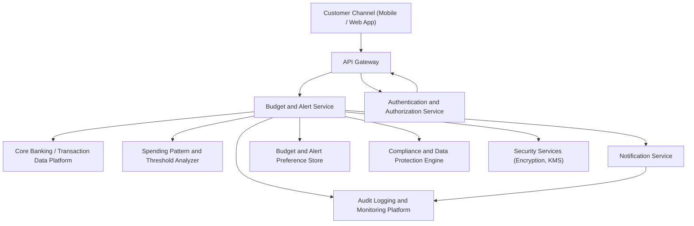

### Epic: QE-3012 - DAVBanking1-Budgeting and Spending Alerts

#### 1. High-Level Design

- Architecture Overview & Component Diagram:

- Component Descriptions:
  - Customer Channel (Mobile / Web App): Interface for setting budgets, viewing alerts, and alert history.
  - API Gateway: Protects, validates, and routes API calls related to budgets and alerts.
  - Budget and Alert Service: Central service to define spending patterns, create alerts, and manage alert lifecycle.
  - Core Banking / Transaction Data Platform: Source of transaction data used to detect anomalies and spending thresholds.
  - Spending Pattern and Threshold Analyzer: Computes typical spending, categories, and thresholds; detects anomalies.
  - Notification Service: Sends alert messages via selected channels.
  - Budget and Alert Preference Store: Stores per-user budget settings, thresholds, and channel preferences.
  - Authentication and Authorization Service: Validates user and ensures access only to own budget and alert data.
  - Compliance and Data Protection Engine: Ensures alerts and data processing comply with financial and privacy regulations.
  - Audit Logging and Monitoring Platform: Records alert generation, user responses, and configuration changes.
  - Security Services (Encryption, KMS): Secures at-rest data and keys.

- Integration Points & Data Flow:
  1. User configures budgets and threshold preferences via Mobile/Web App; stored in Preference Store.
  2. Budget and Alert Service periodically or in near real-time ingests transaction data from Core Banking.
  3. Analyzer determines if spending exceeds budgets or deviates from typical patterns.
  4. Budget and Alert Service validates potential alerts against user preferences and Compliance Engine.
  5. Approved alerts are delivered via Notification Service, and summarized in the app.
  6. Alert history is stored and viewable through the app.
  7. All events (alert creation, delivery, user acknowledgment) logged in Audit Logging Platform.

- Security & Compliance Features:
  - Encryption:
    - Budget settings and alert history encrypted at rest with AES-256.
    - All service-to-service traffic using TLS 1.3.
  - RBAC/ABAC:
    - Only authenticated account owners manage or view their own budgets and alerts.
    - Attributes such as customer type or region affect default thresholds and regulatory checks.
  - Validation and Filtering:
    - Budget input validated for sane ranges and categories.
    - Alerts are content-minimized; avoid unnecessary disclosure in message text.
  - Audit Logging:
    - Alerts, their triggers, and user responses are logged with contextual metadata.
  - Compliance:
    - Respect user notification and communication preferences.
    - Data retention rules for alert history defined and enforced.
    - Alerts designed to be informative, not advisory beyond approved scope.

- Resiliency & Error Handling:
  - Circuit Breakers:
    - Between Budget and Alert Service and Core Banking, Notification Service, and Compliance Engine.
  - Retries:
    - Transient issues in pulling transactions or sending alerts use controlled retries.
  - Fallbacks:
    - When Analyzer unavailable, system can pause new anomaly alerts and rely on static budget thresholds.
  - Monitoring:
    - Metrics on alert volume, false-positive rates, and latency tracked and used to tune thresholds.
  - User Feedback:
    - Users can mark alerts as “not useful,” feeding improvement cycles.

#### 2. Validation Report

- Requirements Coverage:
  - Define spending patterns and thresholds per customer:
    - Covered via Analyzer and Preference Store.
  - Generate budget alerts based on transaction analysis:
    - Covered via Budget and Alert Service and Analyzer integration.
  - Send spending alerts when anomalies or overspending detected:
    - Covered through Notification Service.
  - Display alert history within banking experience:
    - Covered via Mobile/Web App viewing from Preference/History storage.

- Compliance Status:
  - Data retention:
    - Alert history retention governed by policies configured in Compliance Engine.
    - Pass, with potential per-region tailoring.
  - Privacy constraints:
    - Limited disclosure of sensitive data in alerts, encryption, and access controls.
    - Pass, with recommended review by DPO/compliance.

- Identified Ambiguities/Risks:
  - Ambiguity: What level of anomaly triggers an alert (statistical thresholds, time windows).
    - Mitigation: Start with conservative thresholds, expose configuration for product owners and compliance.
  - Risk: Excessive false positives may reduce user trust.
    - Mitigation: Progressive tuning, user feedback loops, and A/B testing.
  - Ambiguity: Integration with other budgeting tools or external apps (out of scope).
    - Mitigation: Explicitly document non-integration and provide export capabilities only if compliance approves.
