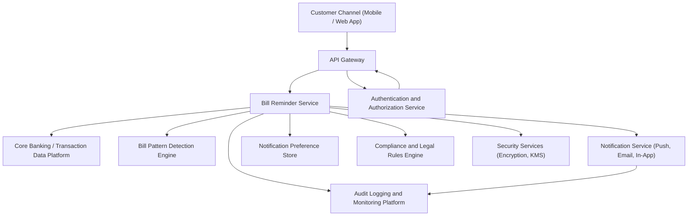

### Epic: QE-3013 - DAVBanking1-Bill Payment Reminders and Notifications

#### 1. High-Level Design

- Architecture Overview & Component Diagram:

- Component Descriptions:
  - Customer Channel (Mobile / Web App): Allows users to view and manage upcoming bill reminders and notification settings.
  - API Gateway: Secures and routes requests to Bill Reminder Service.
  - Bill Reminder Service: Orchestrates detection, scheduling, and management of bill reminders.
  - Core Banking / Transaction Data Platform: Provides transaction data to infer recurring bills and due dates.
  - Bill Pattern Detection Engine: Identifies recurring payments and predicts upcoming bill events.
  - Notification Service: Delivers reminders through push, email, SMS, and in-app alerts.
  - Notification Preference Store: Captures user channel preferences, quiet hours, and consent for electronic communications.
  - Authentication and Authorization Service: Ensures only authenticated users manage/view their reminders.
  - Compliance and Legal Rules Engine: Ensures reminders comply with regulations for electronic communications, disclosures, and opt-out rules.
  - Audit Logging and Monitoring Platform: Tracks reminder generation, delivery, failures, and user configuration changes.
  - Security Services (Encryption, KMS): Encrypts reminder data and secure routing of notifications metadata.

- Integration Points & Data Flow:
  1. Batch or streaming jobs from Bill Reminder Service to Core Banking pull relevant transaction data.
  2. Bill Pattern Detection Engine processes transactions to identify recurring bills and forecast due dates.
  3. Bill Reminder Service creates reminder records, referencing accounts, expected amounts, due dates, and lead times.
  4. Notification preferences and consents are read from Preference Store; Compliance Engine validates message content and channel usage.
  5. Bill Reminder Service schedules notifications through Notification Service respecting user preferences and regulatory rules.
  6. Notifications are sent over secure channels; minimal financial data is included in messages (e.g., no full account numbers).
  7. User can view upcoming reminders and modify preferences via Mobile/Web App, with changes persisted in Preference Store.
  8. All reminder generation, delivery attempts, and user changes are recorded in Audit Logging Platform.

- Security & Compliance Features:
  - Encryption:
    - All transaction data and reminder records encrypted at rest using AES-256.
    - All calls between services use TLS 1.3.
  - RBAC/ABAC:
    - Access to reminder data restricted to account owners.
    - ABAC used to handle jurisdiction-specific notification rules (e.g., time-of-day restrictions, channel permissions).
  - Input Validation and Output Filtering:
    - Reminder configuration changes validated for completeness and correct formats.
    - Notification content is templated and scrubbed of unnecessary account-specific detail.
  - Audit Logging:
    - Logs include creation of reminders, modifications, opt-in/opt-out events, delivery success/failure, and exceptions.
  - Compliance:
    - Consent management integrated via Preference Store and Compliance Engine.
    - Data retention schedules for reminder logs and notification history aligned to legal requirements.
    - Communication opt-out and unsubscribe mechanisms enforced.

- Resiliency & Error Handling:
  - Circuit Breakers:
    - Between Bill Reminder Service and Notification Service, Core Banking, and Compliance Engine.
  - Retries:
    - Transient failures in Notification Service lead to retries with backoff; non-delivery logged.
  - Fallbacks:
    - If Pattern Detection Engine unavailable, use previously known schedules until service restores.
  - Monitoring:
    - KPIs such as reminder lead time accuracy, delivery success rate, and latency are continuously monitored.
  - Error Messaging:
    - Internal errors result in non-specific, user-friendly messages while detailed diagnostics are logged internally.

#### 2. Validation Report

- Requirements Coverage:
  - Detect recurring and upcoming bill payments from transaction data:
    - Covered via Bill Pattern Detection Engine integrated with Core Banking.
  - Generate bill payment reminder events:
    - Covered via Bill Reminder Service and internal scheduling.
  - Deliver reminders via bank’s notification channels:
    - Covered via Notification Service with compliant templates.
  - Allow users to view and manage upcoming bill reminders:
    - Covered via Mobile/Web App and Preference Store.

- Compliance Status:
  - Data retention:
    - Logs and reminder history retention governed by configured schedules in compliance engine.
    - Pass, assuming jurisdiction-specific policies applied.
  - Privacy constraints:
    - Limited data in notifications, encryption of reminder data, and strict access controls.
    - Pass, with note to verify channel provider contracts for data protection.

- Identified Ambiguities/Risks:
  - Ambiguity: Exact lead time expectations (e.g., 3 vs. 7 days before due).
    - Mitigation: Make lead time configurable per product and region; default to conservative setting.
  - Risk: Misclassification of recurring transactions could create false reminders.
    - Mitigation: Provide simple ways to correct or dismiss specific reminders and use feedback to improve detection.
  - Ambiguity: Handling shared accounts or joint users for reminders.
    - Mitigation: Define rules on which account owners receive reminders, configurable per account.
