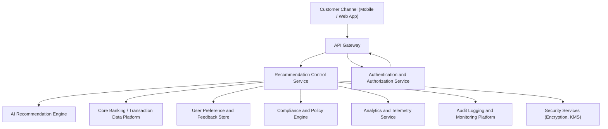

### Epic: QE-3014 - DAVBanking1-Recommendation Confirmation and Dismissal

#### 1. High-Level Design

- Architecture Overview & Component Diagram:

- Component Descriptions:
  - Customer Channel (Mobile / Web App): Displays recommendations and provides UI actions to confirm or dismiss them.
  - API Gateway: Secures, validates, and routes recommendation and feedback calls.
  - Recommendation Control Service: Manages lifecycle of recommendations, handles confirm/dismiss events, and updates feedback store and analytics.
  - AI Recommendation Engine: Generates and refines recommendations based on user behavior and feedback.
  - Authentication and Authorization Service: Verifies user identity and ensures actions are permitted.
  - Core Banking / Transaction Data Platform: Provides underlying transaction and account information used to generate recommendations.
  - Analytics and Telemetry Service: Collects metrics on acceptance rates, dismissal patterns, and engagement.
  - Compliance and Policy Engine: Validates recommendations and feedback capture against regulatory constraints.
  - Audit Logging and Monitoring Platform: Records all user decisions on recommendations and any changes applied to future recommendation logic.
  - Security Services (Encryption, KMS): Ensures secure storage of feedback and recommendation data using AES-256.
  - User Preference and Feedback Store: Persists per-user preferences, history of confirmed/dismissed recommendations, and consent flags.

- Integration Points & Data Flow:
  1. User requests recommendations via app; API Gateway forwards to Recommendation Control Service.
  2. Recommendation Control Service retrieves candidate recommendations from AI Recommendation Engine and applies compliance checks.
  3. Recommendations are persisted (with IDs) in Preference and Feedback Store and returned to client.
  4. When user confirms or dismisses a recommendation, the event is posted to API Gateway and forwarded to Recommendation Control Service.
  5. Recommendation Control Service:
     - Validates that the user owns the recommendation (using token claims and stored record).
     - Persists the event and updated status in Preference and Feedback Store.
     - Sends telemetry to Analytics Service for acceptance/dismissal metrics.
     - Sends anonymized feedback to AI Recommendation Engine for model refinement.
     - Logs event details to Audit Logging Platform.
  6. Future recommendation requests incorporate historical feedback to adjust relevance and frequency.

- Security & Compliance Features:
  - Encryption:
    - All feedback events are sent over TLS 1.3.
    - Recommendation and feedback records encrypted at rest using AES-256.
  - RBAC/ABAC:
    - Role checks ensure only RetailCustomer can act on their own recommendations.
    - Attribute checks ensure that corporate or restricted users are handled according to different policy sets if needed.
  - Validation and Filtering:
    - Server validates recommendation IDs against user identity and session.
    - Input events (confirm/dismiss) checked for idempotency to prevent replay attacks.
  - Audit Logging:
    - Every confirm/dismiss event includes user ID, recommendation ID, timestamp, and originating channel.
    - Stored in an immutable log store for regulatory audits.
  - Compliance:
    - Policy Engine enforces rules on which recommendations can be presented and how feedback may influence models (e.g., avoidance of unfair practices).
    - Data retention and consent management for feedback data are enforced via Preference Store and policy rules.

- Resiliency & Error Handling:
  - Circuit Breakers:
    - Between Recommendation Control Service and AI Engine, Analytics, and Compliance Engine.
  - Retries:
    - Telemetry and logging are retried asynchronously via message queues.
  - Fallbacks:
    - If Analytics or AI Engine are unavailable, user actions are queued for later processing while the user gets a success acknowledgement.
  - Error Responses:
    - Clear, non-technical messages to the user on transient failures with safe retry guidance.
  - Monitoring:
    - Acceptance rate metrics monitored for anomalies that might indicate model issues or UX problems.

#### 2. Validation Report

- Requirements Coverage:
  - Provide UI mechanisms to confirm or dismiss recommendations:
    - Covered via Mobile/Web App integration with Recommendation Control Service.
  - Capture user feedback events on each recommendation:
    - Covered via Feedback Store and analytics event pipeline.
  - Adjust future recommendations based on acceptance and dismissal patterns:
    - Covered via feedback loop from Recommendation Control Service to AI Recommendation Engine.
  - Track recommendation acceptance rates as key metric:
    - Covered via Analytics and Telemetry Service.

- Compliance Status:
  - Data retention:
    - Feedback data retention managed via policy rules; summarized statistics can outlive raw feedback where allowed.
    - Pass, assuming explicit retention configuration.
  - Privacy constraints:
    - Feedback tied to user identity is encrypted, access-controlled, and not exposed outside authorized analytics.
    - Pass, pending formal PIA/DPIA.

- Identified Ambiguities/Risks:
  - Ambiguity: Level of detail to be stored for each feedback event (e.g., context, device information).
    - Mitigation: Adopt strict data minimization, documenting any additional attributes with justification.
  - Risk: Bias amplification if dismissed recommendations are not properly interpreted.
    - Mitigation: AI governance process evaluates impact of feedback loops, with fairness monitoring and human review.
  - Ambiguity: Regulatory expectation on explicit consent for using feedback to adjust models.
    - Mitigation: Capture explicit consent for personalization and provide opt-out paths; tag all feedback with consent status.
