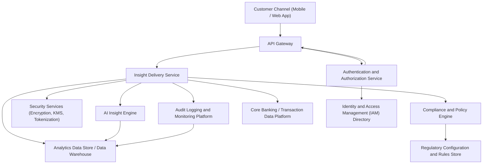

### Epic: QE-3015 - DAVBanking1-Secure and Compliant Insight Delivery

#### 1. High-Level Design

- Architecture Overview & Component Diagram:

- Component Descriptions:
  - Customer Channel (Mobile / Web App): Presents insights, recommendations, alerts, and reminders to authenticated users; enforces UI-level security (e.g., masking).
  - API Gateway: Single entry point; terminates TLS 1.3, enforces rate limiting, request validation, and routing to backend services.
  - Insight Delivery Service: Orchestrates retrieval, filtering, and delivery of AI-driven insights; applies access control checks and compliance constraints.
  - AI Insight Engine: Generates insights and recommendations from transaction and profile data according to configured models and policies.
  - Authentication and Authorization Service: Handles secure login (MFA as required), issues tokens (e.g., OAuth2/OIDC), and evaluates coarse-grained authorization.
  - Security Services (Encryption, KMS, Tokenization): Manages AES-256 encryption for data at rest, key management, and tokenization of sensitive identifiers.
  - Compliance and Policy Engine: Evaluates each insight against banking and regulatory policies (e.g., fairness, suitability, communication rules).
  - Audit Logging and Monitoring Platform: Centralized logging for access, insight generation, delivery, and policy decisions; supports investigations and monitoring.
  - Regulatory Configuration and Rules Store: Stores jurisdiction-specific regulatory rules, retention schedules, and consent-related policies.
  - Core Banking / Transaction Data Platform: Source of truth for transactional and profile data used in insight generation.
  - IAM Directory: Holds user identities, roles, and attributes for RBAC/ABAC.
  - Analytics Data Store / Data Warehouse: Stores anonymized or pseudonymized data for model monitoring, performance metrics, and risk analytics.

- Integration Points & Data Flow:
  1. User authenticates via Mobile/Web App; credentials are sent over TLS 1.3 to API Gateway and then to Authentication Service.
  2. Authentication Service validates user against IAM Directory, issues JWT/access token with roles and attributes.
  3. API Gateway validates token and forwards requests for insights to the Insight Delivery Service.
  4. Insight Delivery Service:
     - Retrieves required transaction/profile data from Core Banking.
     - Calls AI Insight Engine to obtain candidate insights/recommendations.
     - Enriches the request with user attributes (segment, geography, risk profile) from IAM/Customer Profile.
  5. Insight Delivery Service invokes Compliance and Policy Engine, providing:
     - Proposed insights/recommendations.
     - User attributes and context.
     - Channel, locale, and jurisdiction.
  6. Compliance and Policy Engine retrieves applicable rules and thresholds from Regulatory Configuration and Rules Store, evaluates:
     - Suitability, fairness, disclosure requirements, communication wording limits.
     - Restrictions on certain product promotions.
  7. Policy decisions (allow/modify/block) are returned to Insight Delivery Service.
  8. Insight Delivery Service filters and annotates insights accordingly, applies data minimization, and logs decisions and context to Audit Logging Platform.
  9. Sanitized, compliant insights are returned via API Gateway to the client over TLS 1.3.
  10. Relevant events (e.g., insight viewed, dismissed) are pseudonymized and streamed to Analytics Data Store for monitoring and model governance.

- Security & Compliance Features:
  - Encryption:
    - Data in transit: All communication between client and API Gateway, and between backend services, uses TLS 1.3 with strong cipher suites.
    - Data at rest: Sensitive data in Core Banking, Insight Delivery, and AI Insight Engine stores is encrypted using AES-256 with centralized key management.
  - Access Control (RBAC/ABAC):
    - RBAC: Roles such as RetailCustomer, BankAnalyst, ComplianceOfficer determine baseline permissions to insights and analytics.
    - ABAC: Attributes like region, risk tier, KYC status, and consent flags control which insights can be generated and shown.
    - Fine-grained checks in Insight Delivery Service ensure that a user only sees insights derived from accounts they own or are authorized to view.
  - Input Validation and Output Filtering:
    - API Gateway performs schema validation, size limits, and basic sanitization of input parameters.
    - Insight Delivery Service validates all references (account IDs, customer IDs) against authenticated identity.
    - Output filtering removes unnecessary PII, masks account numbers, and restricts fields based on user role and consent.
  - Audit Logging:
    - All insight generation events, access attempts, policy decisions, and data retrieval calls are logged with timestamp, user ID (or pseudonym), accounts, and outcome.
    - Tamper-evident log storage with retention policies aligned to regulatory requirements.
  - Secrets Management:
    - Credentials, API keys, and private keys stored in a dedicated secrets vault; accessed via short-lived tokens, rotated regularly.
    - No secrets in code or configuration files.
  - Compliance Mapping:
    - Data privacy: Data minimization and purpose limitation enforced via policy engine and attribute-based access.
    - Model governance: Calls and outputs from AI Insight Engine tagged with model version and stored for fairness/accuracy reviews.
    - Change management: Regulatory Configuration Store supports versioned policies; changes trigger regression checks and require approvals.

- Resiliency & Error Handling:
  - Circuit Breakers:
    - Between Insight Delivery Service and AI Insight Engine, Core Banking, and Compliance Engine to avoid cascading failures.
  - Retries:
    - Idempotent read operations (e.g., fetching transaction data) use bounded exponential backoff.
    - Non-idempotent operations (e.g., logging) use at-least-once semantics with deduplication where necessary.
  - Fallback Patterns:
    - If AI Insight Engine is unavailable, system can fall back to cached or rules-based insights where permitted.
    - If Compliance Engine is unavailable, system defaults to safest behavior (block delivery of new insights) and informs user with generic message.
  - Graceful Degradation:
    - If non-critical analytics services fail, insight delivery continues while telemetry is queued locally for later transmission.
  - Monitoring and Alerts:
    - Health checks for all services; SLA monitoring for insight response times (< 2 seconds for typical view).
    - Alerts for unusual access patterns or spikes in blocked insights (potential compliance issue).

#### 2. Validation Report

- Requirements Coverage:
  - Enforce secure authentication for access to insights and recommendations:
    - Covered via Authentication Service, IAM, MFA support, and API Gateway token validation.
  - Apply data privacy controls to transaction and profile information:
    - Covered via ABAC, data minimization, masking, and encryption at rest and in transit.
  - Implement compliance checks for AI outputs:
    - Covered via Compliance and Policy Engine, Regulatory Configuration Store, and model governance metadata.
  - Monitor data privacy and regulatory risk related to AI features:
    - Covered via centralized Audit Logging, analytics on blocked/modified insights, and monitoring dashboards.
  - NFRs (encryption, access control, regulatory adaptability, performance):
    - Encryption: AES-256/TLS 1.3 explicitly addressed.
    - Access control: RBAC/ABAC defined at multiple layers.
    - Regulatory adaptability: Configuration-driven rules in Regulatory Configuration Store.
    - Performance: Architecture supports caching, asynchronous processing, and monitoring of response times.

- Compliance Status:
  - Data retention:
    - Design includes retention policies in Regulatory Configuration Store and enforcement via logging and analytics platform.
    - Pass, assuming retention schedules configured per jurisdiction.
  - Privacy constraints:
    - Data minimization, attribute-based access, encryption, and audit logging all in place.
    - Pass, with note that privacy impact assessment and DPIA should be conducted prior to go-live.

- Identified Ambiguities/Risks:
  - Ambiguity: Specific regulatory frameworks (e.g., GDPR, CCPA, local banking regulations) not fully enumerated.
    - Mitigation: Use configurable policy rules per jurisdiction and maintain mapping documents outside the system to specific laws.
  - Risk: Explainability requirements for AI insights vary by regulator and may be stricter than “basic level.”
    - Mitigation: Include explanation metadata (key features, simple rationale) with each insight and provide a standardized “Why am I seeing this?” view.
  - Ambiguity: Model monitoring thresholds (drift, bias) not specified.
    - Mitigation: Define SLOs and thresholds for model performance and fairness metrics in model governance process; integrate with Analytics Data Store.
  - Risk: Dependency on Compliance Engine availability could block insight delivery.
    - Mitigation: High-availability deployment for Compliance Engine, plus well-defined fail-safe behavior (block high-risk insights, allow low-risk informational insights only if explicitly agreed by compliance).
