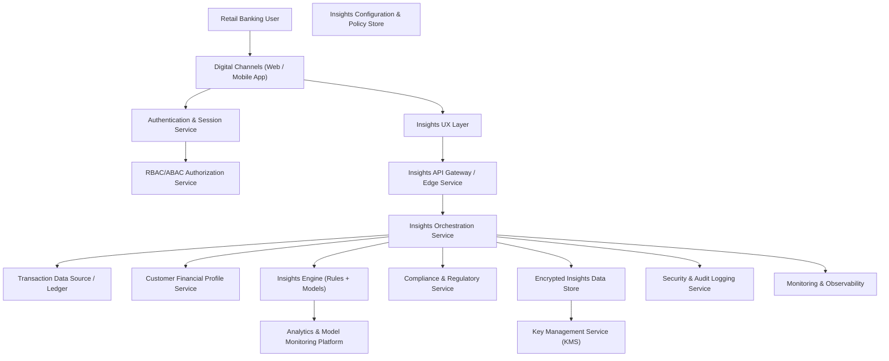

#### 1. High-Level Design

- Architecture Overview & Component Diagram:

- Component Descriptions:

  - Digital Channels (Web / Mobile App): Provides the front-end for viewing personalized insights, explanations, and any actions linked to insights.
  - Authentication & Session Service: Manages secure access and session lifecycle for users accessing insights.
  - RBAC/ABAC Authorization Service: Enforces that only authorized users (and processes) can access their own insights and related data.
  - Insights UX Layer: UI components that display insights in simple, user-friendly language, segmented by time and category.
  - Insights API Gateway / Edge Service: Exposes a secure API façade for insights-related operations, handling rate limiting and request normalization.
  - Insights Orchestration Service: Central service that orchestrates data retrieval, profile derivation, insight generation, and persistence.
  - Transaction Data Source / Ledger: System of record for transactional data required for insights.
  - Customer Financial Profile Service: Derives and maintains a profile summarizing income patterns, spending categories, trends, and segment attributes.
  - Insights Engine (Rules + Models): Combines business rules and AI/ML models to generate personalized insights from profile and transaction data.
  - Insights Configuration & Policy Store: Stores configuration for insight rules, thresholds, segment-specific strategies, and feature toggles.
  - Compliance & Regulatory Service: Validates that insights comply with banking regulations, especially around suitability, fairness, and explanations.
  - Encrypted Insights Data Store: Persistence layer for generated insights, explanations, and metadata, encrypted at rest.
  - Key Management Service (KMS): Manages encryption keys for insights and related secrets.
  - Security & Audit Logging Service: Logs access, generation, and viewing of insights for security and compliance purposes.
  - Monitoring & Observability: Captures performance, latency, errors, and system health metrics.
  - Analytics & Model Monitoring Platform: Receives model outputs and performance data to monitor accuracy, bias, and drift.

- Integration Points & Data Flow:

  1. Data ingestion and profile derivation:
     - Insights Orchestration Service periodically or on demand fetches transaction data from the Transaction Data Source via secure APIs.
     - The data is passed to the Customer Financial Profile Service, which aggregates:
       - Income trends, spending categories, recurring expenses, and cash flows.
     - Profiles are stored (or cached) in a secure, minimized format focusing on necessary features.

  2. Insight generation:
     - For a given request (triggered by user or schedule), Orchestration loads the relevant profile and configuration from the Configuration & Policy Store.
     - It then calls the Insights Engine, which:
       - Applies deterministic rules (e.g., “spend in category X increased by Y% month-over-month”) and ML models (pattern recognition).
       - Produces candidate insights with metadata (confidence scores, category, time period).
     - The Compliance & Regulatory Service is invoked to ensure insights:
       - Do not constitute unauthorized advice or unsuitable recommendations.
       - Align with regulatory definitions of information vs. advice.

  3. Storage and retrieval:
     - Validated insights are persisted in the Encrypted Insights Data Store with necessary metadata and display strings.
     - The Insights UX Layer retrieves insights via the Insights API Gateway and Orchestration Service, filtered by user and time period.

  4. Presentation to users:
     - Insights are presented in simple language with basic explanations (e.g., “Based on your last 3 months of spending in category X…”).
     - Users can view, hide, or mark insights as useful/not useful; feedback is captured for analytics and model improvements.

  5. Monitoring and model governance:
     - The Analytics & Model Monitoring Platform tracks:
       - Insight engagement, correctness indicators, and segment performance.
       - Potential biases or drift in model behavior.
     - Orchestration and Insights Engine emit metrics and logs to Monitoring & Observability.

- Security & Compliance Features:

  - Encryption (AES-256/TLS 1.3):
    - All external and internal API traffic uses TLS 1.3.
    - Encrypted Insights Data Store uses AES-256 encryption for at-rest data.
    - KMS handles key rotation, key access policies, and audit trails for key usage.

  - Input Validation & Output Filtering:
    - Inputs (filters, date ranges, category selections) from Digital Channels are validated at the API Gateway and Orchestration layers:
      - Range checks, format checks, and maximum limits to prevent abuse.
    - Outputs are filtered to:
      - Avoid exposing unnecessary granular detail in contexts where it is not needed.
      - Ensure explanations remain within allowed advice boundaries (as per Compliance guidance).

  - RBAC/ABAC:
    - Customers may only access insights generated for their own accounts; enforced via user identity and account mappings in Orchestration.
    - Internal roles (e.g., risk analysts) may access aggregated or anonymized insight metrics via Analytics & Monitoring.
    - ABAC enforces region, product, and channel constraints for insights (e.g., certain insights disabled in specific jurisdictions).

  - Audit Logging:
    - Insight generation, view events, and key actions (e.g., enabling/disabling specific insight types) are logged with user ids, timestamps, and context.
    - Logs omit raw personal data; rely on identifiers and anonymized tags.
    - Audit logs are stored in a secure, write-once or append-only format per regulatory expectations.

  - Compliance:
    - Data Retention:
      - Insights retained for a defined period aligned with banking policies; may differ from transaction retention if allowed.
      - Older insights may be aggregated or anonymized for analytics while raw insights are purged.

    - Consent Management:
      - Users may opt in/out of specific types of insights (e.g., spending pattern insights vs. income variability insights).
      - Consent flags stored in Configuration & Policy or Profile services and enforced before generation and display.

    - Data Lineage:
      - Each insight references source transactions (IDs, not raw details in the insight store) and profile version.
      - Insight Engine version and configuration snapshot are stored for reproducibility.

    - Compliance Reporting:
      - Reports on insight usage, opt-out rates, and regulatory exceptions can be generated using audit and analytics data.
      - Model monitoring outputs (drift, fairness metrics) support regulatory audits for AI usage.

- Resiliency & Error Handling:

  - Retry Mechanisms:
    - Calls to Transaction Data Source and Compliance Service use retriable patterns with exponential backoff for transient failures.
    - Insight generation requests are idempotent; duplicate requests are deduplicated via request IDs.

  - Circuit Breakers:
    - Insights Engine and Compliance Service calls are wrapped in circuit breakers to avoid system-wide outages.
    - If the Compliance Service is unavailable, the system defaults to not surfacing new insights while continuing to allow access to previously generated ones.

  - Fallback Patterns:
    - When the Transaction Data Source is unavailable, Orchestration can fall back to the most recent cached profile (if allowed), clearly labeling insights as potentially outdated.
    - If the Insights Engine is unreachable, basic rule-based insights may be generated locally in Orchestration as a degraded mode.

  - Logging & Monitoring:
    - Error logs and metrics capture failure types, frequencies, and impacted user segments.
    - Latency is tracked from request to insight display to ensure adherence to the 2-second NFR.

#### 2. Validation Report

- Requirements Coverage:

  - Transaction data ingestion and processing:
    - Covered via Orchestration and integration with Transaction Data Source; profiles built from these data.

  - Customer financial profile derivation:
    - Covered by the Customer Financial Profile Service and its integration with Orchestration.

  - Insight generation logic based on spending and income patterns:
    - Covered by the Insights Engine using rules and models leveraging profile and transaction data.

  - Insight presentation in user-friendly format:
    - Covered by Insights UX Layer and Gateway, which provide simplified language and contextual explanations.

  - Support for different retail customer segments:
    - Covered via segment-aware configurations in Insights Configuration & Policy Store and segment logic in the Insights Engine.

  - NFR – Insights generated and displayed within 2 seconds:
    - Addressed by designing low-latency interactions, caching profiles, and monitoring response times.

  - NFR – Compliance with banking data privacy and security standards:
    - Addressed via encryption, RBAC/ABAC, audit logging, consent management, and controlled output filtering.

- Compliance Status:

  - Data Retention:
    - Status: Pass (Retention timelines defined; anonymization and purging strategies in place.)

  - Privacy & Security:
    - Status: Pass (TLS 1.3, AES-256, minimized data storage, restricted access.)

  - Consent Management:
    - Status: Pass (Opt-in/opt-out per insight type; enforced at generation and display.)

  - Data Lineage & Audit:
    - Status: Pass (Insight records reference source data, engine versions, and are fully auditable.)

  - Regulatory Constraints on AI & Advice:
    - Status: Pass (Compliance & Regulatory Service gating insights and differentiating between informational content and regulated advice.)

- Identified Ambiguities/Risks:

  - Ambiguity: Boundary between “insights” and regulated recommendations/advice.
    - Risk: Insights might be interpreted as advice, triggering stricter regulatory requirements.
    - Mitigation: Involve legal/compliance in defining message templates; enforce pre-approved phrasing; use Compliance Service to block high-risk content.

  - Ambiguity: Level of personalization allowed per jurisdiction.
    - Risk: Over-personalization could clash with privacy expectations.
    - Mitigation: Use region-specific policies in ABAC; allow disabling or limiting certain insight categories per jurisdiction.

  - Risk: Model bias or inaccurate insights affecting customer trust.
    - Mitigation: Continuous monitoring, bias analysis, and thresholds for disabling specific insight types if quality falls below agreed levels.

  - Risk: Latency breaches under peak load.
    - Mitigation: Autoscaling Insights Engine and Orchestration services; caching commonly used profile data; strict performance monitoring.

  - Risk: Over-retention of insight data beyond required periods.
    - Mitigation: Automated retention enforcement jobs with audit reports to validate deletion and anonymization procedures.
