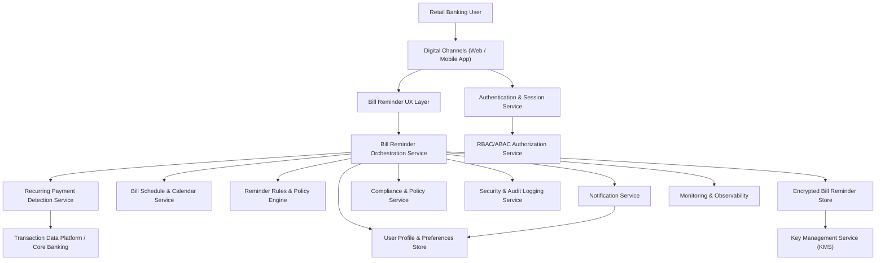

#### 1. High-Level Design

- Architecture Overview & Component Diagram:

- Component Descriptions:

  - Digital Channels (Web / Mobile App): Presents upcoming bills, reminders, and user actions (configure, dismiss, mark handled). Communicates only via secure APIs.
  - Authentication & Session Service: Provides secure login, session management, and token issuance for all reminder operations.
  - RBAC/ABAC Authorization Service: Enforces which users and internal roles can view, modify, or administer reminders (e.g., support staff with read-only access).
  - Bill Reminder UX Layer: Front-end components for bill calendar, reminder list, rule configuration, and reminder detail views.
  - Bill Reminder Orchestration Service: Core backend service that orchestrates detection, scheduling, rule evaluation, and notification triggering.
  - Recurring Payment Detection Service: Analyzes transaction history to identify recurring payments, inferred due dates, and bill-like patterns.
  - Transaction Data Platform / Core Banking: Source of authoritative transaction history and existing bill-pay data.
  - Bill Schedule & Calendar Service: Maintains schedules of upcoming and historical bill reminders, including lead times and recurrence.
  - Reminder Rules & Policy Engine: Evaluates user-configured rules (lead time, frequency) and bank policies (communication constraints, limits).
  - Notification Service: Delivers reminders through approved channels (in-app, email, SMS, push), honoring user preferences and regulatory rules.
  - User Profile & Preferences Store: Stores notification preferences, reminder configurations, time zones, and consent flags.
  - Compliance & Policy Service: Validates that reminder content and channels conform to banking communication policies and regulatory constraints.
  - Encrypted Bill Reminder Store: Persisted storage (e.g., RDBMS or document store) for reminders, identified bills, schedules, and status, encrypted at rest.
  - Key Management Service (KMS): Manages encryption keys for data at rest and secrets used for notifications and integrations.
  - Security & Audit Logging Service: Centralized logging of access, reminder generation, delivery events, and user actions for traceability.
  - Monitoring & Observability: Collects metrics, traces, and error logs; supports alerting and SLO monitoring.

- Integration Points & Data Flow:

  1. Transaction ingestion and detection:
     - On a scheduled job or event trigger, the Recurring Payment Detection Service queries the Transaction Data Platform over a secure, mutually authenticated channel (TLS 1.3).
     - Transactions are analyzed for patterns (amount, merchant, cadence) to identify probable bills.
     - Detected bills and inferred due dates are passed to the Bill Reminder Orchestration Service.

  2. Schedule generation and reminder persistence:
     - The Orchestration Service consults the Bill Schedule & Calendar Service to generate future instances (e.g., next due date).
     - User preferences from the User Profile & Preferences Store are applied (lead time, channels).
     - The Reminder Rules & Policy Engine validates rules and calculates reminder trigger times.
     - The Encrypted Bill Reminder Store persists schedules and reminders (status, channel, timestamps).

  3. Reminder evaluation and notification:
     - A scheduler within the Orchestration Service evaluates due reminders within the defined time window.
     - For each candidate reminder:
       - The Compliance & Policy Service is invoked to ensure message content and channel are allowed (no sensitive data in clear, correct disclaimers).
       - If compliant, the Notification Service is called with a templated, redacted message and channels derived from Preferences.
     - Notification Service delivers messages and returns delivery status; Orchestration Service updates reminder status accordingly (e.g., Sent).

  4. User interaction (in-app):
     - User authenticates via Digital Channel; Authentication & Session Service issues tokens.
     - RBAC/ABAC Authorization verifies access; the UX Layer calls the Orchestration Service to load upcoming and past reminders.
     - The user can dismiss or mark reminders as handled; actions are propagated to Orchestration, persisted, and logged via Security & Audit Logging.
  
  5. Monitoring and feedback:
     - Orchestration and Detection services emit metrics (number of reminders generated, delivered, dismissed; latency) to Monitoring & Observability.
     - Audit events and logs are centralized for line-of-business reporting and compliance audits.

- Security & Compliance Features:

  - Encryption (AES-256/TLS 1.3):
    - All internal and external service calls use TLS 1.3 with mutual authentication.
    - The Encrypted Bill Reminder Store encrypts data at rest with AES-256, keys managed by KMS.
    - Sensitive fields (e.g., partial account numbers, merchant identifiers) are either tokenized or redacted in logs and notifications.
  
  - Input Validation & Output Filtering:
    - All user inputs (e.g., custom reminder names, notes) are validated server-side:
      - Length limits, allowed character sets, and contextual validation (e.g., lead time range).
    - Output to notifications is filtered:
      - No full account numbers or exact amounts if policy forbids; only high-level descriptors (e.g., “Utility bill due soon”).
      - Templates enforce redaction rules centrally via the Compliance & Policy Service.

  - RBAC/ABAC:
    - Customer-level access ensures users can only access reminders linked to their accounts.
    - Internal staff (e.g., customer support) may have read-only access to reminder metadata via ABAC (e.g., role + region + case context).
    - Administrative actions (e.g., disabling reminder features for a segment) require elevated roles, enforced via RBAC.

  - Audit Logging:
    - All reminder creations, updates, deliveries, and user actions (dismiss, mark handled) generate audit events.
    - Logs include:
      - User identifier (pseudonymized where required), time, channel, and action.
      - No raw sensitive data; only references (IDs) and minimal descriptive fields.
    - Audit logs are immutable (append-only) and retained according to banking regulations.

  - Compliance:
    - Data retention policies:
      - Reminder data retained based on regulatory guidance and internal retention schedules (e.g., 7 years or as mandated).
      - Pseudonymization or deletion is applied after retention expiry or upon valid deletion request, per policy.
    - Consent management:
      - Users must opt-in for specific channels (SMS, email) via Preferences.
      - Changes to consent are versioned and logged for auditability.
    - Data lineage:
      - Each reminder record references the source transactions (IDs), detection logic version, and rules applied.
      - Enables traceability from reminder to underlying financial events for investigations.
    - Compliance reporting:
      - Regular reports on reminder volumes, channels, opt-in/opt-out rates, and exceptions can be generated from logs and metrics.

- Resiliency & Error Handling:

  - Retry Mechanisms:
    - Idempotent APIs for Notification Service and Transaction Data Platform with exponential backoff and jitter on transient errors.
    - Detection jobs track progress via checkpoints to resume safely after failures.

  - Circuit Breakers:
    - For downstream dependencies (Notification Service, Compliance Service, Transaction Platform), circuit breakers prevent cascading failures.
    - When open, the system:
      - Queues reminder requests for later delivery where policy allows.
      - Degrades gracefully by providing in-app-only reminders if external channels are unavailable.

  - Fallback Patterns:
    - If recurring detection is unavailable, the system can temporarily rely on existing bill-pay data from Core Banking (if available).
    - If Compliance Service is unavailable, the default fail-safe is to suppress outbound notifications to avoid non-compliant communications.

  - Logging & Monitoring:
    - Structured logs for each failure mode, tagged by service, channel, and user segment.
    - Metrics for latency, error rates, and dropped reminders, with alerting thresholds aligned to banking SLAs.

#### 2. Validation Report

- Requirements Coverage:

  - Detection of recurring bill payments and due dates:
    - Covered by Recurring Payment Detection Service and integration with Transaction Data Platform.

  - Bill calendar or schedule generation:
    - Covered by Bill Schedule & Calendar Service in conjunction with Orchestration Service.

  - Reminder rule configuration (lead time, frequency):
    - Covered by Reminder Rules & Policy Engine and User Profile & Preferences Store.

  - Reminder notifications through available channels:
    - Covered by Notification Service integrated with Preferences and Compliance Service.

  - In-app view of upcoming and past reminders:
    - Covered by Digital Channels + Bill Reminder UX Layer backed by Orchestration and Encrypted Store.

  - User ability to dismiss or mark reminders as handled:
    - Covered via UX actions mapped to Orchestration, persisted in the Encrypted Store, and logged.

  - NFR – Reminder generation and delivery within 2 seconds:
    - Addressed with low-latency architecture, asynchronous scheduling, and monitoring on latency metrics.

  - NFR – Secure processing and storage of bill-related data:
    - Addressed via AES-256 at rest, TLS 1.3 in transit, KMS, RBAC/ABAC, and input/output controls.

  - NFR – Avoid exposing sensitive information in reminders:
    - Addressed via Compliance & Policy Service and notification templates with strict redaction rules.

- Compliance Status:

  - Data Retention:
    - Status: Pass (Design includes explicit retention policies, deletion on expiry, and controlled access.)
  
  - Privacy & Data Protection:
    - Status: Pass (Secure transport, encryption at rest, minimal data exposure in messages, access controls.)
  
  - Consent Management:
    - Status: Pass (Explicit consent and opt-in per channel in the Preferences Store; changes logged.)
  
  - Data Lineage & Audit:
    - Status: Pass (Reminders linked to transaction IDs and detection rules, audit logging integrated.)
  
  - Regulatory Communication Constraints:
    - Status: Pass (Compliance & Policy Service gating outbound communications, templated content.)

- Identified Ambiguities/Risks:

  - Ambiguity: Level of detail allowed in reminder messages (e.g., showing merchant name or amount).
    - Risk: Over-exposure of transaction details in channels such as SMS or email.
    - Mitigation: Default to conservative content (high-level descriptions) and drive specific policies from Compliance Service based on jurisdiction and channel.

  - Ambiguity: Exact definition of “bill-like patterns” and acceptable false-positive rates.
    - Risk: Customers may receive reminders for non-bills, affecting trust.
    - Mitigation: Include feedback mechanisms (dismiss with “not a bill”) and thresholds tuned over time using Monitoring & Observability; start with strict detection rules.

  - Ambiguity: Variations in regulatory requirements across markets for retention and communications.
    - Risk: Non-compliance in regions with stricter rules.
    - Mitigation: Parameterize retention and messaging policies by jurisdiction; use ABAC rules including country/region in the Compliance & Policy Service.

  - Risk: Dependency on Notification Service availability.
    - Mitigation: Circuit breakers and queue-based retries; in-app reminders remain available even if external channels fail.

  - Risk: User expectation management (reminders vs. actual payment execution).
    - Mitigation: Clear UI and messaging that reminders do not guarantee payment; explicit labels and disclaimers enforced by Compliance & Policy Service.
