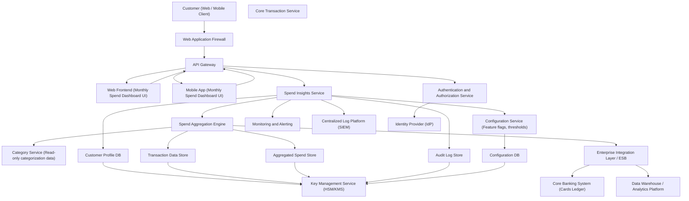

#### 1. High-Level Design

- Architecture Overview & Component Diagram:

- Component Descriptions:

  - Customer (Web / Mobile Client): Browser or mobile app used by customers to view their monthly spending summary dashboard.
  - Web Application Firewall (WAF): Protects against common web attacks (e.g., OWASP Top 10), enforces IP/geo rules, and basic rate limiting.
  - API Gateway:
    - Terminates TLS 1.3.
    - Routes requests to internal services.
    - Applies coarse-grained RBAC, throttling, and request/response normalization.
  - Web Frontend / Mobile App:
    - Renders the Monthly Spending Summary Dashboard.
    - Calls backend APIs to fetch monthly totals, KPIs, and breakdowns.
    - Performs basic client-side input validation (e.g., month selection).
  - Authentication and Authorization Service (AUS):
    - Integrates with enterprise IdP (IDM) using OAuth2/OIDC.
    - Issues and validates access tokens and refresh tokens.
    - Provides RBAC/ABAC decisions to the API Gateway and Spend Insights Service.
  - Spend Insights Service:
    - Main domain service for the dashboard.
    - Exposes APIs: `GET /spend/monthly-summary?month=YYYY-MM`.
    - Applies business rules, security checks, and orchestrates calls to Aggregation Engine and data stores.
    - Enforces per-user data access.
  - Spend Aggregation Engine:
    - Calculates monthly total spend, number of transactions, and basic breakdowns for a given month.
    - Uses historical transactions from Transaction Data Store.
    - Writes and reads pre-computed aggregates from Aggregated Spend Store for performance.
  - Core Transaction Service (CTS):
    - Provides read-only transaction feeds from the core card ledger.
    - Supports backfill and near-real-time updates into Transaction Data Store.
  - Category Service:
    - Supplies read-only categorization metadata (e.g., mapping of MCC codes to categories).
    - Used by Aggregation Engine to provide breakdown entry points.
  - Configuration Service:
    - Manages feature flags (e.g., enabling/disabling specific dashboard widgets) and threshold values.
    - Provides configurations to frontend and Spend Insights Service.
  - Customer Profile DB:
    - Stores customer-level metadata and preferences (e.g., preferred currency, consent flags).
  - Transaction Data Store (TDB):
    - Stores normalized card transaction history.
    - Partitioned by customer and month to support efficient monthly queries.
  - Aggregated Spend Store (ADB):
    - Stores pre-computed monthly KPIs and breakdowns for fast retrieval.
    - Includes total spend, number of transactions, top categories (as pointers/entry points).
  - Audit Log Store (AUD):
    - Immutable or append-only store of auditable events: dashboard access, configuration changes, security events.
  - Configuration DB:
    - Persistence for feature flags and config values.
  - Enterprise Integration Layer / ESB:
    - Integrates with Core Banking System and Data Warehouse.
    - Handles transformations, protocol conversions, and asynchronous feeds.
  - Core Banking System (CBS):
    - System of record for credit card accounts and ledger.
    - Authoritative source of transaction data.
  - Data Warehouse / Analytics Platform (DWH):
    - Receives transaction and aggregation feeds for analytics, reporting, and compliance queries.
  - Monitoring and Alerting:
    - Collects metrics (latency, error rate, throughput).
    - Triggers alerts on SLO/SLA breaches.
  - Centralized Log Platform / SIEM:
    - Aggregates logs for security monitoring, incident response, and forensic analysis.
  - Key Management Service (KMS/HSM):
    - Manages encryption keys for data-at-rest and tokens.
  - Identity Provider (IdP):
    - Enterprise identity system for customer authentication (e.g., SSO, MFA).

- Integration Points & Data Flow:

  1. Authentication and Session Establishment:
     - Customer accesses dashboard via Web or Mobile.
     - WAF forwards request to API Gateway.
     - Gateway redirects to AUS/IdP for OAuth2/OIDC authentication.
     - IdP performs MFA/step-up authentication as needed.
     - AUS issues JWT or opaque access token (short-lived) + refresh token.
  2. Dashboard Data Request:
     - Client invokes `GET /spend/monthly-summary?month=YYYY-MM` with access token.
     - API Gateway:
       - Validates TLS 1.3 connection.
       - Performs token introspection via AUS.
       - Applies basic RBAC: ensure role `CARD_CUSTOMER` or equivalent.
     - Gateway forwards to Spend Insights Service.
  3. Business Logic & Aggregation:
     - Spend Insights Service:
       - Validates request parameters (month format, allowable range, ownership).
       - Consults Customer Profile DB for preferences (e.g., default month range).
       - Checks ADB for pre-computed summary.
       - If not available or stale:
         - Calls Aggregation Engine.
         - Aggregation Engine:
           - Pulls transactions from TDB (ensuring customer and month filters).
           - Executes aggregation: total spend, count of transactions, basic breakdown (e.g., online vs in-store or entry-level categories).
           - Writes aggregated results into ADB.
       - Returns monthly summary payload to API Gateway.
  4. Downstream Transaction Data Ingestion:
     - CTS receives transaction updates from CBS.
     - ESB pushes normalized transactions into TDB in near-real-time or batch.
     - Aggregation Engine may be triggered asynchronously (e.g., nightly) to precompute monthly aggregates.
  5. Logging, Monitoring, and Audit:
     - Spend Insights Service and API Gateway emit:
       - Access logs, error logs to Centralized Log Platform / SIEM.
       - Metrics to Monitoring and Alerting.
     - Audit events (e.g., dashboard access, consent checks) sent to Audit Log Store.
       - Integration events propagated to DWH for regulatory reporting.

- Security & Compliance Features:

  - Transport Security (TLS 1.3):
    - All client-to-gateway and internal service-to-service communications are over TLS 1.3 with mutual TLS for internal calls.
    - Strong cipher suites mandated per enterprise security baseline.
  - Data Encryption (AES-256):
    - PII, PAN tokens, and sensitive financial fields stored encrypted at rest using AES-256, with keys managed by KMS/HSM.
    - ADB and TDB volumes encrypted; column-level encryption for high-risk fields.
  - Input Validation:
    - API layer:
      - Validates `month` parameter format (YYYY-MM) using strict regex.
      - Enforces month within allowable range (e.g., last 24 months) and ensures only credit card products are queried.
    - Frontend:
      - Restricts month selection via UI controls; prevents arbitrary text input.
  - Output Filtering:
    - Responses strictly limited to:
      - Aggregated values (total spend, counts, high-level breakdown).
      - No full PANs, CVV, or unmasked card numbers.
      - No unnecessary PII attributes.
    - API returns only fields defined in approved response schema; extra internal fields are excluded.
  - RBAC / ABAC:
    - RBAC:
      - Roles like `CARD_CUSTOMER`, `READ_SPEND_SUMMARY`.
      - API Gateway enforces coarse-grained access; Spend Insights Service enforces fine-grained checks.
    - ABAC:
      - Policies to ensure customer can only access their own card accounts (e.g., subject-id == customer-id).
      - Environment attributes for additional constraints (e.g., region, device risk score).
  - Audit Logging:
    - Events logged:
      - Authentication success/failure.
      - Dashboard summary viewed (with customer ID, card reference, month, timestamp).
      - Configuration changes.
      - Security-relevant events (e.g., repeated invalid month requests).
    - Logs stored in immutable or WORM-compliant storage per regulatory requirements.
  - Secrets Management:
    - No secrets stored in code or config files.
    - All credentials (DB passwords, API keys, signing keys) retrieved from KMS/Secrets Manager at runtime.
    - Regular rotation and access audited.
  - Compliance Mapping:
    - Data minimization: Only aggregated spend for selected month, no surplus attributes.
    - PCI-DSS alignment: No storage or display of full PAN, sensitive auth data excluded.
    - Privacy (e.g., GDPR-like):
      - Use of customer identifiers consistent with data minimization and pseudonymization.
      - Consent flags checked prior to showing derived/analytics dashboards where required.
    - Access and Retention:
      - Role-based data access; no cross-customer views for retail users.
      - Use of regional data stores as needed for data residency.

- Resiliency & Error Handling:

  - Retry Mechanisms:
    - Client-side:
      - Minimal retries for idempotent API calls with exponential backoff on network timeouts.
    - Service-side:
      - Spend Insights Service uses resilient HTTP/gRPC clients with bounded retries for TDB/ADB and CTS calls.
      - Only idempotent reads are retried.
  - Circuit Breakers:
    - Between Spend Insights Service and:
      - Transaction Data Store.
      - Aggregated Spend Store.
      - Integration layer/ESB and DWH.
    - When a dependency is degraded:
      - Service falls back to:
        - Cached or last-known good monthly summary if available.
        - Graceful degradation message to user.
  - Timeouts:
    - Strict timeouts on all outbound calls to avoid cascading failures.
    - Dashboard API has overall SLA-based timeout; if exceeded, returns partial data or a well-structured error.
  - Graceful Degradation:
    - If aggregation component unavailable:
      - Return last computed monthly summary with a freshness indicator.
    - If transaction feed delayed:
      - Mark summary as "may not reflect latest transactions".
  - Error Handling:
    - Validation errors: HTTP 400 with clear, non-sensitive error messages (e.g., “Invalid month format. Use YYYY-MM.”).
    - Authorization errors: HTTP 403 with generic messages (no leakage of authorization policy details).
    - Internal errors: HTTP 500 with generic message, detailed stack traces only in logs.
  - Observability:
    - Metrics:
      - Request latency and success rate for `GET /spend/monthly-summary`.
      - Cache hit ratio for ADB.
      - Aggregation job durations and failure counts.
    - Tracing:
      - Distributed tracing across gateway, Spend Insights, Aggregation Engine, and data stores.
    - Alerts:
      - Triggered on sustained error rate thresholds or SLO violation.

#### 2. Validation Report

- Requirements Coverage:

  - Monthly total credit card spend calculation:
    - Covered by Aggregation Engine using TDB and stored in ADB.
    - UI and API explicitly support monthly granularity (month parameter).
  - Monthly summary KPIs (total spend, number of transactions):
    - Aggregation Engine computes both total amount and transaction count.
    - Returned via the Spend Insights Service and rendered in dashboard KPIs.
  - Visual representation of monthly spend (summary cards or charts):
    - Web and mobile clients render UI components such as cards and charts populated from the summary API.
  - Month selection to view a specific month’s summary:
    - API parameter `month=YYYY-MM` and UI month-picker enable selection.
    - Validation ensures only permitted months can be selected.
  - Basic breakdown of spend suitable as entry point to deeper insights:
    - Aggregated Spend Store maintains high-level breakdown (e.g., broad categories, or online vs in-store).
    - UI uses these breakdowns as navigation entry points into more detailed category and top-spend views (as separate epics).

- Compliance Status:

  - Data Retention:
    - Design supports storing:
      - Raw transaction data in TDB according to enterprise retention policies (e.g., 7–10 years or per regulatory rules).
      - Aggregated monthly summaries with defined retention (e.g., shorter or same as transaction data, with documented policy).
    - Ability to configure retention policies per region using Configuration Service and DWH policies.
    - Status: Pass, assuming retention intervals are configured and enforced at infrastructure and DWH levels.
  - Consent Management:
    - Customer Profile DB holds consent flags where required for advanced analytics dashboards.
    - Spend Insights Service checks consent prior to rendering non-essential analytics; for essential account information, relies on contractual necessity legal basis.
    - Status: Pass, contingent on consent model being implemented as described.
  - Data Lineage:
    - Data flows from CBS → CTS → TDB → Aggregation Engine → ADB → Dashboard.
    - Events and data movements replicated to DWH with metadata for dataset origin and transformation steps.
    - Lineage traceable via logs and ETL metadata in DWH.
    - Status: Pass.
  - Compliance Reporting:
    - DWH used as the authoritative source for compliance queries and regulatory reports.
    - SIEM and Audit Log Store capture access events for internal/external audits.
    - Status: Pass.

- Identified Ambiguities/Risks:

  - Ambiguity: Retention period for aggregated monthly summaries vs underlying transaction data.
    - Risk: Misalignment with regulatory or internal policies could lead to either over-retention (compliance risk) or under-retention (audit/reporting issues).
    - Mitigation:
      - Define explicit retention requirements for ADB in data governance documents.
      - Implement configurable retention policies with automated purging and documented exceptions.
  - Ambiguity: Scope of “Basic breakdown of spend” (level of granularity, number of categories).
    - Risk: Overly granular breakdown might inadvertently expose sensitive behavior patterns beyond intended scope or conflict with privacy policies.
    - Mitigation:
      - Align breakdown levels with predefined category taxonomies approved by compliance.
      - Limit dashboard to high-level, non-sensitive categories (e.g., “Everyday”, “Lifestyle”, “Bills”) while deeper breakdowns reside in other epics with separate controls.
  - Risk: Performance under high monthly transaction volume for certain customers (e.g., corporate card or heavy spenders).
    - Mitigation:
      - Use pre-computation and partitioned TDB/ADB.
      - Performance test with realistic high-volume scenarios.
      - Introduce pagination or truncation for any lists displayed as part of the summary (if later added).
  - Risk: Over-reliance on cached or pre-computed data may show slightly stale summaries.
    - Mitigation:
      - Display “Last updated” timestamp in UI.
      - Provide clear messaging that summary may not include most recent transactions if ingestion is delayed.
  - Ambiguity: Handling of multiple credit cards per customer (e.g., combined vs per-card view).
    - Risk: Confusion if users expect either consolidated or card-specific summaries.
    - Mitigation:
      - Clarify product requirement: whether the dashboard defaults to per-card or consolidated summary.
      - Implement filters to switch between per-card and combined views as a future refinement, with explicit UX copy.
