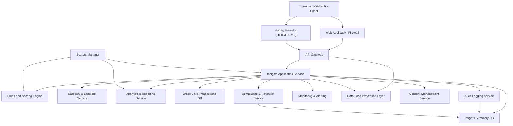

#### 1. High-Level Design

- **Architecture Overview & Component Diagram:**

- **Component Descriptions:**

  - **Customer Web/Mobile Client (U)**  
    - Presents the monthly spending summary dashboard UI.  
    - Allows month selection, displays total spend, number of transactions, and visual summaries (cards/charts).  
    - Handles client-side input validation (valid month, allowed date range).

  - **Web Application Firewall (WAF)**  
    - Filters malicious traffic (SQL injection, XSS patterns, request anomalies).  
    - Enforces rate-limiting and geo/IP-based blocking policies.

  - **API Gateway (AG)**  
    - Single entry point for backend APIs.  
    - Terminates TLS 1.3, validates OAuth2/OIDC tokens, enforces coarse-grained RBAC.  
    - Provides request throttling and standardized error responses.

  - **Identity Provider (IDP)**  
    - Authenticates users via OIDC/OAuth2.  
    - Issues JWT access tokens containing user identity, roles, and consent scopes.

  - **Insights Application Service (AS)**  
    - Orchestrates monthly spend calculation and retrieval of KPIs and summaries.  
    - Applies business rules for selecting transactions, currency handling, and month boundaries.  
    - Enforces fine-grained RBAC/ABAC decisions for access to summary data.  
    - Calls underlying services and assembles the response for the dashboard.

  - **Rules and Scoring Engine (RS)**  
    - Hosts reusable business rules for monthly spend computation (e.g., include only posted transactions, exclude fees if specified, treatment of refunds).  
    - Controls thresholds for highlighting unusual spend (if extended later).  

  - **Category & Labeling Service (CLS)**  
    - Classifies transactions into spend categories (e.g., groceries, travel) used to build high-level breakdowns.  
    - Maintains mapping logic, machine-learning models or rule-based classifiers.  

  - **Analytics & Reporting Service (AR)**  
    - Aggregates transaction data and pre-computes monthly summary metrics for performance.  
    - Maintains materialized views of monthly totals, counts, and breakdown aggregates.  

  - **Credit Card Transactions DB (CCD)**  
    - System of record for credit card transactions.  
    - Stores immutable transaction data used as the source for monthly computation.  

  - **Insights Summary DB (ISD)**  
    - Stores pre-aggregated monthly summary data per customer and month.  
    - Holds anonymized/aggregated data where possible for insights and dashboards.  

  - **Audit Logging Service (AUD)**  
    - Records access to financial summaries, including user ID, timestamp, operation, and context.  
    - Supports regulatory audit and fraud investigations.  

  - **Secrets Manager (SM)**  
    - Stores and rotates credentials, encryption keys, and API keys.  
    - Provides short-lived access tokens to services.

  - **Monitoring & Alerting (MON)**  
    - Collects metrics, logs, and traces across services.  
    - Triggers alerts on error rates, latency, and security anomalies.

  - **Data Loss Prevention Layer (DLP)**  
    - Scans outbound responses and logs to prevent leakage of sensitive PII beyond policy.  
    - Masks or tokenizes specific fields in logs and external outputs when necessary.

  - **Consent Management Service (CM)**  
    - Stores and evaluates user consent and preferences for data usage and analytics.  
    - Validates that the customer has consented to insights/analytics features before returning summaries.

  - **Compliance & Retention Service (CR)**  
    - Applies data retention policies for summary data and logs.  
    - Manages data lineage metadata and handles deletion/archival workflows.

- **Integration Points & Data Flow:**

  1. **Authentication & Authorization**  
     - Customer logs in; IDP authenticates and issues JWT with roles and consent scopes.  
     - Client sends requests over HTTPS (TLS 1.3) with bearer token to AG.  
     - AG validates token, checks global RBAC (e.g., “consumer_cc_insights:view”), and routes to AS.

  2. **Month Selection & Summary Retrieval**  
     - User selects a month in the UI (e.g., 2026-05).  
     - Client sends `GET /insights/monthly-summary?month=YYYY-MM` to AG.  
     - AG forwards to AS after WAF and DLP pre-check.

  3. **Application Service Orchestration**  
     - AS validates input month (format, not in future, within allowable history).  
     - AS queries CM to confirm consent for analytics/spending insights.  
     - If consent granted, AS calls AR/ISD for pre-computed monthly summary.  
       - If data is available, AR/ISD returns aggregated metrics (total spend, transaction count, category totals).  
       - If not available or stale, AS fetches data from CCD, applies RS and CLS, aggregates in AR, and persists results to ISD.

  4. **Data Aggregation & Business Logic**  
     - AR uses rules from RS to determine included transactions and currency conversions if applicable.  
     - CLS assigns categories to transactions.  
     - AR computes:  
       - Total monthly spend  
       - Number of transactions  
       - High-level breakdowns (e.g., top categories, percentage by category)  
     - AR returns a summarized, non-PII-heavy response to AS; only necessary fields (aggregated numbers, category labels) are returned.

  5. **Response to Client**  
     - AS constructs a response DTO (total, KPIs, category breakdown).  
     - AS logs an access event to AUD.  
     - Response passes through DLP and AG; AG enforces content-size and rate controls.  
     - WAF passes the response back to the client over TLS 1.3.

  6. **Logging, Monitoring, and Retention**  
     - AUD writes structured audit events with minimal PII.  
     - MON collects performance and error metrics.  
     - CR ensures logs and summary data are retained and purged according to policy (e.g., 7–10 years for financial data, or as required by regulation).

- **Security & Compliance Features:**

  - **Transport & Storage Security**  
    - All client-to-gateway connections use **TLS 1.3** with strong cipher suites.  
    - Service-to-service calls use mutual TLS 1.2+ or mutual TLS 1.3 where supported.  
    - Sensitive data at rest in CCD and ISD is encrypted using **AES-256** (e.g., AES-256-GCM).  
    - Keys are managed via **Secrets Manager (SM)** with rotation policies.

  - **Input Validation & Output Filtering**  
    - AS validates `month` parameter (strict regex `^\d{4}-(0[1-9]|1[0-2])$`, range checks).  
    - AG and WAF enforce limits on query parameters and request size.  
    - Outputs include only aggregated numeric values and category labels; no full card numbers, CVV, or sensitive PII.  
    - DLP ensures no disallowed PII leaks in responses or logs.

  - **Authentication & Authorization (RBAC/ABAC)**  
    - IDP issues tokens after user authentication; tokens carry `sub` (user ID), roles, and tenant/customer IDs.  
    - AG enforces coarse-grained **RBAC** (e.g., “consumer”, “support-agent”).  
    - AS applies **ABAC** to ensure:  
      - User can only access their own monthly summaries (subject = account owner).  
      - Support roles (if allowed) can only access data masked or limited by role and jurisdiction.  
      - Regional and regulatory attributes (e.g., EU/US residency) influence what data can be displayed and retained.

  - **Audit Logging & Traceability**  
    - AUD logs include: user ID, timestamp, endpoint, month requested, consent ID, decision outcome.  
    - Logs avoid storing full PANs, but may log hashed or tokenized identifiers if needed.  
    - Audit logs are immutable, access-controlled, and retained according to CR rules.

  - **Compliance & Privacy Controls**  
    - **Data Retention**: CR applies different retention periods for:  
      - Raw transaction data (CCD) as per financial regulations.  
      - Aggregated insights in ISD (possibly shorter retention, configurable).  
      - Audit logs (as per regulatory requirements).  
    - **Consent Management**: CM tracks whether the user has opted in to insights.  
      - If consent revoked, future insights are not generated or displayed.  
      - Historical aggregates may be anonymized or deleted according to policy.  
    - **Data Lineage**: CR records lineage between CCD (transaction-level), AR (aggregation logic), and ISD (summary outputs) for compliance reporting and model explainability.  
    - **Compliance Reporting**: AR and CR support generation of reports showing how data is used, which regions it resides in, and how long it is retained.

- **Resiliency & Error Handling:**

  - **Circuit Breakers**  
    - AS uses circuit breakers when calling CCD, AR, CLS, CM, and CR.  
    - On repeated failures (e.g., CCD downtime), AS opens the circuit and returns a standard “service temporarily unavailable” message with correlation ID.  
    - Dashboard can show a friendly error state with retry option.

  - **Retry Mechanisms**  
    - Transient errors (timeouts, 5xx) from AR, CLS, and CCD are retried with exponential backoff and jitter.  
    - Idempotent read operations are safe to retry.  
    - Retried calls are capped to avoid cascading failures.

  - **Fallback Patterns**  
    - If pre-computed summary in ISD is unavailable but CCD is reachable, AS triggers on-the-fly computation and optionally caches result.  
    - If CLS is down, system may fall back to limited breakdowns (e.g., “Other” category) while still providing total spend and transaction count.  
    - If CM is unreachable, conservative fallback: deny access to insights until consent status is confirmed.

  - **Graceful Degradation & UX**  
    - Partial data (e.g., total monthly spend but no category breakdown) is clearly indicated in the UI when available.  
    - Errors are surfaced as non-technical messages to users, with technical details captured only in logs.

  - **Logging & Monitoring**  
    - Structured logs with correlation IDs propagate from AG to AS and downstream services.  
    - MON tracks SLOs (availability, latency) and triggers alerts on anomalies.  
    - Alerting thresholds differentiate between partial and total outages to guide response prioritization.

---

#### 2. Validation Report

- **Requirements Coverage:**

  - **Epic Requirement:** “Monthly total credit card spend calculation”  
    - **Coverage:**  
      - AR and AS compute monthly total spend using CCD as source of truth.  
      - RS defines rules for which transactions are included (posted, cleared) and how refunds/chargebacks are treated.  

  - **Epic Requirement:** “Monthly summary KPIs (e.g., total spend, number of transactions)”  
    - **Coverage:**  
      - AR calculates and stores in ISD: total spend, number of transactions, and optionally additional KPIs (e.g., average transaction amount) if agreed.  
      - AS exposes these KPIs via a dedicated summary endpoint used by the dashboard.

  - **Epic Requirement:** “Visual representation of monthly spend (e.g., summary cards or charts)”  
    - **Coverage:**  
      - UI (web/mobile client) is designed to consume aggregated data and render summary cards and charts.  
      - AS response contracts are structured to support graphical representation (e.g., category names, amounts, percentages).

  - **Epic Requirement:** “Month selection to view a specific month’s summary”  
    - **Coverage:**  
      - Client supports interactive month selection component.  
      - API accepts a month parameter with robust validation and range constraints.  
      - AS retrieves data for the specified month from ISD or computes it on-the-fly from CCD.

  - **Epic Requirement:** “Basic breakdown of spend suitable as an entry point into deeper insights”  
    - **Coverage:**  
      - CLS categorizes transactions and AR aggregates by category.  
      - AS returns category breakdowns that can be drilled into by future epics (e.g., category-wise views, cross-month comparisons).  
      - Architecture explicitly positions this dashboard as the gateway for deeper insight modules.

  - **Epic Non-Goals/Out of Scope (respected):**  
    - **Non-credit-card products:**  
      - Data sources are restricted to CCD; no integration with deposit or loan systems in this epic.  
    - **Detailed transaction-level management features:**  
      - Only aggregated data and category breakdowns are returned.  
      - No transaction editing, dispute initiation, or other management functions are included.

- **Compliance Status:**

  - **Data Retention:**  
    - **Status:** Pass (design level)  
    - CR manages retention policies for:  
      - CCD: aligned with core banking/credit card retention policies (typically long-term).  
      - ISD: defined retention window; enables pruning of older aggregates if allowed by regulation and business requirements.  
      - AUD: retention period sufficient to meet audit and anti-fraud regulations.  

  - **Privacy & Consent:**  
    - **Status:** Pass (design level)  
    - CM enforces opt-in for insights; AS checks consent before generating or returning summaries.  
    - Revocation flows are accounted for: future insights blocked, older aggregates treated as per policy (e.g., anonymization, deletion where required).  
    - Only aggregated, non-sensitive data is presented; PII and PAN data are not exposed in the dashboard.

  - **Security Controls (Encryption, RBAC/ABAC, Logging):**  
    - **Status:** Pass (design level)  
    - Transport: TLS 1.3 enforced between client and gateway; mutual TLS between internal services.  
    - Storage: AES-256 at rest for databases with keys managed by SM.  
    - Access Control: RBAC at AG and ABAC in AS ensure least-privilege access.  
    - Audit Logging: All access to monthly summaries is recorded with immutable logs; logs themselves are protected and access-controlled.

- **Identified Ambiguities/Risks:**

  1. **Definition of “Monthly Spend”**  
     - **Ambiguity:**  
       - Whether to include pending authorizations, refunds, chargebacks, fees, or interest in “total spend” is not explicitly defined.  
     - **Mitigation:**  
       - RS will codify business rules with stakeholders:  
         - Include only posted purchase transactions.  
         - Exclude fees/interest from “spend” but they may appear in separate informational metrics if required.  
         - Clarify treatment of refunds and reversals (e.g., net them against spend in the month of posting).  
       - Documented in business rules and API contracts.

  2. **Time Zone and Month Boundary Handling**  
     - **Ambiguity:**  
       - Which time zone determines transaction posting date for monthly boundaries (e.g., local branch time vs UTC).  
     - **Mitigation:**  
       - Adopt a single authoritative time zone (e.g., system-of-record’s posting date and time) and clear rule for assignment of transactions to month (e.g., posting date in system-of-record).  
       - Documented in system design and API documentation to ensure consistent reporting.

  3. **Performance for High-Volume Customers**  
     - **Risk:**  
       - Users with very high transaction volumes may experience slow response if real-time aggregation is required.  
     - **Mitigation:**  
       - Use AR and ISD to precompute monthly aggregates via batch or near-real-time jobs.  
       - Introduce caching layers for frequently accessed months (e.g., previous 3–6 months).  
       - Monitor performance and scale horizontally as needed.

  4. **Consent Changes Impact on Historical Data**  
     - **Ambiguity:**  
       - Whether historical aggregated summaries must be deleted or anonymized when a user withdraws consent.  
     - **Mitigation:**  
       - Engage legal/compliance to define explicit behavior.  
       - Implement capabilities in CR to:  
         - Flag aggregates tied to a consent ID.  
         - Anonymize or delete historical aggregates when policy requires.  

  5. **Regulatory Differences Across Jurisdictions**  
     - **Risk:**  
       - Different regions (e.g., EU vs non-EU) may have different rules for profiling and analytics.  
     - **Mitigation:**  
       - ABAC rules incorporate regional attributes; in restrictive regions, limit or disable advanced insights and ensure explicit consent.  
       - CM and CR integrate jurisdictional rules into their policies and reporting.

  6. **Out-of-Scope Features Creep**  
     - **Risk:**  
       - Stakeholders may attempt to add transaction management actions into this epic (e.g., dispute, installment plans).  
     - **Mitigation:**  
       - HLD and scope documentation clearly state that transaction-level management is out of scope.  
       - Any such features are captured as separate epics linked to this one, with their own security and compliance review.

Overall, the design satisfies the epic’s scope while ensuring strong enterprise security (TLS 1.3, AES-256, RBAC/ABAC, audit logging, DLP, secrets management) and compliance considerations (data retention, consent management, data lineage, and reporting), with identified ambiguities documented and mitigation paths defined.