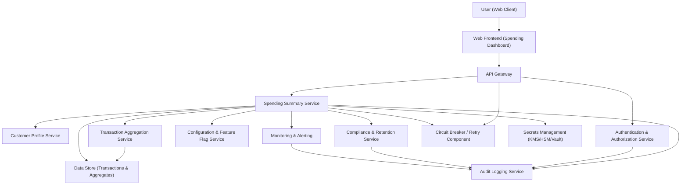

#### 1. High-Level Design

- Architecture Overview & Component Diagram:

- Component Descriptions:

  - **Web Frontend (Spending Dashboard)**  
    - Provides the monthly spending summary UI for credit card customers.  
    - Allows month selection, displays total spend, number of transactions, and high-level breakdowns via cards/charts.  
    - Performs client-side input validation (e.g., month format) and interacts only through secured APIs.

  - **API Gateway**  
    - Single entry point for all dashboard-related API calls.  
    - Enforces TLS 1.3, rate limiting, request/response size limits, and basic input sanitization.  
    - Routes authenticated requests to the Spending Summary Service, attaches correlation IDs, and standardizes error responses.

  - **Authentication & Authorization Service**  
    - Authenticates users via OAuth2/OIDC (e.g., ID tokens, refresh tokens).  
    - Issues short-lived access tokens with scopes limiting access to spending data.  
    - Evaluates RBAC/ABAC policies to ensure customers see only their own credit card spending.

  - **Spending Summary Service**  
    - Core domain service responsible for computing and serving monthly spending summaries.  
    - Orchestrates retrieval of customer credit card accounts and relevant transactions for the selected month.  
    - Applies business logic for total spend, transaction counts, and basic breakdowns (e.g., high-level categories or merchant segments).  
    - Caches frequently accessed month summaries where allowed by policy.  
    - Implements audit logging, compliance hooks (data retention, consent checks), and error handling.

  - **Customer Profile Service**  
    - Provides canonical customer identities and associated credit card accounts.  
    - Ensures that only credit card products are in scope (filters out non-credit-card products).  
    - Supplies metadata used for ABAC policy evaluation (e.g., region, segment).

  - **Transaction Aggregation Service**  
    - Fetches raw credit card transactions and performs aggregation by month, customer, and account.  
    - Maintains derived aggregates (total spend, counts) to optimize summary performance.  
    - Supports high-level breakdown calculations (e.g., categories, merchant types) suitable as an entry point to deeper insights.

  - **Data Store (Transactions & Aggregates)**  
    - Stores credit card transaction data and monthly aggregates.  
    - Encrypted at rest using AES-256 with keys managed by SM.  
    - Provides query interfaces optimized for monthly-level views (e.g., `customerId + month` indexes).

  - **Audit Logging Service**  
    - Receives structured audit events (who accessed which month’s summary, when, and via which client).  
    - Stores logs in append-only, tamper-evident storage with retention per regulatory policy.  
    - Supports compliance reporting and investigations.

  - **Compliance & Retention Service**  
    - Enforces data retention rules on transaction and aggregate data.  
    - Manages consent states for use of transaction data in analytics/insights.  
    - Provides data lineage metadata showing how monthly summaries were derived.

  - **Configuration & Feature Flag Service**  
    - Manages feature rollout (e.g., enabling new KPI cards, new breakdown types).  
    - Allows gradual exposure of deeper analytics while keeping this epic focused on summary.  
    - Stores policy-driven limits (max months available, regional constraints).

  - **Monitoring & Alerting**  
    - Collects metrics (latency, error rates, volume per month).  
    - Raises alerts on performance degradation and failures in aggregation or compliance enforcement.

  - **Circuit Breaker / Retry Component**  
    - Implements resilience patterns for calls from API Gateway/Spending Summary Service to downstream services (Transaction Aggregation, Customer Profile, Compliance).  
    - Provides controlled retries with backoff and fallback behavior.

  - **Secrets Management (KMS/HSM/Vault)**  
    - Manages encryption keys, API credentials, and tokens.  
    - Supports key rotation and auditable access to secrets used by services and data stores.

- Integration Points & Data Flow:

  1. **User Access & Month Selection**
     - The user logs in through the banking app and navigates to the “Monthly Spending Summary” dashboard.
     - The Web Frontend obtains an access token from the Authentication Service and calls the API Gateway to request a summary for a selected month (e.g., `2025-06`).

  2. **Authentication & Authorization**
     - API Gateway verifies the access token via the Authentication Service (OIDC introspection or JWT validation).
     - RBAC: Ensures the user role permits access to credit card spending dashboards.  
     - ABAC: Confirms contextual attributes (customer ID, region, product type) allow access to the requested month and account.

  3. **Summary Computation**
     - API Gateway forwards the request (with validated customer ID and month) to the Spending Summary Service.
     - Spending Summary Service queries the Customer Profile Service to retrieve customer credit card accounts.
     - Spending Summary Service calls the Transaction Aggregation Service to fetch monthly aggregates (total spend, number of transactions, high-level breakdown) for those accounts.
     - If aggregates exist, they are returned from the Data Store; otherwise, Transaction Aggregation derives them from raw transactions and stores new aggregates.

  4. **Data Return to Frontend**
     - Spending Summary Service constructs a response including:
       - Monthly total credit card spend.
       - Number of transactions.
       - Summary KPIs.
       - High-level breakdown suitable as an entry point to deeper insights (no detailed transaction views).
     - API Gateway applies output filtering (removing non-essential fields, masking identifiers if needed) and returns the response via TLS 1.3 to the Web Frontend.
     - Web Frontend renders summary cards and charts for the selected month.

  5. **Security, Compliance, and Logging**
     - Each access to a monthly summary generates audit events: user ID (or pseudonymous identifier), timestamp, month requested, accounts included, response status.
     - Compliance service validates retention and consent rules before returning data; if constraints are not met (e.g., data beyond retention window), the service returns a compliance-safe response.
     - Monitoring collects metrics on summary usage and performance, feeding dashboards and alerts.

- Security & Compliance Features:

  - **Encryption & Transport Security**
    - All client-to-API Gateway calls use **TLS 1.3** with modern cipher suites.
    - Data at rest in the transaction and aggregate Data Store is encrypted with **AES-256** keys managed by Secrets Management.
    - Keys are rotated regularly, with multi-region availability as required, and access is strictly audited.

  - **Input Validation & Output Filtering**
    - Frontend and API Gateway validate month input (format, allowed range) and customer identifiers.
    - Server-side checks enforce:
      - Valid month range (e.g., within permitted history).
      - Prohibition of free-form filters outside this epic’s scope (e.g., no arbitrary transaction search).
    - Output filtering ensures responses include only: total spend, transaction count, summary KPIs, and high-level breakdowns; detailed transaction fields and non-credit-card data are excluded.

  - **RBAC/ABAC**
    - **RBAC:** Roles such as `Customer`, `SupportAgent`, `Admin` with separate allowed operations. For this epic, customer users are restricted to their own summaries.
    - **ABAC:** Attributes such as `customerRegion`, `productType=credit_card`, `regulatoryDomain` used to enforce region-specific rules and confirm that only credit card products are used in calculations.

  - **Audit Logging**
    - Audit events for:
      - Summary view requests (month, accounts, user ID or pseudonym).
      - Policy decisions (denied access, compliance constraint triggers).
      - Key actions such as configuration changes impacting the dashboard.
    - Logs stored immutably with retention aligning to regulatory requirements and privacy policies.

  - **Compliance Mapping**
    - **Data Retention:** The Compliance & Retention Service ensures old transaction data is purged or anonymized according to defined retention periods while keeping derived aggregates as permitted.
    - **Consent Management:** Before using transaction data for summaries, consent flags are checked; if consent is withdrawn, summaries may be limited or anonymized.
    - **Data Lineage:** For each monthly summary, metadata identifies the underlying transaction set and aggregation logic version, supporting audits.
    - **Compliance Reporting:** Aggregated logs and lineage data support periodic compliance reports (e.g., access volumes, retention enforcement status).

- Resiliency & Error Handling:

  - **Circuit Breakers**
    - Between Spending Summary Service and:
      - Transaction Aggregation Service.
      - Customer Profile Service.
      - Compliance & Retention Service.
    - If a downstream service is failing:
      - The circuit opens, and the Summary Service returns either cached data (if allowed) or a graceful “temporarily unavailable” message with non-sensitive error codes.

  - **Retry Mechanisms**
    - Idempotent calls to downstream services use bounded retries (e.g., 3 retries with exponential backoff).
    - Network-related transient errors are retried; input or authorization errors are not retried.

  - **Fallback Patterns**
    - If Transaction Aggregation Service is unavailable:
      - Use most recent available aggregate for that month if permitted by compliance rules.
      - Present a partial summary with clear indication “summary not fully up to date.”
    - If Compliance Service is unavailable:
      - Default to the most restrictive behavior (deny access or show limited summary) to avoid compliance breaches.

  - **Error Logging & User Messaging**
    - Errors are logged with correlation IDs to support debugging while avoiding leakage of sensitive information.
    - User-facing messages are generic (e.g., “We’re unable to load your summary right now. Please try again later.”) and do not expose internal details.

#### 2. Validation Report

- Requirements Coverage:

  - **Epic Goal:**  
    - Deliver a web-based monthly spending summary for credit card customers, providing at-a-glance view of total spend, key metrics, and high-level breakdowns for a selected month.  
    - **Coverage:**  
      - Web Frontend provides a monthly summary dashboard.  
      - Spending Summary Service and Transaction Aggregation Service generate total spend and counts.  
      - UI shows high-level breakdowns and summary KPIs.

  - **User Value:**  
    - Customers quickly understand monthly credit card spending without manual transaction review, supporting financial awareness and budgeting.  
    - **Coverage:**  
      - Aggregated views and visual representation (cards/charts) address this by replacing manual per-transaction checking.

  - **Scope (High Level):**
    - **Monthly total credit card spend calculation**  
      - Implemented via Transaction Aggregation Service and Data Store aggregates.
    - **Monthly summary KPIs (total spend, number of transactions)**  
      - Explicitly computed and surfaced in the dashboard.
    - **Visual representation of monthly spend (summary cards/charts)**  
      - Delivered via Web Frontend component layout backed by API data.
    - **Month selection to view a specific month’s summary**  
      - UI control with backend validation for allowed months; summary endpoint supports `month` parameter.
    - **Basic breakdown of spend as entry point into deeper insights**  
      - Aggregation logic includes high-level categories/segments, exposed without detailed drill-down in this epic.

  - **Out of Scope:**
    - **Non-credit-card products**  
      - Customer Profile Service filters products; Spending Summary Service uses only credit card accounts.
    - **Detailed transaction-level management features**  
      - No endpoints or UI components are designed for editing, tagging, or managing individual transactions; only summary-level views are provided.

- Compliance Status:

  - **Data Retention:**  
    - Transaction data and aggregates are subject to configured retention periods enforced by the Compliance & Retention Service.  
    - Summaries use only data within allowed retention windows, and derived aggregates follow retention rules.  
    - **Status:** Pass (design includes explicit retention enforcement and automated purging/anonymization).

  - **Consent Management:**  
    - Consent flags are checked before transaction use in summaries, and future enhancements can limit or anonymize data if consent is revoked.  
    - **Status:** Pass (design enforces consent checks before serving summaries).

  - **Privacy & Access Control:**  
    - RBAC/ABAC ensure customers access only their own credit card spend, with regional constraints applied as needed.  
    - No cross-customer data exposure; identifiers are restricted and outputs are filtered.  
    - **Status:** Pass.

  - **Data Lineage & Reporting:**  
    - Lineage metadata links summaries to data sources and aggregation logic versions.  
    - Audit logging and lineage information support compliance reporting.  
    - **Status:** Pass.

- Identified Ambiguities/Risks:

  - **Ambiguity: Level of Breakdown Detail**
    - The epic specifies “basic breakdown of spend suitable as an entry point into deeper insights” but does not define exact dimensions (e.g., category vs. merchant type).
    - **Risk:** Misalignment with downstream analytics epics or over-scope by including too detailed breakdowns.
    - **Mitigation:**  
      - Limit breakdown to a small set of high-level categories (e.g., “Groceries”, “Utilities”, “Travel”) defined in configuration.  
      - Treat any deeper drill-down or multi-dimensional analysis as separate epics.

  - **Ambiguity: Performance and Historical Range**
    - The epic does not define how many months back are viewable or performance SLAs.
    - **Risk:** Large historical range could degrade performance or conflict with retention rules.
    - **Mitigation:**  
      - Introduce configuration for max months available (e.g., last 12 months), enforced by the API.  
      - Monitor latency and error rates; adjust aggregation strategy or caching as needed.

  - **Risk: Dependency Failures (Customer Profile, Transaction Aggregation, Compliance)**
    - Downstream service outages could impact summary availability.
    - **Mitigation:**  
      - Implement circuit breakers, retries, and fallbacks as described.  
      - Provide partial or cached summaries with clear user messaging when services fail.

  - **Risk: Regulatory Changes**
    - Future regulatory changes might affect retention, consent, or data visibility.
    - **Mitigation:**  
      - Centralize compliance rules in the Compliance & Retention Service and Configuration Service, allowing dynamic updates without major redesign.  
      - Maintain data lineage to support post-hoc analysis in case of regulatory audits.

  - **Risk: Security Misconfiguration**
    - Misconfigured TLS or key management could weaken security guarantees.
    - **Mitigation:**  
      - Use standardized security baselines (TLS 1.3 only, AES-256 at rest) with automated configuration checks.  
      - Integrate Secrets Management with CI/CD and ensure regular security reviews and penetration testing around the dashboard APIs.
