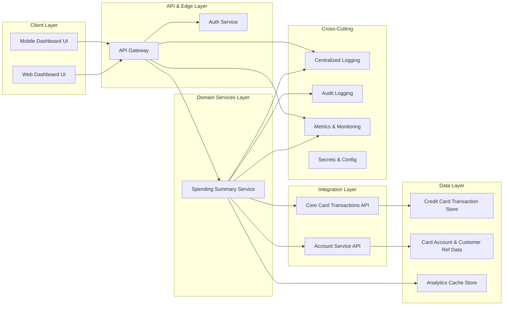

# HLD: QE-3179 – DAVMS1 Monthly Spending Summary Dashboard

## 1. Architecture Overview

The Monthly Spending Summary Dashboard is a web-based feature within the existing banking application that provides credit card customers with an at-a-glance monthly spending view. The feature calculates and aggregates credit card transactions for a selected month and surfaces high-level KPIs and visual summaries.

The architecture is designed as a modular, enterprise-grade solution aligned with the existing digital banking platform. It consists of:

- **Client Layer (Web/Mobile UI)** – React/Angular (web) and native/hybrid (mobile) components rendering the monthly summary dashboard, month selector, and summary visualizations.
- **API / Edge Layer** – Secure REST/GraphQL endpoints exposed via an API gateway, handling authentication, authorization, rate limiting, and request routing.
- **Domain Services Layer** – A dedicated **Spending Summary Service** responsible for aggregating credit card transaction data, computing monthly totals, KPIs, and basic breakdowns.
- **Data Layer** – Existing credit card transaction store, reference data (card accounts, currencies), and an optional **Analytics Cache Store** (e.g., Redis) for precomputed monthly summaries.
- **Integration Layer** – Service connectors to the core credit card transaction system and customer account services through secure APIs or message-based integrations.
- **Cross-Cutting Concerns** – Centralized logging, monitoring, audit trails, configuration, secrets management, and compliance controls.

This design explicitly covers:
- Monthly total credit card spend calculation
- Monthly summary KPIs
- Visual representation of monthly spend
- Month selection for summary view
- Basic breakdown of spend as an entry point for deeper insights

Non-credit card products and detailed transaction-level management capabilities are not implemented in this epic and are treated as integration boundaries for future work.

## 2. Component Diagram (Mermaid)

## 3. Component Descriptions

### 3.1 Web Dashboard UI

Single-page application component within the existing online banking portal providing:
- Monthly spending summary view for credit card accounts only.
- Month selector control (e.g., dropdown or date picker limited to months) to request a specific month’s summary.
- Display of KPIs (total monthly spend, number of transactions, possibly average transaction value).
- Visual representation (e.g., summary cards, bar charts, donut charts for basic breakdown such as high-level categories or merchant groupings).
- Navigation link to deeper insights (e.g., category views or detailed transactions), implemented as links only; underlying detailed management features remain out of scope.

Explicit exclusions:
- No editing of transactions.
- No display or management of non-credit-card products (e.g., loans, deposits) in this dashboard.

### 3.2 Mobile Dashboard UI

Native or hybrid mobile banking application module mirroring the web UI capabilities:
- Optimized for smaller screens with responsive charts and KPI cards.
- Utilizes the same API endpoints as the web UI to ensure consistent data.

Explicit exclusions:
- No standalone offline mode caching transaction details.
- No cross-product dashboard beyond credit card spend for this epic.

### 3.3 API Gateway

The existing enterprise API gateway or edge component providing:
- Routing from client applications (web/mobile) to backend services.
- TLS termination and enforcement of HTTPS for all client calls.
- Authentication token validation (delegating to Auth Service) and RBAC policy enforcement.
- Rate limiting and throttling to protect backend services from abuse.

Explicit exclusions:
- No new public APIs for non-credit-card products.

### 3.4 Auth Service

Central authentication and authorization service:
- Validates user identity via existing mechanisms (e.g., OAuth2/OIDC tokens, session cookies).
- Provides user and account-level claims to the API Gateway for access control (e.g., which credit card accounts can be accessed).

Explicit exclusions:
- No changes to core authentication mechanisms (e.g., password flows, MFA) within this epic.

### 3.5 Spending Summary Service

Primary domain service implementing monthly spending logic:
- Accepts requests from the API Gateway with parameters including customer identifier, card account identifier(s), and selected month.
- Queries credit card transaction data and account reference data (via TX_API and ACCT_API).
- Aggregates transaction-level data to compute:
  - Total monthly spend amount for the selected month.
  - Number of transactions during the month.
  - Optional KPIs (e.g., average transaction amount, max/min transaction size) if within future scope.
- Generates a basic breakdown of spend suitable as an entry point into deeper analysis:
  - High-level categories (e.g., “Travel”, “Groceries”, “Online retail”), or
  - Merchant segments or channel (e.g., “POS”, “Online”).
- Normalizes currency and transaction status rules as defined by credit card domain policies.
- Writes or updates cached summaries into the Analytics Cache Store for frequently accessed periods (e.g., current and previous months).
- Provides a structured summary response to the client via the API Gateway, including KPIs and visualization-ready data (aggregated series, labels, totals), but without exposing raw transaction details.

Explicit exclusions:
- No transaction authorization or posting logic.
- No detailed transaction editing, disputes handling, or refunds processing.

### 3.6 Credit Card Transaction Store

Existing data store containing credit card transaction records for all customers:
- Holds normalized transaction data with fields such as card account ID, transaction timestamp, amount, currency, merchant information, and category code.
- Supports query patterns necessary for monthly aggregation by customer and card account.

Explicit exclusions:
- No schema changes that affect posting of transactions.
- No storage of non-credit-card product data for this feature.

### 3.7 Card Account & Customer Reference Data Store

Data store containing card account metadata and customer-account relationships:
- Used to validate that the requesting user has access to the specified credit card account(s).
- Provides currency and account status information for aggregation logic.

Explicit exclusions:
- No new cross-product consolidation logic (e.g., combining multiple product types).

### 3.8 Analytics Cache Store

High-performance cache (e.g., Redis, in-memory cache, or a dedicated analytics store):
- Stores precomputed monthly summaries keyed by customer, account, and month.
- Reduces latency for repeated queries (e.g., current month or recently-viewed months).
- TTL-based invalidation and background refresh policies defined to ensure data freshness.

Explicit exclusions:
- No long-term storage of detailed transaction history.

### 3.9 Core Card Transactions API

Integration service providing access to transaction data:
- Exposes read APIs for querying credit card transactions by customer, account, and date range.
- Enforces domain rules (posted vs. pending transactions, reversals) as per credit card policies.

Explicit exclusions:
- No write APIs consumed by this epic.

### 3.10 Account Service API

Integration service for account metadata:
- Returns card account details, ownership info, and currencies.
- Used to ensure proper authorization and to label dashboard content correctly.

Explicit exclusions:
- No non-credit-card product management APIs used in this epic.

### 3.11 Cross-Cutting Services (Logging, Audit, Monitoring, Secrets)

Centralized services shared across components:
- Logging: API requests, summary generation events, cache usage, and error conditions.
- Audit Logging: Security-relevant events such as access to monthly summaries, failed authorization checks, and changes in configuration affecting summaries.
- Monitoring & Metrics: Latency, error rates, cache hit/miss ratios, call volumes per endpoint, and resource usage of the Spending Summary Service.
- Secrets & Configuration: Secure storage of API credentials, database connection strings, cache configuration, and feature toggles.

Explicit exclusions:
- No logging of full transaction details that could exacerbate sensitive data exposure.

## 4. Integration Points & Data Flows

### 4.1 Flow 1 – Authentication & Session Establishment

1. User accesses the banking web or mobile application and signs in through existing authentication mechanisms.
2. Auth Service authenticates the user and issues a secure session token (e.g., JWT) or establishes a federated session.
3. Client stores the token securely (browser session storage, secure mobile keystore) and sends it with subsequent API calls.
4. API Gateway validates the token on each request and enforces RBAC rules based on user and account claims.

Scope traceability:
- Supports month selection and display by ensuring only authorized access to credit card accounts.

### 4.2 Flow 2 – Monthly Summary Request & Response

1. From the Monthly Spending Summary Dashboard, the user selects a month (default: current month) and optionally a card account if multiple cards exist.
2. Web/Mobile UI constructs a request including the selected month and account identifier and sends it via HTTPS to the Monthly Summary endpoint on the API Gateway.
3. API Gateway validates authentication token, applies rate limiting, and routes the request to the Spending Summary Service.
4. Spending Summary Service checks the Analytics Cache Store for an existing summary for (customer, account, month).
5. If cached summary exists and is still valid:
   - Service returns the cached summary payload to the API Gateway.
6. If cache miss or cache entry expired:
   - Spending Summary Service calls Account Service API to validate account ownership and retrieve reference data.
   - Spending Summary Service calls Core Card Transactions API with a date range matching the selected month.
   - Transactions are aggregated to compute total monthly spend, number of transactions, and basic spend breakdown.
   - Aggregation results are written to the Analytics Cache Store.
   - Summary payload is returned to the API Gateway.
7. API Gateway sends the summary response to the client.
8. Web/Mobile UI renders KPIs and visual elements using the summary payload.

Scope traceability:
- Monthly total credit card spend calculation.
- Monthly summary KPIs.
- Visual representation of monthly spend.
- Month selection for summary.
- Basic breakdown of spend.

### 4.3 Flow 3 – Observability & Audit

1. API Gateway logs incoming monthly summary requests with anonymized or aggregated identifiers.
2. Spending Summary Service logs the completion status of summary generation (success/failure, cache hit/miss) with correlation IDs but without sensitive transaction details.
3. Audit Logging service records access events to monthly summaries, including customer ID references, account ID references, and timestamps, stored in a secure audit store.
4. Monitoring system ingests metrics from API Gateway and Spending Summary Service (e.g., latency, error rates, cache performance).
5. Operations dashboards and alerts are configured to detect anomalies (spikes in errors, abnormal latency).

Scope traceability:
- Supports reliability and enterprise-grade operation of the monthly summary feature.

### 4.4 Flow 4 – Error Handling & Degradation

1. If Core Card Transactions API is unavailable or times out:
   - Spending Summary Service detects the failure via timeouts or circuit breaker state.
   - If cache contains a recent summary, service returns the cached summary with a “stale data” indicator.
   - If no cache entry exists, service returns a controlled error response indicating that the summary cannot be retrieved currently.
2. If Account Service API authorization fails:
   - Service returns an authorization error with a generic message and logs an audit event.
3. If Analytics Cache Store is unavailable:
   - Service bypasses cache and directly queries Core Card Transactions API, while logging the degradation.
4. API Gateway converts internal errors into standardized status codes and safe error messages.
5. Client UI displays user-friendly error or info messages (e.g., “We’re unable to show your monthly summary right now. Please try again later.”) without exposing stack traces or internal error codes.

Scope traceability:
- Ensures the monthly summary feature behaves predictably under failure conditions while maintaining security.

## 5. Security & Compliance Features

### 5.1 Transport Security

- All client-to-API gateway communications use HTTPS with TLS 1.2+.
- Internal service-to-service communication uses mutual TLS or equivalent secure channels within the enterprise network.

### 5.2 Data Encryption

- Sensitive data at rest (transaction records, account identifiers, audit logs) resides in existing encrypted databases.
- Cache entries store aggregated monthly summary data (totals, counts, category aggregates) but not full transaction details; cache storage is encrypted where required by policy.

### 5.3 Input Validation

- API Gateway and Spending Summary Service validate:
  - Month parameter (format, range) to prevent invalid or excessively large date ranges.
  - Account identifiers to ensure they match customer-authorized accounts.
- Standard validation libraries are used to mitigate injection attacks.

### 5.4 Output Filtering

- Spending Summary Service returns only aggregated values (monthly totals, counts, high-level breakdowns) and excludes raw transaction-level detail.
- No PII values (names, addresses, full card numbers) are exposed in summary responses; account references use masked or tokenized identifiers as per existing standards.

### 5.5 RBAC / ABAC

- API Gateway enforces RBAC policies to limit dashboard access to authenticated customers.
- ABAC policies ensure users see only their own credit card account summaries, using claims from Auth Service and Account Service.

### 5.6 Audit Logging

- Access to monthly spending summaries is logged with customer and account references, timestamps, and source channel (web/mobile).
- All failed authorization attempts are recorded as security events.

### 5.7 Secrets Management

- API credentials, database connection strings, TLS keys, and cache configuration are stored in centralized secrets management (e.g., vault solution) and never hard-coded.

### 5.8 Compliance Mapping

Based on scope:
- **PCI-DSS**: Applicable due to credit card transaction data. Design aligns with PCI-DSS principles by ensuring:
  - No full PAN or sensitive card data is exposed in the dashboard or logs.
  - Data access is limited to read-only aggregated views.
  - Strong access controls and audit logging around transaction data usage.
- **Privacy (e.g., GDPR/CCPA)**: Applicable insofar as customer data is involved. Design:
  - Limits exposure to necessary account references and aggregated amounts.
  - Avoids sharing data outside authenticated sessions.

Detailed compliance certification and legal interpretation remain outside this epic but are assumed as part of platform-wide controls.

## 6. Resiliency & Error Handling

### 6.1 Retry Mechanisms

- Spending Summary Service uses controlled retries with exponential backoff when calling Core Card Transactions API and Account Service API, constrained by overall request timeouts.

### 6.2 Circuit Breakers

- Circuit breakers protect against repeated calls to failing downstream services. Once a threshold of failures is reached, calls are short-circuited and cached data or default error responses are returned.

### 6.3 Timeouts

- Defined timeouts for each downstream call (e.g., transaction query, account metadata query) to prevent resource exhaustion.

### 6.4 Graceful Degradation

- If downstream services fail, dashboard may:
  - Show last known summary (if available) with a clear indication that data may be outdated.
  - Show partial KPIs if certain breakdowns cannot be computed.

### 6.5 Error Handling

- Standardized error model from API Gateway:
  - 200 – Success, summary delivered.
  - 400 – Invalid parameters (e.g., unsupported month format).
  - 401 – Unauthenticated user.
  - 403 – User not authorized to access requested account.
  - 404 – Requested resource (account or summary) not found.
  - 429 – Too many requests; rate limiting engaged.
  - 500 – Internal server error.
  - 503 – Downstream services unavailable.
- Error payloads omit internal details and contain correlation IDs for support.

### 6.6 Observability

- Metrics: Latency per endpoint, summary generation duration, cache hit/miss ratio, error rates per downstream service.
- Logs: Structured logs with correlation IDs across API Gateway and Spending Summary Service.
- Traces: Optional use of distributed tracing for end-to-end visibility.

## 7. Validation Report

### 7.1 Requirements Coverage

- **Monthly total credit card spend calculation**
  - Components: Spending Summary Service, Core Card Transactions API, Credit Card Transaction Store.
  - Flows: Flow 2 – Monthly Summary Request & Response.

- **Monthly summary KPIs (e.g., total spend, number of transactions)**
  - Components: Spending Summary Service, Web Dashboard UI, Mobile Dashboard UI.
  - Flows: Flow 2 – Monthly Summary Request & Response.

- **Visual representation of monthly spend (e.g., summary cards or charts)**
  - Components: Web Dashboard UI, Mobile Dashboard UI.
  - Flows: Flow 2 – Monthly Summary Request & Response.

- **Month selection to view a specific month’s summary**
  - Components: Web Dashboard UI, Mobile Dashboard UI, API Gateway, Spending Summary Service.
  - Flows: Flow 1 – Authentication & Session Establishment, Flow 2 – Monthly Summary Request & Response.

- **Basic breakdown of spend suitable as an entry point into deeper insights**
  - Components: Spending Summary Service, Web Dashboard UI, Mobile Dashboard UI.
  - Flows: Flow 2 – Monthly Summary Request & Response.

### 7.2 Compliance Status

- **Transport Security** – Pass
  - HTTPS/TLS enforced for client and internal communications.

- **Data Encryption at Rest** – Pass-with-conditions
  - Assumes existing databases and cache infrastructure use encryption according to enterprise standards. If not, this is a required platform enhancement.

- **Access Control (RBAC/ABAC)** – Pass
  - Gateway and Auth Service enforce identity and account-level constraints.

- **PCI-DSS Alignment** – Pass-with-conditions
  - Aggregated views and exclusion of full card numbers are compliant with general PCI principles; a formal PCI audit is required for certification.

- **Privacy (GDPR/CCPA) Alignment** – Pass-with-conditions
  - Design minimizes personal data exposure and restricts access to authenticated sessions, but legal and policy reviews are needed for formal attestation.

- **Audit Logging** – Pass
  - All access and failed authorization events are captured.

### 7.3 Identified Ambiguities / Risks

- **Ambiguity/Risk 1 – Category Model for Basic Breakdown**
  - Consequence: Without a defined category model (e.g., mapping MCC codes to categories), breakdowns may be inconsistent and confusing to customers.
  - Mitigation: Align with existing analytics taxonomy or define a standardized category mapping as a prerequisite; implement feature toggles to adjust category schema without breaking clients.

- **Ambiguity/Risk 2 – Scope Boundary with Deeper Insights Features**
  - Consequence: Links to detailed transaction views or advanced analytics may create expectations that those features are available or fully integrated, although they are out of scope for this epic.
  - Mitigation: Ensure UI clearly marks deeper insights links as navigation to separate features/epics and that this epic’s acceptance criteria limit responsibilities to high-level summary only.

- **Ambiguity/Risk 3 – Treatment of Pending / Reversed Transactions**
  - Consequence: Monthly totals might include or exclude certain transaction states in ways that differ from other parts of the application, causing customer confusion.
  - Mitigation: Define consistent aggregation rules (e.g., include posted transactions only, optionally show pending totals separately), document in domain service configuration, and align with existing statements logic.

- **Ambiguity/Risk 4 – Cross-Product Dashboard Expectations (Out of Scope)**
  - Consequence: Customers may expect spending summaries across multiple product types (debit, loans), which this epic excludes. Mixing products could also affect compliance.
  - Mitigation: UI copy and labeling should clearly state that the dashboard covers credit card spending only; future epics can extend to multi-product views with appropriate design.

- **Ambiguity/Risk 5 – Cache Staleness Handling**
  - Consequence: Use of cached summaries during downstream outages may show outdated data; customers might base decisions on stale information.
  - Mitigation: Display a “last updated” timestamp and a disclaimer when cached data is served; configure conservative TTL and refresh strategies in line with business needs.
