# High-Level Design (HLD) – QE-3179 – DAVMS Monthly Spending Summary Dashboard

## 1. Architecture Overview

### 1.1 Purpose
Design a secure, enterprise-grade web experience that presents a monthly spending summary for credit card customers, including total spend, key KPIs, and a high-level breakdown for a selected month. The solution must aggregate transaction data, compute summary metrics, and render them in a dashboard UI that acts as an entry point into deeper analyses, without implementing detailed transaction management features or support for non–credit-card products.

### 1.2 Logical Architecture
- **Client Layer**: Browser-based single-page application (SPA) or modular web UI that renders the monthly summary dashboard, allows month selection, and displays visual KPIs and high-level breakdowns.
- **API / Edge Layer**: Secure REST/GraphQL endpoints exposed via an API gateway for session management, rate limiting, request validation, and routing to domain services.
- **Domain Services Layer**: Business services to compute monthly totals, derive summary KPIs, and generate high-level breakdowns from normalized credit card transaction data.
- **Data Stores Layer**: Existing credit card transaction store (system of record), analytics/summary store for precomputed aggregates, and configuration store for dashboard metadata.
- **Integration Layer**: Connectivity to core card systems, data warehouse or streaming pipelines where transactions are ingested, and observability stack (logging, metrics, traces).
- **Cross-Cutting Concerns**: Authentication/authorization, encryption, secrets management, audit logging, error handling, observability, and compliance alignment for financial data.

### 1.3 Component Diagram (Mermaid)

```mermaid
flowchart TD
    subgraph ClientLayer[Client Layer]
        UI_Dashboard[Web UI - Monthly Spending Dashboard]
        UI_MonthSelector[UI Component - Month Selector]
        UI_KPI_Cards[UI Component - Summary KPI Cards]
        UI_SpendChart[UI Component - Monthly Spend Visualization]
        UI_BreakdownPanel[UI Component - High-Level Breakdown Panel]
    end

    subgraph EdgeLayer[API / Edge Layer]
        API_Gateway[API Gateway]
        API_SpendSummary[Spend Summary API]
        API_Auth[Authentication & Session API]
    end

    subgraph DomainLayer[Domain Services Layer]
        Svc_SpendAggregation[Monthly Spend Aggregation Service]
        Svc_KPI_Calculation[KPI Calculation Service]
        Svc_Breakdown[High-Level Breakdown Service]
        Svc_DashboardConfig[Dashboard Configuration Service]
    end

    subgraph DataLayer[Data Stores Layer]
        DB_Transactions[Credit Card Transaction Store]
        DB_Summary[Monthly Summary & KPI Store]
        DB_Config[Dashboard Metadata Store]
    end

    subgraph IntegrationLayer[Integration & Observability]
        Int_CoreCards[Core Card Platform Integration]
        Int_DataWarehouse[Data Warehouse / Analytics Platform]
        Int_AuthProvider[Identity Provider]
        Obs_Logging[Centralized Logging]
        Obs_Metrics[Metrics & Monitoring]
        Obs_Tracing[Distributed Tracing]
        Sec_Vault[Secrets Vault]
    end

    subgraph CrossCutting[Cross-Cutting Concerns]
        CC_RBAC[RBAC / Authorization Engine]
        CC_Encryption[Encryption Services]
        CC_Audit[Audit Logging Service]
        CC_Validation[Input Validation & Output Filtering]
        CC_ErrorHandling[Error & Exception Handling]
    end

    UI_Dashboard --> UI_MonthSelector
    UI_Dashboard --> UI_KPI_Cards
    UI_Dashboard --> UI_SpendChart
    UI_Dashboard --> UI_BreakdownPanel

    UI_Dashboard --> API_Gateway
    UI_MonthSelector --> API_Gateway

    API_Gateway --> API_Auth
    API_Gateway --> API_SpendSummary

    API_Auth --> Int_AuthProvider
    API_Auth --> CC_RBAC

    API_SpendSummary --> CC_Validation
    API_SpendSummary --> Svc_SpendAggregation
    API_SpendSummary --> Svc_KPI_Calculation
    API_SpendSummary --> Svc_Breakdown
    API_SpendSummary --> CC_ErrorHandling

    Svc_SpendAggregation --> DB_Transactions
    Svc_SpendAggregation --> DB_Summary

    Svc_KPI_Calculation --> DB_Transactions
    Svc_KPI_Calculation --> DB_Summary

    Svc_Breakdown --> DB_Transactions
    Svc_Breakdown --> DB_Summary

    Svc_DashboardConfig --> DB_Config

    DB_Transactions --> Int_CoreCards
    DB_Transactions --> Int_DataWarehouse

    Obs_Logging --> API_Gateway
    Obs_Logging --> API_SpendSummary
    Obs_Logging --> Svc_SpendAggregation
    Obs_Logging --> Svc_KPI_Calculation
    Obs_Logging --> Svc_Breakdown

    Obs_Metrics --> API_Gateway
    Obs_Metrics --> API_SpendSummary

    Obs_Tracing --> API_Gateway
    Obs_Tracing --> API_SpendSummary
    Obs_Tracing --> Svc_SpendAggregation

    CC_Encryption --> DB_Transactions
    CC_Encryption --> DB_Summary
    CC_Encryption --> DB_Config

    CC_Audit --> API_SpendSummary
    CC_Audit --> Svc_SpendAggregation

    Sec_Vault --> API_Gateway
    Sec_Vault --> DomainLayer
```

## 2. Component Descriptions

### 2.1 Client Layer
- **Web UI – Monthly Spending Dashboard (UI_Dashboard)**  
  Single-page dashboard providing the entry experience for monthly credit card spending. Renders total monthly spend, KPIs, charts, and breakdowns. Handles initial load and subsequent month selections. Responsible for client-side state, invoking summary APIs, and presenting aggregated data. Does not expose individual transaction details or non–credit-card products, per out-of-scope constraints.

- **UI Component – Month Selector (UI_MonthSelector)**  
  UI control (e.g., dropdown or calendar) allowing customers to select a specific statement month. Triggers API calls with the selected month identifier. Ensures only valid months (within available transaction history) can be selected.

- **UI Component – Summary KPI Cards (UI_KPI_Cards)**  
  Visual elements (cards/tiles) showing key performance indicators such as total spend for the month and number of transactions. Consumes summary metrics from the API and displays them without revealing individual transaction-level detail.

- **UI Component – Monthly Spend Visualization (UI_SpendChart)**  
  Chart or graphical representation of monthly spending (e.g., total spend bar, trend line within the month, or proportional visualization). Uses aggregated data only. Serves to quickly communicate overall usage patterns.

- **UI Component – High-Level Breakdown Panel (UI_BreakdownPanel)**  
  Panel presenting high-level breakdowns (e.g., by broad category, channel, or merchant type) that act as an entry point into deeper insights handled by other epics. Does not implement detailed filtering, transaction search, or editing features.

### 2.2 API / Edge Layer
- **API Gateway (API_Gateway)**  
  Central edge component that terminates TLS, enforces authentication and authorization policies, applies rate limiting, validates incoming requests, and routes them to the appropriate backend APIs. Handles cross-origin rules for the dashboard client.

- **Spend Summary API (API_SpendSummary)**  
  REST/GraphQL API providing endpoints such as `GET /spend-summary?month=<id>`. Accepts a month identifier and returns aggregate monthly totals, KPIs, and high-level breakdown data. Implements request validation, output filtering, RBAC checks, and delegates to domain services for computation. Ensures that responses do not include detailed transaction records.

- **Authentication & Session API (API_Auth)**  
  Handles login, token refresh, and session validation, integrated with an external identity provider. Issues access tokens with appropriate scopes for credit card data access. Supports both browser-based and mobile clients if required by the broader application.

### 2.3 Domain Services Layer
- **Monthly Spend Aggregation Service (Svc_SpendAggregation)**  
  Computes total monthly credit card spend for the selected month. Queries transaction data from the card transaction store or precomputed summary tables. Applies business rules such as currency handling, refunds/reversals, and excluded transaction types. Writes or updates monthly summary entries in the summary store for reuse.

- **KPI Calculation Service (Svc_KPI_Calculation)**  
  Derives summary KPIs including total spend, number of transactions, average transaction amount, and other simple metrics required for top-level dashboard cards. Uses existing transaction and summary data and ensures calculations are aligned with finance reporting standards.

- **High-Level Breakdown Service (Svc_Breakdown)**  
  Produces high-level breakdown structures (e.g., spend by major category or merchant segment) that serve as an entry point into deeper analytics experiences. Aggregates transactions using coarse-grained dimensions only. Explicitly avoids implementing detailed analytic journeys or transaction-level management features, which remain out of scope.

- **Dashboard Configuration Service (Svc_DashboardConfig)**  
  Maintains configurable aspects of the dashboard (e.g., which KPIs are shown, chart types, labels). Reads from the metadata store and provides configuration data to UI and API layers. Supports feature toggles for future expansions without impacting the current epic’s scope.

### 2.4 Data Stores Layer
- **Credit Card Transaction Store (DB_Transactions)**  
  Existing transactional system of record (e.g., relational database, event store, or data warehouse view) containing historical credit card transactions. Serves as the primary input for spend calculations and breakdowns. Access is read-only from this epic’s services; write operations related to transaction management are out of scope.

- **Monthly Summary & KPI Store (DB_Summary)**  
  Optimized store (relational tables or analytics store) for precomputed monthly totals and KPIs per customer and card. Improves performance and consistency for dashboard queries. Contains only aggregate-level data, no PII beyond necessary identifiers such as hashed customer ID and card ID.

- **Dashboard Metadata Store (DB_Config)**  
  Repository for UI configuration, labels, card definitions, and chart configuration. May be implemented as a key-value store or small relational schema. Does not store any customer transactions.

### 2.5 Integration & Observability Layer
- **Core Card Platform Integration (Int_CoreCards)**  
  Secure integration layer (APIs or messaging) connecting to the bank’s core credit card systems. Provides transaction feeds or statement data used to populate the transaction store or summary store. Operates asynchronously; ingestion pipelines themselves may be managed by separate epics.

- **Data Warehouse / Analytics Platform Integration (Int_DataWarehouse)**  
  Interfaces with enterprise analytics platforms that already aggregate card transactions. Enables reuse of existing aggregates for monthly summaries where appropriate. Ensures alignment with enterprise reporting logic.

- **Identity Provider Integration (Int_AuthProvider)**  
  Connects the authentication API to corporate identity solutions (e.g., OAuth2/OIDC provider). Handles token issuance, validation, and single sign-on features.

- **Centralized Logging (Obs_Logging)**  
  Collects structured logs from gateway, APIs, and domain services for audit and troubleshooting. Logs are scrubbed to avoid storing full card numbers or sensitive PII.

- **Metrics & Monitoring (Obs_Metrics)**  
  Tracks availability, latency, error rates, and business KPIs (e.g., dashboard usage) to ensure performance and reliability.

- **Distributed Tracing (Obs_Tracing)**  
  Correlates requests across client, API, and domain layers for end-to-end observability.

- **Secrets Vault (Sec_Vault)**  
  Central vault storing service credentials, API keys, and encryption keys. Accessed via secure clients with strict RBAC.

### 2.6 Cross-Cutting Concerns
- **RBAC / Authorization Engine (CC_RBAC)**  
  Enforces role-based access for credit card dashboard features. Ensures only authenticated customers can access their own monthly summaries. Prevents cross-account data exposure.

- **Encryption Services (CC_Encryption)**  
  Provides standardized encryption for data at rest (e.g., database-level encryption) and supports key rotation. Ensures all card-related identifiers and aggregates are protected according to enterprise policies.

- **Audit Logging Service (CC_Audit)**  
  Records security-relevant actions, such as viewing a monthly summary, configuration changes, and admin-level access. Helps meet regulatory and internal audit requirements.

- **Input Validation & Output Filtering (CC_Validation)**  
  Applies schema and business rule validation to incoming requests (e.g., month parameters, customer identifiers). Performs output filtering to ensure only aggregates and non-sensitive fields are returned.

- **Error & Exception Handling (CC_ErrorHandling)**  
  Provides unified error handling and mapping to API status codes. Ensures sensitive internal details are not exposed in responses and that failures degrade gracefully.

## 3. Integration Points & Data Flows

### 3.1 Flow 1 – Authentication & Session Establishment
1. Customer navigates to the monthly spending dashboard (UI_Dashboard).
2. UI_Dashboard checks current session state; if absent or expired, it redirects to the authentication flow handled by API_Auth.
3. UI_Dashboard calls API_Gateway, which routes authentication requests to API_Auth.
4. API_Auth delegates authentication to Int_AuthProvider using OAuth2/OIDC flows.
5. Upon successful authentication, Int_AuthProvider issues tokens, which API_Auth validates and forwards to UI_Dashboard via secure cookies or token responses.
6. CC_RBAC associates the session with the customer’s roles and permitted resources.
7. UI_Dashboard stores session tokens in a secure storage mechanism (e.g., HTTP-only cookies) and proceeds to load monthly summary data.

### 3.2 Flow 2 – Initial Monthly Summary Load (Default Month)
1. After authentication, UI_Dashboard triggers a request to API_Gateway for the customer’s default month summary (e.g., latest statement month).
2. API_Gateway validates the request, verifies token scopes via CC_RBAC, and forwards it to API_SpendSummary.
3. API_SpendSummary invokes CC_Validation to ensure the month parameter and customer identifier are valid.
4. API_SpendSummary calls Svc_SpendAggregation to retrieve or compute total monthly spend for the requested month using DB_Summary and/or DB_Transactions.
5. Svc_SpendAggregation, if necessary, reads aggregated data from DB_Summary or falls back to computing from DB_Transactions.
6. Svc_SpendAggregation returns total spend aggregates to API_SpendSummary.
7. API_SpendSummary invokes Svc_KPI_Calculation to derive KPIs such as total spend, number of transactions, and averages using DB_Summary and DB_Transactions.
8. API_SpendSummary calls Svc_Breakdown to build high-level breakdown data (e.g., spend by major category), reading from DB_Transactions/DB_Summary.
9. API_SpendSummary optionally retrieves configuration data from Svc_DashboardConfig, which reads from DB_Config, to determine which KPIs and charts to present.
10. API_SpendSummary assembles a response containing aggregate spend, summary KPIs, and breakdown structures, passing through CC_Validation for output filtering.
11. API_SpendSummary emits audit events via CC_Audit and logs via Obs_Logging.
12. API_Gateway returns the response to UI_Dashboard.
13. UI_Dashboard updates UI_KPI_Cards, UI_SpendChart, and UI_BreakdownPanel with the received data.

### 3.3 Flow 3 – Month Selection & Summary Refresh
1. Customer uses UI_MonthSelector to choose a specific month.
2. UI_MonthSelector dispatches an event within UI_Dashboard, triggering a new API call through API_Gateway to API_SpendSummary with the selected month.
3. API_Gateway performs authentication and authorization checks (CC_RBAC), rate limiting, and forwards the request.
4. API_SpendSummary validates the selected month using CC_Validation (e.g., ensuring it falls within allowed history and belongs to the customer).
5. Similar to Flow 2, API_SpendSummary calls Svc_SpendAggregation, Svc_KPI_Calculation, and Svc_Breakdown using DB_Summary and DB_Transactions.
6. API_SpendSummary sends an aggregate-only response back via API_Gateway.
7. UI_Dashboard updates UI_KPI_Cards, UI_SpendChart, and UI_BreakdownPanel to reflect the newly selected month.

### 3.4 Flow 4 – Observability & Audit
1. API_Gateway, API_SpendSummary, and domain services emit structured logs to Obs_Logging for each request, including anonymized identifiers and result status.
2. Performance metrics (latency, error rates, request volumes) are sent to Obs_Metrics.
3. Distributed tracing information is sent to Obs_Tracing, capturing spans across UI, gateway, and domain services.
4. CC_Audit records view events and configuration changes linked to the customer or operator ID.
5. Operations teams monitor dashboards and alerts, using metrics and traces to maintain reliability.

### 3.5 Flow-to-Scope Mapping
- **Monthly total credit card spend calculation** → Flows 2 & 3 (Svc_SpendAggregation, DB_Transactions, DB_Summary).
- **Monthly summary KPIs (total spend, number of transactions)** → Flows 2 & 3 (Svc_KPI_Calculation, UI_KPI_Cards).
- **Visual representation of monthly spend (summary cards or charts)** → Flows 2 & 3 (UI_SpendChart, UI_KPI_Cards).
- **Month selection to view a specific month’s summary** → Flow 3 (UI_MonthSelector, API_SpendSummary).
- **Basic breakdown of spend suitable as an entry point into deeper insights** → Flows 2 & 3 (Svc_Breakdown, UI_BreakdownPanel).

## 4. Security & Compliance Features

### 4.1 Transport Security
- All client–server communications use HTTPS with modern TLS (TLS 1.2+), terminated at API_Gateway.
- HSTS, secure cookies, and appropriate CORS policies are enforced to prevent downgrade and cross-site attacks.

### 4.2 Data Encryption
- Data at rest in DB_Transactions, DB_Summary, and DB_Config is encrypted using enterprise-approved methods (e.g., transparent database encryption).
- All encryption keys are managed via Sec_Vault with rotation policies.
- Sensitive identifiers (e.g., customer IDs, card IDs) are stored in tokenized or hashed form where feasible.

### 4.3 Input Validation & Output Filtering
- CC_Validation enforces strict schemas and validation rules for month parameters and identifiers.
- Only aggregate data (totals, counts, categories) is returned; no full card numbers, personal addresses, or raw transaction narratives are exposed.
- Output is whitelisted by field to prevent accidental leakage of sensitive information.

### 4.4 RBAC / ABAC
- CC_RBAC ensures that a customer can only view summaries for accounts they own or are authorized for.
- Access tokens include scopes/claims specifying allowed operations and account identifiers.
- Administrative views (if any) are implemented via separate roles and potentially separate UIs, not covered by this epic.

### 4.5 Audit Logging
- CC_Audit records:
  - Successful and failed attempts to view monthly summaries.
  - Changes to dashboard configurations via Svc_DashboardConfig.
- Logs contain anonymized identifiers and no raw sensitive content (e.g., no full PANs).

### 4.6 Secrets Management
- Sec_Vault stores credentials for Int_CoreCards, Int_DataWarehouse, and Int_AuthProvider.
- Services authenticate to Sec_Vault using short-lived tokens with least privilege.

### 4.7 Compliance Mapping
Given the handling of financial transaction aggregates for credit card products:
- **PCI-DSS**: The design minimizes exposure to cardholder data by using aggregates and omitting full card numbers. Where underlying systems handle PANs, DB_Transactions and Int_CoreCards remain within the PCI-DSS scope, but this dashboard’s surfaces are designed to avoid direct PCI data exposure.
- **Data Privacy Regulations (e.g., GDPR/CCPA)**: The dashboard displays customer-specific summaries only to authenticated users, supports secure handling of identifiers, and limits retention in logs. Right-to-access and deletion are handled at the data-store level by other epics, but the dashboard respects those states.
- **Internal Banking Security Policies**: RBAC, encryption, audit logging, and observability conform to typical enterprise controls.

## 5. Resiliency & Error Handling

### 5.1 Retry Mechanisms
- API_SpendSummary and domain services use bounded retries with exponential backoff for transient failures when accessing DB_Summary or DB_Transactions.
- Integration calls to Int_CoreCards and Int_DataWarehouse executed by upstream ingestion processes use similar retry policies; this epic’s runtime components depend on already-ingested data.

### 5.2 Circuit Breakers & Timeouts
- API_Gateway and API_SpendSummary enforce timeouts on calls to domain services and data stores to prevent resource exhaustion.
- Circuit breakers are configured on expensive data queries; when tripped, the dashboard shows a degraded but safe view (e.g., last-known summary) rather than failing outright.

### 5.3 Graceful Degradation
- If DB_Summary is unavailable but DB_Transactions is available, Svc_SpendAggregation can compute on-the-fly aggregates with potentially higher latency.
- If breakdown data cannot be computed, UI_BreakdownPanel can display a message indicating that detailed breakdown is temporarily unavailable while still showing total spend and basic KPIs.

### 5.4 Error Handling & Response Semantics
- **4xx Errors (Client Errors)**: Returned when invalid month parameters, unauthorized access, or malformed requests are detected. The response includes human-readable but non-sensitive messages (e.g., “Invalid month selected” or “You are not authorized to view this account”).
- **5xx Errors (Server Errors)**: Returned for unexpected failures in domain services or data stores. The response message remains generic (e.g., “An unexpected error occurred”) while detailed context is logged internally.
- Error responses comply with a standardized format including correlation IDs for troubleshooting.

### 5.5 Observability
- Obs_Logging captures context for all major flows, including correlation IDs, request outcomes, and performance data.
- Obs_Metrics exposes time-series data for API latency, error counts, and usage metrics.
- Obs_Tracing enables root-cause analysis across layers.

## 6. Validation Report

### 6.1 Requirements Coverage (Scope Items)
- **Scope: Monthly total credit card spend calculation**  
  - **Components**: Svc_SpendAggregation, DB_Transactions, DB_Summary, API_SpendSummary, UI_KPI_Cards, UI_SpendChart.  
  - **Flows**: Flow 2 (Initial Monthly Summary Load), Flow 3 (Month Selection & Summary Refresh).

- **Scope: Monthly summary KPIs (e.g., total spend, number of transactions)**  
  - **Components**: Svc_KPI_Calculation, DB_Summary, DB_Transactions, API_SpendSummary, UI_KPI_Cards.  
  - **Flows**: Flow 2, Flow 3.

- **Scope: Visual representation of monthly spend (e.g., summary cards or charts)**  
  - **Components**: UI_SpendChart, UI_KPI_Cards, UI_Dashboard, API_SpendSummary.  
  - **Flows**: Flow 2, Flow 3.

- **Scope: Month selection to view a specific month’s summary**  
  - **Components**: UI_MonthSelector, UI_Dashboard, API_Gateway, API_SpendSummary, CC_Validation, CC_RBAC.  
  - **Flows**: Flow 3.

- **Scope: Basic breakdown of spend suitable as an entry point into deeper insights**  
  - **Components**: Svc_Breakdown, DB_Transactions, DB_Summary, UI_BreakdownPanel, API_SpendSummary.  
  - **Flows**: Flow 2, Flow 3.

### 6.2 Out-of-Scope Acknowledgement
- **Out of Scope: Non-credit-card products**  
  - Design explicitly restricts data sources to credit card transaction stores and related summary tables. No components query deposits, loans, or other product systems. RBAC and request validation ensure only credit card account identifiers are accepted.

- **Out of Scope: Detailed transaction-level management features**  
  - UI components do not display individual transactions or provide functionality for editing, disputing, or annotating transactions. API_SpendSummary does not expose transaction-level endpoints. Transaction management features are assumed to be delivered by separate epics and may be accessed via navigation links but are not implemented within this design.

### 6.3 Compliance Status
- **PCI-DSS**: **Pass-with-conditions**  
  - Justification: Underlying transaction systems remain in PCI scope, but dashboard endpoints serve only aggregated data and prevent direct exposure of cardholder data. Compliance depends on correct configuration of DB_Transactions and Int_CoreCards and adherence to masking/tokenization policies.

- **Data Privacy (GDPR/CCPA or regional equivalents)**: **Pass**  
  - Justification: Access is restricted to authenticated customers viewing their own data, logs are anonymized, and PII exposure is minimized to what is strictly necessary at the aggregate level.

- **Internal Security Policy / Access Control**: **Pass**  
  - Justification: RBAC, audit logging, encryption, and observability are embedded across layers.

### 6.4 Identified Ambiguities / Risks
- **Ambiguity/Risk 1 – Category Definition for High-Level Breakdown**  
  - **Consequence**: Without clear category definitions (e.g., what constitutes “travel” vs. “transport”), breakdowns may be inconsistent across systems and confusing to customers. Misalignment with the analytics platform could lead to reporting discrepancies.  
  - **Mitigation**: Establish standardized category taxonomy and mapping rules managed by Svc_Breakdown and Int_DataWarehouse. Document these in the Dashboard Metadata Store and subject them to data governance review.

- **Ambiguity/Risk 2 – Default Month Selection Logic**  
  - **Consequence**: If default month selection is ambiguous (e.g., current calendar month vs. last statement period), customers may see unexpected totals, reducing trust in the dashboard.  
  - **Mitigation**: Define and implement a clear default (e.g., last fully closed statement cycle) in Svc_SpendAggregation and Svc_DashboardConfig and expose explanatory text in the UI.

- **Ambiguity/Risk 3 – Performance Expectations for On-the-Fly Aggregation**  
  - **Consequence**: If DB_Summary is unavailable and on-the-fly aggregation over DB_Transactions is required, response times may degrade significantly for high-volume customers.  
  - **Mitigation**: Set SLAs and use caching strategies for aggregates. Implement alerting when DB_Summary is unhealthy and consider pre-warming aggregates for high-usage accounts.

- **Ambiguity/Risk 4 – Integration Boundaries with Deeper Analytics Journeys**  
  - **Consequence**: The dashboard is an entry point into deeper analytics that are out of scope. Without well-defined navigation and data contracts, handoff to those experiences may be inconsistent or duplicated.  
  - **Mitigation**: Define navigation patterns (links/buttons) and generic contracts (e.g., category IDs, month IDs) that deeper-analytics epics can rely on, while keeping their implementation separate from this design.

- **Ambiguity/Risk 5 – Multi-Card or Multi-Account Handling**  
  - **Consequence**: If a customer holds multiple cards, it is unclear whether the dashboard presents combined or per-card summaries. This could impact understanding and compliance with access rules.  
  - **Mitigation**: Define card selection behavior (e.g., per-card view with optional aggregate toggle) in Svc_DashboardConfig and UI_Dashboard, with RBAC enforcing visibility. This epic may assume per-card views, but the decision must be documented for downstream design.
