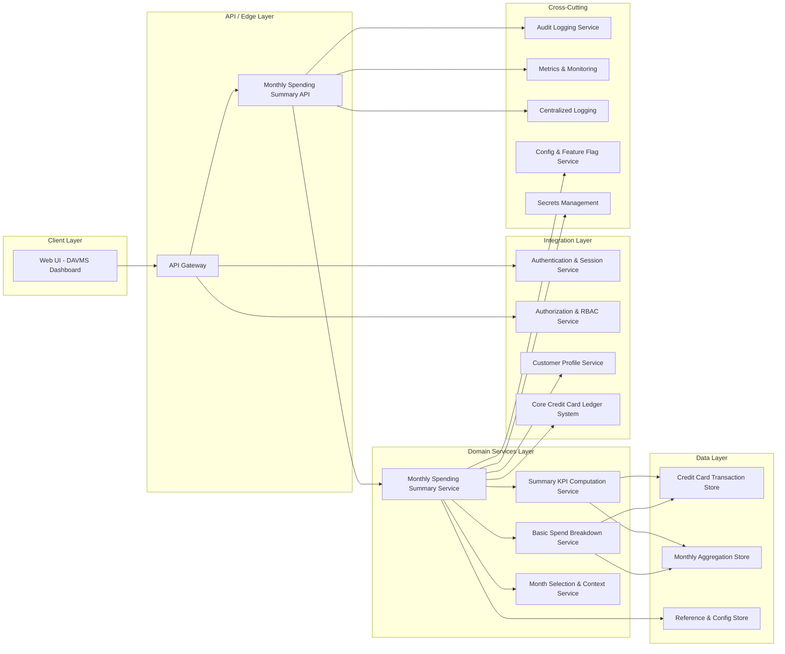

# High-Level Design (HLD) – QE-3179 DAVMS Monthly Spending Summary Dashboard

## 1. Architecture Overview

### 1.1 Context & Goals
The DAVMS Monthly Spending Summary Dashboard provides credit card customers with an at-a-glance view of monthly spending, summary KPIs, and a basic high-level breakdown of spend for a selected month. It acts as a hub for deeper analytical features that are delivered by separate epics.

In scope requirements:
1. Monthly total credit card spend calculation.
2. Monthly summary KPIs (e.g., total spend, number of transactions).
3. Visual representation of monthly spend (summary cards or charts).
4. Month selection to view a specific month’s summary.
5. Basic breakdown of spend suitable as an entry point into deeper insights.

Out of scope boundaries (must NOT be implemented in this design):
- Non-credit-card products.
- Detailed transaction-level management features (e.g., editing, dispute workflows, tagging, notes).

### 1.2 High-Level Architecture
The solution follows a typical layered enterprise architecture:
- **Client Layer**: Web UI (banking portal) & optional mobile web view.
- **API / Edge Layer**: DAVMS Spending Summary API exposed via an API gateway.
- **Domain Services Layer**: Monthly Spending Summary Service and supporting domain services for KPI computation and breakdown aggregation.
- **Data Layer**: Transaction store (credit card ledger), analytic/aggregation store, reference/configuration store.
- **Integration Layer**: Secure integration with existing credit card transaction systems, customer profile systems, and authentication/authorization services.
- **Cross-Cutting Concerns**: Security, compliance, observability, error handling, configuration, and secrets management.

### 1.3 Component Diagram (Mermaid)

## 2. Component Descriptions

### 2.1 Web UI – DAVMS Dashboard
- **Purpose**: Presents the monthly spending summary to authenticated credit card customers within the existing banking web experience.
- **Responsibilities**:
  - Displays monthly total spend and KPIs (e.g., total amount, number of transactions, average transaction value).
  - Renders visual elements like summary cards and charts based on API responses.
  - Provides month selection controls (e.g., dropdown or date picker limited to past billing cycles).
  - Initiates navigation to deeper analytical experiences that are out of scope for this epic (e.g., detailed category analysis, transaction-level management), via links or buttons.
- **Key Design Notes**:
  - No direct access to transaction systems; all data obtained via the Summary API.
  - Only credit card accounts are selectable; other product types are excluded.
  - Responsive design to support desktop and mobile web.

### 2.2 API Gateway
- **Purpose**: Edge entry point enforcing security, throttling, and routing for DAVMS APIs.
- **Responsibilities**:
  - Routes requests from the web UI to the Monthly Spending Summary API.
  - Offloads cross-cutting concerns such as rate limiting, TLS termination, and basic request validation.
  - Enforces authentication via existing identity provider (IdP) tokens.
- **Key Design Notes**:
  - Supports only HTTPS.
  - Applies product-level routing rules to ensure only credit card-related endpoints are exposed for this epic.

### 2.3 Monthly Spending Summary API
- **Purpose**: RESTful or JSON-based API responsible for exposing monthly spending summary data for a given customer and month.
- **Responsibilities**:
  - Validates incoming requests (customer identity, selected month, account type).
  - Orchestrates domain services to compute total monthly spend, KPIs, and basic breakdown.
  - Returns structured, non-PII payloads required by the UI (e.g., aggregated amounts, counts, anonymized category codes).
- **Key Design Notes**:
  - No transaction modification endpoints; read-only summary API.
  - Explicitly rejects non-credit-card products via validation.

### 2.4 Monthly Spending Summary Service
- **Purpose**: Central domain service coordinating monthly summary calculations.
- **Responsibilities**:
  - Interprets month selection context (billing cycle or calendar month) via Month Selection Service.
  - Retrieves transaction aggregates from Aggregation Store where available; falls back to the Transaction Store.
  - Delegates KPI computation to KPI Service and breakdown generation to Breakdown Service.
  - Applies business rules for filtering (e.g., excluding reversed or canceled transactions per domain policy).
- **Key Design Notes**:
  - Encapsulates credit card-specific rules; does not operate on other product types.
  - Provides a stable interface for future epics that extend analysis capabilities.

### 2.5 Summary KPI Computation Service
- **Purpose**: Computes the KPIs required for the monthly summary.
- **Responsibilities**:
  - Derives total monthly spend from transaction aggregates.
  - Calculates number of transactions and derived metrics such as average spend per transaction.
  - Ensures numeric precision/rounding consistent with billing statements.
- **Key Design Notes**:
  - Operates on pre-filtered transaction sets restricted to credit card accounts.

### 2.6 Basic Spend Breakdown Service
- **Purpose**: Generates a high-level breakdown of monthly spend suitable as an entry point into deeper insights.
- **Responsibilities**:
  - Aggregates spend by coarse categories (e.g., merchant category groups, online vs in-store) without exposing detailed transaction-level controls.
  - Produces a compact summary suitable for chart or tile representation.
  - Ensures that breakdown granularity is aligned with “entry point” expectations and leaves detailed analysis to separate epics.
- **Key Design Notes**:
  - Does not expose per-transaction identifiers or allow transaction-level operations.
  - Explicitly bounded to credit card transactions only.

### 2.7 Month Selection & Context Service
- **Purpose**: Resolves the requested month into a canonical time window for downstream services.
- **Responsibilities**:
  - Maps user-selected month into a date range based on business rules (billing cycle vs calendar month).
  - Validates that selected month is within allowed historical limits and not in the far future.
  - Ensures consistency of time window across all KPI and breakdown computations.
- **Key Design Notes**:
  - Does not itself store financial data; only calculates date ranges and context.

### 2.8 Credit Card Transaction Store
- **Purpose**: Authoritative data source for credit card transactions.
- **Responsibilities**:
  - Stores ledger entries for credit card purchases, adjustments, and reversals.
  - Provides query interfaces for retrieval by account and date range.
- **Key Design Notes**:
  - Accessed read-only by DAVMS components for this epic.
  - Non-credit-card products are excluded at query level.

### 2.9 Monthly Aggregation Store
- **Purpose**: Optimizes performance by storing pre-computed monthly aggregates.
- **Responsibilities**:
  - Holds aggregated totals and counts per customer, account, and month.
  - Optionally stores coarse breakdown data to reduce runtime computation.
- **Key Design Notes**:
  - Updated by batch processes or streaming pipelines that are assumed to exist or are delivered by separate epics.
  - DAVMS uses it read-only for summary retrieval.

### 2.10 Reference & Configuration Store
- **Purpose**: Stores non-sensitive reference data used by domain services.
- **Responsibilities**:
  - Holds category mappings, KPI definitions, and feature flag configurations for UI behavior.
- **Key Design Notes**:
  - Does not contain PII or transactional data.

### 2.11 Authentication & Session Service
- **Purpose**: Provides user authentication and session management integrated with the broader banking platform.
- **Responsibilities**:
  - Issues and validates tokens used by the Web UI and API Gateway.
  - Supports multi-factor authentication if required by the platform.
- **Key Design Notes**:
  - DAVMS relies on existing auth capabilities; no custom credential handling.

### 2.12 Authorization & RBAC Service
- **Purpose**: Enforces role- and attribute-based access control for credit card data.
- **Responsibilities**:
  - Validates that a user is permitted to view the requested credit card account monthly summary.
  - Ensures that staff or proxy access follows enterprise policies.
- **Key Design Notes**:
  - Access checks occur at the API Gateway and within the Summary API for defense in depth.

### 2.13 Customer Profile Service
- **Purpose**: Provides customer and account relationships needed to determine which credit card accounts are visible.
- **Responsibilities**:
  - Identifies credit card accounts associated with the signed-in customer.
  - Filters out non-credit-card relationships for this dashboard.

### 2.14 Core Credit Card Ledger System
- **Purpose**: System of record for credit card transactions.
- **Responsibilities**:
  - Supplies transaction data to the Transaction Store or integration interfaces consumed by DAVMS.

### 2.15 Audit Logging Service
- **Purpose**: Records access and key actions for security and compliance.
- **Responsibilities**:
  - Logs read access to monthly summaries (customer, account, month, timestamp, outcome).
  - Provides immutable logs suitable for compliance review.

### 2.16 Metrics & Monitoring Service
- **Purpose**: Provides operational observability.
- **Responsibilities**:
  - Collects API latency, error rates, and throughput metrics.
  - Exposes dashboards and alerts for SRE/operations teams.

### 2.17 Centralized Logging Service
- **Purpose**: Aggregates application logs across components.
- **Responsibilities**:
  - Stores structured logs from API and domain services for troubleshooting.

### 2.18 Config & Feature Flag Service
- **Purpose**: Manages runtime configuration for DAVMS.
- **Responsibilities**:
  - Controls feature flags such as enabling new breakdown types.
  - Stores non-secret configuration parameters.

### 2.19 Secrets Management Service
- **Purpose**: Securely stores and rotates secrets used by DAVMS.
- **Responsibilities**:
  - Manages API keys, certificates, and database credentials.

## 3. Integration Points & Data Flow

### 3.1 Flow 1 – Authentication & Session Establishment
1. User navigates to the banking web portal and authenticates via the Authentication & Session Service.
2. Upon successful login, the portal issues a secure token scoped to the user’s session.
3. Web UI stores the token in a secure, http-only storage mechanism for subsequent API calls.
4. API Gateway validates tokens on every request to the Summary API, rejecting invalid or expired tokens.

**Scope Mapping**: Required as a foundation for all in-scope features but does not directly satisfy a specific scope item; enables secure access for monthly totals, KPIs, visualization, month selection, and breakdown.

### 3.2 Flow 2 – Month Selection & Summary Retrieval (Primary Request Flow)
1. User opens the DAVMS Monthly Spending Summary dashboard in the Web UI.
2. Web UI retrieves the list of available months (billing cycles) by calling Summary API with a generic “context” request or uses pre-fetched configuration.
3. User selects a month via the UI.
4. Web UI sends a `GET /summary?accountId=<credit_card_account>&month=<YYYY-MM>` request to the Summary API through the API Gateway.
5. API Gateway validates the token and routes the request to Summary API.
6. Summary API performs authorization via Authorization Service to ensure the user may view the account.
7. Summary API invokes Month Selection Service to convert the requested month into an exact date range.
8. Summary Service queries the Monthly Aggregation Store for existing aggregates for the account and date range.
9. If aggregates exist, Summary Service retrieves totals and basic breakdown data from Aggregation Store; otherwise it queries the Transaction Store.
10. Summary Service passes retrieved data to KPI Service to compute total monthly spend and KPIs.
11. Summary Service passes the same data set to Breakdown Service to compute high-level breakdown.
12. Summary Service composes a response containing: total spend, number of transactions, derived KPIs, and basic breakdown entries.
13. Summary API returns the composed response to the Web UI via API Gateway.
14. Web UI renders summary cards and charts based on the response.

**Scope Mapping**:
- Monthly total credit card spend calculation → Steps 8–10; components: Summary Service, KPI Service, Aggregation Store/Transaction Store.
- Monthly summary KPIs → Steps 10–12; components: KPI Service, Summary Service.
- Visual representation of monthly spend → Step 14; components: Web UI.
- Month selection → Steps 2–4, 7; components: Web UI, Month Selection Service.
- Basic breakdown of spend → Steps 9, 11–12, 14; components: Breakdown Service, Summary Service, Web UI.

### 3.3 Flow 3 – Business Logic & Processing (Aggregation / Refresh)
1. A scheduled batch or streaming process (outside this epic) updates Monthly Aggregation Store with aggregates grouped by account and month using data from Core Credit Card Ledger System.
2. Monthly Aggregation Store exposes read APIs used by Summary Service.
3. When a user requests a summary, Summary Service attempts to use the pre-computed aggregates first; if missing, it falls back to on-demand computation from Transaction Store.

**Scope Mapping**:
- Supports monthly total credit card spend calculation and KPIs by optimizing access to transaction data.

### 3.4 Flow 4 – Observability & Audit
1. Summary API logs every incoming request and outcome to Centralized Logging Service.
2. Metrics & Monitoring Service receives metrics on request latency, error rates, and success counts.
3. Audit Logging Service records access attempts with attributes: customer identifier, credit card account reference, month, timestamp, auth result (success/failure), and response classification.

**Scope Mapping**:
- Supports reliability and compliance of all in-scope flows.

## 4. Security & Compliance Features

### 4.1 Transport Security
- All client-to-server and service-to-service communication uses HTTPS or mutually authenticated TLS.
- API Gateway terminates external TLS and re-establishes secure connections internally.

### 4.2 Data Encryption
- At rest: Transaction Store, Aggregation Store, and logs containing financial attributes are encrypted using enterprise-standard key management.
- In transit: All calls between Web UI, API Gateway, Summary API, and backend services are encrypted using TLS.

### 4.3 Input Validation
- Summary API validates:
  - `accountId` is associated with the authenticated customer and corresponds to a credit card product.
  - `month` adheres to an expected format and is within allowed historical bounds.
- API Gateway enforces request size limits and basic schema validation.

### 4.4 Output Filtering
- Response payloads include only aggregated financial metrics and breakdown labels; no raw card numbers, personal addresses, or other sensitive PII.
- Detailed transaction data (such as individual merchant names and timestamps) is reserved for other epics and not exposed here.

### 4.5 RBAC / ABAC
- Authorization Service enforces rules such as:
  - Only the account owner or authorized delegate may view the monthly summary.
  - Staff access must be explicitly authorized and logged.
- Attribute-based rules may restrict access by geography or regulatory segment where applicable.

### 4.6 Audit Logging
- Audit logs capture read access to monthly summaries with required attributes and are retained according to enterprise policy.
- Access by staff or proxies is flagged to support subsequent review.

### 4.7 Secrets Management
- Credentials and keys for databases, internal APIs, and third-party integrations are stored only in the Secrets Management Service.
- Automated rotation of secrets follows enterprise policy.

### 4.8 Compliance Mapping
- **Financial data protection**: Applies internal policies equivalent to GLBA-style safeguards for financial information.
- **Data minimization**: Only summary-level data is exposed for this epic; transaction-level details are intentionally omitted.
- **Logging & monitoring**: Aligned with enterprise SOC 2-style controls for availability and security.

## 5. Resiliency & Error Handling

### 5.1 Retry Mechanisms
- Summary Service uses controlled retries when reading from Aggregation Store and Transaction Store in case of transient network failures.
- Idempotent queries ensure retries do not affect data consistency.

### 5.2 Circuit Breakers & Timeouts
- API Gateway and Summary API apply timeouts and circuit breakers when downstream services degrade.
- If Aggregation Store is unavailable, Summary Service may fall back to Transaction Store within configured limits; if both fail, the API returns a graceful error.

### 5.3 Graceful Degradation
- If breakdown computation fails but total spend and KPIs are available, the API returns partial results and an indicator that breakdown is temporarily unavailable.
- UI shows a non-blocking message for missing breakdown while still presenting available summary data.

### 5.4 Error Handling & Status Codes
- `200 OK`: Successful retrieval of monthly summary.
- `400 Bad Request`: Invalid month format, unsupported product type, or malformed request.
- `401 Unauthorized`: Missing or invalid authentication token.
- `403 Forbidden`: User not authorized to view requested account summary.
- `404 Not Found`: Aggregates not found and no transactions exist for the given month.
- `500 Internal Server Error`: Unexpected errors in backend processing.

For each error, responses:
- Use generic messages without revealing internal system details.
- Provide error codes that the UI can map to user-friendly messages.

### 5.5 Observability
- Metrics collected for request latency, error rates, breakdown computation failures, and fallback scenarios.
- Dashboards and alerts configured for SLOs on Summary API availability and latency.

## 6. Validation Report

### 6.1 Requirements Coverage
- **Scope Item 1 – Monthly total credit card spend calculation**
  - **Components**: Summary Service, KPI Service, Monthly Aggregation Store, Credit Card Transaction Store.
  - **Flows**: Flow 2 (steps 8–10), Flow 3.
- **Scope Item 2 – Monthly summary KPIs (e.g., total spend, number of transactions)**
  - **Components**: KPI Service, Summary Service.
  - **Flows**: Flow 2 (steps 10–12).
- **Scope Item 3 – Visual representation of monthly spend (summary cards or charts)**
  - **Components**: Web UI.
  - **Flows**: Flow 2 (step 14).
- **Scope Item 4 – Month selection to view a specific month’s summary**
  - **Components**: Web UI, Month Selection Service, Summary API.
  - **Flows**: Flow 2 (steps 2–4, 7).
- **Scope Item 5 – Basic breakdown of spend suitable as an entry point into deeper insights**
  - **Components**: Breakdown Service, Summary Service, Web UI, Monthly Aggregation Store, Credit Card Transaction Store.
  - **Flows**: Flow 2 (steps 9, 11–12, 14), Flow 3.

### 6.2 Out of Scope Acknowledgement
- **Non-credit-card products**
  - Explicitly excluded via input validation and authorization rules in Summary API and underlying services.
  - Web UI restricts account selection to credit card accounts.
- **Detailed transaction-level management features**
  - Not provided by Summary API or UI; no endpoints for editing, disputing, or tagging transactions.
  - Navigation to other epics’ features may be provided via links, but those features are implemented and secured separately.

### 6.3 Compliance Status
- **Transport Security**: **Pass** – HTTPS/TLS enforced at API Gateway and between services.
- **Data Encryption at Rest**: **Pass-with-conditions** – Assumes underlying databases and log stores are configured for encryption with enterprise key management.
- **Access Control (RBAC/ABAC)**: **Pass** – Authorization Service enforces access; Summary API performs secondary checks.
- **Audit Logging**: **Pass** – Access to summaries is logged with key attributes.
- **Data Minimization / PII Exposure**: **Pass** – Design exposes only summary aggregates and generic breakdown categories.
- **Operational Monitoring (Observability)**: **Pass** – Metrics and logs are captured and surfaced.

### 6.4 Identified Ambiguities & Risks
- **Ambiguity/Risk 1 – Month definition (billing cycle vs calendar month)**
  - **Consequence**: Inconsistent totals between dashboard and official statements; customer confusion and potential support volume.
  - **Mitigation**: Business stakeholders must define a canonical month definition. Month Selection Service configuration must be aligned with statement generation rules and clearly communicated in UI copy.

- **Ambiguity/Risk 2 – Breakdown granularity**
  - **Consequence**: Breakdown may be perceived as too coarse or too detailed relative to “entry point” expectations; could overlap with future deep-dive epics.
  - **Mitigation**: Collaborate with UX and analytics stakeholders to define a small set of coarse categories; enforce that no per-transaction identifiers are exposed and that deeper analytics remain in separate epics.

- **Ambiguity/Risk 3 – Dependency on external aggregation processes**
  - **Consequence**: If batch or streaming processes updating Monthly Aggregation Store are delayed, users may see stale or incomplete summaries.
  - **Mitigation**: Design clear fallback logic to Transaction Store and surface data freshness indicators in UI; align SLAs for aggregation pipelines with dashboard SLOs.

- **Ambiguity/Risk 4 – Cross-product exposure boundaries**
  - **Consequence**: If account filtering fails, non-credit-card data might inadvertently be included, violating scope and potentially regulatory expectations.
  - **Mitigation**: Implement strict product-type filtering at authorization and query layers; add automated tests and monitoring focused on product categorization.
