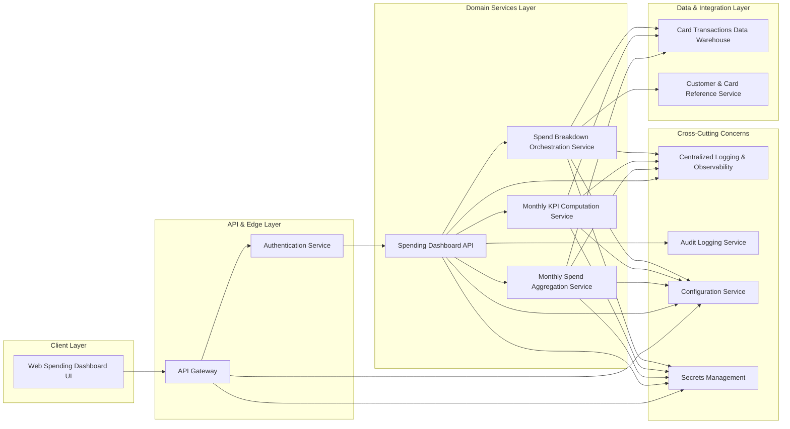

# High-Level Design (HLD) – QE-3185 – Monthly Spending Summary Dashboard

## 1. Architecture Overview

### 1.1 Context and Objectives
This design delivers a web-based monthly spending summary for credit card customers. It provides:
- Aggregated monthly total credit card spend
- Summary KPIs (e.g., total spend, number of transactions)
- Visual representations of monthly spend (summary cards and/or charts)
- Month selection to view a specific month’s summary
- A basic spend breakdown acting as an entry point into deeper insights

Explicit boundaries:
- Only credit card products are in scope
- Detailed transaction-level management features are out of scope

The solution is designed as an enterprise-grade, cloud-ready architecture, separating client, API/edge, domain services, data stores, integrations, and cross‑cutting concerns.

### 1.2 Logical Architecture
The logical architecture consists of the following layers:
- **Client Layer** – Web client for authenticated banking users to view monthly spend dashboard
- **API & Edge Layer** – API gateway, authentication/authorization, request routing
- **Domain Services Layer** – Business logic for spend aggregation, KPI computation, and breakdown generation
- **Data & Integration Layer** – Access to core card transaction data and customer/product metadata
- **Cross-Cutting Services** – Security, audit, logging, monitoring, configuration, and secrets management

### 1.3 Component Diagram (Mermaid)

## 2. Component Descriptions

### 2.1 Web Spending Dashboard UI
A responsive web application module within the existing online banking frontend.

Responsibilities:
- Display monthly spending summary KPIs for credit card accounts
- Render visual components (cards, charts) showing total spend and breakdowns
- Provide month selection (e.g., dropdown or calendar controls) to view specific months
- Make authenticated API calls to the Spending Dashboard API
- Handle error messages and loading states gracefully

Explicit exclusions:
- Does not implement detailed transaction-level management (e.g., dispute initiation, tagging, notes)
- Does not support non-credit-card product views (e.g., checking, savings, loans) within this dashboard

### 2.2 API Gateway
The enterprise API gateway providing edge security and routing.

Responsibilities:
- Terminate TLS from web client
- Validate access tokens/session cookies issued by the banking authentication stack
- Enforce rate limiting and request quotas for dashboard endpoints
- Route authorized requests to the Spending Dashboard API
- Apply basic request/response size limits and schema validation where configured

Explicit exclusions:
- No direct business logic for calculating spend or KPIs

### 2.3 Authentication Service
Central identity and authentication provider.

Responsibilities:
- Authenticate the user via existing banking login flows
- Issue and validate tokens or sessions used by the API Gateway
- Provide user identity and card ownership claims for authorization checks

Explicit exclusions:
- Does not store or expose real transaction content

### 2.4 Spending Dashboard API
Stateless RESTful service that exposes the monthly spending dashboard capabilities.

Responsibilities:
- Receive authenticated requests from the API Gateway for a selected month and credit card
- Perform authorization checks (user can only access their own cards)
- Orchestrate calls to aggregation, KPI, and breakdown services
- Apply response shaping for UI consumption (summary data structures, not raw transaction lists)
- Enforce that only credit card product identifiers are accepted
- Ensure out-of-scope detailed transaction operations are not exposed via its contract

Explicit exclusions:
- No endpoints for transaction-level editing, exporting full transaction datasets, or non-card product dashboards

### 2.5 Monthly Spend Aggregation Service
Domain service encapsulating rules for monthly total spend calculation.

Responsibilities:
- Query card transaction data for the selected month and card
- Apply business rules for spend calculation (e.g., include settled purchases; exclude reversals/fees per policy)
- Aggregate total spend value for the month
- Provide summarized totals back to the Spending Dashboard API

Explicit exclusions:
- Does not perform category classification or cross-month comparisons; these belong to future epics

### 2.6 Monthly KPI Computation Service
Domain service calculating summary KPIs for the month.

Responsibilities:
- Calculate number of transactions for the selected month
- Compute additional summary metrics as required (e.g., average spend per transaction, max single transaction amount if in scope)
- Return KPI objects suitable for rendering summary cards

Explicit exclusions:
- No trend analysis across multiple months (e.g., year-over-year views)

### 2.7 Spend Breakdown Orchestration Service
Orchestration service that produces a basic spend breakdown as an entry point to deeper insights.

Responsibilities:
- Retrieve transaction summaries for the selected month
- Apply lightweight grouping (e.g., by high-level merchant type or category buckets supported by existing data) sufficient for a basic breakdown
- Restrict breakdown complexity to what can be shown in a summary dashboard (e.g., top categories, top merchants)
- Return breakdown structures that can be used to link into deeper analytics modules (delivered by future epics)

Explicit exclusions:
- Detailed, interactive analytics (drill-down to individual transactions, multi-dimensional filters) are out of scope for this epic

### 2.8 Card Transactions Data Warehouse
Existing or new data warehouse optimized for analytical queries over card transactions.

Responsibilities:
- Store credit card transaction records with necessary fields (amounts, dates, merchant codes, etc.)
- Provide query interfaces (SQL, analytical APIs) to support monthly aggregation and KPI calculations
- Enforce access controls so that domain services only access data for authorized card accounts

Explicit exclusions:
- Non-credit-card product datasets are not used by this epic

### 2.9 Customer & Card Reference Service
Reference data service for customer and card metadata.

Responsibilities:
- Provide mapping between authenticated user identities and card accounts
- Supply card attributes needed for the dashboard (e.g., card nickname, last 4 digits, product type identifier limited to credit cards)

Explicit exclusions:
- Does not provide detailed account management features (e.g., card limit changes, address updates)

### 2.10 Centralized Logging & Observability
Cross-cutting logging & monitoring component.

Responsibilities:
- Capture structured logs for API requests, aggregation executions, and breakdown generation
- Feed logs and metrics into monitoring/alerting systems (e.g., dashboards for latency, error rates)

### 2.11 Audit Logging Service
Compliance-oriented audit logging component.

Responsibilities:
- Record security-significant events (e.g., dashboard access, failed authorization attempts)
- Retain audit trails according to organizational policies

### 2.12 Configuration Service
Central configuration management.

Responsibilities:
- Provide environment-specific configuration, such as rate limits, aggregation rules, KPI definitions

### 2.13 Secrets Management
Secure secrets storage and rotation.

Responsibilities:
- Store and manage credentials for data warehouse connections and reference services
- Provide API keys, certificates, and encryption keys to services securely

## 3. Integration Points & Data Flow

### 3.1 Flow 1 – Authentication and Session Establishment
1. User accesses the Monthly Spending Summary Dashboard via the web client.
2. Web client redirects to or embeds existing banking login flow.
3. Authentication Service validates credentials and establishes a session or issues an access token.
4. Web client stores session state securely (e.g., HTTP-only secure cookies) and includes token on subsequent requests.

Scope mapping:
- Supports precondition for all in-scope capabilities by ensuring authenticated access to monthly spend calculations and displays.

### 3.2 Flow 2 – Monthly Total Spend & KPI Retrieval
1. Authenticated user selects a month and a credit card in the web dashboard UI.
2. Web client sends an HTTPS request to the Spending Dashboard API via the API Gateway, including selected month and card identifier.
3. API Gateway validates the access token and forwards the request to the Spending Dashboard API.
4. Spending Dashboard API validates that the requested product is a credit card and that the user is authorized for the card.
5. Spending Dashboard API calls the Monthly Spend Aggregation Service with normalized parameters (card ID, month range).
6. Monthly Spend Aggregation Service queries Card Transactions Data Warehouse for transactions in the given month and card.
7. Aggregation Service computes the total spend according to business rules and returns the total to the Spending Dashboard API.
8. Spending Dashboard API calls the Monthly KPI Computation Service.
9. KPI Service queries Card Transactions Data Warehouse for transaction counts and other required metrics.
10. KPI Service computes KPIs (e.g., total number of transactions, average spend per transaction if required) and returns them.
11. Spending Dashboard API composes a summary response containing monthly total spend and KPIs.
12. API Gateway returns the response to the Web Spending Dashboard UI.
13. Web UI renders summary cards or widgets showing total spend and KPIs.

Scope mapping:
- **Monthly total credit card spend calculation**: Steps 5–7, AGG_SVC + CARD_DW
- **Monthly summary KPIs**: Steps 8–10, KPI_SVC + CARD_DW

### 3.3 Flow 3 – Basic Spend Breakdown Retrieval
1. From the same user session, the Web UI requests the basic spend breakdown for the selected month.
2. Web UI calls the Spending Dashboard API via the API Gateway, including month and card identifiers.
3. API Gateway validates token and routes request to the Spending Dashboard API.
4. Spending Dashboard API performs authorization checks and validates credit card product type.
5. Spending Dashboard API invokes the Spend Breakdown Orchestration Service.
6. Breakdown Service queries Card Transactions Data Warehouse for the relevant transactions.
7. Breakdown Service optionally queries Customer & Card Reference Service for auxiliary metadata needed for grouping (e.g., card product type or merchant category mappings if not stored in CARD_DW).
8. Breakdown Service applies simple grouping logic (e.g., by category, merchant type) appropriate for summary visualization.
9. Breakdown Service returns a structured breakdown (e.g., categories with aggregated amounts) to the Spending Dashboard API.
10. Spending Dashboard API formats the response for UI visualization.
11. Web UI renders charts or summary cards showing the basic breakdown and possibly navigation links to deeper insights modules (implemented by separate epics).

Scope mapping:
- **Visual representation of monthly spend (summary cards or charts)**: Steps 10–11, WEB + DASH_API + BRK_SVC
- **Basic breakdown of spend as an entry point into deeper insights**: Steps 5–9, BRK_SVC + CARD_DW + CUST_REF

### 3.4 Flow 4 – Month Selection and Navigation
1. User interacts with month selection UI control (e.g., dropdown for past 12 months).
2. Web UI updates local state to reflect selected month.
3. Web UI triggers the Monthly Total Spend & KPI Retrieval (Flow 2) and Basic Spend Breakdown Retrieval (Flow 3) for the newly selected month.
4. Responses are rendered using the same visual components, refreshed for the selected month.

Scope mapping:
- **Month selection to view a specific month’s summary**: Steps 1–4, WEB + DASH_API + underlying services

### 3.5 Flow 5 – Logging and Audit
1. For every dashboard request, Spending Dashboard API emits structured application logs to Centralized Logging & Observability (request ID, user ID, card ID, month, latency, status).
2. Security-significant events (e.g., failed authorization, unusual request patterns) are sent to Audit Logging Service.
3. Monitoring dashboards and alerts are configured over the observability data to detect performance or security issues.

Scope mapping:
- Supports reliability and compliance for all in-scope flows; no direct business requirement but necessary for enterprise readiness.

## 4. Security & Compliance Features

Security is implemented consistently across layers to support safe display of monthly credit card spend without exposing sensitive details beyond what is necessary.

### 4.1 Transport Security
- All communication between Web UI and API Gateway uses HTTPS with strong TLS configurations.
- Internal service-to-service traffic (API Gateway → Spending Dashboard API → domain services → data warehouse/reference services) is encrypted in transit according to enterprise standards (e.g., mTLS where mandated).

### 4.2 Data Encryption
- Card Transactions Data Warehouse stores sensitive data in encrypted form at rest per organizational policy.
- Access to CARD_DW is restricted to service identities via Secrets Management; only fields necessary for monthly aggregation and breakdown are queried.

### 4.3 Input Validation
- API Gateway performs basic schema and size validation on incoming requests (month format, card identifier shape).
- Spending Dashboard API validates:
  - The month parameter (e.g., allowed range, format like YYYY-MM)
  - The card identifier belongs to an allowed credit card product type
  - No unsupported filters are accepted that would imply detailed transaction management in this endpoint.

### 4.4 Output Filtering
- Spending Dashboard API ensures responses contain only aggregated and summary-level data:
  - Total amounts, counts, and grouped breakdowns
  - No raw transaction records or personally identifiable information beyond what is already standard in card dashboards (e.g., high-level card identifier using masked format handled by existing UI patterns)
- Web UI renders summary information and does not display full transaction tables or detailed attributes.

### 4.5 Authorization & Access Control (RBAC/ABAC)
- Authentication Service provides identity and card ownership claims.
- Spending Dashboard API enforces authorization by confirming that requested card IDs belong to the authenticated user.
- Role-based or attribute-based rules can restrict dashboard access (e.g., block access for certain account states) via configuration.

### 4.6 Audit Logging
- Access to monthly spending dashboard endpoints is logged with user identity, card reference, and timestamp.
- Failed authorization or unusual access patterns are logged and flagged for review.

### 4.7 Secrets Management
- All passwords, keys, and connection strings for accessing Card Transactions Data Warehouse and Customer & Card Reference Service are stored in Secrets Management.
- Services retrieve secrets via secure APIs and do not hard-code credentials.

### 4.8 Compliance Mapping
Given the scope (monthly spending summary, aggregated card data, no payment processing or transaction management operations):
- **PCI-DSS**: Relevant only to the extent that card-related data is accessed; the design uses existing card data infrastructure and ensures:
  - Encrypted storage and transport
  - Strict access controls and logging
- **Privacy/PII regulations (e.g., GDPR-like regimes)**: The dashboard displays aggregated financial information attributable to a user. Compliance is supported by:
  - Data minimization (summary metrics instead of detailed records)
  - Secure authentication and authorization
  - Ability to respect customer privacy preferences through upstream identity and consent mechanisms.

No additional PHI-specific or healthcare-related compliance frameworks are implicated.

## 5. Resiliency & Error Handling

### 5.1 Retry Mechanisms
- Domain services (Aggregation, KPI, Breakdown) implement idempotent read operations.
- Transient errors when contacting Card Transactions Data Warehouse or Customer & Card Reference Service are handled with bounded retries and exponential backoff.

### 5.2 Circuit Breakers and Timeouts
- Client-side timeouts are enforced in Web UI to prevent hanging requests.
- API Gateway and Spending Dashboard API enforce per-call timeouts when invoking downstream services.
- Circuit breakers are configured for data warehouse and reference service calls to prevent cascading failures; when open, the API returns a degraded but safe response.

### 5.3 Graceful Degradation
- If breakdown data is unavailable (e.g., CARD_DW latency issues), the dashboard can still show total spend and basic KPIs with a message indicating limited insights.
- If KPI calculations fail but aggregation succeeds, total spend can be shown with a limited KPI set.

### 5.4 Error Handling Semantics
Representative status codes and behaviors (no real data values used):
- **200 OK** – Successful retrieval of summary and breakdown data.
- **400 Bad Request** – Invalid month format, unsupported card identifier, or request attempting out-of-scope operations (e.g., transaction management parameters).
- **401 Unauthorized** – Missing or invalid authentication token.
- **403 Forbidden** – Authenticated but unauthorized to access the requested card.
- **404 Not Found** – Card or month data not available (e.g., no transactions for that month); UI should show appropriate messaging.
- **500 Internal Server Error** – Unexpected errors; logs and alerts created, generic error message returned without internal details.

Exposure rules:
- Client-visible messages remain generic and avoid leaking sensitive system details.
- Detailed error traces are logged internally for operational analysis.

### 5.5 Observability
- Every request is tagged with a correlation ID propagated through API Gateway, Spending Dashboard API, and domain services.
- Metrics are collected for latency, error rate, ongoing usage counts per endpoint.
- Dashboards and alerts are configured for SLOs such as percentile response times and uptime.

## 6. Validation Report

### 6.1 Requirements Coverage
- **Monthly total credit card spend calculation**
  - Components: Monthly Spend Aggregation Service, Spending Dashboard API, Card Transactions Data Warehouse
  - Flows: Flow 2 (Monthly Total Spend & KPI Retrieval)
- **Monthly summary KPIs (e.g., total spend, number of transactions)**
  - Components: Monthly KPI Computation Service, Spending Dashboard API, Card Transactions Data Warehouse
  - Flows: Flow 2 (Monthly Total Spend & KPI Retrieval)
- **Visual representation of monthly spend (e.g., summary cards or charts)**
  - Components: Web Spending Dashboard UI, Spending Dashboard API, Spend Breakdown Orchestration Service
  - Flows: Flow 3 (Basic Spend Breakdown Retrieval), Flow 2 (for KPI-based summary cards)
- **Month selection to view a specific month’s summary**
  - Components: Web Spending Dashboard UI, Spending Dashboard API, API Gateway
  - Flows: Flow 4 (Month Selection and Navigation), invoking Flow 2 & Flow 3
- **Basic breakdown of spend suitable as an entry point into deeper insights**
  - Components: Spend Breakdown Orchestration Service, Card Transactions Data Warehouse, Customer & Card Reference Service, Web Spending Dashboard UI
  - Flows: Flow 3 (Basic Spend Breakdown Retrieval)

### 6.2 Out of Scope Acknowledgement
- **Non-credit-card products**
  - Enforced via product-type validation in Spending Dashboard API and domain services; Card Transactions Data Warehouse queries are constrained to credit card datasets.
- **Detailed transaction-level management features**
  - No endpoints or UI elements are provided for transaction editing, disputes, tagging, or exporting; any such requirements are delegated to future epics.

### 6.3 Compliance Status
- **Transport Security** – **Pass**
  - HTTPS and encrypted internal communications are mandated.
- **Data Encryption at Rest** – **Pass-with-conditions**
  - Assumes underlying Card Transactions Data Warehouse and secrets management already comply with enterprise encryption standards; must be confirmed during implementation.
- **Authentication & Authorization** – **Pass**
  - Uses existing banking authentication and enforces per-card authorization checks.
- **Audit Logging** – **Pass-with-conditions**
  - Design specifies audit logging; implementation must ensure retention and review processes align with organizational policy.
- **PCI-DSS / Card Data Controls** – **Pass-with-conditions**
  - Design minimizes exposure (aggregated data only) but depends on existing card infrastructure; formal PCI attestation and segmentation controls are assumed.
- **Privacy/PII Controls** – **Pass-with-conditions**
  - Aggregated views are privacy-friendly, but alignment with regulatory specifics (e.g., data subject rights handling) occurs at platform level.

### 6.4 Identified Ambiguities/Risks
1. **Level of Breakdown Detail**
   - Ambiguity/Risk: “Basic breakdown” is not precisely defined (e.g., number of categories, inclusion of merchant names).
   - Consequence: Overly detailed breakdown might approach transaction-level analytics and blur the boundary with out-of-scope features.
   - Mitigation: Define a maximum number of categories and restrict grouping to high-level types; avoid showing individual merchants or transaction lists.

2. **Supported Month Range**
   - Ambiguity/Risk: The epic does not specify how many historical months should be available.
   - Consequence: Querying very long histories can impact performance; inconsistent UX across channels.
   - Mitigation: Set a configurable limit (e.g., last 12–24 months) in the Configuration Service and validate requested month against this limit.

3. **Performance Expectations for High-Volume Cards**
   - Ambiguity/Risk: No explicit non-functional requirements (e.g., maximum latency) for customers with high transaction volumes.
   - Consequence: Dashboard might be slow for certain segments if aggregation queries are not optimized.
   - Mitigation: Implement indexing and pre-aggregation strategies in Card Transactions Data Warehouse and define SLOs with monitoring.

4. **Dependency on Future Deep Insights Epics**
   - Ambiguity/Risk: The dashboard is an “entry point” but the hand-off to deeper analytics is not defined.
   - Consequence: Navigation or linking might be inconsistent once future epics deliver advanced insights.
   - Mitigation: Use generic navigation hooks (e.g., “View detailed insights” buttons that can be wired later) and keep contracts stable.

5. **Product Scope Guardrails**
   - Ambiguity/Risk: While non-credit-card products are out of scope, shared infrastructure might expose them inadvertently.
   - Consequence: Users might see incomplete or misleading data for other products.
   - Mitigation: Strict product-type checks in Spending Dashboard API and filtering queries by product type; explicit tests to ensure only credit card datasets are used.
