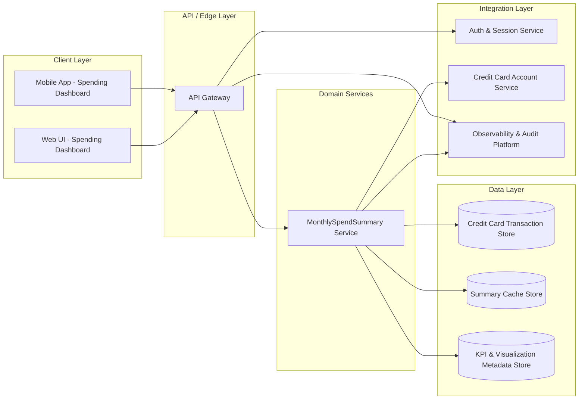

# High-Level Design: Monthly Spending Summary Dashboard (QE-3192)

## 1. Architecture Overview

The Monthly Spending Summary Dashboard is a web-based experience within the existing banking application that aggregates credit-card transaction data to present a concise summary of monthly spending. The solution focuses exclusively on credit card products and high-level monthly metrics, without exposing transaction-level management capabilities.

### 1.1 Logical Architecture Layers

1. **Client Layer (Web & Mobile Frontend)**  
   - Banking Web UI and Mobile App modules that present the monthly spending summary, KPIs, and visualizations.  
   - Provides month selection controls and navigational links to deeper analysis features (implemented in other epics).

2. **API / Edge Layer**  
   - API Gateway / Edge service that exposes secure REST/GraphQL endpoints for fetching monthly spending summaries.  
   - Handles authentication, authorization, rate limiting, request validation, and response normalization.

3. **Domain Services Layer (Spend Summary Service)**  
   - "MonthlySpendSummary Service" responsible for computing monthly totals and KPIs for credit card accounts.  
   - Encapsulates business rules such as transaction filtering, month boundaries, and data aggregation logic.

4. **Data Layer**  
   - **Transaction Store**: Existing credit card transaction database (e.g., relational DB / data warehouse) containing normalized transaction records.  
   - **Summary Cache Store**: High-performance cache (e.g., Redis) for frequently accessed monthly summary results per customer/account.  
   - **Metadata Store**: Configuration for KPI definitions, supported months range, visualization configuration.

5. **Integration Layer**  
   - Integration with existing Authentication & Session Service for identifying the customer and authorized cards.  
   - Integration with Customer Profile & Account Services to validate credit card account ownership and status.  
   - Integration with Observability platform (logging, metrics, traces).

6. **Cross-Cutting Concerns**  
   - Security, compliance, observability, audit logging, error handling, configuration management, and secrets management applied consistently across layers.

### 1.2 Component Diagram (Mermaid)

## 2. Component Descriptions

### 2.1 Web UI - Spending Dashboard (WUI)
- React/Angular/Vue (or equivalent) module embedded within the existing online banking portal.  
- Presents monthly spending KPIs: total spend, number of transactions, and key high-level breakdowns (e.g., high-level segment overview only).  
- Provides month selection controls (e.g., dropdown of months, calendar, or pagination).  
- Displays visual representations (summary cards, bar/line charts, pie/segment visuals) using anonymized and aggregated data only.  
- Integrates with existing routing/navigation to provide entry points into deeper category and multi-month analyses (implemented in separate epics; links only, no logic).  
- Ensures no transaction-level management UI (no per-transaction edit, dispute, categorization or export) to honor out-of-scope boundaries.

### 2.2 Mobile App - Spending Dashboard (MAPP)
- Native or hybrid mobile screen leveraging the same backend APIs as the web UI.  
- Presents the same KPIs and visualizations optimized for small screens.  
- Shares common UI components and design system tokens for consistency with the web experience.  
- Enforces scope limitations by restricting actions to view-only summary and navigation to deeper insight modules.

### 2.3 API Gateway (APIGW)
- Single entry point for all dashboard-related API calls from web and mobile clients.  
- Terminates TLS and enforces mutual TLS or token-based authentication depending on existing enterprise standards.  
- Performs request validation, schema checks, and rate limiting per customer/session to avoid backend overload.  
- Routes authenticated summary requests to MonthlySpendSummary Service.  
- Applies fine-grained authorization: customers can only view summaries for credit card accounts they own and that are active.  
- Normalizes responses and hides implementation details; ensures no sensitive data fields are exposed beyond aggregated metrics.

### 2.4 MonthlySpendSummary Service (MSSVC)
- Stateless domain service implementing business logic to compute monthly spending summary.  
- Responsibilities:  
  - Accept a request including customer identity (from auth), target month, and card/account identifiers.  
  - Validate that the requested month is within the supported historical range and that the account is a credit card product.  
  - Apply filters to transaction data (e.g., posted transactions, exclude reversals/fees if required by product rules).  
  - Aggregate transactions to compute:  
    - Total monthly spend amount.  
    - Number of transactions within the month.  
    - High-level breakdown values (e.g., categories or segments at an abstract level suitable as an entry point into deeper analysis).  
  - Look up KPI definitions and visualization configuration from the Metadata Store.  
  - Utilize Summary Cache Store to fetch or persist pre-computed monthly summaries for performance.  
  - Emit audit events for summary views if required by bank policy.  
- Enforces out-of-scope boundaries by not exposing transaction-level management operations or non-credit-card products.

### 2.5 Credit Card Transaction Store (TXDB)
- Existing authoritative data store of credit card transactions.  
- Contains fields like transaction ID, account ID, customer ID, amounts, dates, merchant, and classification attributes.  
- Read-only for the MonthlySpendSummary Service; no modification operations.  
- Indexed to support efficient queries for a given month, account, and customer.  
- Interfaces may be direct SQL, data warehouse queries, or via an internal data access service (depending on enterprise standards).

### 2.6 Summary Cache Store (SUMCACHE)
- In-memory or distributed cache for storing pre-computed monthly summaries by customer and account.  
- Keys: composite of customer ID, card ID, month/year.  
- Values: aggregated metrics and breakdowns.  
- Time-to-live configured aligned with data freshness requirements (e.g., daily rebuild, on-demand refresh upon transaction updates).  
- Reduces load on TXDB and improves response times for frequently accessed months.

### 2.7 KPI & Visualization Metadata Store (METADB)
- Stores configuration for KPIs and visualization models, including:  
  - Definitions of KPIs (e.g., total spend, number of transactions, optional high-level segments).  
  - Mapping from internal data fields to visualization components.  
  - Display thresholds, labels, and units.  
- Allows future extension to new KPIs or views without code changes in client layer.  
- Does not store or process per-customer transaction data; purely configuration.

### 2.8 Auth & Session Service (AUTH)
- Existing enterprise authentication service (e.g., OAuth2/OpenID Connect based).  
- Authenticates customer sessions for both web and mobile.  
- Issues tokens containing customer identifiers and authorized scopes.  
- Provides APIs for token introspection used by API Gateway.  
- Ensures secure session handling, including expiration and revocation.

### 2.9 Credit Card Account Service (ACCT)
- Master data and lifecycle management for credit card accounts.  
- Validates that requested accounts belong to the authenticated customer.  
- Returns account status (e.g., active, closed, blocked) to determine whether summaries may be shown.  
- Filters out non-credit-card products; the MonthlySpendSummary Service will only operate on credit card accounts.

### 2.10 Observability & Audit Platform (OBS)
- Central logging, metrics, and tracing system.  
- Receives structured logs from APIGW and MSSVC for each summary request.  
- Stores audit records of access to monthly summary data (e.g., customer ID, account ID, month queried, timestamp).  
- Provides dashboards for operational monitoring: error rates, latency, cache hit/miss ratios.

## 3. Integration Points & Data Flow

### 3.1 Flow 1: Authentication & Session Establishment

1. Customer accesses banking web or mobile application.  
2. Client redirects to Auth & Session Service for login if session is not already established.  
3. Auth & Session Service validates credentials and multi-factor authentication (if configured).  
4. Upon success, Auth & Session Service issues a secure token containing customer ID and permissions.  
5. Client stores the session/token securely (e.g., HTTP-only cookie or secure storage) and uses it for subsequent API calls to the dashboard.

**Scope coverage:** Underpins all features, as month selection and summary retrieval depend on authenticated sessions for a specific customer.

### 3.2 Flow 2: Monthly Total Spend & KPIs Retrieval (Primary Summary Flow)

1. Customer opens the Monthly Spending Summary Dashboard (web or mobile).  
2. Client determines default month (e.g., latest complete statement month) and calls the API Gateway endpoint `/spend-summary?month=YYYY-MM` with the session token.  
3. API Gateway validates the token with Auth & Session Service (introspection) and verifies the customer identity.  
4. API Gateway validates request parameters (month format, required fields).  
5. API Gateway invokes MonthlySpendSummary Service with customer ID, selected month, and card/account identifiers.  
6. MonthlySpendSummary Service calls Credit Card Account Service to retrieve list of customer credit card accounts and validate eligibility.  
7. MonthlySpendSummary Service checks Summary Cache Store for a cached summary for each eligible card/month combination.  
8. For cache misses, MonthlySpendSummary Service queries Transaction Store for all relevant transactions within the requested month for each card.  
9. MonthlySpendSummary Service aggregates transactions to calculate:  
   - Monthly total credit card spend.  
   - Number of transactions.  
   - High-level breakdown values.  
10. MonthlySpendSummary Service enriches the result using KPI & Visualization Metadata Store (labels, ordering, units).  
11. MonthlySpendSummary Service writes the computed summary to Summary Cache Store with appropriate TTL.  
12. MonthlySpendSummary Service emits observability metrics and audit events via Observability & Audit Platform.  
13. MonthlySpendSummary Service returns summary response to API Gateway.  
14. API Gateway translates the domain response into a client-friendly payload and returns it to the client.  
15. Client renders summary KPIs and visual components for the selected month.

**Scope coverage:**  
- Monthly total credit card spend calculation.  
- Monthly summary KPIs (total spend, number of transactions).  
- Visual representation of monthly spend via client-rendered charts/cards.  
- Month selection (through parameter `month=YYYY-MM`).  
- Basic high-level breakdowns as entry point into deeper insights.

### 3.3 Flow 3: Month Selection & Navigation to Deeper Insights

1. Customer interacts with month selector on the dashboard (e.g., selects a previous month).  
2. Client calls the same summary endpoint with updated month parameter.  
3. Steps 3–15 of Flow 2 repeat for the new month.  
4. Client presents updated KPIs and visualization for the selected month.  
5. For deeper insights (e.g., category breakdown, trends across months), client provides navigation links/buttons that route to other modules/epics; the summary dashboard does not execute deeper analytics itself.

**Scope coverage:**  
- Month selection to view specific month’s summary.  
- Basic breakdown of spend acting as entry point to deeper insights (navigation only, no implementation leakage).

### 3.4 Flow 4: Observability, Audit, and Error Handling

1. For each API call, API Gateway and MonthlySpendSummary Service emit logs and metrics (e.g., latency, status codes, cache behavior) to Observability & Audit Platform.  
2. Audit events include customer ID (token-derived), account ID(s), month requested, and outcome (success/failure) without exposing transaction details.  
3. Alerts are configured for elevated error rates, latency spikes, or cache failures.  
4. Operational dashboards in Observability Platform allow real-time monitoring of usage and performance.

**Scope coverage:** Supports reliability and traceability of the monthly summary experience.

## 4. Security & Compliance Features

### 4.1 Transport Security
- All client-to-API and service-to-service communication occurs over TLS (HTTPS for public channels, mTLS inside the data center or service mesh as per enterprise standards).  
- TLS versions and cipher suites follow bank security baseline.  
- HSTS enabled for web experience to prevent protocol downgrades.

### 4.2 Data Encryption
- At rest encryption for Transaction Store and Summary Cache Store using enterprise-managed keys.  
- Field-level encryption may be applied to sensitive transaction attributes in TXDB per existing policies; MonthlySpendSummary Service operates on decrypted or tokenized data via authorized access mechanisms.  
- Backup and archival storage uses encrypted volumes in line with enterprise key management.

### 4.3 Input Validation
- API Gateway enforces strict schema validation for request payloads:  
  - Month parameter checked for valid format (YYYY-MM) and acceptable range.  
  - Customer and account identifiers derived from secure tokens, not from client-provided fields.  
- MonthlySpendSummary Service validates business rules: only credit card accounts, supported months, and appropriate transaction statuses.  
- Rejects malformed or out-of-range requests with clear error responses.

### 4.4 Output Filtering
- Responses include aggregated metrics only; no transaction-level details or merchant-specific data.  
- No PII fields (names, addresses, card numbers) are returned to clients from summary APIs; clients rely on existing account context UI for identification.  
- Error messages are sanitized, revealing no implementation details or sensitive data.

### 4.5 RBAC / ABAC
- Auth & Session Service issues tokens containing roles/claims for retail customers.  
- API Gateway applies access control policies ensuring only the authenticated customer can access their own credit card summaries.  
- Administrative/service accounts for debugging or operations follow separate, more restrictive policies with audit trails.

### 4.6 Audit Logging
- Every summary retrieval is logged with: anonymized customer identifier, account identifier, month, and action type (view summary).  
- Logs are centralized in the Observability & Audit Platform with retention per regulatory requirements.  
- Audit logs are immutable and protected from unauthorized modification.

### 4.7 Secrets Management
- Database credentials, API keys, and encryption keys are stored in a central secrets vault (e.g., HashiCorp Vault, AWS Secrets Manager, or equivalent).  
- Services fetch secrets dynamically at startup or on demand using short-lived access tokens.  
- No secrets are stored in code repositories or configuration files.

### 4.8 Compliance Mapping
- **Consumer financial data protection:**  
  - Aggregated summaries are derived from existing credit card transaction data; design maintains current compliance posture by leveraging secure data stores and access policies.  
  - No introduction of new data categories beyond existing transaction and account data.  
- **Privacy regulations (e.g., data minimization):**  
  - Only aggregated metrics required for monthly awareness are exposed; no additional PII is surfaced by this feature.  
  - Respect customer consent and notification mechanisms established by the broader application.  
- **Internal risk & audit policies:**  
  - Detailed audit logging and monitoring align with internal governance requirements.

## 5. Resiliency & Error Handling

### 5.1 Retry Mechanisms
- Client-side retries for idempotent summary retrieval requests (e.g., network glitches) with exponential backoff.  
- API Gateway and MonthlySpendSummary Service use circuit breakers and controlled retries when calling downstream services such as Auth, Account Service, or Transaction Store.

### 5.2 Circuit Breakers & Timeouts
- Service-to-service calls have strict timeouts to avoid resource exhaustion.  
- Circuit breakers trip when repeated failures are detected, returning graceful fallback responses instead of cascading failures.  
- Fallback behavior may include returning a "temporary unavailable" status or a partially cached summary when safe.

### 5.3 Graceful Degradation
- If Summary Cache Store is unavailable, MonthlySpendSummary Service may fall back to direct TXDB queries, subject to performance constraints.  
- If TXDB is unreachable, the service returns a clear error indicating summary cannot be displayed at this time, without exposing internal details.  
- UI communicates degraded states with appropriate messaging: "Summary temporarily unavailable, please try again later" while still allowing navigation to other areas of the banking app.

### 5.4 Error Handling & Status Codes
- Typical status codes:  
  - **200 OK**: Summary successfully computed and returned.  
  - **400 Bad Request**: Invalid month parameter or unsupported product type.  
  - **401 Unauthorized**: Missing or invalid authentication token.  
  - **403 Forbidden**: Authenticated but not permitted to access requested account.  
  - **404 Not Found**: No data available for requested month/account combination.  
  - **429 Too Many Requests**: Rate limit exceeded.  
  - **500 Internal Server Error**: Unexpected errors in backend services.  
  - **503 Service Unavailable**: Downstream systems (TXDB, Account Service) not reachable.
- Error payloads include non-sensitive fields: error code, human-readable message, correlation ID.

### 5.5 Observability
- Metrics: request rate, latency, cache hit rate, summary computation time, error rates per endpoint.  
- Logs: structured application logs with correlation IDs for each request.  
- Traces: distributed tracing across API Gateway, MonthlySpendSummary Service, Account Service, and Transaction Store.  
- Alerts: thresholds for elevated error rates, latency, or availability issues.

## 6. Validation Report

### 6.1 Requirements Coverage (Scope Items)

1. **Monthly total credit card spend calculation**  
   - Components: MonthlySpendSummary Service, Credit Card Transaction Store, Summary Cache Store, KPI & Visualization Metadata Store.  
   - Flows: Flow 2 (Monthly Total Spend & KPIs Retrieval).

2. **Monthly summary KPIs (e.g., total spend, number of transactions)**  
   - Components: MonthlySpendSummary Service, KPI & Visualization Metadata Store, Web UI, Mobile App.  
   - Flows: Flow 2.

3. **Visual representation of monthly spend (e.g., summary cards or charts)**  
   - Components: Web UI - Spending Dashboard, Mobile App - Spending Dashboard, KPI & Visualization Metadata Store.  
   - Flows: Flow 2 (response rendering on client).  

4. **Month selection to view a specific month’s summary**  
   - Components: Web UI, Mobile App, API Gateway, MonthlySpendSummary Service.  
   - Flows: Flow 2 (month parameter) and Flow 3 (Month Selection & Navigation).

5. **Basic breakdown of spend suitable as an entry point into deeper insights**  
   - Components: MonthlySpendSummary Service, KPI & Visualization Metadata Store, Web UI, Mobile App.  
   - Flows: Flow 2 (high-level breakdown computation) and Flow 3 (navigation to deeper insights via other modules).

### 6.2 Out of Scope Acknowledgement

1. **Non-credit-card products**  
   - MonthlySpendSummary Service explicitly validates product type via Credit Card Account Service and ignores non-credit-card accounts.  
   - UI confines dashboard access to credit card products; navigation for other products routes to separate modules.

2. **Detailed transaction-level management features**  
   - No transaction edit, dispute, categorization, export, or per-transaction view implemented in this design.  
   - APIs return aggregated metrics only; any transaction-level management is delegated to other epics/modules.

### 6.3 Compliance Status

- **Transport Security**: **Pass**  
  - TLS enforced for all communication, with adherence to enterprise baseline.

- **Data Encryption at Rest**: **Pass**  
  - All primary stores are encrypted at rest and use managed keys.

- **Access Control (RBAC/ABAC)**: **Pass**  
  - Tokens and service policies ensure customers access only their own credit card summaries.

- **Audit Logging & Monitoring**: **Pass**  
  - Detailed audit events and observability implemented for all summary views.

- **Privacy / Data Minimization**: **Pass-with-conditions**  
  - Design exposes only aggregated data; ongoing governance must ensure KPIs do not inadvertently expose sensitive patterns beyond intended scope.

- **Regulatory Reporting / Specific Regulatory Regimes**: **Gap**  
  - Epic scope does not define explicit requirements for jurisdiction-specific regulatory reporting; if needed, additional design work must address these.

### 6.4 Identified Ambiguities / Risks

1. **Definition of "spend" and included transaction types**  
   - **Ambiguity/Risk**: Unclear whether fees, reversals, refunds, or pending authorizations should be included in total monthly spend and transaction counts.  
   - **Consequence**: Inconsistent summaries across channels or misalignment with statements could cause customer confusion or complaints.  
   - **Mitigation**: Establish explicit business rules via product owners; encode them in KPI metadata and service logic; ensure alignment with statement generation logic.

2. **Historical range for month selection**  
   - **Ambiguity/Risk**: Scope does not specify how many months back customers can view summaries.  
   - **Consequence**: Unbounded history may cause performance issues and storage overhead; too little history may reduce customer value.  
   - **Mitigation**: Define a standard lookback window (e.g., 12–24 months) and enforce via API validation and UI constraints.

3. **Level of detail in high-level breakdowns**  
   - **Ambiguity/Risk**: "Basic breakdown" is not fully specified; over-detailed breakdowns may conflict with separation between this epic and deeper analysis epics.  
   - **Consequence**: Feature overlap and confusion on where to maintain breakdown logic; potential UI clutter.  
   - **Mitigation**: Define a small set of top-level segments (e.g., necessities vs discretionary) for this feature and reserve granular category details for downstream analysis epics.

4. **Performance expectations and SLA for summary retrieval**  
   - **Ambiguity/Risk**: No explicit SLA (e.g., 95th percentile latency) is defined.  
   - **Consequence**: Hard to size infrastructure and tune caching strategies; may lead to suboptimal user experience.  
   - **Mitigation**: Agree on target performance metrics with stakeholders; configure Summary Cache TTL and capacity accordingly and adjust via observability metrics.

5. **Multi-card vs consolidated summary behavior**  
   - **Ambiguity/Risk**: It is not specified whether multiple credit card accounts per customer are consolidated into a single summary or shown individually.  
   - **Consequence**: Inconsistent interpretation could lead to misaligned budgeting insights.  
   - **Mitigation**: Define clear UX and business rules for multi-card customers; support either aggregated or per-card view through configuration in metadata.

---
