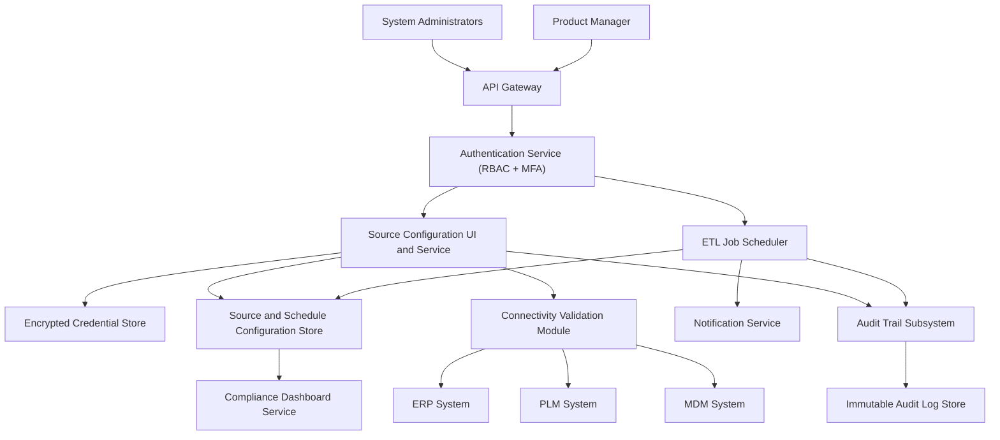

### Epic: QE-3206 - Release2-Data Source Configuration and ETL Job Scheduling

#### 1. High-Level Design

- Architecture Overview & Component Diagram:

- Component Descriptions:

  - **Source Configuration UI and Service**: Interface for configuring ERP/PLM/MDM connections and ETL schedules.
  - **Encrypted Credential Store**: Holds source credentials with AES-256.
  - **Connectivity Validation Module**: Tests source connections.
  - **ETL Job Scheduler**: Schedules jobs and integrates with notification and dashboard.
  - **Source and Schedule Configuration Store**: Stores connection and schedule metadata.
  - **Audit Trail Subsystem**: Logs configuration changes and scheduling actions.

- Integration Points & Data Flow:

  - **SRCMGR → CREDS/CFGSTORE**:
    - Persists secure credentials and configuration.
  - **CONNVAL → Sources**:
    - Validates connectivity.
  - **ETLSCHED → CFGSTORE/NOTIF**:
    - Uses configuration to schedule jobs and send notifications on execution results.
  - **AUD → LOGDB**:
    - Tracks who changed what and when.

- Security & Compliance Features:

  - AES-256 encryption for credentials and configuration.
  - TLS 1.3 for UI/API interactions.
  - RBAC/MFA ensuring only admins can modify sources and schedules.
  - Immutable logs for configuration changes.

- Resiliency & Error Handling:

  - Validation of configurations and clear error messages for misconfigurations.
  - Retries for connectivity checks.
  - Circuit breakers for unstable sources.

#### 2. Validation Report

- Requirements Coverage:

  - Multiple source system configuration: SRCMGR.
  - Connectivity validation: CONNVAL.
  - Encrypted credential storage: CREDS.
  - RBAC for source management: AUTH.
  - ETL job scheduling: ETLSCHED.
  - Metadata management: CFGSTORE.
  - Notification integration: NOTIF.
  - Support for incremental and full ETL job configuration: Configuration fields and schedule definitions.
  - NFRs (availability, ETL time, AES-256, RBAC/MFA, immutable logging, scalability, backups, DR, FDA 21 CFR Part 11, ALCOA+): Covered.

- Compliance Status:

  - Secure configuration and governance: Pass.
  - Audit readiness for configuration changes: Pass.

- Ambiguities/Risks:

  - Governance for who can approve new sources not explicitly detailed.
    - Mitigation: Implement approval workflows in SRCMGR and enforce via RBAC.
