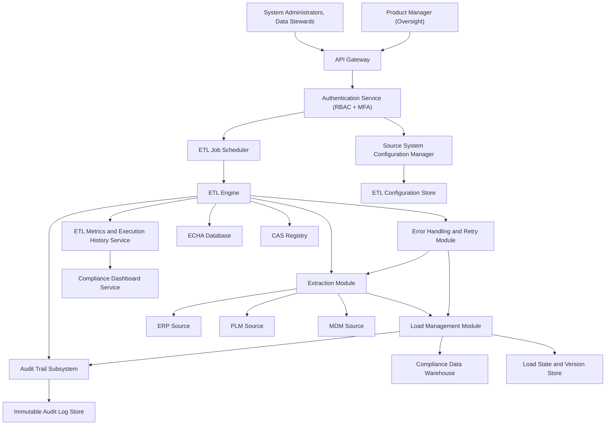

### Epic: QE-3207 - Release2-Automated Data Extraction and Load Management

#### 1. High-Level Design

- Architecture Overview & Component Diagram:

- Component Descriptions:

  - **Source System Configuration Manager**: Manages secure source configurations.
  - **ETL Job Scheduler**: Schedules incremental and full loads.
  - **ETL Engine**: Core extraction and loading orchestrator.
  - **Extraction Module**: Executes scheduled, incremental, and full extractions.
  - **Load Management Module**: Loads validated data into DW with versioning and integrity controls.
  - **Error Handling and Retry Module**: Implement retry and error management.
  - **ETL Metrics and Execution History Service**: Captures metrics and logs for monitoring.

- Integration Points & Data Flow:

  - **CFGSTORE → ETLSCHED/ETL**:
    - Configuration drives schedules and extraction parameters.
  - **ETL → EXTRACT→LOAD→DW/LOADDB**:
    - Data flows from sources to warehouse and load tracking.
  - **ETL/LOAD → AUD/METRICS**:
    - Execution history and load state recorded.

- Security & Compliance Features:

  - AES-256 encryption for CFGSTORE, DW, LOADDB, LOGDB.
  - TLS 1.3 for extraction channels where applicable.
  - RBAC for source configuration and scheduling.
  - Immutable logging for ETL operations.
  - Compliance with FDA 21 CFR Part 11 and ALCOA+.

- Resiliency & Error Handling:

  - Retries for source connectivity and load errors.
  - Circuit breakers around misbehaving sources.
  - Rollback support via LOADDB versioning.
  - Recovery within <30 minutes target.

#### 2. Validation Report

- Requirements Coverage:

  - Scheduled extraction, incremental and full loads: ETLSCHED + EXTRACT.
  - Retry mechanism and error handling: RETRY module.
  - Extraction metrics capture and execution history: METRICS.
  - Loading validated data: LOAD module.
  - Historical version maintenance and rollback: LOADDB.
  - Data lineage preservation: AUD and DW metadata.
  - NFRs (ETL <2 hours, scalability, availability, audit logging, backups, DR, AES-256, TLS): Covered.

- Compliance Status:

  - Operational reliability and traceability: Pass.
  - Audit readiness: Pass.

- Ambiguities/Risks:

  - Source system-specific nuances for incremental detection.
    - Mitigation: Source adapters with thorough mapping and metadata.
