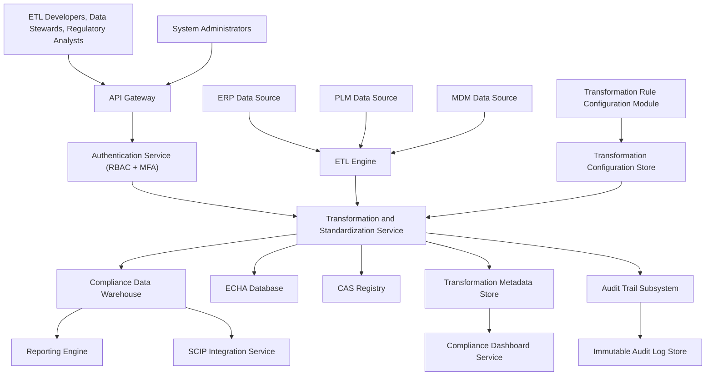

### Epic: QE-3208 - Release2-Data Transformation and Regulatory Standardization

#### 1. High-Level Design

- Architecture Overview & Component Diagram:

- Component Descriptions:

  - **Transformation and Standardization Service**: Converts raw data into EUMDR-ready formats, including mapping, unit conversion, normalization, classification, CAS validation, SVHC identification, and metadata preservation.
  - **Transformation Rule Configuration Module**: Manages rule sets and mappings.
  - **Transformation Metadata Store**: Records original values, mappings applied, and transformation lineage.
  - **ETL Engine**: Feeds extracted data to transformation service.
  - **Compliance Data Warehouse**: Stores transformed outputs.
  - **SCIP Integration Service / Reporting Engine**: Downstream consumers of standardized data.

- Integration Points & Data Flow:

  - **ETL → Transformation Service**:
    - Raw data passed for transformation.
  - **Transformation Service → DW/METADB**:
    - Transformed data to DW; metadata (rules used, source mapping) to METADB.
  - **Transformation Service → ECHADB/CASREG**:
    - Lookup of SVHC and CAS information.
  - **Transformation Service → Audit**:
    - Logs transformation actions and rule usage.
  - **METADB → Dashboard**:
    - Surfacing statistics on transformations and lineage.

- Security & Compliance Features:

  - AES-256 encryption for DW, METADB, CFGSTORE, LOGDB.
  - RBAC/MFA for configuration access.
  - Input validation on rule definitions and mapping configuration.
  - Immutable logs for transformation actions supporting data lineage.
  - ALCOA+ compliance via meticulous tracking of data changes.

- Resiliency & Error Handling:

  - Retries for external lookups.
  - Circuit breakers around ECHADB/CASREG.
  - Fallback using cached SVHC and CAS data with flags to revalidate later.

#### 2. Validation Report

- Requirements Coverage:

  - Source attribute mapping: RULECFG + TRANS.
  - Unit conversion: TRANS logic.
  - Data normalization: TRANS.
  - Substance classification: TRANS using ECHADB.
  - CAS number validation: TRANS using CASREG.
  - SVHC identification: TRANS via ECHADB.
  - Preservation of source metadata: METADB.
  - Configurable transformation rules: CFGSTORE and rule engine.
  - NFRs (ETL <2 hours, scalability, immutable logs, configurable rules, AES-256, RBAC/MFA, backups, FDA 21 CFR Part 11, ALCOA+): Covered.

- Compliance Status:

  - Data lineage and integrity: Pass.
  - Regulatory readiness for EUMDR reporting and SCIP submissions: Pass.

- Ambiguities/Risks:

  - Complexity of multi-jurisdiction transformations (REACH, RoHS beyond EUMDR).
    - Mitigation: Rule sets segmented by framework and jurisdiction.
