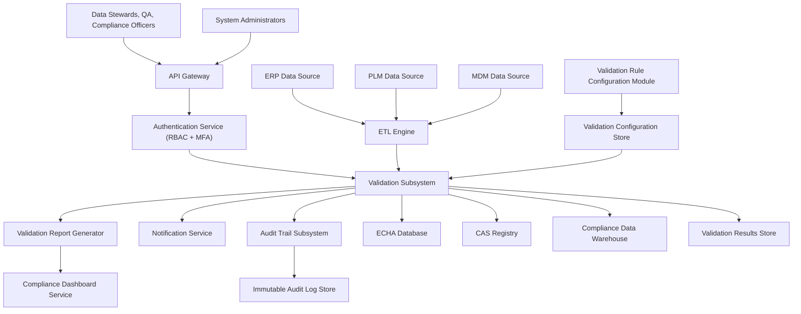

### Epic: QE-3209 - Release2-Data Validation and Quality Assurance for Restricted Substances

#### 1. High-Level Design

- Architecture Overview & Component Diagram:

- Component Descriptions:

  - **Validation Subsystem**: Executes mandatory fields, business rules, thresholds, consistency checks, duplicates, and completeness validation.
  - **Validation Rule Configuration Module**: Manages rules to adapt to regulatory changes.
  - **Validation Report Generator**: Produces structured validation reports.
  - **Validation Results Store**: Holds record-level validation outcomes and metrics.
  - **Compliance Data Warehouse**: Receives validated data.
  - **Notification Service**: Alerts on validation failures.
  - **Audit Trail Subsystem**: Logs validation operations and results.
  - **ERP/PLM/MDM/ECHA/CAS**: Source and reference systems.

- Integration Points & Data Flow:

  - **ETL → Validation Subsystem**:
    - ETL passes extracted data batches for validation.
  - **Validation Subsystem → VALDB/DW**:
    - Valid records flow to DW; invalid records and detailed results to VALDB.
  - **Validation Subsystem → VALREP/DASH**:
    - Aggregated validation reports consumed by dashboard.
  - **Validation Rule Configuration → CFGSTORE → Validation Subsystem**:
    - Rules read from CFGSTORE at runtime.
  - **Validation Subsystem → ECHADB/CASREG**:
    - Reference checks for thresholds and CAS numbers.
  - **Validation Subsystem → NOTIF/AUD**:
    - Alerts and audit logs recorded.

- Security & Compliance Features:

  - AES-256 for DW, VALDB, CFGSTORE, LOGDB.
  - RBAC/MFA for rule configuration access.
  - Input validation of rule definitions and reference data.
  - Immutable logging of validation runs and outcomes.
  - Compliance with FDA 21 CFR Part 11 and ALCOA+ via traceability and accuracy.

- Resiliency & Error Handling:

  - Retries for external reference lookups.
  - Circuit breakers for ECHADB and CASREG.
  - Fallback to cached reference data if external sources unavailable, with flags.

#### 2. Validation Report

- Requirements Coverage:

  - Mandatory field validation: Implemented in VALSYS.
  - Business rule validation: Implemented via rule engine.
  - Concentration threshold validation: Using ECHADB thresholds.
  - Cross-source consistency checks: Across ERP, PLM, MDM.
  - Duplicate detection: Validation logic.
  - Completeness validation: Rule-based checks.
  - Validation report generation: VALREP.
  - Rule configuration: RULECFG + CFGSTORE.
  - NFRs (ETL < 2 hours, accuracy ≥99.5%, immutable logging, configurable rules, RBAC/MFA, backups, FDA 21 CFR Part 11, ALCOA+): Addressed.

- Compliance Status:

  - Data quality and integrity: Pass.
  - Auditability: Pass.

- Ambiguities/Risks:

  - Interpretation of certain business rules could vary by region.
    - Mitigation: Rule metadata includes jurisdiction and applicability.
