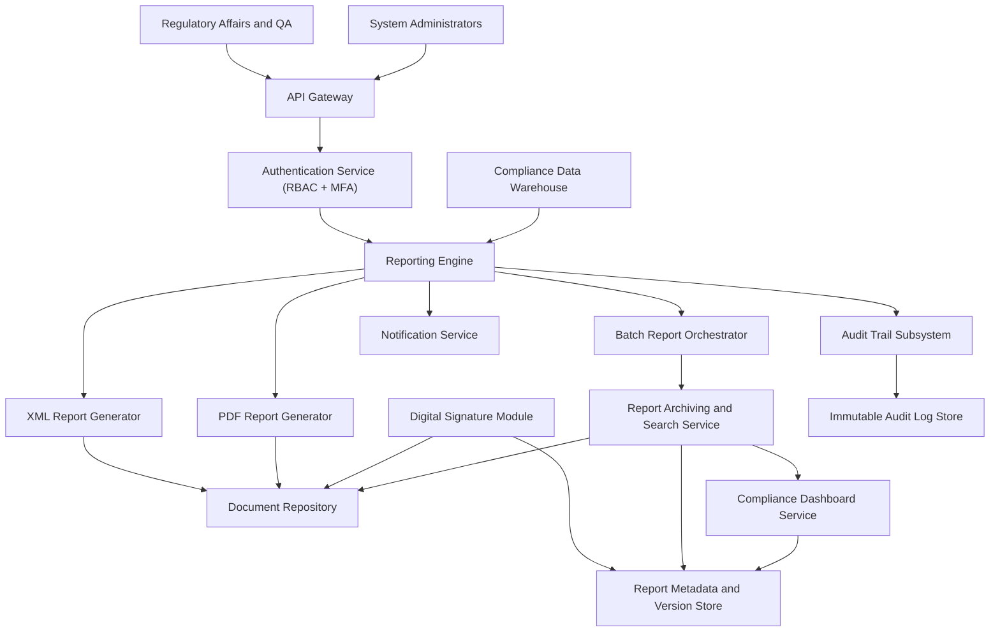

### Epic: QE-3210 - Release2-Regulatory Reporting and Document Management for EUMDR

#### 1. High-Level Design

- Architecture Overview & Component Diagram:

- Component Descriptions:

  - **Reporting Engine**: Orchestrates report generation based on regulatory templates (EUMDR).
  - **XML/PDF Generators**: Produce formatted XML and PDF documents.
  - **Digital Signature Module**: Applies signatures and maintains integrity metadata.
  - **Batch Report Orchestrator**: Schedules and manages batch report runs.
  - **Report Archiving and Search Service**: Stores reports with metadata and enables retrieval.
  - **Document Repository**: Central store for report artifacts.
  - **Report Metadata and Version Store**: Holds report versions and associated attributes.
  - **Audit Trail Subsystem**: Logs report generation and version changes.
  - **Dashboard**: Displays reporting status and KPIs.

- Integration Points & Data Flow:

  - **DW → Reporting Engine**:
    - Reporting engine consumes validated and standardized data.
  - **Reporting Engine → Generators**:
    - Requests generation of XML/PDF based on templates.
  - **Generators → Document Repository**:
    - Store generated documents securely.
  - **Digital Signature Module → DOCREP/REPDB**:
    - Applies signatures and records signature status.
  - **Batch Orchestrator → Archiving Service**:
    - Archiving service indexes and archives reports for historical retrieval.
  - **Archiving Service → Dashboard**:
    - Feeds pending and completed report counts and statuses.
  - **Reporting Engine → Notification Service**:
    - Sends completion and failure notifications.
  - **Reporting Engine → Audit Trail**:
    - Logs each generation run and outcome.

- Security & Compliance Features:

  - AES-256 encryption at rest for DOCREP and REPDB.
  - TLS 1.3 for access to reports.
  - RBAC ensuring only authorized roles can generate or view reports.
  - Immutable logging of report versions and accesses.
  - Compliance alignment with FDA 21 CFR Part 11 and ALCOA+.

- Resiliency & Error Handling:

  - Retries for batch job failures.
  - Circuit breakers around DW and DOCREP.
  - Fallback to partial batch or rescheduling when performance thresholds threatened.

#### 2. Validation Report

- Requirements Coverage:

  - XML report generation: XMLGEN.
  - PDF report generation: PDFGEN.
  - Digital signing: SIGNER.
  - Batch report generation: BATCH.
  - Historical report archiving: ARCH + DOCREP.
  - Report search and retrieval: ARCH with REPDB.
  - Report versioning: REPDB.
  - Integration with document repository: DOCREP.
  - NFRs around performance, encryption, immutability, availability, DR, compliance: Addressed.

- Compliance Status:

  - Data retention and integrity: Pass.
  - Auditability of reports: Pass.

- Ambiguities/Risks:

  - Exact EUMDR template variants not exhaustively enumerated.
    - Mitigation: Template-driven configuration and version control.
