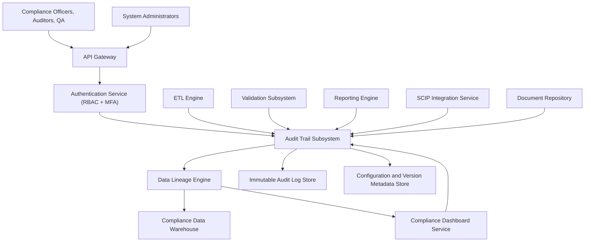

### Epic: QE-3211 - Release2-Comprehensive Audit Trail and Data Lineage

#### 1. High-Level Design

- Architecture Overview & Component Diagram:

- Component Descriptions:

  - **Audit Trail Subsystem**: Central component capturing all ETL activities, user actions, configuration changes, report generation, and submission history.
  - **Immutable Audit Log Store**: WORM-compliant store ensuring logs cannot be altered.
  - **Configuration and Version Metadata Store**: Tracks versions of configurations and relevant artifacts.
  - **Data Lineage Engine**: Builds and maintains lineage graphs across ETL, validation, reporting, and submissions.
  - **ETL / Validation / Reporting / SCIP / Dashboard / Document Repository**: Sources of audit events.

- Integration Points & Data Flow:

  - **All Systems → Audit Trail Subsystem**:
    - ETL, validation, reporting, SCIP, dashboard, and document repository emit structured events.
  - **Audit Trail Subsystem → LOGDB/META**:
    - Events written immutably with versioning and context.
  - **Data Lineage Engine → DW/DASH**:
    - Lineage information used by dashboard for drilling and investigations.

- Security & Compliance Features:

  - **Encryption**:
    - AES-256 at rest for LOGDB and META stores.
    - TLS 1.3 for all audit event ingestion.
  - **RBAC/MFA**:
    - Restricted access to audit viewing and export functions.
  - **Audit Integrity**:
    - Non-repudiation via signed events and tamper-evident storage.
  - **Compliance Mapping**:
    - Directly supports FDA 21 CFR Part 11 and ALCOA+.

- Resiliency & Error Handling:

  - **Durable Queues**:
    - Events buffered to ensure no loss during transient outages.
  - **Retries**:
    - Event ingestion retried for storage failures.
  - **Circuit Breakers**:
    - Protect core systems from audit subsystem failures; use buffering.

#### 2. Validation Report

- Requirements Coverage:

  - Capture ETL execution logs: ETL emits to AUDSYS.
  - Record user actions: Dashboard and admin modules emit events.
  - Log configuration changes: Metadata store records versions.
  - Track report generation events: Reporting engine emits events.
  - Record submission history: SCIP emits detailed events.
  - Maintain immutable audit records: LOGDB is WORM-style.
  - Version history for configurations: META manages versions.
  - Audit log search and retrieval: Lineage and dashboard enable query.
  - NFRs (immutability, completeness, performance, availability, AES-256, RBAC, backups, DR, FDA 21 CFR Part 11, ALCOA+): Addressed.

- Compliance Status:

  - Data retention, data integrity, auditability: Pass.
  - Consent and privacy: Pass given enterprise policies on operational auditing.

- Ambiguities/Risks:

  - Exact search capabilities and retention periods unspecified.
    - Mitigation: Parameterize retention and indexing strategies.
