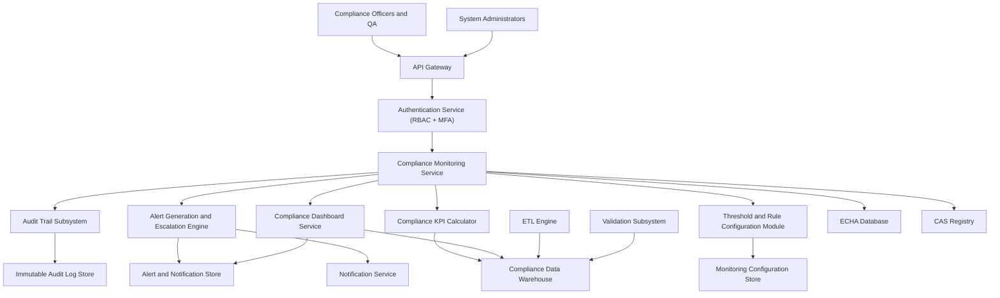

### Epic: QE-3212 - Release2-Compliance Monitoring, Threshold Alerts, and Notifications

#### 1. High-Level Design

- Architecture Overview & Component Diagram:

- Component Descriptions:

  - **Compliance Monitoring Service**: Continuously evaluates restricted substance data against thresholds and compliance rules.
  - **Threshold and Rule Configuration Module**: Allows authorized users to configure and manage compliance thresholds and alert rules.
  - **Alert Generation and Escalation Engine**: Creates alerts and manages escalation workflows.
  - **Compliance KPI Calculator**: Computes compliance KPIs and aggregates them for dashboard display.
  - **Notification Service**: Sends alerts via email or other channels.
  - **Compliance Dashboard Service**: Displays alert status and compliance KPIs.
  - **Alert and Notification Store**: Holds alert records, statuses, acknowledgements, and resolutions.
  - **Audit Trail Subsystem**: Logs monitoring events and alert lifecycles.
  - **Compliance Data Warehouse**: Holds validated restricted substances data used for monitoring.
  - **ECHA Database / CAS Registry**: Provide reference data and regulatory thresholds.

- Integration Points & Data Flow:

  - **DW/ECHADB/CASREG → Compliance Monitoring Service**:
    - Monitoring queries concentration values and threshold definitions.
  - **Monitoring Service → Alert Engine**:
    - Violations produce alerts with contextual data.
  - **Alert Engine → Notification Service**:
    - Sends notifications to stakeholders based on severity and escalation policies.
  - **Alert Engine → ALERTDB/AUD**:
    - Logs alert creation, updates, acknowledgements, and resolution.
  - **Monitoring Service → KPI Calculator → DW**:
    - KPI calculator writes aggregated metrics to DW for dashboard consumption.
  - **Monitoring Service → Dashboard**:
    - Feeds dashboard with current alert status and compliance KPIs.
  - **Threshold Configuration Module → CFGSTORE**:
    - Stores threshold definitions and workflow configurations; changes audited.

- Security & Compliance Features:

  - **Encryption**:
    - AES-256 for DW, ALERTDB, CFGSTORE, LOGDB.
    - TLS 1.3 for dashboard and API calls.
  - **RBAC/MFA**:
    - Only designated roles can edit thresholds and escalation configurations.
    - Alert viewing restricted based on role and jurisdiction.
  - **Input Validation**:
    - Threshold values and rules validated for logical consistency (no negative limits, appropriate units).
  - **Output Filtering**:
    - Alert content sanitized before notification to prevent injection.
  - **Audit Logging**:
    - All threshold changes, alert events, notifications, and acknowledgements logged immutably.
  - **Compliance Mapping**:
    - Supports proactive risk management for EUMDR and related frameworks.
    - Meets FDA 21 CFR Part 11 and ALCOA+ via immutable logs and traceable actions.

- Resiliency & Error Handling:

  - **Retries**:
    - Retry notification delivery when channels are temporarily unavailable.
  - **Circuit Breakers**:
    - Protect monitoring service from overload if downstream systems (DW, ECHADB) fail.
  - **Fallbacks**:
    - If dashboard is unavailable, alerts still logged and sent via notifications.
  - **Alert SLA Monitoring**:
    - Track response times to ensure <15 minute SLA; escalate if not achieved.

#### 2. Validation Report

- Requirements Coverage:

  - Threshold monitoring: Implemented via Monitoring Service against DW and reference data.
  - Alert generation on violations: ALERT engine creates alerts.
  - Escalation workflows: Configurable workflows in RULES.
  - Notification delivery: Via Notification Service.
  - Alert acknowledgement tracking: ALERTDB records acknowledgements.
  - Alert resolution tracking: ALERTDB and audit logs record resolutions.
  - Compliance KPI computation: KPI module calculates metrics.
  - Dashboard visualization: DASH shows alerts and KPIs.
  - NFRs (99.9% availability, scalability to millions of records, immutable logs, RBAC/MFA, AES-256, DR RPO 30 minutes): Covered via architecture and infra design.

- Compliance Status:

  - **Data Retention**: Alert histories retained per regulatory and audit needs; status: Pass.
  - **Consent Management**: Alert content typically operational; user data used under organizational policies; status: Pass with dependency.
  - **Data Lineage**: Each alert linked to underlying data and thresholds; status: Pass.
  - **Compliance Reporting**: Alert histories support audit evidence and compliance monitoring; status: Pass.

- Identified Ambiguities/Risks:

  - Escalation chain details (roles and timelines) not fully specified.
    - Mitigation: Configurable escalation hierarchies documented per organization.
  - Handling alert storms (too many alerts).
    - Mitigation: Rate-limiting, aggregation, grouping in ALERT engine.
