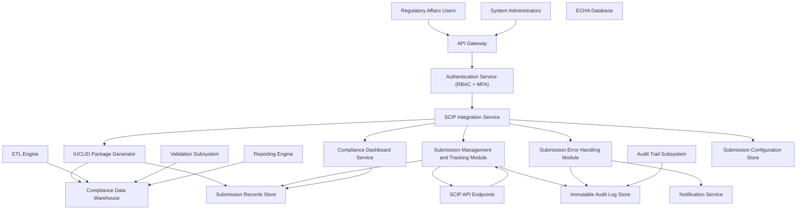

### Epic: QE-3213 - Release2-SCIP Integration and IUCLID Submission Management

#### 1. High-Level Design

- Architecture Overview & Component Diagram:

- Component Descriptions:

  - **SCIP Integration Service**: Central orchestrator for IUCLID generation, API-based submissions, status monitoring, and tracking.
  - **IUCLID Package Generator**: Builds compliant IUCLID XML packages from validated data in DW.
  - **Submission Management and Tracking Module**: Handles submission lifecycle, status polling, and storage of acknowledgements and confirmation numbers.
  - **Submission Error Handling Module**: Identifies failed submissions, triggers retries, and routes alerts.
  - **Compliance Dashboard Service**: Displays submission status and metrics.
  - **ETL Engine / Validation Subsystem / Reporting Engine**: Provide source data for IUCLID packages.
  - **Notification Service**: Sends alerts for submission failures, retries, and critical states.
  - **Audit Trail Subsystem**: Captures all submission events.
  - **Submission Records Store**: AES-256-encrypted store for submissions, responses, acknowledgements, and confirmation numbers.
  - **Submission Configuration Store**: Holds endpoints, mapping rules, and retry policies.
  - **SCIP API Endpoints / ECHA Database**: External regulatory systems used for submissions and reference data.

- Integration Points & Data Flow:

  - **DW → IUCLID Package Generator**:
    - Generator extracts validated restricted substance data and builds IUCLID packages.
  - **IUCLID Package Generator → Submission Records Store**:
    - Stores generated packages, version information, and metadata.
  - **Submission Management → SCIP API**:
    - Sends packages via secure API, receives responses, and stores confirmations.
    - Implements retry logic and backoff for transient failures.
  - **Submission Management → LOGDB/AUD**:
    - Logs submission attempts, statuses, and confirmations immutably.
  - **Submission Error Handling → Notification Service**:
    - Sends alerts for failed submissions and unrecoverable errors.
  - **SCIP Integration Service → Dashboard**:
    - Pushes submission statuses into dashboard views.
  - **Authentication Service → SCIP Integration Service**:
    - Ensures only authorized roles can initiate or manage submissions.

- Security & Compliance Features:

  - **Encryption & Transmission**:
    - TLS 1.3 for all calls to SCIP API.
    - AES-256 encryption for submission packages, responses, and acknowledgements in SUBDB.
  - **RBAC/ABAC**:
    - Only Regulatory Affairs and designated admins can initiate or modify submissions.
    - Attribute-based checks (e.g., regulatory jurisdiction) ensure appropriate routing.
  - **Input Validation**:
    - IUCLID generator validates required fields, formats, and business rules before package generation.
  - **Output Filtering**:
    - SPI responses are parsed securely; any embedded untrusted content is sanitized.
  - **Audit Logging**:
    - Every submission, retry, acknowledgment, status change logged with full context.
    - Logs support FDA 21 CFR Part 11 and ALCOA+.
  - **Secrets Management**:
    - API credentials and certificates for SCIP are managed in a secrets vault.
    - Rotation policies enforced.

- Resiliency & Error Handling:

  - **Retries**:
    - Automatic retries on transient SCIP API failures with exponential backoff.
  - **Circuit Breakers**:
    - Circuit breaker on SCIP API integration to protect platform during outages.
  - **Fallbacks**:
    - If SCIP is unavailable, submissions are queued for later processing.
  - **Error Classification**:
    - Distinguish between validation errors (data issues) and transport errors (API/network).
    - Validation errors result in user-facing remediation tasks, not retries.
  - **Logging**:
    - Detailed error logs stored in LOGDB for investigation.

#### 2. Validation Report

- Requirements Coverage:

  - IUCLID package generation: Implemented via IUCLID Package Generator using DW data.
  - API-based SCIP submission: Implemented via Submission Management module.
  - Submission tracking: SUBDB and dashboard views handle status tracking.
  - Status monitoring: Periodic polling of SCIP API and dashboards.
  - Error handling for failed submissions: ERRHDL module plus retry logic.
  - Capture acknowledgements: Stored in SUBDB tied to submission records.
  - Storage of confirmation numbers: Persisted and linked to submissions.
  - Integration of submission status into dashboards: SCIPINT → DASH.
  - NFRs (99.9% availability, 100% submission success target, AES-256, RBAC, backups, DR, immutable logs, FDA 21 CFR Part 11, ALCOA+): Addressed through architecture, logging, and DR plans.

- Compliance Status:

  - **Data Retention**: Submission records stored per regulatory retention requirements; status: Pass.
  - **Consent Management**: Submissions performed under organizational regulatory mandate; regard to data privacy relies on upstream consent; status: Pass with dependency.
  - **Data Lineage**: Submissions trace back to specific ETL runs and validated datasets; status: Pass.
  - **Compliance Reporting**: Complete submission histories and acknowledgements support audits; status: Pass.

- Identified Ambiguities/Risks:

  - Exact polling interval and long-term storage format for submissions not fully specified.
    - Mitigation: Configuration-driven polling and retention policies; documented in CFGSTORE.
  - Handling partial failures (e.g., some records within a package rejected).
    - Mitigation: Detailed error parsing and remediation workflows integrated with validation subsystem.
  - Regulatory changes to SCIP schemas.
    - Mitigation: Configurable mapping and schema versioning in IUCLID generator.
