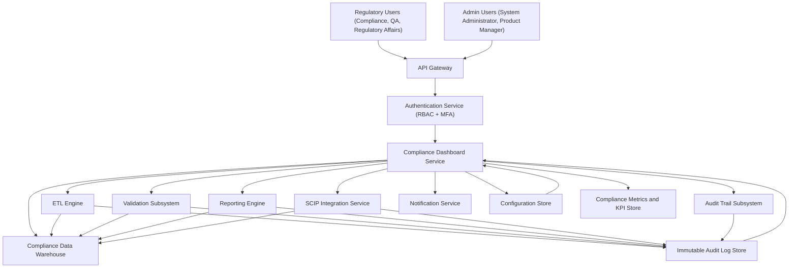

### Epic: QE-3214 - Release2-Regulatory Compliance Dashboard and Operational KPIs

#### 1. High-Level Design

- Architecture Overview & Component Diagram:

- Component Descriptions:

  - **API Gateway**: Front-door for all dashboard requests; enforces TLS 1.3, request routing, throttling, and basic API protection.
  - **Authentication Service**: Provides RBAC with MFA, token issuance, and session management for dashboard users.
  - **Compliance Dashboard Service**: UI and backend that aggregates ETL job status, failures, validation errors, compliance scores, threshold violations, submission status, pending reports, and audit summaries.
  - **ETL Engine**: Produces job status, execution metrics, and failure events consumed by the dashboard.
  - **Validation Subsystem**: Supplies validation error counts, quality metrics, and rule-level summaries.
  - **Reporting Engine**: Provides reporting status, pending and completed reports, and KPIs.
  - **SCIP Integration Service**: Supplies submission status, acknowledgements, and confirmation numbers.
  - **Audit Trail Subsystem**: Generates immutable audit records; dashboard reads summaries and trends.
  - **Notification Service**: Sends alerts on failed jobs, threshold violations, and compliance degradations.
  - **Configuration Store**: Maintains dashboard configuration (widgets, thresholds, filters) with strict access control.
  - **Compliance Metrics and KPI Store**: Aggregated metrics for compliance scores, KPIs, and trend analysis.
  - **Immutable Audit Log Store**: WORM-style store for all dashboard interactions and underlying ETL/audit events.
  - **Compliance Data Warehouse**: Centralized repository for ETL outputs, validation results, and reporting data.

- Integration Points & Data Flow:

  - **ETL Engine → Dashboard**: ETL publishes job execution status, failure flags, runtime metrics to METRICDB and LOGDB; dashboard queries for:
    - ETL job status
    - Failed jobs
    - Execution history
  - **Validation Subsystem → Dashboard**: Validation writes errors and quality metrics to DW and LOGDB; dashboard surfaces:
    - Validation errors by job, rule, and source
    - Data quality KPIs
  - **Reporting Engine → Dashboard**: Reporting status and pending reports stored in METRICDB and LOGDB; dashboard shows:
    - Pending reports
    - Report generation KPIs
    - Completion trends
  - **SCIP Integration Service → Dashboard**: Submission statuses, acknowledgements, confirmation numbers stored in DW and LOGDB; dashboard shows:
    - Submission status tracking
    - Failed submission alerts
  - **Audit Trail Subsystem → Dashboard**: Audit summaries and trends stored in LOGDB; dashboard shows:
    - Audit log summary views
    - Drill-down to detailed logs
  - **Dashboard → Notification Service**: On threshold violations or failures, dashboard triggers notifications and escalations.
  - **Dashboard → Authentication Service**: Each user request is authenticated and authorized, with MFA and role checks.
  - **Dashboard → Configuration Store**: Config read/write for dashboards, filters, thresholds; all changes audited.

- Security & Compliance Features:

  - **Encryption (AES-256/TLS 1.3)**:
    - All UI and API calls go through TLS 1.3.
    - METRICDB, DW, LOGDB, CFGSTORE use AES-256 at rest.
  - **RBAC/ABAC**:
    - Role-based access: Compliance Officers see full KPIs and audit summaries; others see scoped views.
    - Attribute-based filters (e.g., region, product line) applied per user attributes to limit data exposure.
  - **Input Validation & Output Filtering**:
    - Query parameters for filters and drill-down are validated (type, range, allowed values).
    - Output from underlying systems is sanitized to avoid injection in UI.
    - Pagination and rate limits prevent data exfiltration via bulk exports.
  - **Audit Logging**:
    - Every dashboard access, filter change, report drill-down, and configuration change is logged with user, timestamp, and context.
    - Logs comply with FDA 21 CFR Part 11 and ALCOA+ (attributable, legible, contemporaneous, original, accurate).
  - **Secrets Management**:
    - Service credentials for backend integrations stored in a secure secrets vault.
    - Rotation and versioning of secrets; access limited to dashboard service identities.
  - **Compliance Mapping**:
    - EUMDR: Operational KPIs and submission status visibility support audit readiness.
    - FDA 21 CFR Part 11: Secure access control, tamper-evident logs, and auditability.
    - ALCOA+: Dashboard data sourced only from immutable logs and compliant stores.

- Resiliency & Error Handling:

  - **Circuit Breakers**:
    - Dashboard service employs circuit breakers when querying ETL, validation, reporting, SCIP, and audit subsystems to avoid cascading failures.
  - **Retries**:
    - Transient read failures from METRICDB, DW, LOGDB are retried with backoff.
  - **Graceful Degradation**:
    - If a subsystem is unavailable, dashboard shows partial data with clear indicators and guidance.
  - **Fallback Patterns**:
    - Dashboard uses cached metrics for read-only views when live queries fail.
  - **Logging & Monitoring**:
    - All dashboard errors logged immutably in LOGDB.
    - Health checks and metrics for dashboard latency and availability.

#### 2. Validation Report

- Requirements Coverage:

  - ETL job status: Represented in dashboard via ETL integration and METRICDB.
  - Failed ETL jobs: Surfaced from ETL and LOGDB.
  - Validation errors: Derived from validation subsystem and DW.
  - Compliance score visualization: Calculated in METRICDB, displayed in dashboard.
  - Threshold violation views: From compliance monitoring and LOGDB.
  - Submission status tracking: From SCIP integration and DW.
  - Pending report listing: From reporting engine and METRICDB.
  - Audit log summary views: From audit subsystem and LOGDB.
  - Drill-down navigation: Implemented via dashboard interactions with DW and LOGDB.
  - NFRs (99.9% availability, secure/RBAC, AES-256, immutable logs, backups, disaster recovery, FDA 21 CFR Part 11, ALCOA+): Addressed via architecture, security, logging, and DR considerations.

- Compliance Status:

  - **Data Retention**: Dashboard uses underlying data retention policies from DW/LOGDB with configurable retention for metrics and summaries; status: Pass.
  - **Consent Management**: User access and data visibility bounded by RBAC/ABAC, leveraging enterprise consent frameworks; status: Pass (assuming upstream identity and consent systems are in place).
  - **Data Lineage**: Each metric and visualization traceable back to ETL jobs, validation results, and audit logs; status: Pass.
  - **Compliance Reporting**: Dashboard surfaces KPIs and statuses to support reporting and audits rather than generating reports itself; status: Pass.

- Identified Ambiguities/Risks:

  - Granularity of compliance scores (per product, per batch, per region) not explicitly defined.
    - Mitigation: Configuration-driven KPI definitions with documented lineage.
  - No explicit retention period for dashboard configuration and metric snapshots.
    - Mitigation: Align configuration and metrics retention to enterprise policies and EUMDR/Audit needs.
  - Performance impact of querying large audit datasets for summaries.
    - Mitigation: Pre-aggregations and index strategy; batch computation of KPIs.
