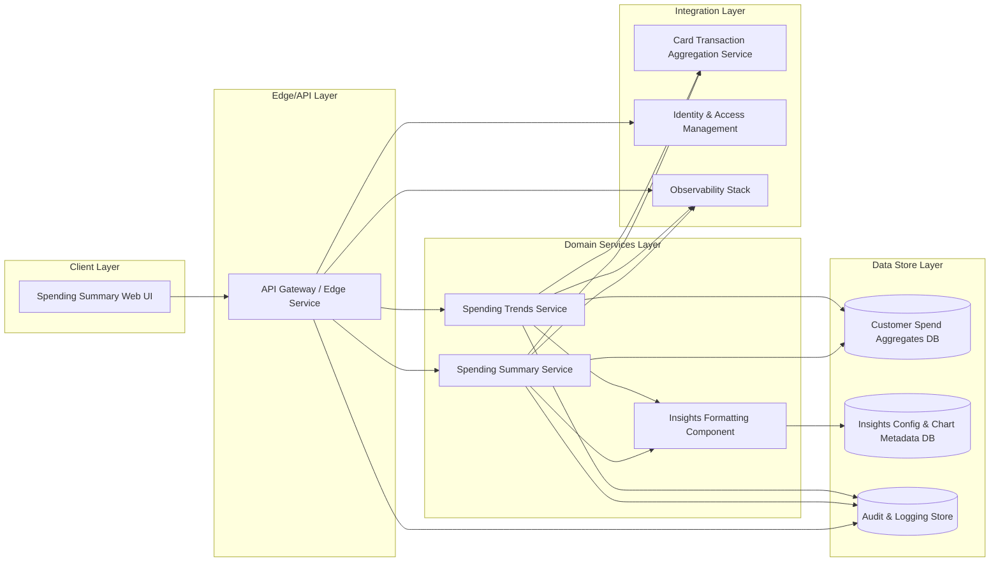

# High-Level Design (HLD) – QE-3250 – Spending Summary Dashboard

## 1. Architecture Overview

The Spending Summary Dashboard is a web-based application enabling credit card customers to view monthly and 6‑month spending summaries, analyze trends, and consume visual insights via summary cards and charts. The solution is implemented as a secure, scalable microservice-aligned web application.

### 1.1 Logical Architecture Layers

1. **Client Layer (Presentation)**  
   - Browser-based single-page application (SPA) built using a modern framework (e.g., React, Angular, or Vue).  
   - Provides dashboards, charts, and summary cards for monthly and 6‑month spending views.  
   - Includes UX controls for month selection and displaying spend visualizations.

2. **Edge/API Layer**  
   - API Gateway / Edge service terminating TLS, performing request routing, authentication, authorization, rate limiting, and basic input validation.  
   - Exposes RESTful/JSON APIs for:  
     - Monthly spending summary retrieval.  
     - 6‑month spending trend retrieval.  
     - Spending insights metadata and chart configuration.

3. **Domain Services Layer**  
   - **Spending Summary Service**: Calculates monthly spending summaries, total spend, counts of transactions, and other KPIs for credit card accounts.  
   - **Spending Trends Service**: Aggregates and returns 6‑month trend data for visualization (e.g., month‑wise totals).  
   - **Insights Formatting Service** (may be a logical component within the above services): Produces data structures optimized for UI rendering (cards, charts, labels) without exposing PII or transaction details.

4. **Data Store Layer**  
   - **Customer Spend Data Store (Read‑Optimized)**:  
     - Relational or columnar store containing aggregated spend metrics per customer, per month, restricted to credit card products.  
     - Stores only derived/aggregated financial metrics and keyed references, not raw transaction narratives or unnecessary PII.  
   - **Reference / Configuration Store**:  
     - Holds chart configuration, thresholds for insights, and feature toggles.  
   - **Audit & Logs Store**:  
     - Centralized logging and audit store for security and compliance events.

5. **Integration Layer**  
   - **Card Transaction Aggregation Service (Upstream)**: Internal system that provides aggregated spend totals per customer and per month (this HLD consumes aggregated outputs only, not raw transaction details).  
   - **Identity and Access Management (IAM)**: Provides authentication tokens and authorization assertions (e.g., OAuth2 / OIDC).  
   - **Observability Stack**: Central logging, metrics, and tracing for all services.

6. **Cross‑Cutting Concerns**  
   - **Security**: TLS, token validation, RBAC, secrets management.  
   - **Compliance**: Treatment of financial data in line with internal security policies; no PCI card numbers or sensitive authentication data exposed to UI.  
   - **Resiliency**: Circuit breakers, retries, and graceful degradation of non‑critical insights.  
   - **Monitoring & Telemetry**: Dashboards and alerts on latency, error rates, and data freshness.

### 1.2 Mermaid Component Diagram

## 2. Component Descriptions

### 2.1 Spending Summary Web UI (Client Layer)
- Provides a personalized dashboard for authenticated credit card customers to view spending summaries.  
- Renders monthly total spend, transaction count, and other summary KPIs using cards and charts.  
- Displays 6‑month trend visualizations using charts such as line or bar graphs.  
- Includes interactive controls to select a month and trigger data retrieval via API calls.  
- Implements client-side input validation for month selection and basic filtering (e.g., preventing invalid date ranges).  
- Explicitly limited to **credit card products only**; product filters and labels clearly indicate that non‑card products are not represented.

### 2.2 API Gateway / Edge Service
- Terminates TLS for all external browser traffic.  
- Performs authentication via IAM integration (e.g., validating OIDC tokens).  
- Applies authorization checks to ensure a user can only view their own aggregated spend data.  
- Implements coarse‑grained RBAC (e.g., customer user vs. support user) if applicable; only customer persona is considered in this epic.  
- Performs schema-level validation for incoming requests (e.g., month parameter validation, preventing malformed inputs).  
- Routes requests to Spending Summary Service and Spending Trends Service.  
- Enforces rate limiting and basic request throttling to protect backend services.  
- Logs API calls with anonymized identifiers and stores audit logs in Audit & Logging Store.

### 2.3 Spending Summary Service
- Exposes APIs to return monthly spending summaries for an authenticated customer.  
- Computes and retrieves metrics such as total monthly spend and number of transactions from aggregated data, ensuring only credit card‑related aggregates are used.  
- Ensures that only aggregate metrics (totals, counts) are returned; no transaction‑level detail in this epic.  
- Applies business rules for monthly summaries, including handling months with no transactions.  
- Offloads data formatting to Insights Formatting Component to avoid UI-specific logic in backend business services.  
- Integrates with Card Transaction Aggregation Service to fetch or refresh aggregated metrics where the local data store is not yet populated.  
- Writes operational and audit logs for each response including non‑PII identifiers (e.g., hashed customer ID or account reference).

### 2.4 Spending Trends Service
- Exposes APIs delivering spending trend data over the last 6 months for an authenticated customer.  
- Retrieves and aggregates month-wise totals from Customer Spend Aggregates DB.  
- Ensures data for exactly the last 6 months relative to a business‑defined reference date (e.g., current statement cycle or calendar month).  
- Deals gracefully with gaps (e.g., months with zero activity).  
- Restricts outputs to aggregated monthly metrics without transaction-level details.  
- Delegates data shaping to Insights Formatting Component to output chart-ready structures.  
- Logs each trend request and response with anonymized identifiers and stores relevant entries in Audit & Logging Store.

### 2.5 Insights Formatting Component
- Receives processed aggregate data from Spending Summary and Spending Trends services.  
- Transforms domain metrics into UI‑ready JSON structures, including summary cards (labels, numeric metrics, basic categories) and chart series.  
- Encapsulates display logic such as mapping metrics to chart types and applying configuration from ConfigDB.  
- Masks or omits any attributes that could expose PII or sensitive details; only aggregated numeric values and generic categorizations are delivered.  
- Applies feature toggles and thresholds (e.g., highlight high spending months) from ConfigDB.  
- Returns standardized response formats enabling downstream SPA development without further backend change.

### 2.6 Customer Spend Aggregates DB
- Stores aggregated spending metrics per customer and per month, limited to credit card products.  
- Schema example (conceptual, no sample values):  
  - Customer
domain identifier (e.g., hashed customer ID).  
  - Account reference (non‑card number identifier).  
  - Month key (e.g., YYYY‑MM).  
  - Total spend amount.  
  - Transaction count.  
  - Derived insights metrics (e.g., category breakdown percentages if used).  
- Excludes primary account numbers (PANs), expiration dates, CVV, and cardholder names to avoid PCI/PII exposure.  
- Acts as a read‑optimized store; any heavy aggregation is performed upstream in Card Transaction Aggregation Service or ETL pipelines.

### 2.7 Insights Config & Chart Metadata DB
- Stores configuration for chart types, labels, color palettes, and threshold values used by the Insights Formatting Component.  
- Contains feature toggle flags to enable or disable specific dashboard widgets without redeploying services.  
- Holds localization keys or references (no localized content values tied to PII).  
- Provides non‑critical reference data; if unavailable, default configurations are used for graceful degradation.

### 2.8 Audit & Logging Store
- Central store for structured logs and audit records from API Gateway and domain services.  
- Captures who accessed which dashboard feature, when, and from which client context (device type or application version, represented without unique device identifiers).  
- Retains logs per organizational policy for compliance and forensic analysis.  
- Supports querying for anomalies such as unusual access patterns or repeated errors.  
- Does not store transaction content or raw financial data; only high‑level access and operational details.

### 2.9 Card Transaction Aggregation Service
- Upstream internal service that aggregates credit card transactions into monthly and multi‑month metrics.  
- Provides APIs or scheduled feeds for per‑customer monthly totals and transaction counts.  
- Responsible for PCI-sensitive handling at the transaction and card level; this HLD assumes its interfaces expose only aggregated metrics and non‑card identifiers.  
- Acts as the source of truth for financial aggregates consumed by Spending Summary and Spending Trends services.

### 2.10 Identity & Access Management (IAM)
- Central authentication provider offering OAuth2/OIDC-based tokens.  
- Manages customer identities and authentication flows, including multi-factor authentication according to enterprise security policy.  
- Issues short‑lived access tokens scoped appropriately for dashboard access.  
- Provides token introspection or signing keys used by API Gateway to validate access tokens.

### 2.11 Observability Stack
- Aggregates application metrics, logs, and traces from API Gateway and domain services.  
- Provides dashboards for monitoring latency, error rates, and throughput of dashboard operations.  
- Supports alerts for SLA breaches (e.g., API latency, error spikes, data freshness issues).  
- Stores no PII; telemetry is keyed with non‑identifying technical IDs where needed.

## 3. Integration Points & Data Flows

Each scope item is mapped to one or more flows below.

### Flow 1 – Authentication & Session Establishment
1. Customer navigates to the Spending Summary Dashboard URL in the browser.  
2. Web UI redirects to IAM or initiates an authentication flow (e.g., OIDC code flow).  
3. IAM authenticates the customer and issues an access token back to the Web UI.  
4. Web UI includes the token in subsequent API calls to the API Gateway.  
5. API Gateway validates the token (signature, expiry, scopes) using IAM configuration.  
6. On successful validation, a secure session context is established for subsequent spending summary and trends calls.

### Flow 2 – Monthly Spending Summary Retrieval
1. Customer selects a specific month from the UI control or accepts the default (current month).  
2. Web UI validates the selected month client-side (basic sanity checks) and sends a `GET /spending-summary?month=YYYY-MM` request to API Gateway with the access token.  
3. API Gateway performs:  
   - TLS termination.  
   - Input validation for the month parameter.  
   - Authorization checks to determine the customer ID associated with the token.  
   - Routing to Spending Summary Service.
4. Spending Summary Service resolves the customer identifier, queries Customer Spend Aggregates DB for the given month and credit card product(s).  
5. If aggregated data exists:  
   - Spending Summary Service calculates key metrics (monthly total, transaction count, and any derived KPIs).  
6. If aggregated data is missing or stale:  
   - Spending Summary Service calls Card Transaction Aggregation Service to refresh metrics, and then updates or reads from Customer Spend Aggregates DB as per internal policy.  
7. Spending Summary Service passes the aggregated metrics to Insights Formatting Component.  
8. Insights Formatting Component formats the data into UI‑ready JSON for summary cards and charts (no transaction detail).  
9. Spending Summary Service returns the formatted response to API Gateway, which logs the operation and sends the response to the Web UI.  
10. Web UI renders monthly spending summary cards and charts for the selected month.

Covers scope:  
- Monthly spending summary with key metrics.  
- Month-wise spend visualization for trend analysis (single month perspective).  
- Month selection and corresponding summary view.

### Flow 3 – 6‑Month Spending Trends Retrieval
1. On dashboard load or when the customer navigates to the trends section, Web UI issues `GET /spending-trends?range=6m` to API Gateway with the access token.  
2. API Gateway validates the token and request parameters, then routes to Spending Trends Service.  
3. Spending Trends Service queries Customer Spend Aggregates DB for the last 6 months of data associated with the customer’s credit card account(s).  
4. Spending Trends Service calculates month-wise totals and constructs a sequence of 6 monthly data points, including handling missing months by explicitly returning zero or no-activity markers.  
5. Spending Trends Service passes aggregated data to Insights Formatting Component.  
6. Insights Formatting Component applies configuration (chart type, labels, thresholds) from ConfigDB and creates chart‑ready data structures (e.g., series arrays per month).  
7. Spending Trends Service returns formatted trend data to API Gateway.  
8. API Gateway logs the request, sends the response to Web UI.  
9. Web UI renders a 6‑month trend chart and any associated visual indicators or summary cards.

Covers scope:  
- Overall spending trends for the last 6 months.  
- Month-wise spend visualizations for trend analysis.  
- Display spending insights using summary cards and charts.

### Flow 4 – Insights & Visualization Configuration
1. On initial dashboard load, Web UI requests configuration metadata via a dedicated API endpoint or embedded configuration.  
2. API Gateway routes configuration requests to Spending Summary Service or an auxiliary configuration endpoint.  
3. The service queries ConfigDB for current chart metadata, thresholds for highlighting spending patterns, and feature toggles.  
4. The service returns configuration data to Web UI via API Gateway.  
5. Web UI uses configuration to render summary cards, charts, and insights consistent with enterprise UX guidelines.

Covers scope:  
- Display spending insights using summary cards and charts.

### Flow 5 – Observability & Audit
1. For each API call (authentication, monthly summary, trends, configuration), API Gateway logs request metadata (method, path, anonymized subject ID, timestamp, outcome).  
2. Spending Summary and Spending Trends services emit structured logs and metrics to Observability Stack, including latency, success/failure counts, and data freshness metrics.  
3. Audit & Logging Store persists security- and access-related events per policy (e.g., successful and failed dashboard access, abnormal usage spikes).  
4. Operations and security teams use observability dashboards and alerts for incident response and performance tuning.

Covers scope:  
- End-to-end support for delivering spending insights in a monitored, auditable fashion.

## 4. Security & Compliance Features

### 4.1 Transport Security
- All client-to-edge communication is secured via HTTPS with modern TLS versions and strong cipher suites.  
- HSTS may be enabled to enforce HTTPS usage.  
- Mutual TLS is optionally used for internal communication between API Gateway and backend services.

### 4.2 Data Encryption
- At Rest:  
  - Customer Spend Aggregates DB is encrypted at rest using enterprise-standard encryption (e.g., AES-256) managed via the organization’s key management system.  
  - ConfigDB and Audit & Logging Store are similarly encrypted at rest.  
- In Transit:  
  - All service-to-service communication inside the data center or cloud environment is protected via TLS.

### 4.3 Input Validation & Output Filtering
- Edge layer validates query parameters (e.g., month, range) against strict formats to prevent injection and misuse.  
- Domain services validate contextual business rules (e.g., allowable ranges for months, ensuring 6‑month window constraints).  
- Output filtering ensures only aggregated metrics and non-sensitive identifiers are returned to the client.  
- API responses use whitelist-based serialization to prevent accidental leakage of internal fields.

### 4.4 RBAC / ABAC
- RBAC enforces that only authenticated customers can access their own spending dashboards.  
- Authorization checks use attributes from IAM tokens (subject ID, roles, scopes) to bind requests to the correct non‑card account identifiers.  
- Administrative or support access to Customer Spend Aggregates DB is controlled via enterprise RBAC with least privilege.

### 4.5 Audit Logging
- Every access to the spending dashboard and API endpoints is recorded with anonymized user identifiers, timestamps, and operation metadata.  
- Security-relevant events (failed authentication, authorization failures) are flagged and stored in Audit & Logging Store.  
- Access logs are retained according to compliance and retention policies.

### 4.6 Secrets Management
- Service credentials (DB passwords, API keys, TLS certificates) are stored in a centralized secrets manager.  
- Secrets are injected into services at runtime via secure mechanisms and are never logged.  
- Regular rotation of keys and certificates is enforced.

### 4.7 Compliance Mapping
- **PCI-DSS**: Although the dashboard deals with credit card spending, it only consumes aggregated metrics from an upstream PCI-compliant system and does not store or process card numbers, CVV, or sensitive authentication data. This design supports PCI-DSS scoping minimization by restricting cardholder data handling to the upstream aggregation service.  
- **Privacy/PII**: Customer identifiers in this system use non-PII references (e.g., hashed IDs or surrogate keys). No customer names, addresses, or contact details are required for dashboard operation.  
- **Internal Security Policies**: Logging, access control, and encryption are aligned with enterprise InfoSec standards and data classification rules, with regular review.

## 5. Resiliency & Error Handling

### 5.1 Retry Mechanisms
- Client-side: Web UI may retry idempotent read requests (monthly summary, trends) on transient network failures with exponential backoff.  
- Server-side: Spending Summary and Spending Trends services include bounded retries when communicating with Card Transaction Aggregation Service and data stores, with jittered backoff and retry limits to avoid thundering herds.

### 5.2 Circuit Breakers
- Circuit breakers at the services layer prevent repeated attempts to call unhealthy downstream dependencies (e.g., Card Transaction Aggregation Service).  
- When tripped, services return a degraded but safe response (e.g., last known metrics or “data currently unavailable” indicators).

### 5.3 Timeouts
- API Gateway enforces request timeouts for backend service calls.  
- Domain services specify timeouts on DB and upstream service calls to prevent resource exhaustion under degraded conditions.

### 5.4 Graceful Degradation
- If ConfigDB is unavailable, default visualization configurations are used and the dashboard continues to display basic summaries.  
- If Customer Spend Aggregates DB or Card Transaction Aggregation Service is temporarily unavailable:  
  - For monthly summary: the UI indicates that data is unavailable for the selected month, with a non-blocking error message.  
  - For trends: the UI renders partial data if available, or a high-level notification that trends cannot be displayed.  
- Non-critical insights (e.g., additional visual cues) may be hidden, while core metrics (where available) remain accessible.

### 5.5 Error Handling & Response Semantics
- Common HTTP response patterns:  
  - **200 OK**: Successful retrieval of summary or trends data.  
  - **400 Bad Request**: Invalid month or range parameters; the response includes generic error codes and messages without echoing raw input.  
  - **401 Unauthorized**: Missing or invalid tokens; UI redirects to login without exposing internal details.  
  - **403 Forbidden**: Authorization failure (e.g., attempt to access another user’s data); generic message returned.  
  - **404 Not Found**: No spending data for requested period; message indicates no available data.  
  - **429 Too Many Requests**: Rate limiting triggered; UI message signals throttling.  
  - **500/502/503 Server Errors**: Generic error with correlation ID for support; no stack traces or internal information exposed.  
- All error responses avoid inclusion of PII or detailed system information; correlation IDs allow internal support teams to trace issues using logs.

### 5.6 Observability
- Services emit metrics such as request counts, latency percentiles, error rates, and dependency health statistics to Observability Stack.  
- Distributed tracing captures end-to-end call chains from Web UI through API Gateway to backend services.  
- Dashboards and alerts are configured for availability and performance SLOs.

## 6. Validation Report

### 6.1 Requirements Coverage

Scope (High Level) items and their coverage:

1. **Generate monthly spending summary with key metrics (e.g., total spend, number of transactions)**  
   - Components: Spending Summary Web UI, API Gateway, Spending Summary Service, Customer Spend Aggregates DB, Card Transaction Aggregation Service, Insights Formatting Component.  
   - Flows: Flow 2 (Monthly Spending Summary Retrieval), Flow 5 (Observability & Audit).

2. **Generate overall spending trends for the last 6 months**  
   - Components: Spending Summary Web UI, API Gateway, Spending Trends Service, Customer Spend Aggregates DB, Card Transaction Aggregation Service, Insights Formatting Component.  
   - Flows: Flow 3 (6‑Month Spending Trends Retrieval), Flow 5 (Observability & Audit).

3. **Display spending insights using summary cards and charts**  
   - Components: Spending Summary Web UI, Insights Formatting Component, ConfigDB, API Gateway.  
   - Flows: Flow 2 (Monthly Spending Summary Retrieval), Flow 3 (6‑Month Spending Trends Retrieval), Flow 4 (Insights & Visualization Configuration).

4. **Provide month-wise spend visualization for trend analysis**  
   - Components: Spending Summary Web UI, Spending Trends Service, Customer Spend Aggregates DB, Insights Formatting Component, ConfigDB.  
   - Flows: Flow 2 (for single-month visualization context), Flow 3 (multi-month visualization), Flow 4 (visualization configuration).

5. **Allow users to select a month and view corresponding spending summary**  
   - Components: Spending Summary Web UI, API Gateway, Spending Summary Service, Customer Spend Aggregates DB, Card Transaction Aggregation Service, Insights Formatting Component.  
   - Flows: Flow 2 (Monthly Spending Summary Retrieval).

### 6.2 Out of Scope Acknowledgement

Out of Scope items and how they are handled:

1. **Non-credit-card products**  
   - The Customer Spend Aggregates DB and domain services are explicitly constrained to credit card product data only; any attempt to fetch aggregate data for other products is either unsupported or filtered out prior to aggregation.  
   - UI labels and filter options make clear that only credit card spending is represented.  
   - If a common customer platform exposes multi-product data, cross‑product views remain out of scope for this epic and would be addressed in future epics.

2. **Detailed transaction-level management features**  
   - Domain services expose only aggregated metrics; no endpoints expose transaction lists, transaction edits, disputes, or categorization management.  
   - Any need for transaction-level views or management flows is deferred to separate epics and would integrate via different services dedicated to transaction handling.  
   - UI does not include controls for viewing or managing individual transactions.

### 6.3 Compliance Status

- **Transport Security**: **Pass** – TLS enforced at all external and internal communication points.  
- **Data Encryption at Rest**: **Pass** – All data stores with financial aggregates or logs are encrypted at rest.  
- **Access Control (RBAC/ABAC)**: **Pass-with-conditions** – Design assumes IAM tokens contain sufficient attributes (subject ID, roles, scopes). Implementation must ensure least privilege and enforcement of customer‑only access.  
- **Audit Logging**: **Pass** – All key access and security events are logged with appropriate retention and correlation.  
- **PII/PCI Exposure Control**: **Pass-with-conditions** – Design excludes card numbers and explicit PII; implementation must validate that upstream Card Transaction Aggregation Service enforces PCI-DSS and that downstream schemas never store prohibited fields.  
- **Input Validation and Output Filtering**: **Pass** – Edge and services perform structured validation; only whitelisted fields are serialized in responses.  
- **Secrets Management**: **Pass** – Central secrets management is assumed; any deviation would create a compliance gap.

### 6.4 Identified Ambiguities / Risks

1. **Ambiguity/Risk: Definition of “key metrics” for monthly summary**  
   - Consequence: Without a clear, agreed list of metrics (e.g., total spend, transaction count, category split, average transaction size), inconsistencies may arise across channels and analytics consumers.  
   - Mitigation: Define a canonical set of key metrics via product and analytics stakeholders and capture them as configuration in ConfigDB; enforce schema validation for responses.

2. **Ambiguity/Risk: 6‑month window definition (calendar vs. statement cycle)**  
   - Consequence: Users may see different totals than expected if the 6‑month window does not align with statement cycles they use elsewhere; this may reduce trust in the dashboard.  
   - Mitigation: Decide on a single convention (e.g., calendar months or statement cycles) and represent it clearly in UI labels and help text; ensure domain services align their queries with that convention.

3. **Ambiguity/Risk: Handling of multi-card accounts under one customer**  
   - Consequence: Ambiguity on whether trends and summaries are per card, per account, or across all cards could cause confusion and misinterpretation of spending patterns.  
   - Mitigation: Clarify in requirements whether to aggregate across all credit cards or present per-card views; encode this decision into domain logic and UI labels (e.g., “All cards” vs. “Card ending XXXX”), ensuring no exposure of full card numbers.

4. **Risk: Dependency on upstream Card Transaction Aggregation Service SLA**  
   - Consequence: If upstream aggregation is delayed or unavailable, the dashboard may show stale or missing data, impacting usability.  
   - Mitigation: Implement freshness indicators in UI (e.g., “Data as of <date>”), configure clear SLAs with upstream teams, and design caching strategies to provide last known good data when possible.

5. **Risk: Potential expansion to out-of-scope areas**  
   - Consequence: Feature creep could unintentionally add non-credit-card products or transaction-level features into the dashboard, increasing security and compliance complexity.  
   - Mitigation: Enforce explicit scope boundaries in backlog management and architecture reviews; use feature toggles to ensure any future extensions are clearly separated and governed by dedicated epics.
