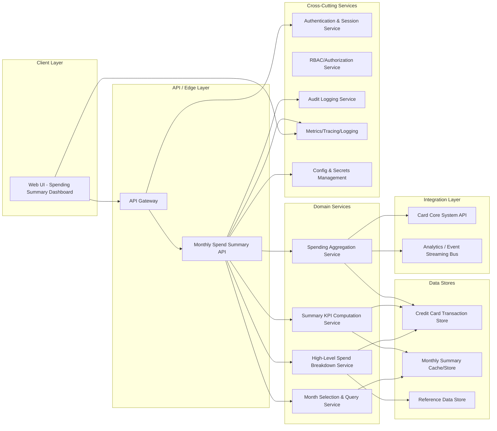

# High-Level Design: Monthly Spending Summary Dashboard (QE-3278)

## 1. Architecture Overview

The Monthly Spending Summary Dashboard is a web-based capability for credit card customers to view an at-a-glance monthly spending summary, key metrics, and high-level breakdowns for a selected month. The solution is designed as an enterprise-grade, cloud-ready architecture with clear separation of client, API, domain, data, integration, and cross-cutting concerns.

### 1.1 Logical Architecture

### 1.2 Scope Mapping to Architecture

The architecture addresses the high-level scope items as follows:

1. **Monthly total credit card spend calculation** – Implemented by Spending Aggregation Service using Credit Card Transaction Store and Card Core System API, exposed via Monthly Spend Summary API and surfaced in Web UI.
2. **Monthly summary KPIs (e.g., total spend, number of transactions)** – Implemented by Summary KPI Computation Service, persisted in Monthly Summary Store for quick retrieval, and displayed via Web UI.
3. **Visual representation of monthly spend (e.g., summary cards or charts)** – Implemented within Web UI using data provided by Monthly Spend Summary API.
4. **Month selection to view a specific month’s summary** – Implemented by Month Selection & Query Service, with API parameters controlling the requested month and Web UI controls to select the month.
5. **Basic breakdown of spend suitable as an entry point into deeper insights** – Implemented by High-Level Spend Breakdown Service using transaction data and reference data.

Out-of-scope items are explicitly excluded:
- **Non-credit-card products** – Architecture filters transaction sources to credit card accounts only and does not integrate with non-card product stores or APIs.
- **Detailed transaction-level management features** – API and UI do not implement transaction-level editing, dispute handling, or advanced transaction management workflows.

## 2. Component Descriptions

### 2.1 Client Layer

**Web UI - Spending Summary Dashboard**  
A responsive web front-end (e.g., SPA or server-rendered UI) embedded in the existing banking application. Responsibilities:
- Authenticate users via existing session/auth mechanisms and call backend APIs with secure tokens.
- Provide month selector controls (dropdown, calendar, arrows) for choosing the statement month.
- Display key summary KPIs (total spend, number of transactions) using visually distinct cards.
- Render charts or summary widgets (e.g., bar chart per category, donut chart for spend proportions, timeline for monthly total spend) derived from high-level breakdown data.
- Handle loading/error states gracefully (e.g., retries, user messaging) while consuming the Monthly Spend Summary API.
- Ensure no detailed transaction-level management (e.g., edits, category changes) is exposed in this dashboard.

### 2.2 API / Edge Layer

**API Gateway**  
A centralized ingress controlling access to backend APIs. Responsibilities:
- Terminate TLS and enforce HTTPS-only communication.
- Validate authentication tokens and route authorized requests to the Monthly Spend Summary API.
- Enforce rate limiting and basic request validation (method, path, payload size) for dashboard requests.
- Perform request/response logging and propagate correlation IDs for observability.

**Monthly Spend Summary API**  
A RESTful service (or equivalent) exposing endpoints for retrieving monthly spending summaries. Responsibilities:
- Provide an endpoint such as `GET /spend-summary?month=YYYY-MM`.
- Validate query parameters (month, pagination if any) and enforce authorization checks via RBAC/ABAC.
- Orchestrate calls to domain services (aggregation, KPI computation, breakdown, month selection) and assemble a normalized response for the client.
- Apply output filtering to ensure only high-level data (aggregates and summary metrics) is returned; detailed transaction management capabilities remain out of scope.
- Integrate with audit and observability components.

### 2.3 Domain Services

**Spending Aggregation Service**  
A stateless service responsible for calculating total monthly credit card spend. Responsibilities:
- Retrieve credit card transactions for the requested month from the Credit Card Transaction Store or, if necessary, via Card Core System API.
- Filter out non-credit-card product transactions by account type or product identifier.
- Aggregate transaction amounts to compute total monthly spend per customer and per card.
- Publish aggregated metrics or events to the Analytics/Event Streaming Bus for downstream analysis.
- Cache or persist computed totals in Monthly Summary Store when appropriate.

**Summary KPI Computation Service**  
Service responsible for computing summary KPIs for each month. Responsibilities:
- Consume data from Spending Aggregation Service and transaction counts from Credit Card Transaction Store.
- Calculate KPIs such as total spend, number of transactions, average transaction value, max/min transaction value (if in scope), and other high-level indicators.
- Store computed KPIs in Monthly Summary Store keyed by customer, card, and month.
- Expose a domain API for the Monthly Spend Summary API to request KPIs by month.

**High-Level Spend Breakdown Service**  
Service that provides basic breakdowns of spend for use as an entry point into deeper insights. Responsibilities:
- Use transaction data and reference data (e.g., merchant category codes, category hierarchies) from Reference Data Store.
- Derive high-level categories or grouping (e.g., travel, groceries, utilities) appropriate for summary visualization.
- Compute aggregate totals per category or per defined grouping for the requested month.
- Return breakdown data in a form consumable by the Monthly Spend Summary API and Web UI.
- Avoid complex or detailed analytics (e.g., multi-month comparisons, forecasting) that belong to deeper insights outside this epic.

**Month Selection & Query Service**  
Service that encapsulates logic for resolving and validating month-based queries. Responsibilities:
- Validate requested month (supported range, format `YYYY-MM`, cannot be outside available data retention policies).
- Map month selections to existing precomputed summaries in Monthly Summary Store when available.
- Fall back to on-demand aggregation if a requested month has not yet been summarized.
- Provide metadata to the Web UI via the API (e.g., earliest and latest available month, default month) for month selector controls.

### 2.4 Data Stores

**Credit Card Transaction Store**  
Primary data store holding canonical credit card transaction records. Responsibilities:
- Store transaction records with fields such as transaction ID, card ID, customer ID, timestamp, amount, currency, merchant, and product type (no real sample values stored in documentation).
- Support querying by customer, card, and month for aggregation purposes.
- Enforce data encryption at rest and implement role-based access restrictions for spending aggregation workloads.

**Monthly Summary Cache/Store**  
Optimized store for monthly summaries and KPIs. Responsibilities:
- Persist precomputed monthly totals, KPIs, and high-level breakdowns keyed by customer/card/month.
- Support fast reads for dashboard queries to avoid repeated heavy aggregation on primary transaction data.
- Implement data lifecycle policies consistent with compliance and data retention regulations.

**Reference Data Store**  
Store for static or slowly changing reference data used in breakdown calculations. Responsibilities:
- Maintain category definitions, merchant category codes, and mapping rules for grouping transactions into high-level categories.
- Provide versioned reference data to ensure consistent breakdown computation.

### 2.5 Integration Layer

**Card Core System API**  
Integration boundary with the bank’s card core system. Responsibilities:
- Provide transaction feed or on-demand lookup APIs for credit card transactions when they are not fully replicated in the transaction store.
- Enforce strict authentication and authorization for system-to-system calls.
- Return only credit card product transactions for consumption by the Spending Aggregation Service.

**Analytics / Event Streaming Bus**  
Integration for downstream analytics and data science capabilities. Responsibilities:
- Receive events when new monthly summaries are computed (e.g., `MonthlySpendSummaryCreated` events).
- Forward events to analytics platforms or data warehouses (outside scope of this epic) for deeper insights and longitudinal analysis.

### 2.6 Cross-Cutting Services

**Authentication & Session Service**  
Centralized service for user login and session management. Responsibilities:
- Issue tokens or session identifiers used by the Web UI and API Gateway.
- Integrate with enterprise identity providers (e.g., SSO) as per existing bank architecture.

**RBAC/Authorization Service**  
Service enforcing that users can only access their own spending data. Responsibilities:
- Define roles and attributes limiting dashboard access to authenticated customers and authorized internal users.
- Provide authorization checks consumed by the API Gateway and Monthly Spend Summary API.

**Audit Logging Service**  
Service recording key user actions and data accesses. Responsibilities:
- Log access to monthly spending summaries per customer, including who accessed and when.
- Store logs in an immutable, tamper-evident store with appropriate retention.

**Metrics/Tracing/Logging (Observability)**  
Cross-cutting observability stack. Responsibilities:
- Capture metrics (request counts, latencies, error rates) for the Monthly Spend Summary API and related services.
- Provide distributed tracing across Web UI, API Gateway, domain services, and integration calls.
- Collect application logs for troubleshooting and compliance reporting.

**Config & Secrets Management**  
Central secure configuration store. Responsibilities:
- Store credentials for Card Core System API, database connections, and analytics bus.
- Enforce access control and secret rotation policies.

## 3. Integration Points & Data Flow

### 3.1 Flow 1 – Authentication and Session Establishment

1. Customer navigates to the banking application and authenticates via Authentication & Session Service.
2. Web UI receives a session or token and stores it in a secure client-side mechanism (e.g., HTTP-only cookies).
3. Subsequent dashboard API calls from Web UI to API Gateway include the token.
4. API Gateway validates the token and consults RBAC/Authorization Service to check access rights.
5. If authorized, the request proceeds to the Monthly Spend Summary API.

Scope Coverage: Supports secure access to monthly total credit card spend, summary KPIs, visual representation, month selection, and breakdown by ensuring only authorized users access their data.

### 3.2 Flow 2 – Primary Monthly Summary Retrieval

1. Customer opens the Monthly Spending Summary Dashboard in Web UI.
2. Web UI selects a default month (e.g., last completed statement month) and calls `GET /spend-summary?month=YYYY-MM` via API Gateway.
3. API Gateway performs routing and basic validation, then forwards the request to Monthly Spend Summary API.
4. Monthly Spend Summary API validates query parameters and authorization.
5. API calls Month Selection & Query Service to resolve requested month and locate existing summary in Monthly Summary Store.
6. If a precomputed summary exists, Month Selection & Query Service returns identifiers for totals, KPIs, and breakdown entries.
7. Monthly Spend Summary API retrieves KPIs via Summary KPI Computation Service (which reads from Monthly Summary Store) and breakdown data via High-Level Spend Breakdown Service.
8. Monthly Spend Summary API assembles a response containing total monthly spend, summary KPIs, and high-level breakdown data.
9. Response is returned via API Gateway to Web UI.
10. Web UI renders summary cards and charts for the selected month.

Scope Coverage: 
- Monthly total credit card spend calculation (steps 5–8 through use of aggregated data).
- Monthly summary KPIs (steps 7–8).
- Visual representation (step 10).
- Month selection (steps 2, 5).
- Basic breakdown of spend (steps 7–10).

### 3.3 Flow 3 – On-Demand Monthly Aggregation

1. Customer selects a month that has no precomputed summary.
2. Web UI issues `GET /spend-summary?month=YYYY-MM` via API Gateway.
3. Monthly Spend Summary API requests Month Selection & Query Service, which determines that the month is not available in Monthly Summary Store.
4. Month Selection & Query Service instructs Spending Aggregation Service to perform on-demand aggregation for the requested month.
5. Spending Aggregation Service retrieves transactions for the month from Credit Card Transaction Store or Card Core System API.
6. Service filters out non-credit-card transactions and aggregates amounts per card/customer.
7. Summary KPI Computation Service computes KPIs based on aggregated data.
8. High-Level Spend Breakdown Service computes category breakdowns using Reference Data Store.
9. Results (totals, KPIs, breakdown) are stored in Monthly Summary Store.
10. Monthly Spend Summary API reads the new summary and returns it to Web UI.
11. Web UI visualizes the updated summary.
12. Spending Aggregation Service emits events to Analytics/Event Streaming Bus about new summary availability.

Scope Coverage: 
- Monthly total credit card spend calculation (steps 4–6).
- Monthly summary KPIs (step 7).
- Visual representation (step 11).
- Month selection (steps 1–3).
- Basic breakdown of spend (step 8).

### 3.4 Flow 4 – Observability and Audit

1. For each API request, API Gateway and Monthly Spend Summary API emit structured logs and metrics (request ID, latency, outcome).
2. Audit Logging Service records when a customer views a monthly summary (who, which month, timestamp, channel).
3. Observability stack aggregates metrics and traces for dashboard usage.

Scope Coverage: Supports all in-scope capabilities by ensuring reliable monitoring and auditing but does not introduce out-of-scope transaction management features.

## 4. Security & Compliance Features

### 4.1 Transport Security

- All client-server communication is over HTTPS with modern TLS versions enforced.
- API Gateway terminates TLS and enforces strong cipher suites consistent with enterprise security baselines.

### 4.2 Data Encryption

- Credit Card Transaction Store and Monthly Summary Store encrypt data at rest using enterprise-standard encryption mechanisms.
- Keys are managed via Config & Secrets Management with role-based access controls and rotation policies.

### 4.3 Input Validation

- API Gateway enforces basic validation of HTTP methods, headers, and payload size.
- Monthly Spend Summary API validates month parameter format (`YYYY-MM`), supported ranges, and prevents invalid or malformed input.
- Domain services validate identifiers (customer ID, card ID) for expected formats and existence.

### 4.4 Output Filtering

- Monthly Spend Summary API returns aggregate and summary metrics only; detailed transaction data and management capabilities are excluded to respect out-of-scope boundaries.
- Personally identifiable information is not exposed beyond what is already present in existing customer-facing banking UIs (e.g., no explicit account numbers in summary responses; use masked identifiers where required by existing standards).

### 4.5 RBAC/ABAC

- RBAC/Authorization Service defines roles for retail customers and internal operations users.
- Attribute-based rules restrict data access to the authenticated customer or authorized internal roles.
- API Gateway and Monthly Spend Summary API call RBAC/Authorization Service on each request to enforce access rules.

### 4.6 Audit Logging

- Audit Logging Service records every access to a monthly spending summary, including customer identifier, accessed month, channel, and timestamp.
- Logs are immutable and retained according to banking audit and regulatory policies.

### 4.7 Secrets Management

- Config & Secrets Management stores credentials for Transaction Store, Card Core System API, Monthly Summary Store, and Analytics Bus.
- Access to secrets is limited to services that require them, using short-lived access tokens or secure service identities.
- Automated rotation is in place for critical secrets and keys.

### 4.8 Compliance Mapping

Based on the epic scope, the following compliance areas are implicated:

- **Data Protection & Privacy (e.g., GDPR-like, local privacy regulations)** – Applicable due to customer-level spending data. The design mitigates risks by minimizing PII exposure, encrypting data at rest, securing transport, and enforcing access controls.
- **Banking Security Standards** – Applicable for secure handling of financial data, though no explicit card number management or payment processing logic is introduced in this epic.

Compliance Status:  
- Data Protection & Privacy: **Pass-with-conditions** – Assumes existing customer identity and session management are compliant and that masking rules follow enterprise standards.  
- Banking Security Standards: **Pass** – Transport, storage security, RBAC, audit, and observability follow standard controls.

## 5. Resiliency & Error Handling

### 5.1 Retry Mechanisms

- Web UI implements limited client-side retry for transient network failures (e.g., single retry with backoff).
- Monthly Spend Summary API employs retries with exponential backoff when calling Card Core System API and Analytics/Event Streaming Bus, subject to idempotency constraints.

### 5.2 Circuit Breakers & Timeouts

- Calls from Monthly Spend Summary API to Card Core System API are wrapped in circuit breakers to prevent cascading failures.
- Timeouts are configured for external and database calls to avoid hanging requests.

### 5.3 Graceful Degradation

- If Monthly Summary Store is unavailable, the system attempts direct aggregation from Credit Card Transaction Store where feasible.
- If Analytics/Event Streaming Bus is unavailable, dashboard functionality remains operational; events are queued or dropped in a controlled manner, with metrics capturing the impact.
- If Card Core System API is unavailable and transaction data cannot be retrieved, the UI informs the user that the summary is temporarily unavailable and suggests retrying later.

### 5.4 Error Handling & Status Codes

- `200 OK` – Successful retrieval of summary data.
- `400 Bad Request` – Invalid month parameter or unsupported query; response includes generic error description without leaking internal details.
- `401 Unauthorized` – Missing or invalid authentication token.
- `403 Forbidden` – Authenticated but not authorized to view requested data.
- `404 Not Found` – Requested month is outside data retention or not available and cannot be computed.
- `500 Internal Server Error` – Unexpected server-side error.
- `503 Service Unavailable` – Downstream dependency failure (e.g., Card Core System API, data store) causing temporary unavailability.

Error responses must:
- Include correlation IDs for support and troubleshooting.
- Avoid exposing stack traces, internal hostnames, or implementation specifics.

### 5.5 Observability

- Metrics collected: request throughput, latency, error rates, cache hit/miss ratios, dependency health.
- Traces follow distributed tracing standards to link Web UI actions to backend operations.
- Logs are structured and centralized, with access controlled according to enterprise policies.

## 6. Validation Report

### 6.1 Requirements Coverage

1. **Monthly total credit card spend calculation**  
   - Components: Spending Aggregation Service, Monthly Spend Summary API, Credit Card Transaction Store, Card Core System API, Monthly Summary Store.  
   - Flows: Flow 2 (Primary Monthly Summary Retrieval), Flow 3 (On-Demand Monthly Aggregation).

2. **Monthly summary KPIs (e.g., total spend, number of transactions)**  
   - Components: Summary KPI Computation Service, Monthly Summary Store, Monthly Spend Summary API, Web UI.  
   - Flows: Flow 2, Flow 3.

3. **Visual representation of monthly spend (e.g., summary cards or charts)**  
   - Components: Web UI, Monthly Spend Summary API, API Gateway.  
   - Flows: Flow 2, Flow 3.

4. **Month selection to view a specific month’s summary**  
   - Components: Web UI (month selector), Month Selection & Query Service, Monthly Summary Store, Monthly Spend Summary API.  
   - Flows: Flow 2, Flow 3.

5. **Basic breakdown of spend suitable as an entry point into deeper insights**  
   - Components: High-Level Spend Breakdown Service, Reference Data Store, Monthly Spend Summary API, Web UI.  
   - Flows: Flow 2, Flow 3.

### 6.2 Out-of-Scope Acknowledgement

- **Non-credit-card products**  
  - Exclusion: Spending Aggregation Service and related data access components filter explicitly on credit card product identifiers and do not integrate with non-card product data stores or APIs.  
  - Impact: Customers will see spending summaries only for credit card accounts; additional epics are required to support other products.

- **Detailed transaction-level management features**  
  - Exclusion: Monthly Spend Summary API responses carry aggregate metrics and high-level breakdowns only; no transaction editing, dispute workflows, tagging, or complex transaction search capabilities are implemented.  
  - Impact: For detailed transaction management and advanced analytics, users are expected to navigate to existing transaction views or future epics.

### 6.3 Compliance Status

- Data Protection & Privacy: **Pass-with-conditions**  
  - Conditions: Confirm that masking rules for any identifiers displayed in Web UI conform to enterprise privacy guidelines; verify retention policies for Monthly Summary Store align with regulatory requirements.

- Banking Security Standards: **Pass**  
  - Justification: The design implements encryption in transit and at rest, centralized secrets management, strict RBAC, audit logging, and observability consistent with standard banking controls.

### 6.4 Identified Ambiguities / Risks

1. **Ambiguity: Specific KPIs beyond total spend and number of transactions**  
   - Consequence: UI and backend may diverge on which KPIs to implement, causing inconsistent user experience and rework.
   - Mitigation: Define a canonical KPI set in a product specification (e.g., total spend, number of transactions, average transaction size) and version it; ensure Summary KPI Computation Service and Web UI consume the same definition.

2. **Ambiguity: Supported month range and data retention policy**  
   - Consequence: Requests for months outside retention could lead to 404 responses or inconsistent behavior, confusing customers.
   - Mitigation: Establish a clear retention window (e.g., last 24 months) and expose this in Web UI metadata (tooltips, disabled options). Align Month Selection & Query Service validation with this policy.

3. **Risk: Performance impact of on-demand aggregation for high-volume customers**  
   - Consequence: On-demand computation for months without precomputed summaries might cause high latency or resource contention.
   - Mitigation: Introduce background jobs to precompute monthly summaries for all active customers; set thresholds for on-demand aggregation (e.g., limit to recent months) and scale Spending Aggregation Service horizontally.

4. **Boundary Risk: Deeper insights and multi-month analytics**  
   - Consequence: Users may expect trend analysis or cross-month comparisons that are outside the scope of this epic, leading to dissatisfaction.
   - Mitigation: Make the dashboard an explicit entry point by including navigation links or calls-to-action to deeper analytics pages implemented in other epics, clearly labeling them as separate capabilities.

5. **Risk: Dependency on Card Core System API availability**  
   - Consequence: Outages or degradation in the card core system could impact on-demand aggregation and freshness of summaries.
   - Mitigation: Prefer replicated transaction data in Credit Card Transaction Store; design fallback behavior (e.g., use latest cached summary, show banner indicating partial data) when core system is unavailable.
