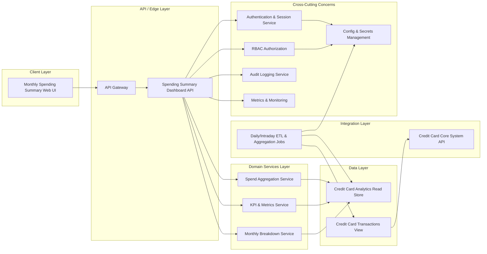

# High-Level Design (HLD) – QE-3284 Monthly Spending Summary Dashboard

## 1. Architecture Overview

### 1.1 Context
A web-based dashboard provides credit card customers with a monthly view of their spending. It aggregates credit card transaction data and presents:
- Monthly total credit card spend
- Monthly summary KPIs (e.g., total spend, number of transactions)
- Visual representation of monthly spend (summary cards/charts)
- Month selection to view a specific month’s summary
- Basic breakdown of spend suitable as an entry point into deeper insights

Only credit-card products are in scope. Non–credit-card products and detailed transaction-level management features are explicitly out of scope and must not be implemented or exposed in this epic.

### 1.2 Logical Architecture
The solution follows a typical layered enterprise architecture:
- **Client Layer** – Browser-based web UI within the existing banking application.
- **API / Edge Layer** – REST/JSON APIs for dashboard data, hosted behind an API gateway.
- **Domain Services Layer** – Application services responsible for computing aggregates and KPIs from normalized transaction data.
- **Data Layer** – Read-optimized store or views sourced from the core credit card transaction system.
- **Integration Layer** – Services and connectors to the core credit card ledger / transaction platform.
- **Cross-Cutting Concerns** – Authentication, authorization, logging, monitoring, rate limiting, and configuration/secrets management.

### 1.3 Mermaid Component Diagram

## 2. Component Descriptions

### 2.1 Client Layer
**WebUI – Monthly Spending Summary Web UI**  
Single-page dashboard embedded in the existing online banking front-end. Responsibilities:
- Render monthly total spend, KPIs, and visual summaries (cards, charts) using data from Dashboard API.
- Provide month selection (e.g., dropdown or date picker) for the billing / calendar month.
- Present a basic breakdown area (e.g., top categories or high-level groupings) without exposing detailed transaction management features.
- Enforce navigation constraints: entry point into deeper insights is via links to other modules/epics, not implemented here.
- Handle client-side input validation for month selection and enforce formats supported by the backend API.

Out-of-scope enforcement:
- Does not render non–credit-card products.
- Does not support transaction editing, dispute flows, or advanced filters that require transaction-level management.

### 2.2 API / Edge Layer
**API Gateway (APIGW)**  
Front-door for all dashboard-related traffic. Responsibilities:
- Route `/spend-dashboard` and related endpoints to Dashboard API.
- Enforce TLS termination, rate limiting, and basic request security (size limits, header validation).
- Support existing authentication tokens from the banking channel (e.g., OAuth2/JWT) and forward principal context to backend.

**DashboardAPI – Spending Summary Dashboard API**  
Backend service exposing the monthly spending summary endpoints. Responsibilities:
- Provide an endpoint like `GET /spend-dashboard/{cardId}/months/{month}` to fetch monthly summary aggregates.
- Validate request parameters: card identifier, month format, pagination or view options if any.
- Orchestrate calls to domain services (SpendAggService, KPIService, BreakdownService).
- Apply authorization checks (with RBACService) ensuring the authenticated user is allowed to view the given card.
- Apply response shaping: only return aggregated and breakdown data; never expose transaction edit actions.
- Produce structured logs and audit events for access to spending summary data.

Out-of-scope enforcement:
- Does not provide endpoints for non–credit-card products.
- Does not expose detailed transaction-level management APIs (create/update/delete transactions, disputes).

### 2.3 Domain Services Layer
**SpendAggService – Spend Aggregation Service**  
Responsibilities:
- Compute monthly total credit card spend per card, using the read store (CC_ReadStore) and/or views.
- Apply business rules for which transaction types contribute to spend (e.g., purchases vs. fees, reversals, refunds).
- Ensure correct handling of currency, exchange rates, and statement cycles as defined by card configuration.
- Expose an internal interface for DashboardAPI to request monthly total spend for a card/month combination.

**KPIService – KPI & Metrics Service**  
Responsibilities:
- Compute summary KPIs for the month: number of transactions, average transaction value, possibly other simple metrics.
- Ensure KPI definitions are standardized and configurable (e.g., include/exclude certain transaction types).
- Optimize queries against the read store to avoid repeated scans, possibly leveraging pre-aggregated data.

**BreakdownService – Monthly Breakdown Service**  
Responsibilities:
- Provide a basic breakdown of spending suitable as an entry point into deeper insights (e.g., by broad categories or merchant segments).
- Use high-level categories only, avoiding detailed transaction-level features (filters per transaction, search).
- Return the breakdown in an aggregated form (e.g., category → total spend → percentage of monthly total).
- Produce data structures ready for visualization (e.g., pie chart, stacked bar), without encoding presentation details.

Out-of-scope enforcement:
- No support for non–credit-card products in breakdown results.
- Does not perform advanced analytics beyond high-level breakdown (e.g., month-over-month comparisons, trends).

### 2.4 Data Layer
**CC_ReadStore – Credit Card Analytics Read Store**  
Responsibilities:
- Provide read-optimized access to credit card transaction aggregates and normalized transaction data.
- Store or cache aggregated metrics needed for monthly total spend and KPIs.
- Expose views for domain services that encourage efficient range queries by card and statement month.
- Ensure no PII/PCI sample data is exposed directly through development artifacts; real data resides only in runtime environments.

**CC_Tx_View – Credit Card Transactions View**  
Responsibilities:
- Logical view or materialized view over the core transaction system for credit card transactions only.
- Provide filtered access (card-only) to transactions used by ETL_Jobs to populate CC_ReadStore.

Out-of-scope enforcement:
- No schemas or views for non–credit-card products.
- No direct support for transaction-level CRUD or disputes.

### 2.5 Integration Layer
**CC_Core_API – Credit Card Core System API**  
Responsibilities:
- Serve as the authoritative source of credit card transactions and balances.
- Provide integration endpoints for ETL_Jobs to pull transaction data.

**ETL_Jobs – Daily/Intraday ETL & Aggregation Jobs**  
Responsibilities:
- Periodically extract credit card transaction data from CC_Core_API.
- Transform and load into CC_Tx_View / CC_ReadStore, computing pre-aggregated metrics when possible.
- Handle reconciliation and error reporting when upstream data is delayed or incomplete.

Out-of-scope enforcement:
- ETL covers only credit card products.
- No ETL logic for other product types as part of this epic.

### 2.6 Cross-Cutting Concerns
**AuthService – Authentication & Session Service**  
- Validates user identity via existing banking SSO/authentication mechanism.
- Issues/validates tokens that the API Gateway and DashboardAPI rely on.

**RBACService – RBAC Authorization**  
- Maintains roles/permissions for viewing credit card accounts.
- Ensures a user can only access spending summaries for cards they own or are authorized for.

**AuditService – Audit Logging Service**  
- Records access to monthly spending summaries, including principal, card reference, and operation type.
- Supports compliance reporting requirements for access to financial data.

**MetricsService – Metrics & Monitoring**  
- Captures performance metrics for dashboard endpoints and domain services (latency, throughput, error rates).

**ConfigService – Config & Secrets Management**  
- Stores configuration (e.g., KPI definitions, ETL schedules) and secrets (API credentials) using a secure vault.

## 3. Integration Points & Data Flow

### 3.1 Flow 1 – Authentication & Session Establishment
1. User accesses the online banking portal and signs in using the existing channel login.
2. AuthService authenticates credentials and issues a session/token.
3. WebUI obtains session/token and attaches it to dashboard API calls.
4. API Gateway validates token and forwards the authenticated request context to DashboardAPI.

Scope mapping: prerequisite for all in-scope capabilities (monthly totals, KPIs, dashboard view, month selection, breakdown).

### 3.2 Flow 2 – Monthly Summary Dashboard Request (Primary Request Flow)
1. User navigates to the Monthly Spending Summary Dashboard in the WebUI.
2. WebUI calls `GET /spend-dashboard/{cardId}/months/{month}` via API Gateway, including the auth token.
3. API Gateway validates the request (auth token, basic parameter formats) and routes to DashboardAPI.
4. DashboardAPI validates parameters (cardId, month), then checks user-card access via RBACService.
5. DashboardAPI calls SpendAggService to retrieve monthly total spend for the card/month.
6. SpendAggService queries CC_ReadStore, applying business rules for transaction inclusion.
7. DashboardAPI calls KPIService to compute summary KPIs (e.g., number of transactions, average transaction amount).
8. KPIService queries CC_ReadStore to get the required transaction counts and aggregates.
9. DashboardAPI calls BreakdownService to obtain basic breakdown data (e.g., category-level aggregates).
10. BreakdownService queries CC_ReadStore to fetch high-level categories and aggregated amounts.
11. DashboardAPI consolidates results from domain services into a response DTO (summary section, KPIs, breakdown section).
12. DashboardAPI logs access and metrics via AuditService and MetricsService.
13. API Gateway returns the response to WebUI.
14. WebUI renders the monthly total spend, KPIs, cards/charts, and basic breakdown.

Scope mapping:
- Monthly total credit card spend calculation – Steps 5–7.
- Monthly summary KPIs – Steps 7–8.
- Visual representation – Steps 11–14 (WebUI uses response to render charts/cards).
- Month selection – Steps 2–4 (month parameter), and UI behavior.
- Basic breakdown of spend – Steps 9–10, 11–14.

### 3.3 Flow 3 – Month Selection & View Refresh
1. User selects a different month using WebUI controls.
2. WebUI validates the chosen month format client-side and constructs a new request to `/spend-dashboard/{cardId}/months/{month}`.
3. API Gateway performs the same validation and routing as in Flow 2.
4. DashboardAPI repeats the orchestration to domain services for the new month.
5. Response is returned and UI re-renders charts, KPIs, and breakdown for the selected month.

Scope mapping:
- Month selection to view a specific month’s summary – Steps 1–5.

### 3.4 Flow 4 – ETL & Data Refresh (Business Logic / Processing)
1. On a scheduled basis (daily or intraday), ETL_Jobs invoke CC_Core_API to retrieve new/updated credit card transactions.
2. ETL_Jobs transform transactions into normalized records and compute pre-aggregated metrics (per card/month).
3. ETL_Jobs load transformed data into CC_Tx_View and CC_ReadStore.
4. ETL_Jobs log success/failure metrics and errors to MetricsService and AuditService as needed.
5. Subsequent dashboard requests use the refreshed data from CC_ReadStore.

Scope mapping:
- Monthly total credit card spend calculation – Steps 2–5.
- Monthly summary KPIs – Steps 2–5.
- Basic breakdown of spend – Steps 2–5.

### 3.5 Flow 5 – Observability & Audit
1. DashboardAPI emits structured logs for each incoming request (card reference, month, correlation id). No PII/PCI sample values are logged.
2. AuditService records an audit event for dashboard access, capturing actor ID (token subject), card reference (non-sensitive identifier), action type (view-summary), and timestamp.
3. MetricsService captures latency, error codes, and throughput metrics for DashboardAPI, SpendAggService, KPIService, BreakdownService.
4. Operations teams consume metrics/dashboards to monitor performance and error rates.

Scope mapping:
- Supports reliability and compliance for all in-scope dashboard functions.

## 4. Security & Compliance Features

### 4.1 Transport Security
- All client-to-server interactions use HTTPS with modern TLS configurations.
- API Gateway terminates external TLS and uses mTLS for internal calls to DashboardAPI where supported.

### 4.2 Data Encryption
- At rest: CC_ReadStore and CC_Tx_View reside on encrypted storage volumes in production.
- In transit: Calls between ETL_Jobs and CC_Core_API, and between API Gateway and backend services, are protected via TLS.

### 4.3 Input Validation
- WebUI performs basic format validation for month and card selection controls.
- DashboardAPI validates request parameters server-side (allowed month ranges, valid card identifiers format, supported locales).
- API Gateway enforces request size limits and basic header validation.

### 4.4 Output Filtering
- DashboardAPI returns only aggregated spending and KPIs; transaction-level details are limited to what is necessary for aggregations and not exposed in responses.
- Out-of-scope transaction management features are not included in any API response.

### 4.5 RBAC/ABAC
- RBACService ensures only authorized users can view cards and associated spending summaries.
- ABAC-style checks (if available) can be used to enforce additional policies, such as customer segment restrictions.

### 4.6 Audit Logging
- AuditService records access to monthly summaries including actor ID, card reference, month, and operation type.
- Logs use correlation IDs and structured formats to support forensic analysis.

### 4.7 Secrets Management
- ConfigService, backed by a secure vault, stores credentials for CC_Core_API and database connections.
- ETL_Jobs and backend services retrieve secrets at runtime using short-lived tokens or service identities.

### 4.8 Compliance Mapping
Based on the epic scope (credit card spending view, no payment processing):
- **PCI-DSS (read-only card transaction data)** – Pass-with-conditions
  - Cardholder data is indirectly involved since the solution reads transaction data, but this epic focuses on aggregated spend and KPIs.
  - Conditions: Card-number and other sensitive PAN details must not be returned to WebUI or logged; adherence to organizational PCI segmentation is required.
- **Privacy/PII regulations (e.g., GDPR/CCPA)** – Pass
  - Only authenticated user views their own financial information.
  - No sample PII values are stored in design artifacts, and runtime logging avoids direct PII where possible.
- **Internal security policies** – Pass
  - Standard enterprise controls (TLS, RBAC, audit logging, secrets management) are applied.

## 5. Resiliency & Error Handling

### 5.1 Retry Mechanisms
- DashboardAPI uses idempotent read operations against CC_ReadStore; transient failures (e.g., timeouts) may be retried with backoff.
- ETL_Jobs implement retry logic when CC_Core_API is temporarily unavailable.

### 5.2 Circuit Breakers & Timeouts
- Calls from DashboardAPI to CC_ReadStore are wrapped with timeouts and circuit breakers via the service framework.
- ETL_Jobs access to CC_Core_API also uses timeouts and circuit-breaking to avoid cascading failures.

### 5.3 Graceful Degradation
- If CC_ReadStore is unavailable, DashboardAPI responds with a well-defined error and instructs UI to show a fallback message (e.g., “Summary temporarily unavailable”).
- Partial data scenarios: if KPIs or breakdown are unavailable but total spend is available, responses may indicate partial data while preserving correctness.

### 5.4 Error Handling & Status Codes
- **200 OK** – Successful retrieval of monthly summary.
- **400 Bad Request** – Invalid month format, card identifier, or unsupported query parameter.
- **401 Unauthorized** – Missing or invalid authentication token.
- **403 Forbidden** – User is authenticated but not authorized to view the requested card.
- **404 Not Found** – No data available for the requested card/month.
- **429 Too Many Requests** – Rate limits exceeded at API Gateway.
- **500 Internal Server Error** – Unhandled server-side error.
- **503 Service Unavailable** – Downstream dependencies unavailable (e.g., CC_ReadStore).

Error responses:
- Contain generic messages and correlation IDs; they do not expose internal implementation details or PII/PCI data.

### 5.5 Observability
- MetricsService collects key indicators (latency, error rate, request volume).
- Dashboards and alerts are configured for:
  - High 5xx rates on DashboardAPI.
  - ETL_Jobs failures or delays beyond configured thresholds.
  - Performance degradation (increased response times).

## 6. Validation Report

### 6.1 Requirements Coverage
**Scope (High Level) items and coverage:**
1. **Monthly total credit card spend calculation**  
   - Components: SpendAggService, CC_ReadStore, ETL_Jobs, CC_Core_API.  
   - Flows: Flow 2 (primary dashboard request), Flow 4 (ETL & data refresh).

2. **Monthly summary KPIs (e.g., total spend, number of transactions)**  
   - Components: KPIService, CC_ReadStore, ETL_Jobs.  
   - Flows: Flow 2 (primary dashboard request), Flow 4 (ETL & data refresh).

3. **Visual representation of monthly spend (e.g., summary cards or charts)**  
   - Components: WebUI, DashboardAPI, API Gateway.  
   - Flows: Flow 2 (primary dashboard request), Flow 3 (month selection & view refresh).

4. **Month selection to view a specific month’s summary**  
   - Components: WebUI, API Gateway, DashboardAPI.  
   - Flows: Flow 2 (primary dashboard request), Flow 3 (month selection & view refresh).

5. **Basic breakdown of spend suitable as an entry point into deeper insights**  
   - Components: BreakdownService, CC_ReadStore, WebUI, DashboardAPI.  
   - Flows: Flow 2 (primary dashboard request), Flow 4 (ETL & data refresh).

### 6.2 Out of Scope Acknowledgement
From the epic description:
- **Non–credit-card products**  
  - Explicitly excluded from CC_Tx_View, CC_ReadStore, ETL_Jobs scope, and WebUI rendering.  
  - No endpoints or UI elements are designed to surface data for other products.

- **Detailed transaction-level management features**  
  - Not supported by DashboardAPI; no CRUD APIs or dispute flows are defined.  
  - WebUI does not provide transaction edit, dispute, or advanced filtering capabilities.  
  - Transaction-level exploration, if needed, is delegated to other epics/modules via navigation only.

### 6.3 Compliance Status
- **Transport Security** – Pass  
  TLS enforced at API Gateway and internal services.

- **Data Encryption at Rest/In Transit** – Pass  
  Encrypted storage and TLS in all service-to-service calls.

- **Input Validation & Output Filtering** – Pass  
  Server-side and client-side validation; responses restricted to aggregates and KPIs.

- **RBAC/ABAC** – Pass  
  RBACService controls card-level access; ABAC optional enhancements defined.

- **Audit Logging** – Pass  
  Access to spending summaries is logged with appropriate metadata.

- **Secrets Management** – Pass  
  ConfigService and secure vault handle credentials and configuration securely.

- **PCI-DSS (read-only, aggregated views)** – Pass-with-conditions  
  Conditions: maintain segmentation, avoid exposing PAN or sensitive cardholder data; follow organization PCI guidelines.

### 6.4 Identified Ambiguities / Risks
1. **Ambiguity: Statement vs Calendar Month Definition**  
   - Consequence: Misalignment between customer expectations and displayed totals; potential support issues and complaints.  
   - Mitigation: Clarify whether month refers to statement cycle or calendar month; codify in business rules and display explanatory text in WebUI.

2. **Ambiguity: Treatment of Reversals, Refunds, and Fees in “Total Spend”**  
   - Consequence: Inconsistent totals compared to statements; confusion about what “spend” means.  
   - Mitigation: Define inclusion/exclusion rules with product owners; implement them consistently in SpendAggService and KPIService; document the rules for downstream LLD.

3. **Risk: ETL Latency Affecting Dashboard Freshness**  
   - Consequence: Dashboard may show stale data for recent transactions; customers may believe spend is lower/higher than actual.  
   - Mitigation: Instrument ETL timeliness metrics; display data freshness indicators in the UI; consider intraday ETL or near-real-time streaming for critical use cases.

4. **Risk: Boundary with Deeper Insights / Other Epics**  
   - Consequence: Users may expect detailed views or comparisons that are not implemented here, leading to usability issues.  
   - Mitigation: Ensure navigation clearly indicates entry into other modules/epics; hide or disable controls for features not yet delivered; coordinate with owners of analytics epics.

5. **Risk: Category Mapping for Breakdown**  
   - Consequence: Misclassification of transactions into categories, leading to misleading breakdowns.  
   - Mitigation: Use centralized category taxonomy service or configuration; define deterministic rules for category assignment; include monitoring to detect anomalies.
