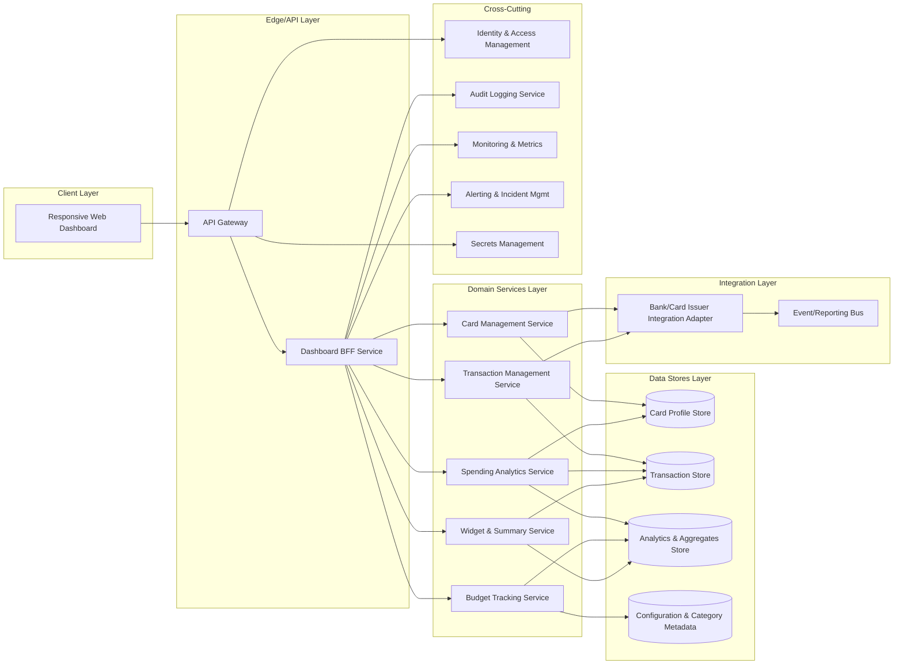

# High-Level Design (HLD) – QE-3301 Monthly Spending Summary Dashboard

## 1. Architecture Overview

The Monthly Spending Summary Dashboard is a multi-channel, enterprise-grade analytics and visualization solution for credit card spending, transactions, utilization, and budgeting. The solution is implemented using a layered architecture:

- **Client Layer**: Responsive web UI supporting desktop, tablet, and mobile form factors.
- **Edge/API Layer**: Secure API gateway and BFF (Backend-for-Frontend) services for dashboard-specific data aggregation.
- **Domain Services Layer**: Modular microservices handling cards, transactions, analytics, and budgeting.
- **Data Stores Layer**: Normalized OLTP stores for card/transaction data and optimized OLAP/analytics data store for aggregations and charts.
- **Integration Layer**: Connectors to upstream systems of record (card issuer/bank systems) and downstream observability and audit platforms.
- **Cross-Cutting Concerns**: Identity and access management, security controls, configuration, logging, monitoring, and compliance.

The architecture is designed so that each bullet in the high-level scope is supported by dedicated components and integration flows. Out-of-scope items such as payment execution, dispute handling, and non-credit-card financial products are explicitly excluded from the design and referenced only as external systems or future extensions

## 2. Component Diagram (Mermaid)

## 3. Component Descriptions

### 3.1 Client Layer

**Responsive Web Dashboard (WebUI)**  
- Single-page application or web-based UI that renders the monthly spending summary dashboard.  
- Implements responsive layouts for mobile, tablet, and desktop using adaptive breakpoints.  
- Provides widgets for dashboard summary, credit card management, transaction table, filters/search, analytics charts, budget tracking, and recent transactions.  
- Handles client-side input validation (e.g., filter criteria, date ranges, search terms) and invokes BFF APIs.  
- Does not store sensitive card or transaction data locally beyond session-specific views.

### 3.2 Edge/API Layer

**API Gateway (APIGW)**  
- Central entry point for all dashboard-related APIs.  
- Enforces authentication, request throttling, IP allow/deny lists, and basic request validation.  
- Routes dashboard-specific requests to the Dashboard BFF service.  
- Terminates TLS and handles cross-origin resource sharing (CORS) policies for the web client.

**Dashboard BFF Service (BFF)**  
- Tailored backend facade that aggregates data from domain services for the dashboard.  
- Exposes coarse-grained endpoints such as `/dashboard/summary`, `/cards`, `/transactions`, `/analytics/spending`, `/budget`, `/widgets/recent-transactions`.  
- Orchestrates calls to Card Management, Transaction Management, Spending Analytics, Budget Tracking, and Widget services.  
- Applies response shaping for the UI (e.g., pagination, sorting, filtering).  
- Handles user-specific context (e.g., selected card, date ranges, categories) without implementing business rules already owned by domain services.  
- Emits audit and metrics events for observability.

### 3.3 Domain Services Layer

**Card Management Service (CardSvc)**  
- Maintains card-level attributes required for dashboard summary: card name, issuing bank, masked card number, credit limit, available credit, current outstanding, billing date, due date.  
- Aggregates card data across multiple cards per user.  
- Supplies total credit limit, available credit, outstanding amount, and utilization percentage to the BFF.  
- Integrates with Bank/Card Issuer systems via the Bank Adapter for periodic or event-based synchronization of card balances and limits.  
- Excludes payment execution, dispute handling, or non-card products, which remain out of scope.

**Transaction Management Service (TxnSvc)**  
- Stores and exposes transactional data per card: transaction date, merchant name, category, card used, amount, payment status, and remarks.  
- Supports pagination, sorting by amount/date, and filters by merchant, category, bank, card, and date range.  
- Normalizes transaction records into a single canonical format regardless of source system.  
- Manages transaction lifecycle status where relevant to spend tracking, but does not implement payment processing pipelines.  
- Publishes transaction events to the Reporting Bus for downstream analytics.

**Spending Analytics Service (AnalyticsSvc)**  
- Computes derived metrics required for the dashboard summary and charts: monthly spending, category-wise spending, monthly spending trend, card-wise spending distribution, category breakdown.  
- Performs aggregations over the Transaction Store and persists pre-computed aggregates in AnalyticsDB to optimize chart performance.  
- Provides drill-down APIs to support interactive analytics (e.g., clicking on a category segment to see underlying transactions).  
- Updates analytics periodically (e.g., hourly) or near real-time based on transaction events from Reporting Bus.

**Budget Tracking Service (BudgetSvc)**  
- Manages monthly budgets per user and optionally per category or card.  
- Calculates current spend against budgets using analytics aggregates.  
- Provides remaining budget, budget utilization percentage, and progress bar indicators.  
- Applies simple rule-based thresholds for highlighting overspend conditions.  
- Does not implement complex financial planning or forecasting beyond current month usage.

**Widget & Summary Service (WidgetSvc)**  
- Provides summary data for dashboard tiles: total monthly spend, total credit limit, available credit, outstanding amount, utilization percentage, number of transactions, and latest five transactions.  
- Aggregates data from CardSvc, TxnSvc, AnalyticsSvc, and BudgetSvc into concise payloads optimized for dashboard load.  
- Enforces consistency between widget values and underlying detailed views by referencing common aggregate sources.

### 3.4 Data Stores Layer

**Card Profile Store (CardDB)**  
- Relational or document store holding card metadata required for dashboard features.  
- Stores masked card identifiers and logical references to issuer systems instead of full PAN values.  
- Maintains credit limit, billing/due dates, and card associations to users.

**Transaction Store (TxnDB)**  
- OLTP store for transaction records, supporting efficient querying by user, card, merchant, category, date range, amount, and payment status.  
- Indexed to support responsive filtering and sorting in the UI.  
- Designed with partitioning/sharding strategies for scalability over large transaction volumes.

**Analytics & Aggregates Store (AnalyticsDB)**  
- Optimized for analytical queries and chart rendering.  
- Stores pre-computed metrics such as category-wise sums, monthly trends, and card-wise distributions.  
- Supports time-series indexing and snapshotting to enable month-over-month and intra-month comparisons.

**Configuration & Category Metadata Store (ConfigDB)**  
- Stores category definitions (Food & Dining, Fuel, Shopping, Travel, Entertainment, Utilities, Healthcare, Education, Miscellaneous, etc.) and rules for mapping transactions to categories.  
- Holds budget configurations (per-user default budgets, limits per category, thresholds for alerts).  
- Provides centrally managed metadata that can be adjusted without code changes.

### 3.5 Integration Layer

**Bank/Card Issuer Integration Adapter (BankAdapter)**  
- Handles secure connectivity to external card issuer/bank systems to fetch card and transaction data periodically.  
- Normalizes external data formats into the internal canonical schema.  
- Supports batch ingestion and incremental updates via APIs or file-based feeds.  
- Enforces data minimization by retrieving only fields necessary for dashboard and analytics.

**Event/Reporting Bus (ReportingBus)**  
- Message or event bus used for streaming transaction and card updates to analytics and reporting consumers.  
- Decouples transactional ingestion from analytics computation to maintain UI responsiveness.  
- Integrates with downstream data lake or warehouse (if present) but such external warehouse capabilities are outside the current epics scope.

### 3.6 Cross-Cutting Concerns

**Identity & Access Management (IAM)**  
- Provides authentication and authorization services.  
- Integrates with enterprise SSO and supports multi-factor authentication where required.  
- Issues access tokens used by the API Gateway to enforce user-specific access.

**Audit Logging Service (Audit)**  
- Captures access and key actions such as dashboard views, filter changes, and export operations.  
- Stores audit logs in a write-optimized store, with retention compliant to organizational policy.  
- Provides search and export interfaces for compliance and operational reviews.

**Monitoring & Metrics (Metrics)**  
- Collects operational metrics (latency, throughput, error rates) for all services.  
- Instruments key user journeys (dashboard load, filter application, chart rendering) for performance tuning.

**Alerting & Incident Management (Alerts)**  
- Defines alert rules on service health and business KPIs (e.g., analytics lag beyond threshold).  
- Integrates with incident management tooling for on-call notifications.

**Secrets Management (Secrets)**  
- Stores and rotates credentials, API keys, and certificates for external integrations and internal services.  
- Provides dynamic secrets access bound to service identities.

## 4. Integration Points & Data Flows

### Flow 1: Authentication & Session Establishment

1. User navigates to the Monthly Spending Summary Dashboard URL.
2. WebUI redirects unauthenticated users to IAM/SSO for login.
3. Upon successful authentication, IAM issues an access token back to the client.
4. WebUI stores token in secure browser storage (e.g., session storage) and includes it in API requests.
5. API Gateway validates the token against IAM, applies RBAC policies, and forwards authorized requests to the BFF.

**Scope coverage**: Responsive design (access from multiple devices), secure access to dashboard summary, card management, transactions, and analytics.

### Flow 2: Dashboard Summary Load (Totals, Utilization, Number of Transactions)

1. WebUI calls `GET /dashboard/summary` on the BFF via APIGW.  
2. BFF requests card-level aggregates from CardSvc (total credit limit, available credit, outstanding amount, utilization).  
3. BFF requests transaction counts and monthly spend totals from AnalyticsSvc (which uses AnalyticsDB and TxnDB).  
4. WidgetSvc combines the aggregates and returns a unified summary response to BFF.  
5. BFF shapes the response for UI tiles and sends it back through APIGW to WebUI.  
6. WebUI renders the dashboard summary widgets.

**Scope coverage**: Dashboard Summary, Total Monthly Spend, Total Credit Limit, Available Credit, Outstanding Amount, Utilization Percentage, Number of Transactions.

### Flow 3: Credit Card Management View (Multiple Cards)

1. WebUI calls `GET /cards` on the BFF with user context.  
2. BFF calls CardSvc to retrieve list of cards and attributes.  
3. CardSvc reads card profiles from CardDB (including masked card number, issuing bank, credit limit, available credit, current outstanding, billing date, due date).  
4. CardSvc returns the card list; BFF may sort/order data per UI needs.  
5. WebUI renders the card management section with multiple cards and associated details.

**Scope coverage**: Display multiple credit cards, Card Name, Issuing Bank, Card Number (masked), Credit Limit, Available Credit, Current Outstanding, Billing Date, Due Date.

### Flow 4: Transaction Management (Table, Filters, Search, Sort)

1. WebUI calls `GET /transactions` with query parameters for filters (merchant, category, bank, card, date range) and sort options (amount/date).  
2. BFF validates query parameters (e.g., date ranges, card identifiers) and forwards request to TxnSvc.  
3. TxnSvc queries TxnDB using the provided filters and sort options, ensuring pagination.  
4. TxnSvc returns the transaction list including transaction date, merchant name, category, card used, amount, payment status, and remarks.  
5. BFF shapes the response for the UI table; APIGW returns the payload to WebUI.  
6. WebUI renders the responsive table and allows user interactions for sorting and filtering without a full page reload.

**Scope coverage**: Transaction Management, responsive transaction table, Transaction Date, Merchant Name, Category, Card Used, Amount, Payment Status, Remarks, Search by Merchant, Filter by Category, Filter by Bank, Filter by Card, Filter by Date Range, Sort by Amount, Sort by Date.

### Flow 5: Spending Analytics (Charts & Category Breakdown)

1. WebUI requests analytics data via endpoints such as `GET /analytics/categories`, `GET /analytics/monthly-trend`, `GET /analytics/card-distribution`.  
2. BFF calls AnalyticsSvc to retrieve pre-computed aggregates from AnalyticsDB.  
3. AnalyticsSvc uses TxnDB and CardDB as needed to refresh aggregates if stale (based on time or event triggers from ReportingBus).  
4. AnalyticsSvc returns metric series for category-wise spending, monthly trend, card-wise distribution, and category breakdown.  
5. WebUI renders charts using client-side visualization libraries (e.g., bar charts, line graphs, pie/donut charts).  
6. Interactions (e.g., selecting categories or cards) trigger further analytics calls via BFF.

**Scope coverage**: Category-wise Spending, Monthly Spending Trend, Card-wise Spending Distribution, Category Breakdown, defined categories (Food & Dining, Fuel, Shopping, Travel, Entertainment, Utilities, Healthcare, Education, Miscellaneous).

### Flow 6: Budget Tracking & Progress Visualization

1. WebUI calls `GET /budget` for the active month and user.  
2. BFF forwards the request to BudgetSvc.  
3. BudgetSvc reads budget definitions from ConfigDB and spend aggregates from AnalyticsDB.  
4. BudgetSvc calculates current spend, remaining budget, and budget utilization percentage; it prepares progress bar data.  
5. BFF returns the budget information to WebUI.  
6. WebUI renders budget tiles and progress bars, highlighting overspend states if utilization exceeds thresholds.

**Scope coverage**: Monthly Budget, Current Spend, Remaining Budget, Budget Utilization %, Progress Bar.

### Flow 7: Recent Transactions Widget

1. WebUI calls `GET /widgets/recent-transactions`.  
2. BFF calls WidgetSvc or TxnSvc for the latest five transactions for the user.  
3. TxnSvc queries TxnDB for the most recent transactions ordered by transaction date.  
4. WidgetSvc shapes the response to include only the necessary fields for the widget.  
5. BFF returns the payload to WebUI; WebUI renders the recent transactions widget.

**Scope coverage**: Recent Transactions Widget (latest 5 transactions).

### Flow 8: Observability & Audit

1. For each request handled by APIGW and BFF, metrics are captured (latency, error codes, payload sizes) and sent to Metrics service.  
2. Significant user actions (dashboard view, filter changes, budget view) generate audit events sent to the Audit service.  
3. Metrics and audit logs are stored in dedicated observability data stores.  
4. Alerts are triggered via the Alerts service based on thresholds and anomalous patterns.

**Scope coverage**: Observability and audit for dashboard interactions, supporting enterprise-grade operations.

## 5. Security & Compliance Features

### 5.1 Transport Security

- All client-to-APIGW and service-to-service communications use TLS with modern cipher suites.  
- Strict HTTPS enforcement for browser clients; HTTP is redirected or rejected.  
- HSTS headers and secure cookie flags are enabled.

### 5.2 Data Encryption

- At-rest encryption for CardDB, TxnDB, AnalyticsDB, ConfigDB using enterprise key management.  
- Database-level transparent encryption (TDE) and field-level encryption for any sensitive identifiers.  
- Keys managed through Secrets Management with regular rotation.

### 5.3 Input Validation

- API Gateway and BFF validate query parameters (e.g., date ranges, sort fields, card IDs) to prevent injection attacks and misuse.  
- WebUI performs initial validation of user inputs for filters and search terms, enforcing length and format constraints.  
- Service-level validation for upstream ingestion via BankAdapter to ensure schema conformity.

### 5.4 Output Filtering

- CardSvc returns masked card numbers only; full card numbers and security codes are never exposed.  
- Transaction results exclude any unnecessary personal descriptors beyond merchant/category/amount and remarks compliant with policy.  
- Error responses are sanitized to avoid leaking implementation details.

### 5.5 RBAC/ABAC

- IAM enforces coarse-grained roles (e.g., standard user, admin/ops) controlling access to dashboards and analytics.  
- Attribute-based rules may restrict access to specific card groups or organizational units where applicable.  
- BFF uses user identity from tokens to scope all queries to that users authorized cards and transactions.

### 5.6 Audit Logging

- Key interactions (login, dashboard access, filter changes, data exports) are recorded with timestamp, user identifier, and contextual metadata.  
- Audit events are immutable and stored with tamper-evident mechanisms where required.  
- Dashboards for compliance reporting can be built on top of the audit store (beyond current epic scope).

### 5.7 Secrets Management

- All external system credentials (bank APIs, event bus, database passwords) are stored centrally in Secrets service.  
- No secrets are hard-coded in source code or configuration files.  
- Access to secrets is governed by service identities and strict access control lists.

### 5.8 Compliance Mapping

- The dashboard deals with card-related spending and transaction data; therefore:  
  - Data minimization and masking are enforced; the system is designed to integrate with broader PCI-DSS controls but does not itself store full card PANs.  
  - Integration boundaries with issuer systems assume those systems handle primary PCI-DSS obligations.  
- Compliance status:  
  - **PCI-DSS**: Pass-with-conditions (requires confirmation that only masked card identifiers and non-sensitive transaction details are stored; if full PAN or cardholder data is ingested, additional controls must be implemented).  
  - **Data Protection/Privacy (e.g., GDPR-equivalent)**: Pass (subject to enterprise-level data retention and subject rights management).  
  - **Internal Security Policies**: Pass (use of TLS, encryption, IAM, audit, secrets management, and logging).

## 6. Resiliency & Error Handling

### 6.1 Retry Mechanisms

- BFF implements bounded retries when calling domain services, with exponential backoff.  
- Domain services use retry patterns when interacting with BankAdapter and ReportingBus to handle transient failures.

### 6.2 Circuit Breakers

- Circuit breakers on calls from BFF to AnalyticsSvc, CardSvc, TxnSvc, and BudgetSvc protect the dashboard from cascading failures.  
- When tripped, the dashboard returns partial data with clear messaging (e.g., analytics temporarily unavailable).

### 6.3 Timeouts

- Request timeouts are configured at APIGW and BFF levels to prevent resource exhaustion from slow downstream services.  
- Service-to-service timeouts are tuned to support responsive user experience (e.g., dashboard load under agreed SLA).

### 6.4 Graceful Degradation

- If AnalyticsSvc is unavailable, the dashboard still displays card summaries and transactions but omits charts and advanced analytics, showing a placeholder message.  
- If BudgetSvc is unavailable, budget tiles show a graceful error state without breaking overall dashboard.  
- Recent Transactions widget can still be displayed even if some other services are degraded.

### 6.5 Error Handling

- Standardized error schema with codes, user-friendly messages, and correlation IDs.  
- Examples:  
  - `DASH-001` – Upstream service unavailable → UI shows Some analytics are temporarily unavailable. Please try again later.  
  - `DASH-002` – Invalid filter parameters → UI prompts user to correct inputs.  
- Technical details logged server-side; client responses avoid stack traces or implementation-specific information.

### 6.6 Observability

- End-to-end trace IDs propagating from WebUI through APIGW and BFF to domain services.  
- Centralized logging with structured fields; logs are correlated across services via trace IDs.  
- Metrics for dashboard load time, error rate per endpoint, cache hit/miss ratios (if caching implemented), and analytics freshness.

## 7. Validation Report

### 7.1 Requirements Coverage (Scope Items → Components & Flows)

1. **Dashboard Summary**  
   - Components: WebUI, BFF, WidgetSvc, CardSvc, AnalyticsSvc, CardDB, AnalyticsDB.  
   - Flows: Flow 2 (Dashboard Summary Load).

2. **Total Monthly Spend**  
   - Components: AnalyticsSvc, AnalyticsDB, WidgetSvc, BFF, WebUI.  
   - Flows: Flow 2, Flow 5.

3. **Total Credit Limit**  
   - Components: CardSvc, CardDB, WidgetSvc, BFF, WebUI.  
   - Flows: Flow 2, Flow 3.

4. **Available Credit**  
   - Components: CardSvc, CardDB, WidgetSvc, BFF, WebUI.  
   - Flows: Flow 2, Flow 3.

5. **Outstanding Amount**  
   - Components: CardSvc, CardDB, WidgetSvc, BFF, WebUI.  
   - Flows: Flow 2, Flow 3.

6. **Utilization Percentage**  
   - Components: CardSvc, AnalyticsSvc, AnalyticsDB, WidgetSvc, BFF, WebUI.  
   - Flows: Flow 2.

7. **Number of Transactions**  
   - Components: TxnSvc, TxnDB, AnalyticsSvc, AnalyticsDB, WidgetSvc, BFF, WebUI.  
   - Flows: Flow 2, Flow 4.

8. **Display Multiple Credit Cards (Card Name, Issuing Bank, Masked Card Number, Credit Limit, Available Credit, Current Outstanding, Billing Date, Due Date)**  
   - Components: CardSvc, CardDB, BFF, WebUI.  
   - Flows: Flow 3.

9. **Transaction Management Table (Transaction Date, Merchant Name, Category, Card Used, Amount, Payment Status, Remarks)**  
   - Components: TxnSvc, TxnDB, BFF, WebUI.  
   - Flows: Flow 4.

10. **Search by Merchant**  
    - Components: WebUI, BFF, TxnSvc, TxnDB.  
    - Flows: Flow 4.

11. **Filter by Category**  
    - Components: WebUI, BFF, TxnSvc, TxnDB, ConfigDB.  
    - Flows: Flow 4.

12. **Filter by Bank**  
    - Components: WebUI, BFF, TxnSvc, TxnDB, CardSvc, CardDB.  
    - Flows: Flow 4.

13. **Filter by Card**  
    - Components: WebUI, BFF, TxnSvc, TxnDB, CardSvc, CardDB.  
    - Flows: Flow 4.

14. **Filter by Date Range**  
    - Components: WebUI, BFF, TxnSvc, TxnDB.  
    - Flows: Flow 4.

15. **Sort by Amount**  
    - Components: WebUI, BFF, TxnSvc, TxnDB.  
    - Flows: Flow 4.

16. **Sort by Date**  
    - Components: WebUI, BFF, TxnSvc, TxnDB.  
    - Flows: Flow 4.

17. **Category-wise Spending**  
    - Components: AnalyticsSvc, AnalyticsDB, TxnDB, ConfigDB, BFF, WebUI.  
    - Flows: Flow 5.

18. **Monthly Spending Trend**  
    - Components: AnalyticsSvc, AnalyticsDB, TxnDB, BFF, WebUI.  
    - Flows: Flow 5.

19. **Card-wise Spending Distribution**  
    - Components: AnalyticsSvc, AnalyticsDB, TxnDB, CardSvc, CardDB, BFF, WebUI.  
    - Flows: Flow 5.

20. **Category Breakdown with Defined Categories (Food & Dining, Fuel, Shopping, Travel, Entertainment, Utilities, Healthcare, Education, Miscellaneous)**  
    - Components: ConfigDB, AnalyticsSvc, AnalyticsDB, BFF, WebUI.  
    - Flows: Flow 5.

21. **Budget Tracking (Monthly Budget, Current Spend, Remaining Budget, Budget Utilization %, Progress Bar)**  
    - Components: BudgetSvc, ConfigDB, AnalyticsSvc, AnalyticsDB, BFF, WebUI.  
    - Flows: Flow 6.

22. **Recent Transactions Widget (Latest 5 Transactions)**  
    - Components: WidgetSvc, TxnSvc, TxnDB, BFF, WebUI.  
    - Flows: Flow 7.

23. **Responsive Design (Mobile, Tablet, Desktop Friendly)**  
    - Components: WebUI.  
    - Flows: Flow 1 (authentication and general access patterns) plus all data access flows executed from various devices.

### 7.2 Compliance Status

- **PCI-DSS**: Pass-with-conditions  
  - Justification: Design assumes storage of masked card identifiers only and non-sensitive transaction data. If full PAN or sensitive authentication data is introduced, additional tokenization, segmentation, and audit controls are required.

- **Data Protection/Privacy**: Pass  
  - Justification: Design restricts data to transactional details and card metadata without storing unnecessary personal data. IAM, encryption, logging, and configurable retention support privacy requirements.

- **Internal Security & Logging Policies**: Pass  
  - Justification: Comprehensive controls for TLS, IAM, RBAC/ABAC, audit logging, secrets management, and observability.

### 7.3 Identified Ambiguities/Risks

1. **Scope of External Data from Bank/Card Issuer Systems**  
   - Ambiguity/Risk: The exact fields ingested from issuer systems are not fully specified. If full PAN or cardholder data is ingested, compliance posture changes significantly.  
   - Consequence: Potential PCI-DSS scope expansion and increased regulatory overhead.  
   - Mitigation: Define strict ingestion schema; enforce masking/tokenization; ensure upstream systems handle sensitive data and expose only necessary attributes.

2. **Budget Granularity and Rules**  
   - Ambiguity/Risk: Whether budgets are per user, per card, or per category is not fully specified.  
   - Consequence: Misalignment between user expectations and actual budget tracking behavior; complexity in UI and service design.  
   - Mitigation: Clarify budget model and rules in functional requirements; parameterize budget configurations in ConfigDB.

3. **Analytics Refresh Cadence**  
   - Ambiguity/Risk: Frequency and latency requirements for analytics updates (near real-time vs. periodic batch) are unspecified.  
   - Consequence: Users may see stale data or system may over-invest in real-time analytics infrastructure.  
   - Mitigation: Define SLAs for analytics freshness; configure ReportingBus and AnalyticsSvc to meet agreed cadence.

4. **Export and Sharing Capabilities**  
   - Ambiguity/Risk: It is unclear if users can export dashboards or share transaction/analytics data externally.  
   - Consequence: Potential data leakage or non-compliant distribution if export features are later added without controls.  
   - Mitigation: Treat export/sharing features as separate epics; enforce role-based access and data minimization when implemented.

5. **Multi-tenant and Organizational Segmentation**  
   - Ambiguity/Risk: Segmentation requirements across multiple organizations or tenants are not described.  
   - Consequence: Risk of data access across organizational boundaries if multi-tenancy is assumed but not clearly modeled.  
   - Mitigation: Define tenancy model; implement ABAC policies and database partitioning as required.
