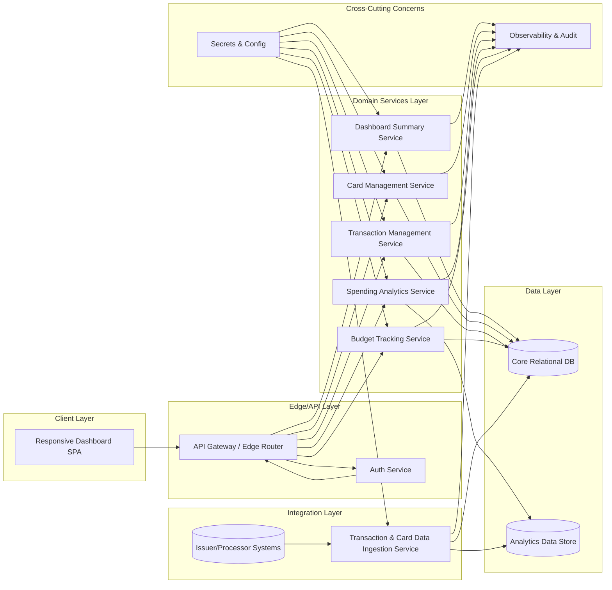

# High-Level Design (HLD) – QE-3301 – Monthly Spending Summary Dashboard

## 1. Architecture Overview

The Monthly Spending Summary Dashboard is an enterprise-grade, responsive web application that provides credit card holders with aggregated and drill-down views of their monthly spending, card utilization, budgeting, and transaction analytics.

The solution follows a layered architecture:

- **Client Layer (Web & Mobile Web UI)**
  - Single-page application (SPA) implemented with a modern web framework (e.g., React/Angular/Vue).
  - Responsive layout supporting desktop, tablet, and mobile form factors.
  - Provides dashboard views, transaction tables, charts, filters, and widgets.

- **Edge/API Layer**
  - API Gateway or edge router exposing REST/GraphQL APIs to the client.
  - Handles authentication, authorization, request validation, rate limiting, and routing.

- **Domain Services Layer**
  - Stateless microservices or modular service components responsible for:
    - Dashboard summary aggregation (spend, limits, utilization, transaction counts).
    - Credit card management (card metadata, masked card numbers, billing/due dates).
    - Transaction management (search, filter, sort, pagination).
    - Spending analytics (category-wise, monthly trends, card-wise distribution, category breakdown).
    - Budget tracking (monthly budget, utilization and progress status).

- **Data Layer**
  - Relational database or document store holding:
    - Card master data (card attributes, issuer, limits, billing cycles).
    - Transaction records (date, merchant, category, amount, status, card reference, remarks).
    - Budget configuration and current spend aggregates.
  - Optional analytics data store optimized for chart queries.

- **Integration Layer**
  - Connectors or services to ingest card and transaction data from upstream systems (e.g., issuer APIs, batch feeds, or internal transaction processors).
  - Event or batch ingestion jobs to keep card and transaction data current.

- **Cross-Cutting Concerns**
  - Centralized authentication and RBAC.
  - Audit logging and observability (metrics, tracing, logging).
  - Secrets and configuration management.
  - Security controls for data protection.

### 1.1 Mermaid Architecture Diagram

```mermaid
flowchart LR
    subgraph Client_Layer[Client Layer]
        UI[Responsive Dashboard SPA]
    end

    subgraph Edge_Layer[Edge/API Layer]
        APIGW[API Gateway / Edge Router]
        AUTH[Auth Service]
    end

    subgraph Domain_Services[Domain Services Layer]
        DASH[Dashboard Summary Service]
        CARD[Card Management Service]
        TX[Transaction Management Service]
        ANALYTICS[Spending Analytics Service]
        BUDGET[Budget Tracking Service]
    end

    subgraph Data_Layer[Data Layer]
        DB_CORE[(Core Relational DB)]
        DB_ANALYTICS[(Analytics Data Store)]
    end

    subgraph Integration_Layer[Integration Layer]
        INGEST[Transaction & Card Data Ingestion Service]
        UPSTREAM[(Issuer/Processor Systems)]
    end

    subgraph Cross_Cutting[Cross-Cutting Concerns]
        OBS[Observability & Audit]
        SEC[Secrets & Config]
    end

    UI --> APIGW
    APIGW --> AUTH
    AUTH --> APIGW

    APIGW --> DASH
    APIGW --> CARD
    APIGW --> TX
    APIGW --> ANALYTICS
    APIGW --> BUDGET

    DASH --> DB_CORE
    CARD --> DB_CORE
    TX --> DB_CORE
    ANALYTICS --> DB_ANALYTICS
    BUDGET --> DB_CORE

    INGEST --> DB_CORE
    INGEST --> DB_ANALYTICS
    UPSTREAM --> INGEST

    DASH --> OBS
    CARD --> OBS
    TX --> OBS
    ANALYTICS --> OBS
    BUDGET --> OBS
    INGEST --> OBS

    SEC --> DASH
    SEC --> CARD
    SEC --> TX
    SEC --> ANALYTICS
    SEC --> BUDGET
    SEC --> INGEST
```

## 2. Component Descriptions

### 2.1 Responsive Dashboard SPA (UI)

- **Responsibilities**
  - Render dashboard summary metrics: total monthly spend, total credit limit, available credit, outstanding amount, utilization percentage, number of transactions.
  - Present credit card management views: list of multiple cards with issuer, masked card number, limits, outstanding amounts, billing and due dates.
  - Provide transaction management tables with filters, search, sort, and pagination.
  - Display spending analytics charts: category-wise, monthly trend, card-wise distribution, category breakdown.
  - Surface budget tracking information: monthly budget, current spend, remaining budget, utilization percentage, progress bar.
  - Show recent transactions widget (latest 5 transactions).
  - Adapt layout for desktop, tablet, and mobile.

- **Key Design Aspects**
  - Client-side routing for different dashboard sections.
  - Shared filter state for synchronized views (e.g., filters affecting both table and charts).
  - Input validation for client-side fields (date ranges, search strings, etc.).

### 2.2 API Gateway / Edge Router (APIGW)

- **Responsibilities**
  - Expose a unified API surface to the UI for dashboard, card, transaction, analytics, and budget endpoints.
  - Enforce HTTPS/TLS for transport security.
  - Terminate client authentication (e.g., OAuth2/OIDC tokens) and delegate verification to Auth Service.
  - Perform coarse-grained authorization and route requests to appropriate domain services.
  - Apply rate limiting and request size limits.

### 2.3 Auth Service (AUTH)

- **Responsibilities**
  - Validate identity tokens and sessions.
  - Resolve user or account identifiers to authorize data access.
  - Provide RBAC/ABAC decisioning for dashboard features (e.g., view-only vs. full analytics).

### 2.4 Dashboard Summary Service (DASH)

- **Responsibilities**
  - Aggregate data across cards and transactions to compute:
    - Total monthly spend for the selected period.
    - Total credit limit across cards.
    - Available credit and outstanding amounts.
    - Utilization percentage (spend vs limit).
    - Number of transactions within the selected date range.
  - Expose consolidated dashboard summary endpoints.

- **Key Design Aspects**
  - Efficient aggregate queries and caching for frequently accessed dashboard views.
  - Support filtering by date range and card subset.

### 2.5 Card Management Service (CARD)

- **Responsibilities**
  - Maintain and expose card metadata:
    - Card name and issuing bank.
    - Masked card number representation.
    - Credit limit and available credit per card.
    - Current outstanding amount.
    - Billing date and due date.
  - Ensure that only masked card numbers are ever returned to clients.

- **Key Design Aspects**
  - Card identifiers stored as internal references; card number is stored and processed in a secure, tokenized or masked form as per organizational policies.
  - Provide endpoints for listing cards and retrieving card-level details used on the dashboard.

### 2.6 Transaction Management Service (TX)

- **Responsibilities**
  - Provide APIs for retrieving and managing transaction lists based on filters:
    - Transaction date range.
    - Merchant name search.
    - Category filter.
    - Filter by bank or card.
    - Sort by amount or date.
  - Include transaction-specific fields: date, merchant, category, card used, amount, payment status, remarks.

- **Key Design Aspects**
  - Pagination support to limit response size.
  - Search and filter capabilities implemented via indexed fields.

### 2.7 Spending Analytics Service (ANALYTICS)

- **Responsibilities**
  - Generate analytics datasets for:
    - Category-wise spending.
    - Monthly spending trend.
    - Card-wise spending distribution.
    - Category breakdown using predefined categories (e.g., food & dining, fuel, shopping, travel, entertainment, utilities, healthcare, education, miscellaneous).
  - Optimize for chart rendering by aggregating transaction data into analytics schemas.

- **Key Design Aspects**
  - Pre-computation or near-real-time aggregation of metrics for the selected period.
  - APIs returning data structures tailored for visualization (e.g., label-value pairs, timeseries).

### 2.8 Budget Tracking Service (BUDGET)

- **Responsibilities**
  - Store and manage monthly budget configurations per user/account.
  - Calculate current spend against budget, remaining budget, and utilization percentage.
  - Supply progress bar metrics for the UI.

- **Key Design Aspects**
  - Budget and spend tracking aligned with the same categories and date ranges used by analytics.
  - Support for multiple budgets (e.g., per card or consolidated) if required in future epics.

### 2.9 Core Relational Database (DB_CORE)

- **Responsibilities**
  - Persist card metadata, budgets, and transaction records.
  - Enforce referential integrity between cards, transactions, and budgets.

- **Structure (Illustrative)**
  - `Card` table: card reference, issuer, masked number, limits, billing/due dates.
  - `Transaction` table: transaction identifier, date, merchant, category, card reference, amount, payment status, remarks.
  - `Budget` table: budget identifier, period, amount, category or scope, linkage to user/account.

### 2.10 Analytics Data Store (DB_ANALYTICS)

- **Responsibilities**
  - Store aggregated or denormalized datasets to support analytical queries and chart rendering.
  - Maintain materialized views or precomputed metrics for category, trend, and card distribution.

### 2.11 Ingestion Service (INGEST)

- **Responsibilities**
  - Receive transaction and card data from upstream systems (issuer or processor systems).
  - Normalize and write data into `DB_CORE` and optionally into `DB_ANALYTICS`.
  - Handle batch and/or streaming ingestion.

### 2.12 Upstream Systems (UPSTREAM)

- **Responsibilities**
  - Provide authoritative card and transaction data.
  - Out of scope for this epic: design of upstream systems, card authorization flows, settlement logic, or payment processing.

### 2.13 Observability & Audit (OBS)

- **Responsibilities**
  - Centralized logging of API requests and responses (excluding sensitive payloads).
  - Metrics for dashboard usage, latency, error rates, and ingestion health.
  - Audit events for access to card and transaction data.

### 2.14 Secrets & Configuration Management (SEC)

- **Responsibilities**
  - Secure storage of database credentials, API keys, and upstream integration secrets.
  - Management of configuration values such as category definitions, thresholds, and default date ranges.

## 3. Integration Points & Data Flow

### 3.1 Flow 1 – Authentication & Session Establishment

1. User accesses the dashboard via browser.
2. Responsive Dashboard SPA redirects or calls Auth Service through the API Gateway to establish identity (e.g., login via organization identity provider).
3. Auth Service validates credentials or tokens and issues a session or token.
4. API Gateway validates the token on each subsequent call and forwards authorized requests to domain services.

**Scope Coverage:** Supports secure access to all dashboard and analytics features.

### 3.2 Flow 2 – Dashboard Summary Retrieval

1. UI initializes the dashboard and calls `GET /dashboard/summary` on API Gateway with user/session context and optional date range.
2. API Gateway validates request (auth, rate limits) and routes to Dashboard Summary Service.
3. Dashboard Summary Service queries `DB_CORE` for:
   - Aggregate monthly spend.
   - Credit limits and available credit.
   - Outstanding amounts.
   - Transaction count for the period.
4. Dashboard Summary Service composes a summary response and returns it via API Gateway to the UI.
5. UI renders dashboard summary tiles and KPIs.

**Scope Coverage:** Dashboard Summary, Total Monthly Spend, Total Credit Limit, Available Credit, Outstanding Amount, Utilization Percentage, Number of Transactions.

### 3.3 Flow 3 – Credit Card Management View

1. UI invokes `GET /cards` on API Gateway to load card list.
2. API Gateway routes the request to Card Management Service.
3. Card Management Service retrieves card data from `DB_CORE`, including issuer, masked card number, credit limit, available credit, current outstanding, billing date, and due date.
4. Service formats the response to include only masked card identifiers.
5. UI renders multiple card tiles or a table with the card attributes.

**Scope Coverage:** Display multiple credit cards and associated fields.

### 3.4 Flow 4 – Transaction Management (Search, Filter, Sort)

1. UI invokes `GET /transactions` with query parameters for date range, merchant search, category, bank, card, sort field (amount/date), and pagination.
2. API Gateway validates and forwards to Transaction Management Service.
3. Transaction Management Service builds a query against `DB_CORE` using indexed fields.
4. Service returns a paginated result set containing transaction date, merchant name, category, card used, amount, payment status, and remarks.
5. UI displays transactions in a responsive table; filters and sorts update the table and related analytics.

**Scope Coverage:** Transaction Management, filters and search capabilities.

### 3.5 Flow 5 – Spending Analytics Charts

1. UI calls `GET /analytics/spending` with date range and selected filters.
2. API Gateway routes to Spending Analytics Service.
3. Spending Analytics Service reads aggregate data from `DB_ANALYTICS` or computes on demand from `DB_CORE`.
4. Service returns datasets for:
   - Category-wise spending.
   - Monthly spending trend (time series).
   - Card-wise spending distribution.
   - Category breakdown with predefined categories.
5. UI renders charts (e.g., bar, line, pie/stacked) using these datasets.

**Scope Coverage:** Spending analytics and category breakdown.

### 3.6 Flow 6 – Budget Tracking & Progress Bar

1. UI calls `GET /budget/summary` with selected month and context.
2. API Gateway forwards to Budget Tracking Service.
3. Budget Tracking Service retrieves budget configuration from `DB_CORE` and aggregates current spend for the same period and category scope.
4. Service calculates remaining budget and utilization percentage.
5. UI renders budget metrics and a progress bar indicating utilization.

**Scope Coverage:** Budget Tracking, Monthly Budget, Current Spend, Remaining Budget, Budget Utilization %, Progress bar.

### 3.7 Flow 7 – Recent Transactions Widget

1. UI invokes `GET /transactions/recent?limit=5`.
2. API Gateway forwards to Transaction Management Service.
3. Service queries `DB_CORE` for the most recent transactions for the user/account.
4. Service returns a list of the latest transactions.
5. UI renders the recent transactions widget.

**Scope Coverage:** Recent Transactions Widget.

### 3.8 Flow 8 – Data Ingestion from Upstream Systems

1. Upstream systems export or stream card and transaction data to Ingestion Service.
2. Ingestion Service validates and normalizes incoming data.
3. Ingestion Service writes card and transaction records to `DB_CORE`.
4. For analytics-optimized paths, Ingestion Service or downstream jobs update `DB_ANALYTICS` aggregates.
5. Dashboard and analytics domain services consume updated data via normal query paths.

**Scope Coverage:** Ensures dashboard, transactions, and analytics have up-to-date data (implicit requirement for accuracy and consistency).

## 4. Security & Compliance Features

### 4.1 Transport Security

- All client-to-API Gateway communications use HTTPS with modern TLS.
- Internal service calls are secured using mutual TLS or trusted network segmentation, depending on organizational standards.

### 4.2 Data Encryption

- Database storage uses encryption at rest for card and transaction data.
- Backup media and analytics data stores are encrypted.
- Sensitive identifiers (card numbers) stored only in masked or tokenized form in this solution; full card numbers, if present in upstream systems, are not exposed by this dashboard.

### 4.3 Input Validation & Output Filtering

- API Gateway and domain services validate inputs:
  - Date ranges must be within configured limits and valid formats.
  - Search strings and filter values are sanitized to prevent injection attacks.
  - Sort fields and filter parameters are whitelisted.
- Output responses:
  - Mask card identifiers and avoid exposing full card numbers.
  - Limit remark field length and sanitize any free-text content before rendering.

### 4.4 RBAC/ABAC

- Auth Service enforces role-based access (RBAC):
  - Standard user roles can view only their own card and transaction data.
  - Administrative or support roles may have extended visibility where permitted.
- Attribute-based access control (ABAC) can restrict views based on account or region attributes if required.

### 4.5 Audit Logging

- Access to card and transaction endpoints is logged with:
  - User or account identifier.
  - Operation type (view, search, filter change).
  - Timestamp and outcome (success/failure).
- Administrative actions affecting budgets or category configuration are audited.

### 4.6 Secrets Management

- All credentials and keys are stored in a centralized secrets manager.
- Services obtain secrets at runtime via secure channels and do not log them.

### 4.7 Compliance Mapping

- This dashboard handles card-related information and transaction data; therefore, it must align with internal policies for handling payment-related data.
- The design:
  - Avoids storing or exposing full card numbers to the UI.
  - Uses masking and aggregation to reduce exposure of sensitive details.
- Broader payment processing compliance requirements (e.g., authorization, settlement) are handled by upstream systems and are out of scope for this epic.

## 5. Resiliency & Error Handling

### 5.1 Retry Mechanisms

- Client-side retries for idempotent reads (dashboard summary, analytics, transaction list) with exponential backoff.
- Internal service calls may employ retry patterns for transient failures (e.g., database connectivity), respecting idempotency.

### 5.2 Circuit Breakers & Timeouts

- API Gateway enforces per-endpoint timeouts.
- Circuit breakers applied to domain services to prevent repeated calls to unhealthy dependencies.

### 5.3 Graceful Degradation

- If analytics data store is unavailable:
  - Dashboard falls back to minimal metrics from `DB_CORE` or displays partial analytics with appropriate messaging.
- If ingestion is delayed:
  - Dashboard shows data timestamp indicators so users are aware of staleness.

### 5.4 Error Handling

- Standardized error responses from APIs:
  - `400 Bad Request`: invalid filters or date ranges; UI prompts user to correct input.
  - `401 Unauthorized` / `403 Forbidden`: authentication/authorization issues; UI redirects to login or shows access error.
  - `404 Not Found`: requested card or transaction resource not available.
  - `429 Too Many Requests`: rate limit exceeded; UI advises user to retry later.
  - `500 Internal Server Error`: unexpected server issue; UI shows generic error and suggests retry.
- Error payloads avoid exposing internal stack traces or sensitive details.

### 5.5 Observability

- Metrics collected:
  - Request counts, latency distributions, error rates per endpoint.
  - Ingestion throughput and lag.
- Distributed tracing across API Gateway and domain services to trace dashboard requests.
- Log aggregation with correlation identifiers per user session.

## 6. Validation Report

### 6.1 Requirements Coverage

1. **Dashboard Summary**
   - **Components:** Responsive Dashboard SPA, Dashboard Summary Service, API Gateway, Core DB.
   - **Flows:** Flow 2 – Dashboard Summary Retrieval.

2. **Total Monthly Spend**
   - **Components:** Dashboard Summary Service, Core DB, Responsive Dashboard SPA.
   - **Flows:** Flow 2 – Dashboard Summary Retrieval.

3. **Total Credit Limit**
   - **Components:** Card Management Service, Dashboard Summary Service, Core DB.
   - **Flows:** Flow 2 – Dashboard Summary Retrieval, Flow 3 – Credit Card Management View.

4. **Available Credit**
   - **Components:** Card Management Service, Dashboard Summary Service, Core DB.
   - **Flows:** Flow 2 – Dashboard Summary Retrieval, Flow 3 – Credit Card Management View.

5. **Outstanding Amount**
   - **Components:** Dashboard Summary Service, Card Management Service, Core DB.
   - **Flows:** Flow 2 – Dashboard Summary Retrieval, Flow 3 – Credit Card Management View.

6. **Utilization Percentage**
   - **Components:** Dashboard Summary Service, Core DB.
   - **Flows:** Flow 2 – Dashboard Summary Retrieval.

7. **Number of Transactions**
   - **Components:** Dashboard Summary Service, Transaction Management Service, Core DB.
   - **Flows:** Flow 2 – Dashboard Summary Retrieval, Flow 4 – Transaction Management.

8. **Credit Card Management (Display multiple credit cards with card details)**
   - **Components:** Responsive Dashboard SPA, Card Management Service, Core DB.
   - **Flows:** Flow 3 – Credit Card Management View.

9. **Transaction Management (Responsive table with transaction fields)**
   - **Components:** Responsive Dashboard SPA, Transaction Management Service, Core DB.
   - **Flows:** Flow 4 – Transaction Management.

10. **Filters and Search (Merchant, Category, Bank, Card, Date Range; Sort by Amount/Date)**
    - **Components:** Responsive Dashboard SPA, Transaction Management Service, API Gateway.
    - **Flows:** Flow 4 – Transaction Management.

11. **Spending Analytics (Category-wise, Monthly Trend, Card-wise Distribution)**
    - **Components:** Responsive Dashboard SPA, Spending Analytics Service, Analytics Data Store, Core DB.
    - **Flows:** Flow 5 – Spending Analytics Charts.

12. **Category Breakdown using defined categories**
    - **Components:** Spending Analytics Service, Analytics Data Store, Responsive Dashboard SPA.
    - **Flows:** Flow 5 – Spending Analytics Charts.

13. **Budget Tracking (Monthly Budget, Current Spend, Remaining Budget, Budget Utilization %, Progress Bar)**
    - **Components:** Budget Tracking Service, Core DB, Responsive Dashboard SPA.
    - **Flows:** Flow 6 – Budget Tracking & Progress Bar.

14. **Recent Transactions Widget (Latest 5 transactions)**
    - **Components:** Transaction Management Service, Core DB, Responsive Dashboard SPA.
    - **Flows:** Flow 7 – Recent Transactions Widget.

15. **Responsive Design (Mobile, Tablet, Desktop)**
    - **Components:** Responsive Dashboard SPA.
    - **Flows:** Flow 1 – Authentication & Session Establishment (for access) plus rendering behavior on each device type.

16. **Data Freshness and Ingestion from Upstream**
    - **Components:** Ingestion Service, Upstream Systems, Core DB, Analytics Data Store.
    - **Flows:** Flow 8 – Data Ingestion from Upstream Systems.

### 6.2 Compliance Status

- **Transport Security:** **Pass**
  - HTTPS/TLS enforced; internal calls secured.

- **Data Encryption at Rest:** **Pass-with-conditions**
  - Design mandates encryption, but actual implementation depends on platform capabilities and configuration; must be verified during implementation.

- **Access Control (RBAC/ABAC):** **Pass-with-conditions**
  - Role and attribute policies are defined conceptually; detailed role matrix and policy rules to be finalized.

- **Audit Logging:** **Pass**
  - Access to card/transaction data and configuration changes are logged.

- **Secrets Management:** **Pass**
  - Central secrets manager used; no secrets in code or logs.

- **Sensitive Data Handling (Card & Transaction Data):** **Pass-with-conditions**
  - Design avoids exposing full card numbers and emphasizes masked data. Implementation must ensure all UI and API fields adhere to masking and tokenization standards and align with organizational policies.

### 6.3 Identified Ambiguities/Risks

1. **Budget Scope Granularity**
   - **Ambiguity/Risk:** Unclear whether budgets are per card, per category, or overall monthly.
   - **Consequence if Unresolved:** Misalignment between user expectations and dashboard calculations; confusion in interpreting utilization and progress bar.
   - **Mitigation:** Define budget granularity and configuration model in a follow-up refinement or epic; adjust Budget Tracking Service schema and UI accordingly.

2. **Category Taxonomy Management**
   - **Ambiguity/Risk:** The categories listed may evolve; governance for adding/removing categories is not specified.
   - **Consequence if Unresolved:** Inconsistent reporting and analytics when categories change; potential mismatch between transaction classification and dashboard charts.
   - **Mitigation:** Establish a controlled taxonomy management process and configuration interface; version category definitions and provide migration rules.

3. **Card Data Sensitivity and Masking Rules**
   - **Ambiguity/Risk:** Detailed masking format and allowable card metadata is not fully described.
   - **Consequence if Unresolved:** Risk of exposing more card details than permitted by internal policies; potential non-compliance.
   - **Mitigation:** Align card display rules with security and compliance guidelines; codify masking pattern and fields allowed on the dashboard.

4. **Data Latency between Upstream and Dashboard**
   - **Ambiguity/Risk:** Frequency and mode of data ingestion (real-time vs batch) are unspecified.
   - **Consequence if Unresolved:** Users may see stale spending data; misinterpretation of current utilization and budget status.
   - **Mitigation:** Define SLAs for data freshness; instrument data age indicators; select ingestion approach (e.g., hourly batch or streaming) to meet SLAs.

5. **Scalability Requirements for Analytics**
   - **Ambiguity/Risk:** Volume of transactions and concurrency expectations are not defined.
   - **Consequence if Unresolved:** Under-provisioned infrastructure may lead to slow analytics queries and degraded user experience.
   - **Mitigation:** Conduct capacity planning based on expected transaction volume; consider horizontal scaling and partitioning strategies for `DB_ANALYTICS` and related services.

6. **Upstream Systems Responsibilities (Out of Scope)**
   - **Ambiguity/Risk:** The dashboard depends on upstream issuer/processor systems whose behavior and SLAs are not described.
   - **Consequence if Unresolved:** Failure or delays in upstream systems will impact dashboard accuracy; unclear ownership for integration issues.
   - **Mitigation:** Define integration contracts and SLAs with upstream providers; include monitoring and alerts on ingestion health; maintain clear ownership boundaries.
