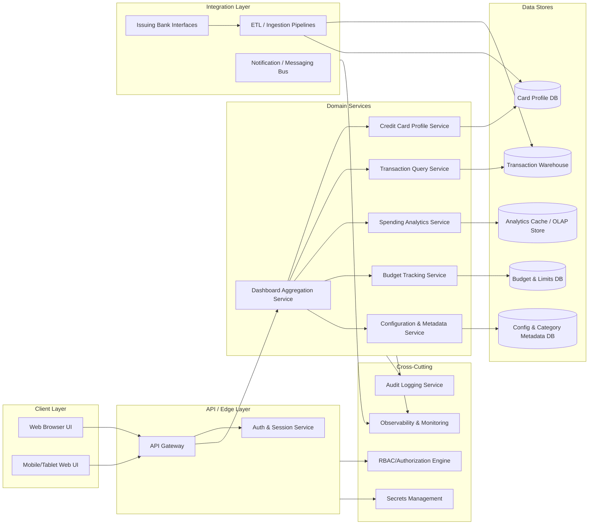

# High-Level Design (HLD) – QE-3318 Monthly Spending Summary Dashboard

## 1. Architecture Overview

The Monthly Spending Summary Dashboard is a multi-channel, read-heavy analytics application that visualizes credit-card-related spending, utilization, transactions, and budgeting insights. The architecture is designed as a modular, service-oriented system with strong security, observability, and scalability.

### 1.1 Logical Architecture

### 1.2 Scope-to-Architecture Mapping (Overview)

The solution provides:
- Dashboard summary of monthly spend, total limits, utilization, outstanding amounts, and transaction counts via the Dashboard Aggregation Service.
- Credit card management, including multiple card views with masked card numbers, via the Credit Card Profile Service and Card Profile DB.
- Transaction management (tabular listing, filters, search, sorting) via the Transaction Query Service and Transaction Warehouse.
- Spending analytics (category-wise, trends, card-wise distribution, breakdowns) via the Analytics Service and OLAP/analytics store.
- Budget tracking (monthly budgets, utilization, progress) via the Budget Tracking Service and Budget DB.
- Recent transactions widget and responsive design for mobile, tablet, and desktop via the web UI, shared APIs, and responsive front-end framework.

"Out of Scope" items such as payment initiation, card issuance workflows, dispute management, and real card data management beyond masked display are explicitly excluded from data flows and services.

## 2. Component Descriptions

### 2.1 Client Layer

**Web Browser UI**  
- Single-page application (SPA) / responsive web app implementing dashboard panels, transactions table, filters, charts, and widgets.  
- Uses a UI framework (e.g., React, Angular, or Vue) with a responsive grid system and breakpoints for desktop, tablet, and mobile.  
- Implements presentation logic only; no business rules or persistence.  
- Integrates with API Gateway using HTTPS and JSON-based REST APIs.  
- Manages user session tokens in secure storage (e.g., HttpOnly cookies or secure storage with appropriate flags).  
- Provides separate layouts/views for Dashboard Summary, Credit Card Management, Transactions, Analytics, Budget Tracking, and Recent Transactions.

**Mobile/Tablet Web UI**  
- Variant of the same responsive web application optimized for smaller viewports.  
- Provides touch-friendly controls, condensed tables, and accessible chart interactions.  
- Shares all business functionality through the same API/edge layer.  
- Ensures performance optimizations via client-side caching and minimal payloads.

### 2.2 API / Edge Layer

**API Gateway**  
- Central entry point for all client traffic.  
- Performs routing, request throttling, basic input validation, and enforcement of TLS.  
- Terminates HTTPS, validates authentication tokens, and forwards authenticated requests to domain services.  
- Exposes versioned REST endpoints, e.g.:  
  - `GET /v1/dashboard/summary`  
  - `GET /v1/cards`  
  - `GET /v1/transactions` with query parameters for filters/sorting  
  - `GET /v1/analytics/spending`  
  - `GET /v1/budget/status`  
  - `GET /v1/transactions/recent`  
- Integrates with RBAC engine to enforce authorization per resource and action.

**Auth & Session Service**  
- Handles user authentication (e.g., SSO/OIDC) and session/token issuance.  
- Validates JWT or session tokens on each request and communicates user identity and roles to API Gateway/RBAC.  
- Maintains session timeout and refresh policies.  
- Out of scope: implementing identity proofing, KYC, or multi-tenant identity federation; those are assumed to be provided by enterprise IAM.

### 2.3 Domain Services

**Dashboard Aggregation Service**  
- Provides composite dashboard views aggregating data from card, transaction, analytics, and budget services.  
- Calculates:  
  - Total monthly spend across cards.  
  - Total credit limit and available credit.  
  - Outstanding amount.  
  - Utilization percentage.  
  - Number of transactions for the selected period.  
- Performs server-side aggregation and caching for frequent dashboard queries.  
- Supports time-window selection (e.g., current month) based on filters/parameters from the client.  
- Responsible for combining multiple cards into a unified view without exposing unmasked card identifiers.

**Credit Card Profile Service**  
- Manages read-only views of credit card profiles required for the dashboard and card management screens.  
- Supports listing multiple cards and their attributes: card name, issuing bank, masked card number, credit limit, available credit, current outstanding, billing date, and due date.  
- Enforces masking for card numbers and ensures that sensitive identifiers are never sent to the client unmasked.  
- Provides APIs optimized for dashboard and management views (e.g., `GET /v1/cards` returning summary profiles).  
- Out of scope: card creation, card closure, and full card lifecycle management; those are handled by upstream card systems.

**Transaction Query Service**  
- Provides access to transaction records optimized for read queries and analytics.  
- Supports paginated tables, filters, search, and sorting using query parameters.  
- Key features:  
  - Query by transaction date (range).  
  - Filter by merchant, category, bank, card, and payment status.  
  - Sort by amount and date.  
- Handles mapping between internal transaction schema and user-facing model.  
- Integrates with Transaction Warehouse for efficient analytics-grade reads.  
- Out of scope: transaction posting, settlement, disputes, and refunds; these are assumed provided by upstream financial systems.

**Spending Analytics Service**  
- Performs aggregation and analytics computations required for visualization.  
- Provides endpoints for:  
  - Category-wise spending aggregates.  
  - Monthly spending trends.  
  - Card-wise spending distribution.  
  - Category breakdown across defined categories (food & dining, fuel, shopping, travel, entertainment, utilities, healthcare, education, miscellaneous).  
- Uses pre-aggregated views or OLAP cubes for performance where necessary.  
- Allows configuration-driven category mappings sourced from Configuration & Metadata Service.

**Budget Tracking Service**  
- Manages user budgets and compares actual spend against budget limits.  
- Provides:  
  - Monthly budget values per user or per segment.  
  - Current spend vs budget.  
  - Remaining budget.  
  - Budget utilization percentage.  
- Computes values that drive progress bars and budget alerts in the UI.  
- Out of scope: automated notifications for budget breaches unless explicitly integrated with Notification Bus (which can be added in future epics).

**Configuration & Metadata Service**  
- Manages non-transactional reference data, such as category definitions, bank names, card naming templates, chart configuration, and filter defaults.  
- Allows administrators to adjust categories and chart display rules without changing code.  
- Serves read-only metadata to client and domain services.

### 2.4 Data Stores

**Card Profile DB**  
- Stores card profile attributes needed for dashboard views and card management screens.  
- Contains masked card identifiers and references to upstream card systems instead of full PANs.  
- Enforces encryption at rest and column-level protections for any sensitive references.

**Transaction Warehouse**  
- Analytics-optimized store (e.g., columnar DB or data warehouse) for transaction history.  
- Contains normalized transaction records: date, merchant, category, card reference, amount, payment status, remarks, and other non-PII attributes used for analytics and dashboard views.  
- Data is ingested from upstream bank/card systems via ETL pipelines.  
- Partitioned by date and possibly by user or card segments for performance.

**Analytics Cache / OLAP Store**  
- Holds pre-computed aggregates and cubes for category-wise spending, trends, and distributions.  
- Used by Spending Analytics Service for low-latency chart generation.  
- Employs efficient rollup tables or multi-dimensional models.

**Budget & Limits DB**  
- Stores user budgets, configuration for limits, and computed snapshots of budget utilization.  
- Maintains history for audit and trend analysis if needed.  
- Encrypted at rest and protected via RBAC controls.

**Config & Category Metadata DB**  
- Stores category definitions, mappings, chart types, threshold configurations, filter presets, and UI metadata.  
- Lightweight, strongly consistent store (e.g., relational DB or config service).

### 2.5 Integration Layer

**ETL / Ingestion Pipelines**  
- Batch or streaming processes that import transaction and card profile data from issuing bank systems and other upstream financial platforms.  
- Perform cleansing, validation, transformation, and mapping into internal schemas.  
- Respect data minimization (only fields needed for analytics and dashboard features are ingested).  
- Out of scope: upstream bank APIs design; the pipelines assume existing interfaces.

**Issuing Bank Interfaces**  
- Abstract representation of external card/bank systems from which card and transaction data is sourced.  
- Used by ETL pipelines only; not exposed to the dashboard clients directly.  
- Out of scope: detailed integration patterns and SLAs; they belong to upstream platform architecture.

**Notification / Messaging Bus**  
- Event bus to support potential future scenarios, such as budget threshold alerts, anomaly detection notifications, or dashboard refresh events.  
- In the current scope, primarily used for emitting events for observability and audits.

### 2.6 Cross-Cutting Components

**Observability & Monitoring**  
- Centralized logging, metrics, and tracing across all services.  
- Dashboards for API latency, error rates, throughput, ETL success/failure, and resource utilization.  
- Alerting on critical failures (e.g., ETL pipeline outage, analytics DB unavailability).

**Audit Logging Service**  
- Structured logging for key user actions: viewing dashboards, accessing card lists, applying filters, and downloading reports (if supported).  
- Stores audit records in tamper-evident storage.  
- Integrates with SIEM for security monitoring.

**Secrets Management**  
- Central vault for API keys, DB credentials, ETL secrets, and encryption keys.  
- Enforces rotation policies and access controls.

**RBAC / Authorization Engine**  
- Enforces role-based access to dashboard features and data sets.  
- Typical roles: standard user, analyst, and admin.  
- Controls access to specific cards or segments based on user attributes.  
- Out of scope: fine-grained ABAC beyond basic role-based controls; can be introduced in later enhancements.

## 3. Integration Points & Data Flow

### 3.1 Flow 1 – Authentication and Session Establishment

1. User navigates to the dashboard via web or mobile browser.  
2. Web UI redirects user to Auth & Session Service (or enterprise SSO) through the API Gateway.  
3. User authenticates using allowed enterprise method (e.g., SSO).  
4. Auth Service issues a secure token (JWT or session cookie) containing user identity and roles.  
5. Client stores the token using secure mechanisms (e.g., HttpOnly cookies).  
6. For subsequent requests, the API Gateway validates the token via Auth Service or local verification and applies RBAC rules.

Scope mapping: prerequisite for all in-scope capabilities (dashboard summary, card management, transactions, analytics, budget, and responsive UI delivery).

### 3.2 Flow 2 – Dashboard Summary Retrieval

1. Client calls `GET /v1/dashboard/summary` with the selected date range (e.g., current month).  
2. API Gateway validates token and authorizes the request.  
3. API Gateway forwards request to Dashboard Aggregation Service.  
4. Dashboard Service queries Card Profile Service for cards accessible to the user.  
5. Card Profile Service retrieves card data from Card Profile DB, applying masking rules.  
6. Dashboard Service queries Transaction Query Service to compute total monthly spend and transaction counts for the selected range.  
7. Transaction Service reads from Transaction Warehouse.  
8. Dashboard Service queries Budget Tracking Service for monthly budget, current spend, remaining budget, and budget utilization.  
9. Dashboard Service combines results and computes overall total credit limit, available credit, outstanding amount, utilization percentage, and number of transactions.  
10. Dashboard Service returns aggregated summary to API Gateway.  
11. API Gateway returns JSON response to client, which renders Dashboard Summary tiles and budget progress bar.

Scope coverage: 
- Dashboard Summary, Total Monthly Spend, Total Credit Limit, Available Credit, Outstanding Amount, Utilization Percentage, Number of Transactions, Monthly Budget, Current Spend, Remaining Budget, Budget Utilization %, Progress Bar.

### 3.3 Flow 3 – Credit Card Management View

1. Client calls `GET /v1/cards`.  
2. API Gateway authenticates and authorizes request.  
3. API Gateway routes request to Card Profile Service.  
4. Card Profile Service queries Card Profile DB for user-accessible cards.  
5. Card data is normalized into the user-facing schema: card name, issuing bank, masked card number, credit limit, available credit, current outstanding, billing date, due date.  
6. Card Profile Service applies additional masking or suppression rules per policy (e.g., hide certain fields for basic roles).  
7. Service responds to API Gateway with summary list.  
8. API Gateway returns data to client.  
9. UI renders card list in the credit card management section.

Scope coverage: 
- Display multiple credit cards with all specified attributes, ensuring masked card numbers.

### 3.4 Flow 4 – Transaction Management Table with Filters/Search/Sorting

1. Client calls `GET /v1/transactions` with query parameters: date range, merchant search term, category filter(s), bank filter, card filter, payment status filter, sort mode (amount or date), and pagination controls.  
2. API Gateway validates authentication and authorization.  
3. API Gateway forwards request to Transaction Query Service.  
4. Transaction Service builds query against Transaction Warehouse based on provided filters and sort criteria.  
5. Warehouse returns paginated set of transaction records (date, merchant, category, card reference, amount, payment status, remarks).  
6. Transaction Service transforms the internal representation into a user-facing schema and applies any masking/obfuscation rules required.  
7. Service responds with paged list to API Gateway.  
8. API Gateway returns data to client.  
9. UI renders responsive table with columns for transaction date, merchant name, category, card used, amount, payment status, remarks, along with filter/search input controls and sortable headers.

Scope coverage: 
- Transaction Management table, all fields, search and filters, sort by amount and date.

### 3.5 Flow 5 – Spending Analytics Charts

1. Client requests analytics data via endpoints such as:  
   - `GET /v1/analytics/spending?groupBy=category`  
   - `GET /v1/analytics/spending?groupBy=month`  
   - `GET /v1/analytics/spending?groupBy=card`  
2. API Gateway validates token and routes requests to Spending Analytics Service.  
3. Analytics Service queries Analytics Cache / OLAP Store for pre-aggregated metrics, or falls back to Transaction Warehouse when necessary.  
4. Analytics Service retrieves and aggregates data into structures suitable for charts (e.g., labels, series, values).  
5. Category definitions and display names are sourced from Config & Metadata Service/DB.  
6. Analytics Service returns JSON containing category-wise spending, monthly trend data points, card-wise spending distribution, and category breakdown metrics.  
7. API Gateway sends the data to client.  
8. UI renders charts (e.g., bar, line, pie) depicting category-wise spending, trends, card distribution, and breakdown by categories (food & dining, fuel, shopping, travel, entertainment, utilities, healthcare, education, miscellaneous).

Scope coverage: 
- Category-wise Spending, Monthly Spending Trend, Card-wise Spending Distribution, Category Breakdown with defined categories.

### 3.6 Flow 6 – Budget Tracking View

1. Client calls `GET /v1/budget/status` with appropriate date/month parameters.  
2. API Gateway authorizes request.  
3. API Gateway routes to Budget Tracking Service.  
4. Budget Service reads from Budget & Limits DB for configured budgets.  
5. Budget Service queries Transaction Warehouse or Analytics Cache for current spend in the selected period.  
6. Budget Service computes remaining budget and utilization percentage.  
7. Service writes/updates snapshot records (optional) and returns computed budget status to API Gateway.  
8. API Gateway returns JSON to client.  
9. UI represents data via numeric display and progress bar visuals.

Scope coverage: 
- Monthly Budget, Current Spend, Remaining Budget, Budget Utilization %, Progress Bar.

### 3.7 Flow 7 – Recent Transactions Widget

1. Client calls `GET /v1/transactions/recent?limit=5`.  
2. API Gateway validates token and authorizes request.  
3. Request is routed to Transaction Query Service.  
4. Service queries Transaction Warehouse for the latest N (5) transactions for the user, ordered by transaction date/time.  
5. Selected transactions are transformed into concise summaries.  
6. Service returns data to API Gateway.  
7. API Gateway sends JSON response to client.  
8. UI displays the latest 5 transactions in the Recent Transactions widget, aligned with dashboard layout.

Scope coverage: 
- Recent Transactions Widget showing latest 5 transactions.

### 3.8 Flow 8 – Responsive UI Delivery

1. Client requests the main web application resources (HTML, JS, CSS) from the web server/CDN.  
2. Web server/CDN responds with assets optimized for caching.  
3. On load, responsive CSS and JS frameworks detect device viewport (mobile, tablet, desktop).  
4. Layout adjusts: grid reflows, charts resize, tables adapt (horizontal scroll, column stacking, condensed views).  
5. User interacts with all aforementioned flows (summary, cards, transactions, analytics, budget, recent transactions) using the same APIs, with UI adapted to screen size.  
6. Observability components capture frontend performance metrics via RUM (optional).

Scope coverage: 
- Responsive Design: Mobile Friendly, Tablet Friendly, Desktop Friendly.

## 4. Security & Compliance Features

Security controls are designed to protect financial information and ensure enterprise-grade data handling. The design avoids storing or exposing full payment card numbers and focuses on analytics use cases.

### 4.1 Transport Security

- All client-to-API and service-to-service communications occur over TLS (HTTPS or mTLS).  
- API Gateway terminates TLS for external clients and uses mTLS for internal service calls where required.  
- Strict TLS configuration (strong ciphers, certificate pinning where applicable).

### 4.2 Data Encryption

- Encryption at rest for all data stores containing financial-related data (Card Profile DB, Transaction Warehouse, Analytics Store, Budget DB).  
- Column-level encryption for any field that could be sensitive, including references to cards or merchants when policy requires.  
- Key management performed via centralized Secrets Management.

### 4.3 Input Validation

- API Gateway performs schema validation on incoming requests: allowed query parameters, types, value ranges, and rate limits.  
- Domain services perform deeper validation, including date range limits, supported categories, and filter values to prevent injection and denial-of-service via expensive queries.  
- Client-side validation ensures user-friendly feedback but is not trusted for security decisions.

### 4.4 Output Filtering

- Card numbers are always masked before being returned to clients. No full PAN is exposed.  
- Transaction and card data returned to clients are limited to necessary fields for dashboard use (data minimization).  
- Error details are sanitized; stack traces and internal identifiers are never exposed in API responses.

### 4.5 RBAC / Authorization

- RBAC engine ensures users see only their own cards and transactions, or those they are allowed to access as per organizational rules.  
- Roles control access to certain analytics views and export features (if implemented).  
- Admin/analyst roles may access broader aggregated views but without access to other users' identifiable card-level details.

### 4.6 Audit Logging

- Audit logs capture key actions: successful logins, dashboard views, filter changes on transactions, and access to analytics and budget views.  
- Logs recorded with timestamps, user ID, action, affected dataset, and outcome.  
- Logs are immutable or tamper-evident and integrated into SIEM for analysis.

### 4.7 Secrets Management

- All service credentials, DB connection strings, and integration keys are stored in a hardened secrets vault.  
- Access is enforced via short-lived tokens and least-privilege policies.  
- Regular key rotation implemented as per enterprise standard.

### 4.8 Compliance Mapping

Given that the epic focuses on spending analytics and dashboards and does not state direct payment processing or card issuance, the solution is oriented toward:

- **PCI-DSS (Card Data Protection)** – Pass-with-conditions:  
  - Masked card numbers only; full PAN and sensitive authentication data are not exposed to or stored by the dashboard.  
  - Additional controls would be required if upstream systems store or process full card data; these lie outside the scope of this epic.  
- **Enterprise Security Baseline** – Pass:  
  - TLS, encryption at rest, RBAC, audit logging, and secrets management are provided.  
- **Privacy/PII Regulations (e.g., GDPR/CCPA)** – Pass-with-conditions:  
  - Design minimizes PII in analytics stores and surfaces primarily aggregated and financial metrics.  
  - Additional measures (data subject rights handling, consent management) depend on upstream identity and profile systems, which are out of scope.

## 5. Resiliency & Error Handling

### 5.1 Retry Mechanisms

- API Gateway uses limited retries for idempotent calls to domain services (e.g., GET requests) when transient network errors occur.  
- Domain services may retry read-only queries against data stores using exponential backoff, respecting circuit breaker states.

### 5.2 Circuit Breakers and Timeouts

- Each service-to-service call is wrapped with timeouts and circuit breakers.  
- If Analytics Store or Transaction Warehouse is unavailable, the calling service trips the circuit and falls back to cached or partial data where possible.  
- Timeouts are tuned per endpoint to maintain user experience under load.

### 5.3 Graceful Degradation

- If analytics data cannot be fetched, the dashboard still loads core summary and transaction tables, with charts marked as temporarily unavailable.  
- If budget service is down, dashboard shows informative message and hides progress bar, without blocking other features.  
- If recent transactions endpoint fails, the main summary and transaction view remain accessible.

### 5.4 Error Handling and Exposure

- Standardized error responses with HTTP status codes:  
  - `400 Bad Request` for invalid filters or parameters.  
  - `401 Unauthorized` for missing/invalid tokens.  
  - `403 Forbidden` for access violations by RBAC.  
  - `404 Not Found` for non-existent resources.  
  - `429 Too Many Requests` for rate limit breaches.  
  - `500 Internal Server Error` for unexpected failures.  
  - `503 Service Unavailable` for downstream outages.  
- Client receives user-friendly messages, while detailed diagnostics are logged server-side only.  
- No internal IDs, stack traces, or query plans are returned in responses.

### 5.5 Observability

- Centralized metrics: request rates, latencies, error percentages per endpoint, ETL throughput, DB health.  
- Distributed tracing for cross-service requests (e.g., from Dashboard Service to Card, Transaction, Analytics, Budget).  
- SLOs defined for key flows (dashboard summary retrieval latency, transaction query responsiveness).  
- Alerts for threshold breaches, such as elevated error rates or ETL backlogs.

## 6. Validation Report

### 6.1 Requirements Coverage

Each "Scope (High Level)" item is covered as follows:

1. **Dashboard Summary**  
   - Components: Web/Mobile UI, API Gateway, Dashboard Aggregation Service, Card Profile Service, Transaction Query Service, Budget Tracking Service, Card Profile DB, Transaction Warehouse, Budget & Limits DB.  
   - Flows: Flow 2 (Dashboard Summary Retrieval), Flow 8 (Responsive UI Delivery).

2. **Total Monthly Spend**  
   - Components: Dashboard Aggregation Service, Transaction Query Service, Transaction Warehouse.  
   - Flows: Flow 2 (Dashboard Summary Retrieval).

3. **Total Credit Limit**  
   - Components: Dashboard Aggregation Service, Card Profile Service, Card Profile DB.  
   - Flows: Flow 2 (Dashboard Summary Retrieval).

4. **Available Credit**  
   - Components: same as Total Credit Limit (Dashboard, Card Service, Card DB).  
   - Flows: Flow 2.

5. **Outstanding Amount**  
   - Components: Dashboard Aggregation Service, Card Profile Service, Card Profile DB.  
   - Flows: Flow 2.

6. **Utilization Percentage**  
   - Components: Dashboard Aggregation Service using totals from Transaction/Card services.  
   - Flows: Flow 2.

7. **Number of Transactions**  
   - Components: Dashboard Aggregation Service, Transaction Query Service, Transaction Warehouse.  
   - Flows: Flow 2.

8. **Credit Card Management (Display multiple credit cards with card name, issuing bank, masked card number, credit limit, available credit, current outstanding, billing date, due date)**  
   - Components: Web/Mobile UI, API Gateway, Card Profile Service, Card Profile DB, RBAC.  
   - Flows: Flow 3 (Credit Card Management View), Flow 8.

9. **Transaction Management (Display table with transaction date, merchant name, category, card used, amount, payment status, remarks)**  
   - Components: Web/Mobile UI, API Gateway, Transaction Query Service, Transaction Warehouse.  
   - Flows: Flow 4 (Transaction Management Table), Flow 8.

10. **Filters and Search (Search by merchant; filter by category, bank, card, date range; sort by amount and date)**  
   - Components: Web/Mobile UI, API Gateway (basic validation), Transaction Query Service, Transaction Warehouse.  
   - Flows: Flow 4.

11. **Spending Analytics (Category-wise Spending, Monthly Spending Trend, Card-wise Spending Distribution)**  
   - Components: Web/Mobile UI, API Gateway, Spending Analytics Service, Analytics Cache/OLAP Store, Transaction Warehouse, Config & Metadata Service/DB.  
   - Flows: Flow 5 (Spending Analytics Charts).

12. **Category Breakdown using defined categories (Food & Dining, Fuel, Shopping, Travel, Entertainment, Utilities, Healthcare, Education, Miscellaneous)**  
   - Components: same as Spending Analytics plus Config & Metadata DB for category definitions.  
   - Flows: Flow 5.

13. **Budget Tracking (Monthly Budget, Current Spend, Remaining Budget, Budget Utilization %, Progress Bar)**  
   - Components: Web/Mobile UI, API Gateway, Budget Tracking Service, Budget & Limits DB, Transaction Warehouse/Analytics Cache.  
   - Flows: Flow 2 (for summary tiles) and Flow 6 (for dedicated budget view).

14. **Recent Transactions Widget (latest 5 transactions)**  
   - Components: Web/Mobile UI, API Gateway, Transaction Query Service, Transaction Warehouse.  
   - Flows: Flow 7.

15. **Responsive Design (Mobile Friendly, Tablet Friendly, Desktop Friendly)**  
   - Components: Web/Mobile UI, static asset delivery (web server/CDN), Observability (for performance metrics).  
   - Flows: Flow 8.

### 6.2 Compliance Status

- **Transport Security** – Pass.  
  - TLS enforced on all external endpoints, mTLS for internal calls as required.

- **Data Encryption (at rest and in transit)** – Pass.  
  - Encryption at rest for all stores containing analytics/financial data; in-transit encryption via TLS.

- **Input Validation and Output Filtering** – Pass.  
  - Defined validation layers and sanitized outputs, including masked card numbers.

- **RBAC/Authorization** – Pass-with-conditions.  
  - Role-based access defined; further expansion to ABAC policies can be implemented for more granular controls.

- **Audit Logging** – Pass.  
  - Key actions captured; logs integrated with SIEM and stored immutably.

- **Secrets Management** – Pass.  
  - Central vault and key rotation described.

- **PCI-DSS Alignment** – Pass-with-conditions.  
  - Design avoids storing/exposing full card numbers but upstream systems must ensure full compliance for end-to-end card processing.  

- **Privacy/PII Regulations** – Pass-with-conditions.  
  - Aggregation-focused analytics reduce PII usage, but full compliance relies on upstream identity profile and consent handling.

### 6.3 Identified Ambiguities / Risks

1. **Ambiguity: Source and granularity of user identity and card ownership rules.**  
   - Consequence: Misconfigured access policies may allow users to see cards or transactions they should not access.  
   - Mitigation: Integrate with enterprise IAM that provides authoritative ownership mappings; enforce strict RBAC and periodic access reviews.

2. **Ambiguity: Exact PII fields stored in Transaction Warehouse and Card Profile DB.**  
   - Consequence: Potential non-compliance with PCI-DSS or privacy regulations if sensitive data is ingested into analytics stores.  
   - Mitigation: Implement data minimization policy; perform schema review with security/compliance; remove or tokenize any PII that isn’t strictly required for analytics.

3. **Ambiguity: Performance expectations for real-time vs near-real-time analytics.**  
   - Consequence: ETL frequency and store choice might not meet user expectations for up-to-the-minute data.  
   - Mitigation: Define SLAs (e.g., data freshness of 15 minutes or 24 hours) and tune ETL and caching accordingly; surface last-refresh timestamp in UI.

4. **Ambiguity: Extent of budget alerting and notifications.**  
   - Consequence: Users may expect warnings or notifications when exceeding budget, which are not fully defined in scope.  
   - Mitigation: Explicitly state in UX that alerts are limited or not available; reserve event-based alerting features for future epics integrated via Notification Bus.

5. **Out-of-Scope Boundary Risk: Upstream payment processing and card lifecycle operations.**  
   - Consequence: Users might infer capabilities (e.g., pay bill, manage card, raise disputes) from dashboard views.  
   - Mitigation: Ensure UI copy clearly communicates that dashboard is informational; any actionable financial operations are redirected to existing bank portals provided by upstream systems.

6. **Out-of-Scope Boundary Risk: Fine-grained attribute-based access control (ABAC).**  
   - Consequence: RBAC alone may be insufficient for complex enterprise sharing scenarios.  
   - Mitigation: Document RBAC limitations; plan future epics to introduce ABAC within the authorization engine if required.
