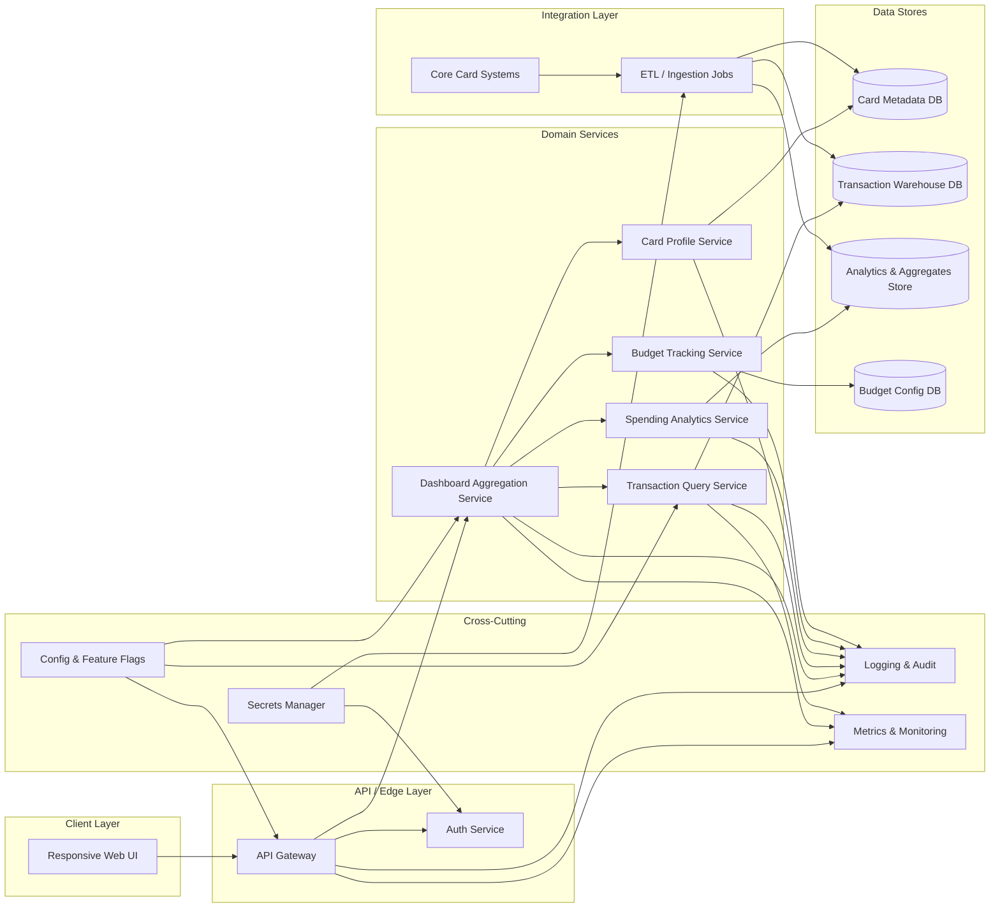

# High-Level Design: Monthly Spending Summary Dashboard (QE-3319)

## 1. Architecture Overview

The Monthly Spending Summary Dashboard is an enterprise web application that provides cardholders with aggregated views and analytics of credit card spending, utilization, budgeting, and recent activity. The solution is designed as a multi-tier, cloud-ready architecture with clear separation of concerns:

- **Client Layer**: Responsive single-page web application (SPA) rendered in browsers across mobile, tablet, and desktop form factors.
- **API / Edge Layer**: Secure RESTful APIs behind an API Gateway, responsible for request routing, throttling, authentication, and authorization.
- **Domain Services Layer**: Microservices / modular services handling cards, transactions, analytics, and budgeting logic.
- **Data Stores Layer**: Relational and analytical data stores used for transactional data, reference data, and pre-computed analytics.
- **Integration Layer**: Connectors and scheduled ingestion processes to upstream card-transaction systems and banking systems.
- **Cross-Cutting Concerns**: Security, compliance, logging, monitoring, configuration, secrets management, resiliency, and observability.

The design focuses strictly on **read-only dashboard and analytics** as implied by scope; any payment execution or card-on-file management beyond reading/display is **out of scope** unless explicitly stated otherwise.

### 1.1 Logical Component Diagram (Mermaid)

## 2. Component Descriptions

### 2.1 Client Layer

**Responsive Web UI**
- Single-page application built with modern web framework (e.g., React/Angular/Vue).
- Implements the dashboard summary view with widgets for:
  - Total monthly spend, total credit limit, available credit, outstanding amount, utilization percentage, transaction count.
  - Multiple card management tiles with masked card numbers and metadata (card name, issuing bank, credit limit, available credit, outstanding, billing date, due date).
  - Transaction table with columns for transaction date, merchant, category, card used, amount, payment status, remarks.
  - Filters and search for merchant, category, bank, card, date range; sort by amount and date.
  - Charts for category-wise spending, monthly spending trend, card-wise spending distribution, and category breakdown.
  - Budget tracking widget showing monthly budget, current spend, remaining budget, and utilization percentage with progress bar.
  - Recent transactions widget listing the latest 5 transactions.
- Implements responsive design rules for mobile, tablet, and desktop via CSS frameworks and media queries.
- Handles input validation at the UI level (date range validity, filter values, search terms) before API calls.

### 2.2 API / Edge Layer

**API Gateway**
- Exposes RESTful endpoints for dashboard retrieval, transaction search, analytics, and budget information.
- Performs request routing to Dashboard Aggregation Service and other domain services.
- Enforces HTTPS-only transport, rate limiting, and request size limits.
- Validates authentication tokens (e.g., JWT, OAuth 2.0 access tokens) using Auth Service.
- Applies cross-origin resource sharing (CORS) rules for web client domains.

**Auth Service**
- Integrates with enterprise identity provider (IdP) for user authentication.
- Issues/validates access tokens and session tokens with appropriate lifetimes.
- Provides user identity and authorization claims (e.g., user ID, roles) to downstream services.
- Supports role-based access control (RBAC) and potentially attribute-based (ABAC) for future extensions.
- Does not manage card PINs or payment authorization details (explicitly out of scope).

### 2.3 Domain Services Layer

**Dashboard Aggregation Service**
- Primary entry point for dashboard views.
- Orchestrates data retrieval from Card Profile Service, Transaction Query Service, Spending Analytics Service, and Budget Tracking Service.
- Computes dashboard summary metrics:
  - Total monthly spend (sum of applicable transactions in current month).
  - Total credit limit and available credit across cards.
  - Outstanding amount and utilization percentage.
  - Number of transactions based on date filter.
- Assembles data into a single dashboard response payload optimized for the UI.
- Ensures that filters and search parameters are propagated to underlying services.
- Applies user-specific scoping: ensures users can only see cards and transactions they are authorized to view.

**Card Profile Service**
- Manages read-only card metadata for display:
  - Card name, issuing bank, masked card number, credit limit, available credit, current outstanding, billing date, due date.
- Provides card listings per user based on identity from Auth Service.
- Interfaces with Card Metadata DB for data retrieval.
- Does not modify card limits or perform card servicing operations (out of scope).

**Transaction Query Service**
- Provides search and filter capabilities over transactions:
  - Filter by merchant, category, bank, card, date range.
  - Sort by amount and date.
- Returns results in a paginated, responsive format suitable for the UI’s transaction table.
- Supports retrieving the latest 5 transactions for the recent transactions widget.
- Queries Transaction Warehouse DB optimized for analytics and reporting workloads.

**Spending Analytics Service**
- Generates data for charts:
  - Category-wise spending for selected time period.
  - Monthly spending trend (e.g., last 6–12 months).
  - Card-wise spending distribution.
  - Category breakdown with defined categories (Food & Dining, Fuel, Shopping, Travel, Entertainment, Utilities, Healthcare, Education, Miscellaneous).
- May use pre-computed aggregates stored in Analytics & Aggregates Store for performance.
- Ensures categories are consistently mapped, with extensibility for new categories.

**Budget Tracking Service**
- Manages user-defined monthly budget configuration (amount and optional per-category budgets if extended).
- Calculates current spend and remaining budget for the configured period using transaction data and/or aggregates.
- Computes budget utilization percentages and supports visualization via progress bar.
- Stores budget configuration and state in Budget Config DB.
- Does not perform automatic payment or fund transfers (out of scope).

### 2.4 Data Stores Layer

**Card Metadata DB**
- Relational database storing card profiles and user-to-card mappings.
- Contains only masked card identifiers or tokenized references; no clear-text PANs.
- Holds billing and due dates, credit limits, and outstanding balances for display.

**Transaction Warehouse DB**
- Analytical store (could be columnar database or data warehouse) storing normalized transaction records.
- Schema includes fields for transaction date, merchant identifier, category, card reference, amount, payment status, and remarks.
- Optimized for read-heavy filter, sort, and aggregation queries.

**Analytics & Aggregates Store**
- Stores pre-computed metrics for category-wise spending, trends, and distributions to improve dashboard responsiveness.
- Refreshed by ETL/Ingestion Jobs based on transaction data.

**Budget Config DB**
- Stores user budget definitions and tracking state.
- Supports versioning of budget configurations and historical comparisons.

### 2.5 Integration Layer

**ETL / Ingestion Jobs**
- Scheduled or streaming processes ingesting authorized transaction and card metadata from Core Card Systems.
- Normalize, mask, and enrich data before persisting to Card Metadata DB, Transaction Warehouse DB, and Analytics & Aggregates Store.
- Implement data quality rules for missing categories, invalid dates, or inconsistent card references.

**Core Card Systems**
- Upstream enterprise systems for card issuance and transaction processing.
- Act as authoritative data sources; interaction is read-only via ETL for this epic.

### 2.6 Cross-Cutting Services

**Logging & Audit Service**
- Centralized, immutable logging platform collecting:
  - API Gateway access logs.
  - Service-level logs (Dashboard, Card, Transaction, Analytics, Budget).
  - Security events (auth success/failure, authorization denials).
- Audit logs capture user ID, timestamp, operation, and resource references (e.g., card token, not clear card number).

**Metrics & Monitoring Service**
- Time-series metrics for latency, error rates, throughput, and resource utilization.
- Dashboards and alerts for SLA/SLO compliance.

**Config & Feature Flags Service**
- Central configuration service for environment-specific settings (rate limits, cache TTLs, chart windows, etc.).
- Feature flags to enable/disable modules (e.g., budget tracking) without redeployment.

**Secrets Manager**
- Secure storage for integration credentials, database passwords, token signing keys.
- Secrets are never hard-coded; accessed via runtime bindings.

## 3. Integration Points & Data Flow

### 3.1 Flow 1 – Authentication and Session Establishment

1. User accesses the Responsive Web UI over HTTPS.
2. Web UI redirects or integrates with enterprise IdP for login.
3. Upon successful authentication, IdP issues access token.
4. Web UI stores token in secure browser storage (e.g., HTTP-only cookies or secure storage) and attaches it to API requests.
5. API Gateway validates token via Auth Service.
6. Auth Service returns token validation result and user claims to API Gateway.
7. API Gateway allows or denies the request based on validation and configured RBAC policies.

**Scope Traceability**: Required for all dashboard, transaction management, analytics, and budget features since user-specific data must be securely scoped.

### 3.2 Flow 2 – Dashboard Summary Retrieval

1. Web UI calls `/dashboard/summary` on API Gateway with selected date range (e.g., current month) and optional filters.
2. API Gateway authenticates the request and routes it to Dashboard Aggregation Service.
3. Dashboard Aggregation Service reads user identity from claims to determine card set.
4. Dashboard Aggregation Service calls Card Profile Service to retrieve card metadata for the user.
5. Card Profile Service queries Card Metadata DB and returns card list with masked numbers, credit limits, available credit, outstanding amounts, billing and due dates.
6. Dashboard Aggregation Service calls Transaction Query Service to fetch transaction summary (e.g., total monthly spend, number of transactions) for the specified period.
7. Transaction Query Service queries Transaction Warehouse DB with necessary filters.
8. Dashboard Aggregation Service calls Spending Analytics Service for utilization and additional metrics (if pre-computed).
9. Spending Analytics Service reads from Analytics & Aggregates Store.
10. Dashboard Aggregation Service calls Budget Tracking Service for budget, current spend, remaining budget, and utilization percentage.
11. Budget Tracking Service reads from Budget Config DB and may query Transaction Warehouse DB or Analytics Store.
12. Dashboard Aggregation Service assembles the response payload including:
    - Dashboard summary metrics.
    - Multiple card metadata tiles.
    - Budget tracking information.
    - High-level analytics indicators.
13. API Gateway returns response to Web UI over HTTPS.

**Scope Traceability**: Covers Dashboard Summary, Total Monthly Spend, Total Credit Limit, Available Credit, Outstanding Amount, Utilization Percentage, Number of Transactions, Credit Card Management, Budget Tracking.

### 3.3 Flow 3 – Transaction Management (Search, Filter, Sort)

1. User opens transaction table in Web UI, optionally adjusting filters (merchant, category, bank, card, date range) and sort options.
2. Web UI validates filter inputs and calls `/transactions/search` on API Gateway.
3. API Gateway authenticates and routes request to Transaction Query Service.
4. Transaction Query Service parses filter and sort parameters, validates date ranges, and applies user-specific scoping.
5. Transaction Query Service queries Transaction Warehouse DB with appropriate WHERE clauses and ORDER BY.
6. Transaction Query Service returns paginated transaction list including transaction date, merchant, category, card reference, amount, payment status, and remarks.
7. Web UI renders transaction table and supports infinite scroll or paging.
8. For recent transactions widget, Web UI calls `/transactions/recent?limit=5`; Transaction Query Service returns the latest 5 transactions.

**Scope Traceability**: Covers Transaction Management, transaction table fields, Filters and Search, Sort by Amount/Date, Recent Transactions Widget.

### 3.4 Flow 4 – Spending Analytics and Visualization

1. User navigates to analytics section of the dashboard.
2. Web UI calls `/analytics/spending` (for category-wise, card-wise, trends) with selected date range and card filters.
3. API Gateway authenticates and routes request to Spending Analytics Service.
4. Spending Analytics Service validates input and determines if pre-computed aggregates are available.
5. If pre-computed, reads aggregated metrics from Analytics & Aggregates Store; otherwise, queries Transaction Warehouse DB and computes metrics on the fly.
6. Spending Analytics Service returns structured data series for:
   - Category-wise spending.
   - Monthly spending trends.
   - Card-wise spending distribution.
   - Category breakdown.
7. Web UI renders charts (bar, line, pie/donut, etc.) using chart libraries.

**Scope Traceability**: Covers Spending Analytics, Category-wise Spending, Monthly Spending Trend, Card-wise Spending Distribution, Category Breakdown with defined categories.

### 3.5 Flow 5 – Budget Tracking View

1. User opens budget tracking component on dashboard.
2. Web UI calls `/budget/summary` via API Gateway.
3. API Gateway authenticates and routes to Budget Tracking Service.
4. Budget Tracking Service retrieves budget configuration from Budget Config DB.
5. Budget Tracking Service calculates current spend and remaining budget for the configured monthly period using Transaction Warehouse DB or Analytics Store.
6. Budget Tracking Service computes budget utilization percentage.
7. Budget Tracking Service returns budget amount, current spend, remaining, and utilization percentage.
8. Web UI renders budget panel with numeric values and progress bar visualization.

**Scope Traceability**: Covers Budget Tracking, Monthly Budget, Current Spend, Remaining Budget, Budget Utilization %, Progress Bar.

### 3.6 Flow 6 – Logging, Monitoring, and Audit

1. Each incoming request through API Gateway generates an access log and metrics entries.
2. Each domain service call (Dashboard, Card, Transaction, Analytics, Budget) produces structured logs with correlation IDs.
3. Logs and metrics are pushed to Logging & Audit Service and Metrics & Monitoring Service.
4. Audit records are stored for user-facing read operations that access sensitive resources (transactions, card details), capturing user ID, operation, and resource identifiers.
5. Alerts are generated based on thresholds (e.g., error rate, latency) to operations teams.

**Scope Traceability**: Supports observability and operational insight implied by enterprise-grade architecture requirements.

## 4. Security & Compliance Features

### 4.1 Transport Security
- All communication between Web UI and API Gateway is enforced over HTTPS with modern TLS configurations.
- Internal service-to-service communication is secured via mutual TLS or service mesh where applicable.

### 4.2 Data Encryption
- Data at rest in Card Metadata DB, Transaction Warehouse DB, Analytics Store, and Budget Config DB is encrypted using enterprise-grade encryption.
- Only masked card identifiers and tokenized references are stored; no full card numbers or sensitive cardholder data in clear text.

### 4.3 Input Validation & Output Filtering
- UI validates filter parameters and search inputs (length, type, permitted characters) before submission.
- API Gateway and services perform server-side validation for date ranges, card identifiers, category values, and pagination parameters.
- Output payloads are filtered to only include fields required by dashboard views; no internal IDs or unnecessary sensitive attributes.

### 4.4 RBAC/ABAC
- Auth Service emits user roles and attributes (e.g., customer vs. support agent).
- Dashboard and Transaction services enforce RBAC so users can access only their own cards and transactions.
- ABAC can be used to restrict access based on attributes such as region or product type if needed.

### 4.5 Audit Logging
- All access to transaction and card data is logged with:
  - User identifier (non-PII, e.g., internal customer ID).
  - Timestamp and source IP.
  - Operation (view dashboard, search transactions, view budget).
  - Outcome (success/failure).
- Audit records stored in immutable log store with retention aligned to organization policy.

### 4.6 Secrets Management
- API Gateway, Auth Service, ETL jobs, and databases retrieve credentials and certificates from Secrets Manager at runtime.
- Secret rotation policies ensure regular key and credential updates.

### 4.7 Compliance Mapping
- **PCI-DSS**: The design positions this system as a consumer of masked/tokenized card data from PCI-compliant upstream systems. No payment authorization or full PAN storage occurs here. Compliance status: *Pass-with-conditions* (requires upstream PCI-compliant systems and masking/tokenization enforced in ETL).
- **Privacy Regulations (e.g., GDPR/CCPA)**: System stores and processes customer transaction history and budgets. Access is controlled, logs are maintained, and data minimization is applied. Compliance status: *Pass-with-conditions* (requires appropriate retention policies and user consent/rights management handled at platform level).

## 5. Resiliency & Error Handling

### 5.1 Retry Mechanisms
- Idempotent reads from domain services may be retried on transient failures with exponential backoff.
- ETL jobs implement retries for transient connectivity issues to Core Card Systems.

### 5.2 Circuit Breakers and Timeouts
- API Gateway enforces per-endpoint timeouts.
- Circuit breaker patterns applied around downstream service calls (Transaction Query, Analytics, Budget, Card) to prevent cascading failures.

### 5.3 Graceful Degradation
- If Analytics Store is unavailable, Spending Analytics Service falls back to simplified metrics computed on the fly or hides advanced charts while keeping basic dashboard summary operational.
- If Budget service fails, dashboard still loads transaction and card data but displays a notice indicating budget data is temporarily unavailable.

### 5.4 Error Handling Semantics
- Standardized HTTP status codes:
  - `200 OK` – Successful responses.
  - `400 Bad Request` – Invalid filter parameters (e.g., unsupported categories, malformed dates).
  - `401 Unauthorized` – Missing or invalid tokens.
  - `403 Forbidden` – User authenticated but not authorized for requested resource.
  - `404 Not Found` – No cards or transactions found for given criteria.
  - `429 Too Many Requests` – Rate limits exceeded.
  - `500 Internal Server Error` – Unexpected server-side errors.
  - `503 Service Unavailable` – Downstream services unavailable.
- Error responses expose only non-sensitive messages (e.g., generic error codes and correlation ID); internal details are logged but not returned to users.

### 5.5 Observability
- Distributed tracing with correlation IDs across API Gateway and services.
- Dashboards and alerts for:
  - Latency of dashboard summary, transaction search, analytics retrieval.
  - Error rates per endpoint.
  - ETL job health and data freshness.

## 6. Validation Report

### 6.1 Requirements Coverage (Scope → Components/Flows)

1. **Dashboard Summary (Total Monthly Spend, Total Credit Limit, Available Credit, Outstanding Amount, Utilization Percentage, Number of Transactions)**
   - Components: Responsive Web UI, API Gateway, Dashboard Aggregation Service, Card Profile Service, Transaction Query Service, Spending Analytics Service, Card Metadata DB, Transaction Warehouse DB, Analytics Store.
   - Flows: Flow 2 (Dashboard Summary Retrieval), Flow 6 (Logging/Monitoring).

2. **Credit Card Management (Display multiple credit cards: card name, issuing bank, masked card number, credit limit, available credit, current outstanding, billing date, due date)**
   - Components: Responsive Web UI, Dashboard Aggregation Service, Card Profile Service, Card Metadata DB.
   - Flows: Flow 2.

3. **Transaction Management (Table with transaction date, merchant name, category, card used, amount, payment status, remarks)**
   - Components: Responsive Web UI, API Gateway, Transaction Query Service, Transaction Warehouse DB.
   - Flows: Flow 3.

4. **Filters and Search (merchant, category, bank, card, date range; sort by amount/date)**
   - Components: Responsive Web UI, API Gateway, Transaction Query Service, Transaction Warehouse DB.
   - Flows: Flow 3.

5. **Spending Analytics (Category-wise spending, monthly spending trend, card-wise spending distribution, category breakdown with defined categories)**
   - Components: Responsive Web UI, API Gateway, Spending Analytics Service, Analytics & Aggregates Store, Transaction Warehouse DB.
   - Flows: Flow 4.

6. **Budget Tracking (Monthly Budget, Current Spend, Remaining Budget, Budget Utilization %, Progress Bar)**
   - Components: Responsive Web UI, API Gateway, Budget Tracking Service, Budget Config DB, Transaction Warehouse DB or Analytics Store.
   - Flows: Flow 2, Flow 5.

7. **Recent Transactions Widget (latest 5 transactions)**
   - Components: Responsive Web UI, API Gateway, Transaction Query Service, Transaction Warehouse DB.
   - Flows: Flow 3.

8. **Responsive Design (Mobile, Tablet, Desktop)**
   - Components: Responsive Web UI.
   - Flows: All user-facing flows (1–5) rely on UI responsiveness.

### 6.2 Compliance Status

- **Transport Security**: Pass. HTTPS enforced at API Gateway and secured internal channels.
- **Data Encryption at Rest**: Pass. All data stores designed with encryption at rest; card data is masked/tokenized.
- **Access Control (RBAC/ABAC)**: Pass-with-conditions. Requires integration with enterprise IdP and full configuration of roles and policies.
- **PCI-DSS Alignment**: Pass-with-conditions. Assumes upstream Core Card Systems are PCI-compliant and ETL enforces masking/tokenization.
- **Privacy Regulations (GDPR/CCPA or similar)**: Pass-with-conditions. Assumes platform-level data subject rights, retention policies, and legal basis management are in place.
- **Audit & Logging**: Pass. Comprehensive logging and audit trails defined.

### 6.3 Identified Ambiguities/Risks

1. **Ambiguity/Risk**: Exact definition of "Monthly" in spending and budget (calendar month vs. billing cycle).
   - Consequence: Inconsistent reporting and user confusion regarding totals and utilization.
   - Mitigation: Introduce configuration allowing selection between calendar month and billing cycle; document chosen approach and surface it in UI labels.

2. **Ambiguity/Risk**: Category mapping rules (transaction categories vs. user-defined categories).
   - Consequence: Misclassified spending affecting analytics and budgeting accuracy.
   - Mitigation: Standardize category taxonomy; implement mapping rules in ETL and provide governance and periodic review.

3. **Ambiguity/Risk**: Handling of multi-card users across multiple issuing banks.
   - Consequence: Potential data scope issues if authorization boundaries are unclear between banks.
   - Mitigation: Ensure user-to-card mapping is explicitly governed; enforce per-bank access rules via Card Profile Service and Auth claims.

4. **Ambiguity/Risk**: Budget configuration lifecycle (who sets/updates budgets, and how frequently).
   - Consequence: Outdated or incorrect budget values leading to misleading utilization views.
   - Mitigation: Define UX for budget configuration updates and implement versioning with effective dates in Budget Config DB.

5. **Ambiguity/Risk**: Response behavior for large datasets (high transaction volumes over wide date ranges).
   - Consequence: Performance degradation and timeouts, impacting user experience.
   - Mitigation: Enforce reasonable pagination, default date ranges, and index strategy on Transaction Warehouse DB; add caching for common queries.

6. **Boundary Risk (Out of Scope)**: Payment execution, dispute management, card limit changes, and card servicing actions are not part of this epic.
   - Consequence: Users might expect action buttons (e.g., "Pay Now", "Dispute Transaction") that are unsupported.
   - Mitigation: UI design should clearly position dashboard as informational only or integrate with separate epics/services via deep links, with clear separation.
