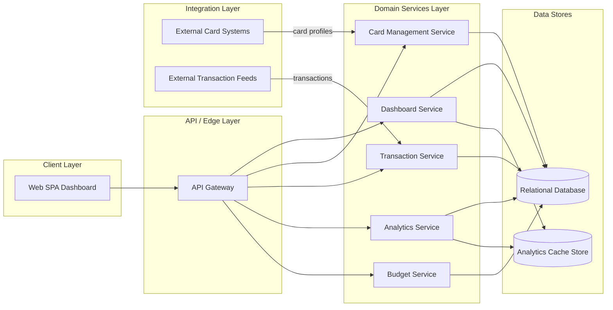

# High-Level Design: Monthly Spending Summary Dashboard (QE-3338)

## 1. Architecture Overview

The Monthly Spending Summary Dashboard is a responsive web application that provides users with consolidated views and analytics of their credit card usage, spending patterns, and budgets. The architecture follows a standard multi-tier enterprise pattern:

- **Client Layer**: Single-page web application (SPA) built with a modern UI framework (e.g., React/Angular/Vue). It renders dashboard widgets, transaction tables, analytics charts, filters, and responsive layouts for mobile, tablet, and desktop.
- **API / Edge Layer**: Stateless RESTful APIs accessed over HTTPS via an API Gateway / Edge Service. Provides endpoints for dashboard summary, credit card data, transaction retrieval and filtering, analytics aggregates, and budget tracking.
- **Domain Services Layer**: Backend microservices encapsulating core business logic:
  - **Dashboard Service** – Orchestrates summary metrics (total monthly spend, utilization, transaction counts) and aggregates credit card and transaction data.
  - **Card Management Service** – Manages card profiles and card-related attributes (masked card numbers, limits, dates).
  - **Transaction Service** – Handles retrieval, filtering, and sorting of transaction records.
  - **Analytics Service** – Computes category-wise spending, monthly trends, card-wise distribution, and category breakdowns.
  - **Budget Service** – Manages monthly budgets, current spend, remaining amounts, and utilization percentages.
- **Data Stores**:
  - **Relational Database (RDBMS)** – Stores normalized entities: Users, Cards, Transactions, Budgets, Categories, and derived aggregates. Uses appropriate indexing for search/filter and analytics queries.
  - **Analytics Cache Store** (e.g., Redis) – Stores pre-computed aggregates (per month, per card, per category) for fast chart rendering.
- **Integration Layer**:
  - **Card & Transaction Ingestion Adapters** – Abstract integration with external card issuers or upstream transaction feeds (if/when added in other Epics). For this Epic, they are assumed as external sources with well-defined APIs but the implementation details may be out of scope.
- **Cross-Cutting Concerns**:
  - Authentication & session handling (relying on existing enterprise identity provider).
  - Authorization for user-level data access.
  - Observability (logging, metrics, traces).
  - Security controls (transport layer, data encryption, secrets management).
  - Error handling and resiliency features.

### Mermaid Component Diagram

## 2. Component Descriptions

### 2.1 Client Layer – Web SPA Dashboard
- Renders the Monthly Spending Summary Dashboard including widgets for total spend, utilization, number of transactions, and budget progress.
- Displays responsive transaction tables with sorting, filtering, and search.
- Renders analytics visualizations (category-wise spending, monthly trends, card-wise distribution, category breakdown grids/charts).
- Provides responsive layouts and breakpoints for mobile, tablet, and desktop.
- Invokes secured REST APIs to retrieve dashboard data; does not perform business-critical calculations beyond UI formatting.

### 2.2 API Gateway / Edge Layer
- Terminates HTTPS connections and enforces global security policies (TLS, authentication, request throttling).
- Routes incoming requests to the appropriate backend service based on URI path and HTTP method.
- Applies common concerns such as rate limiting, request/response transformation, and API versioning.
- Enforces authentication via JWT/OAuth2 tokens issued by the enterprise IdP.

### 2.3 Dashboard Service
- Aggregates credit card and transaction data to produce dashboard summary metrics:
  - Total monthly spend across all cards for the selected period.
  - Total credit limit, available credit, outstanding amount, utilization percentage.
  - Number of transactions.
- Reads data from Card Management Service, Transaction Service, and Budget Service (via internal APIs or shared database models) and composes a single response for the UI.
- Fetches or updates cached aggregates in the Analytics Cache Store for performance-sensitive views.
- Provides endpoints like `/dashboard/summary`, `/dashboard/recent-transactions`, `/dashboard/widgets`.

### 2.4 Card Management Service
- Manages data for multiple credit cards per user:
  - Card name.
  - Issuing bank.
  - Masked card number (only displays partial PAN, e.g., last 4 digits; full card numbers are never exposed to the client).
  - Credit limit and available credit.
  - Current outstanding.
  - Billing date and due date.
- Exposes APIs for retrieving user-specific card lists and card-level utilization details.
- Ensures card data is correctly associated with the authenticated user and not shared across tenants.

### 2.5 Transaction Service
- Manages transactional records used by the dashboard:
  - Transaction Date.
  - Merchant Name.
  - Category.
  - Card Used.
  - Amount.
  - Payment Status.
  - Remarks.
- Provides endpoints for paginated, sortable, and filterable transaction queries:
  - Search by merchant.
  - Filter by category, bank, card, date range.
  - Sort by amount or date.
- Implements server-side filtering and sorting to avoid data over-fetching and client-side heavy lifting.

### 2.6 Analytics Service
- Computes analytical views and aggregates required by the dashboard:
  - Category-wise spending for the selected month or period.
  - Monthly spending trend for a defined historical window.
  - Card-wise spending distribution across user’s cards.
  - Detailed category breakdown across pre-defined categories (Food & Dining, Fuel, Shopping, Travel, Entertainment, Utilities, Healthcare, Education, Miscellaneous).
- Writes frequently used aggregates to the Analytics Cache Store for fast read access.
- Exposes APIs such as `/analytics/category-spend`, `/analytics/monthly-trend`, `/analytics/card-distribution`, `/analytics/category-breakdown`.

### 2.7 Budget Service
- Manages monthly budgets per user and optionally per category:
  - Monthly budget amount.
  - Current spend (based on transactions).
  - Remaining budget.
  - Budget utilization percentage.
- Calculates and returns data needed for the budget widget, including a progress bar representation of utilization.
- Exposes APIs like `/budget/summary` and `/budget/utilization`.

### 2.8 Relational Database (RDBMS)
- Core schema includes:
  - **User**: user_id, identity references.
  - **Card**: card_id, user_id, masked_card_number, issuing_bank, credit_limit, available_credit, current_outstanding, billing_date, due_date.
  - **Transaction**: tx_id, card_id, user_id, tx_date, merchant_name, category_code, amount, payment_status, remarks.
  - **Budget**: budget_id, user_id, month, total_budget_amount, current_spend_amount, remaining_budget_amount, utilization_percentage.
  - **Category**: category_code, description.
- Uses appropriate indexing on user_id, tx_date, category_code, card_id, and amount to support filter and sort operations.
- Ensures referential integrity between users, cards, transactions, and budgets.

### 2.9 Analytics Cache Store
- Stores pre-computed aggregates keyed by user and time horizon, e.g.:
  - `user:{user_id}:month:{YYYY-MM}:category-spend`.
  - `user:{user_id}:month:{YYYY-MM}:card-distribution`.
- Provides fast retrieval for dashboard analytics queries.
- Expiration policies keep cached data aligned with transaction updates; cache invalidation is triggered by new or updated transactions.

### 2.10 Integration Layer – External Card Systems & Transaction Feeds
- Abstracts connections to external issuer APIs and transaction feeds.
- Responsible for ingesting card attributes and transaction records into internal data stores via scheduled jobs or event-driven pipelines.
- For this Epic’s HLD, detailed ingestion logic (ETL, connectors) is considered **out of scope** and implemented under separate Epics; this design only assumes normalized data is present in the internal database.

## 3. Integration Points & Data Flow

### Flow 1 – User Authentication & Session Establishment
1. User navigates to the dashboard UI via browser.
2. UI redirects to enterprise Identity Provider (IdP) if no active session/token is present.
3. IdP authenticates user and returns an access token (e.g., OAuth2/OIDC JWT) to the client.
4. UI stores the token securely (memory or secure storage) and attaches it to every API call via Authorization header.
5. API Gateway validates the token on receipt, checks signature, expiration, and claims.
6. Authorized requests are forwarded to backend services.

### Flow 2 – Dashboard Summary Retrieval
1. UI calls `/dashboard/summary` on API Gateway with the user’s access token.
2. API Gateway authenticates the token and routes the request to Dashboard Service.
3. Dashboard Service queries Card Management Service for card list and credit details, either via internal API or direct DB access.
4. Dashboard Service queries Transaction Service for aggregated monthly spend and transaction count.
5. Dashboard Service queries Budget Service for budget summary and utilization.
6. Dashboard Service computes:
   - Total monthly spend.
   - Total credit limit.
   - Available credit.
   - Outstanding amount.
   - Utilization percentage.
   - Number of transactions.
7. Dashboard Service returns a consolidated summary payload to API Gateway.
8. API Gateway returns the response to the UI, which renders it in dashboard widgets.

### Flow 3 – Transaction Table with Filters, Search & Sorting
1. UI sends a request to `/transactions` (via API Gateway) with parameters like merchant search term, category, bank, card, date range, sort field, and sort direction.
2. API Gateway validates the token and forwards the request to Transaction Service.
3. Transaction Service builds parametrized queries using validated filter parameters.
4. Transaction Service retrieves paginated transaction records from the database.
5. Transaction Service returns structured transaction data (date, merchant, category, card used, amount, payment status, remarks) to API Gateway.
6. API Gateway returns this data to the UI.
7. UI renders the responsive table, applying front-end formatting but not altering the underlying data semantics.

### Flow 4 – Spending Analytics Retrieval
1. UI invokes analytics endpoints (e.g., `/analytics/category-spend`, `/analytics/monthly-trend`, `/analytics/card-distribution`, `/analytics/category-breakdown`) via API Gateway.
2. API Gateway validates the token and routes requests to Analytics Service.
3. Analytics Service checks the Analytics Cache Store for existing aggregates.
4. If aggregates are missing or expired, Analytics Service queries the database for transactions and recomputes the required aggregates.
5. Analytics Service writes refreshed aggregates to the cache and returns them to API Gateway.
6. API Gateway delivers the analytics payload to the UI.
7. UI renders charts such as bar charts, line charts, pie charts, and breakdown tables per the specified categories.

### Flow 5 – Budget Tracking & Progress Bar
1. UI calls `/budget/summary` or `/budget/utilization` via API Gateway.
2. API Gateway authenticates the request and routes to Budget Service.
3. Budget Service retrieves budget configuration and current spend from the database.
4. Budget Service calculates remaining budget and utilization percentage.
5. Budget Service returns budget metrics to API Gateway.
6. API Gateway returns the data to the UI.
7. UI renders the budget panel, including a progress bar for utilization.

### Flow 6 – Recent Transactions Widget
1. UI requests `/dashboard/recent-transactions` via API Gateway.
2. API Gateway validates and forwards to Dashboard Service.
3. Dashboard Service queries Transaction Service (or directly DB) for the latest 5 transactions for the user.
4. Dashboard Service returns a compact list of recent transactions.
5. API Gateway forwards the list to UI.
6. UI displays the last 5 transactions in the widget.

## 4. Security & Compliance Features

### 4.1 Transport Security
- All client-to-server communication occurs over HTTPS using TLS 1.2+.
- API Gateway enforces secure ciphers and disables insecure protocols.

### 4.2 Data Encryption
- Sensitive data at rest (e.g., card details, transactions, budgets) is stored in encrypted form using database-level or storage-level encryption.
- Card numbers are stored tokenized or encrypted and only exposed in masked form to the UI.

### 4.3 Input Validation
- API Gateway and backend services validate query parameters and request bodies:
  - Allowed filter fields (category, date range, bank, card).
  - Pagination controls (page, page size) with limits.
  - Sort fields restricted to defined columns (amount, date).
- Server-side validation prevents injection and unexpected payloads.

### 4.4 Output Filtering
- Backend services ensure only user-specific data is returned; multi-tenant isolation is enforced via user_id scoping.
- Card numbers are always masked before output.
- Transaction details avoid exposing PII beyond the fields necessary (merchant name, category, amount, etc.); no raw account numbers or full PAN are exposed.

### 4.5 RBAC / ABAC
- Authorization is primarily user-based: users can access only their own card, transaction, budget, and analytics data.
- API Gateway and services interpret token claims (user_id, roles) to scope queries.
- Role-based access may restrict access to advanced analytics or administrative reports if required by future Epics.

### 4.6 Audit Logging
- Key operations are logged:
  - Dashboard summary accesses.
  - Transaction query execution (filters used, but not sensitive values).
  - Budget view and updates (if updates are added in future Epics).
- Logs exclude PII and full card numbers, using internal IDs and masked representations.

### 4.7 Secrets Management
- API keys, DB credentials, and encryption keys are stored in an enterprise secrets vault.
- Services retrieve secrets at startup or via short-lived tokens; secrets are never hard-coded.

### 4.8 Compliance Mapping
- **PCI-DSS**: While the Epic involves credit card information, the dashboard is designed to avoid handling or displaying full card PANs. Storage and processing of card data must comply with PCI-DSS guidelines, particularly for encryption, access control, logging, and network segmentation.
- **Data Protection/Privacy (e.g., GDPR-like)**: User data access is limited to authenticated users; personal identifiers are minimized in responses and logs.

## 5. Resiliency & Error Handling

### 5.1 Retry Mechanisms
- Internal service-to-service calls (Dashboard Service → Analytics Service, etc.) implement retries with exponential backoff for transient network errors.
- Retry counts and backoff intervals are configurable and monitored.

### 5.2 Circuit Breakers
- A circuit breaker pattern is applied around high-latency or unstable dependencies such as Analytics Service and external card/transaction feeds.
- On open circuit, services return degraded responses (e.g., last known cached aggregates) rather than blocking.

### 5.3 Timeouts
- All outbound calls have configured timeouts to prevent resource exhaustion.
- Short timeouts for synchronous UI-related endpoints; longer timeouts may be used for background aggregates.

### 5.4 Graceful Degradation
- If Analytics Service or cache is unavailable, dashboard summary still functions using baseline aggregates computed on the fly, possibly limited time ranges.
- If external card/transaction feeds are delayed, dashboard uses the latest available internal data, with potential banners indicating data freshness.

### 5.5 Error Handling & Response Semantics
- Common HTTP status codes:
  - **200 OK** – Successful data retrieval.
  - **400 Bad Request** – Invalid filter parameters or malformed requests; response includes validation error codes but not internal stack traces.
  - **401 Unauthorized** – Missing or invalid authentication token.
  - **403 Forbidden** – Token valid but not authorized to access requested resource.
  - **404 Not Found** – Resource not found (e.g., no transactions within criteria).
  - **429 Too Many Requests** – Rate limit exceeded.
  - **500 Internal Server Error** – Unhandled server errors; response includes generic error message without sensitive details.
- Error payloads use standardized error codes and correlation IDs for easier troubleshooting.

### 5.6 Observability
- Structured logging across all services, including correlation IDs tied to API Gateway requests.
- Metrics for API latencies, error rates, cache hit rates, and database query performance.
- Tracing instrumentation for cross-service requests via distributed tracing.

## 6. Validation Report

### 6.1 Requirements Coverage (Scope → Components & Flows)

1. **Dashboard Summary (total monthly spend, credit limit, available credit, outstanding amount, utilization %, number of transactions)**
   - Components: Web SPA Dashboard, API Gateway, Dashboard Service, Card Management Service, Transaction Service, Budget Service, DB, CACHE.
   - Flows: Flow 2 (Dashboard Summary Retrieval).

2. **Credit Card Management (multiple cards with card name, issuing bank, masked number, credit limit, available credit, current outstanding, billing date, due date)**
   - Components: Web SPA Dashboard, API Gateway, Card Management Service, DB.
   - Flows: Flow 2 (Dashboard Summary Retrieval) and supporting internal calls.

3. **Transaction Management (transaction table with date, merchant, category, card used, amount, payment status, remarks)**
   - Components: Web SPA Dashboard, API Gateway, Transaction Service, DB.
   - Flows: Flow 3 (Transaction Table with Filters, Search & Sorting), Flow 6 (Recent Transactions Widget).

4. **Filters and Search (search by merchant; filter by category, bank, card, date range; sort by amount/date)**
   - Components: Web SPA Dashboard, API Gateway, Transaction Service, DB.
   - Flows: Flow 3 (Transaction Table with Filters, Search & Sorting).

5. **Spending Analytics (category-wise spending, monthly spending trend, card-wise spending distribution, category breakdown)**
   - Components: Web SPA Dashboard, API Gateway, Analytics Service, Transaction Service, DB, CACHE.
   - Flows: Flow 4 (Spending Analytics Retrieval).

6. **Category Breakdown with specified categories (Food & Dining, Fuel, Shopping, Travel, Entertainment, Utilities, Healthcare, Education, Miscellaneous)**
   - Components: Web SPA Dashboard, Analytics Service, Category model in DB, CACHE.
   - Flows: Flow 4 (Spending Analytics Retrieval).

7. **Budget Tracking (monthly budget, current spend, remaining budget, budget utilization %, progress bar)**
   - Components: Web SPA Dashboard, API Gateway, Budget Service, Transaction Service, DB.
   - Flows: Flow 5 (Budget Tracking & Progress Bar).

8. **Recent Transactions Widget (latest 5 transactions)**
   - Components: Web SPA Dashboard, API Gateway, Dashboard Service, Transaction Service, DB.
   - Flows: Flow 6 (Recent Transactions Widget).

9. **Responsive Design (mobile, tablet, desktop)**
   - Components: Web SPA Dashboard.
   - Flows: Primarily UI rendering; backend flows 1–6 remain identical regardless of device.

### 6.2 Compliance Status

- **Transport Security**: **Pass** – HTTPS/TLS enforced by API Gateway.
- **Data Encryption at Rest**: **Pass-with-conditions** – Requires implementation of DB/storage encryption and key management; design accounts for this but assumes enterprise standards are applied.
- **Access Control (RBAC/ABAC)**: **Pass** – User-scoped data retrieval and token-based authorization.
- **Audit Logging**: **Pass-with-conditions** – Design specifies audit logging without PII; requires consistent implementation and log review processes.
- **PCI-DSS**: **Pass-with-conditions** – Dashboard handles card-related data but uses masked numbers; compliance depends on tokenization/encryption implementation, network segmentation, and periodic audits.
- **Privacy/Data Protection**: **Pass** – Minimal exposure of user-identifiable data and strict scoping by authenticated user.

### 6.3 Identified Ambiguities/Risks

1. **Source and Freshness of Card/Transaction Data**
   - Ambiguity: The Epic does not specify how card and transaction data are ingested or how near-real-time the data must be.
   - Consequence: Inconsistent dashboards if upstream feeds are delayed; difficulty meeting user expectations for "current" spend and utilization.
   - Mitigation: Define SLAs for data ingestion, implement data freshness indicators in UI, and manage ingestion in separate Epics.

2. **Budget Granularity (per user vs. per category)**
   - Ambiguity: Scope mentions monthly budget but does not clarify whether budgets are per user, per card, or per category.
   - Consequence: Misalignment between user expectations and calculated utilization; UI may not reflect the intended budgeting model.
   - Mitigation: Clarify budget model in requirements; design Budget Service to support flexible granularity but constrain initial implementation to a well-defined scope.

3. **Analytics Time Window Configuration**
   - Ambiguity: Monthly spending trend and analytics may require configurable historical windows; scope does not specify how far back analytics should go.
   - Consequence: Potential performance issues if queries span unbounded history; inconsistent user experience.
   - Mitigation: Introduce configuration for historical range (e.g., last 12 months); use caching and pagination for long time ranges.

4. **Multi-Tenancy and Role-Based Views**
   - Ambiguity: The Epic focuses on individual users but does not define requirements for administrative or multi-tenant views.
   - Consequence: Future needs (e.g., admin dashboards) may require rework of access control and aggregation logic.
   - Mitigation: Design services with user_id scoping but keep extensibility for roles; define admin requirements in separate Epics.

5. **External Integrations Out of Scope**
   - Ambiguity: While integration adapters are referenced, the Epic does not include implementation details for card issuer APIs or transaction feeds.
   - Consequence: The dashboard depends on data sources that may not yet exist or may change; risk of incomplete functionality.
   - Mitigation: Treat ingestion connectors and ETL jobs as out of scope for this Epic and explicitly state this in design; align delivery timelines with upstream integration Epics.
