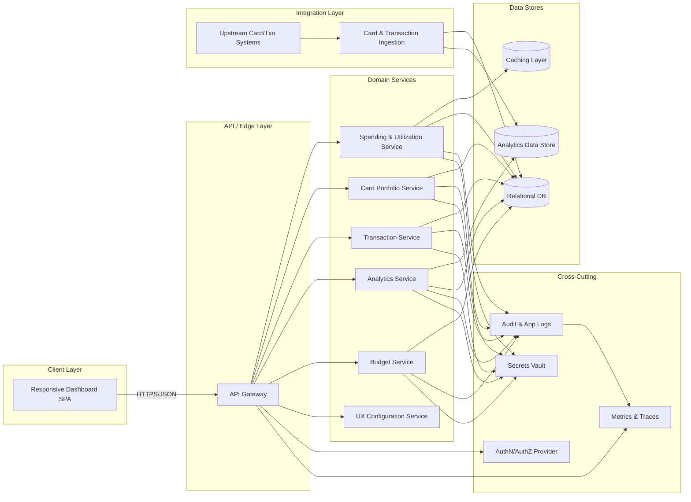

# High-Level Design: Monthly Spending Summary Dashboard v2 (QE-3349)

## 1. Architecture Overview

The "Monthly Spending Summary Dashboard v2" is a responsive, enterprise-grade web application that provides credit card holders with aggregated views of spending, utilization, and budgeting, along with detailed transaction management and analytics. The solution is designed as a multi-tier architecture with clear separation of concerns, security controls, and scalability.

### 1.1 Logical Architecture

- **Client Layer (Web & Mobile UI)**
  - Responsive single-page application (SPA) supporting desktop, tablet, and mobile.
  - Implements dashboard widgets for monthly spend metrics, credit utilization, card management, transaction tables, filters/search, charts, budget tracking, and recent transactions.

- **API / Edge Layer**
  - API Gateway responsible for request routing, throttling, authentication, and centralized policy enforcement.
  - REST/GraphQL API services providing endpoints for dashboard summary, card portfolio, transactions, filters, analytics, and budget data.

- **Domain Services Layer**
  - Spending & Utilization Service: Computes total monthly spend, utilization percentage, and other KPIs.
  - Card Portfolio Service: Manages card metadata and aggregated balances.
  - Transaction Service: Provides paginated, filtered transaction views.
  - Analytics Service: Generates category-wise, monthly trend, card-wise distribution, and category breakdown datasets for charts.
  - Budget Service: Manages monthly budgets, utilization, and remaining budget.
  - UX Configuration Service: Manages widget configurations and responsive layout rules.

- **Data Stores Layer**
  - Relational DB for cards, transactions, budgets, and configuration metadata.
  - Analytics Data Store (e.g., columnar or OLAP) optimized for aggregations across categories, cards, and time.
  - Caching layer (e.g., Redis) to serve frequently accessed dashboard metrics.

- **Integration Layer**
  - Batch/Streaming ingestion from upstream card/transaction systems.
  - Optional integration to customer profile systems for card portfolio alignment (cardholder context only; no PII values stored beyond identifiers as per policy).

- **Cross-Cutting Concerns**
  - Authentication & Authorization
  - Security & Compliance controls (transport security, encryption, RBAC/ABAC, audit logging, secrets management).
  - Observability: centralized logging, metrics, tracing.
  - Resiliency: retries, circuit breakers, timeouts.

### 1.2 Component Diagram (Mermaid)

## 2. Component Descriptions

### 2.1 Client Layer

**Responsive Dashboard SPA**
- Implements the main dashboard interface with:
  - Monthly summary metrics (total spend, total credit limit, available credit, outstanding amount, utilization percentage, number of transactions).
  - Credit card portfolio management view listing multiple cards and associated attributes (card name, issuing bank, masked card number, limits, balances, billing/due dates).
  - Transaction management table supporting pagination, sorting, filtering, and responsive layout.
  - Filter & search controls (merchant, category, bank, card, date range, amount, date sort).
  - Spending analytics visualizations: category-wise charts, monthly spending trends, card-wise distributions, category breakdown.
  - Budget tracking widgets: monthly budget, current spend, remaining budget, budget utilization %, progress bar.
  - Recent transactions widget showing the latest 5 transactions.
- Performs client-side validation (e.g., filter values, date ranges) and interacts with API Gateway over secure HTTPS.
- Adapts layout based on viewport (mobile, tablet, desktop) using responsive design frameworks.

### 2.2 API / Edge Layer

**API Gateway**
- Terminates TLS and enforces security policies (rate limiting, IP restrictions if applicable, JWT validation).
- Routes requests from the SPA to backend domain services based on path and method.
- Centralizes cross-cutting concerns like authentication, authorization checks (in conjunction with Auth provider), and basic request validation.
- Provides API versioning and backward compatibility support as dashboard evolves.

### 2.3 Domain Services

**Spending & Utilization Service (SDS)**
- Aggregates transactions and card limits to compute:
  - Total monthly spend.
  - Total credit limit across cards.
  - Available credit across cards.
  - Outstanding amounts.
  - Utilization percentage (e.g., ratio of outstanding amount to total credit limit).
  - Number of transactions within the selected time frame.
- Supports parameterized queries (e.g., month, custom date range) for flexible dashboard time windows.
- Caches frequently requested KPIs to improve dashboard performance.

**Card Portfolio Service (CPS)**
- Manages the list of cards associated with the user.
- Stores card-level metadata:
  - Card name.
  - Issuing bank.
  - Masked card number representation (e.g., **** **** **** 1234) without storing full PAN in the dashboard context.
  - Credit limit, available credit, current outstanding.
  - Billing date, due date.
- Ensures that any sensitive card identifiers comply with masking requirements and are sourced from compliant upstream systems.

**Transaction Service (TS)**
- Provides a paginated, filterable, and sortable transaction API.
- Supports query parameters:
  - Date range.
  - Merchant name.
  - Category.
  - Bank.
  - Card used.
  - Amount ranges.
  - Payment status.
- Returns structured transaction records with fields:
  - Transaction date.
  - Merchant name (non-PII business identifier).
  - Category (enumeration such as Food & Dining, Fuel, Shopping, Travel, Entertainment, Utilities, Healthcare, Education, Miscellaneous).
  - Card identifier (masked or tokenized).
  - Amount.
  - Payment status.
  - Remarks.
- Supports sorting by amount and date and ensures performance for large datasets via indexed queries.

**Analytics Service (AS)**
- Generates time-series and categorical aggregates for visualization:
  - Category-wise spending across the chosen time range.
  - Monthly spending trends (per month totals).
  - Card-wise spending distributions.
  - Category breakdown slices.
- Queries both relational and analytics stores to optimize for performance and correctness.
- Outputs chart-ready datasets (labels, values, metadata) without rendering UI, leaving visualization to the SPA.

**Budget Service (BS)**
- Manages budget entities per user and time period:
  - Monthly budget configuration.
  - Current spend relative to budget.
  - Remaining budget.
  - Budget utilization percentage.
- Calculates progress indicators for UI (e.g., progress bar values) based on transaction aggregates.

**UX Configuration Service (UX)**
- Holds configuration for dashboard modules and layout for different device classes.
- Provides responsive layout hints (widget ordering, collapse behavior) to SPA.
- Maintains feature flags for widgets (e.g., enabling/disabling certain analytics views) without code change.

### 2.4 Data Stores

**Relational DB (RDB)**
- Tables:
  - `cards`: card metadata (masked identifiers, bank, limits, billing/due dates).
  - `transactions`: transactional records with normalized fields (date, merchant, category, card ref, amount, payment status, remarks).
  - `budgets`: per-user budget configurations and current/remaining values.
  - `users`: references to user identities (only identifiers required for dashboard context, no unnecessary PII).
  - `ux_configs`: responsive layout and widget configuration definitions.
- Enforces referential integrity between users, cards, and transactions.

**Analytics Data Store (ADS)**
- Optimized for aggregation queries:
  - Partitioned by user, time period, and card.
  - Pre-computed aggregates for category, month, and card to speed up chart rendering.
- Populated via ingestion processes and/or ETL from transactional tables.

**Caching Layer (CACHE)**
- Stores frequently accessed dashboard metrics (e.g., current month summary KPIs, last computed charts) keyed by user and time frame.
- TTL configured to balance freshness and performance.

### 2.5 Integration Layer

**Card & Transaction Ingestion (INGEST)**
- Receives card and transaction data from upstream systems through batch files, message queues, or streaming APIs.
- Normalizes data into internal schemas and populates RDB/ADS.
- Applies validation to ensure completeness and consistency of card and transaction data.

**Upstream Card/Txn Systems (UPSTREAM)**
- External or core banking/card processing systems that are the source of truth for card limits, balances, and transaction records.
- Integration boundaries are clearly defined; the dashboard is read-only regarding card and transaction data (no in-scope capability to alter upstream data).

### 2.6 Cross-Cutting Components

**AuthN/AuthZ Provider (AUTHZ)**
- Integrates with enterprise identity providers (e.g., SSO, OAuth2/OIDC).
- Issues or validates tokens for authenticated user sessions.
- Provides user roles and attributes for RBAC/ABAC in the API Gateway and services.

**Audit & App Logs (LOG)**
- Captures:
  - Login and access events.
  - Dashboard view, filter, and search operations.
  - Administrative actions on budgets and configurations.
- Logs exclude PII, PHI, and full card numbers; use identifiers or hashed references.

**Metrics & Traces (METRICS)**
- Collects performance metrics and distributed traces for:
  - API latency.
  - Dashboard rendering time.
  - Query performance (transactions, analytics, budgets).

**Secrets Vault (SECRETS)**
- Stores credentials and API keys (DB credentials, integration tokens).
- Enforces rotation policies and access controls.

## 3. Integration Points & Data Flow

### Flow 1: User Authentication & Session Establishment

1. User navigates to the dashboard SPA via browser.
2. SPA redirects to enterprise identity provider for authentication (e.g., OIDC).
3. Upon successful login, user receives an access token (e.g., JWT) bound to the session.
4. SPA attaches the token to each API request to the API Gateway.
5. API Gateway validates token, checks roles/attributes, and establishes an authorized session context.

**Scope Coverage**: Required for secure access to all dashboard features (summary, card management, transactions, analytics, budget tracking, responsive UI).

### Flow 2: Dashboard Summary Retrieval

1. SPA issues a `GET /dashboard/summary` request to API Gateway.
2. API Gateway validates the token and forwards the request to Spending & Utilization Service.
3. SDS checks CACHE for pre-computed summary metrics for the user and current month.
4. If cache miss, SDS queries RDB and/or ADS for relevant transactions and card limits.
5. SDS computes:
   - Total monthly spend.
   - Total credit limit.
   - Available credit.
   - Outstanding amount.
   - Utilization percentage.
   - Number of transactions.
6. SDS populates CACHE with the computed KPIs and returns response to API Gateway.
7. API Gateway sends the JSON payload to SPA.
8. SPA renders dashboard summary widgets for desktop, tablet, and mobile layouts.

**Scope Coverage**: Dashboard Summary, Total Monthly Spend, Total Credit Limit, Available Credit, Outstanding Amount, Utilization Percentage, Number of Transactions, Responsive Design.

### Flow 3: Credit Card Management View

1. SPA issues `GET /cards` request to API Gateway.
2. API Gateway validates authorization and routes to Card Portfolio Service.
3. CPS queries RDB for all cards associated with the user.
4. CPS aggregates card-level values: credit limit, available credit, current outstanding, billing date, due date, and masked card identifiers.
5. CPS returns card list to API Gateway.
6. API Gateway forwards response to SPA.
7. SPA displays the card management section listing multiple cards with attributes as configured.

**Scope Coverage**: Display multiple credit cards with card name, issuing bank, masked card number, credit limit, available credit, current outstanding, billing date, due date.

### Flow 4: Transaction Management Table & Filters

1. User navigates to transaction view or adjusts filters/search.
2. SPA constructs query parameters (merchant, category, bank, card, date range, amount sort, date sort, payment status) and sends `GET /transactions` request to API Gateway.
3. API Gateway performs basic validation (e.g., date range bounds, allowed categories) and routes to Transaction Service.
4. TS builds a query against RDB using provided filters and sort options, applying pagination.
5. TS returns a page of transactions with fields: transaction date, merchant name, category, card used (masked ID), amount, payment status, remarks.
6. API Gateway returns the payload to SPA.
7. SPA renders the responsive transaction table, adjusting layout for device type and maintaining search/filter controls.

**Scope Coverage**: Transaction Management, Transaction table fields, Search by Merchant, Filter by Category/Bank/Card/Date Range, Sort by Amount/Date, Responsive Design for table.

### Flow 5: Spending Analytics Charts

1. SPA issues `GET /analytics/spending` with parameters (time range, aggregation type: category-wise, monthly trend, card-wise distribution, category breakdown).
2. API Gateway validates request and routes to Analytics Service.
3. AS queries ADS for pre-aggregated metrics; if unavailable, queries RDB and updates ADS.
4. AS computes and returns datasets for:
   - Category-wise spending.
   - Monthly spending trend (e.g., per month totals).
   - Card-wise spending distribution.
   - Category breakdown.
5. API Gateway sends analytics datasets to SPA.
6. SPA renders charts (bar, line, pie, etc.) based on datasets and adapts visuals to device screen size.

**Scope Coverage**: Spending Analytics (Category-wise Spending, Monthly Spending Trend, Card-wise Spending Distribution, Category Breakdown) and Category definitions.

### Flow 6: Budget Tracking & Progress Bar

1. SPA issues `GET /budgets/current` request to API Gateway.
2. API Gateway routes request to Budget Service.
3. BS queries RDB and/or ADS for budget configuration and spend aggregates for the current period.
4. BS computes:
   - Monthly budget.
   - Current spend.
   - Remaining budget.
   - Budget utilization percentage.
5. BS returns data to API Gateway.
6. API Gateway forwards the response to SPA.
7. SPA renders budget widgets and progress bar, reflecting utilization and remaining budget.

**Scope Coverage**: Budget Tracking, Monthly Budget, Current Spend, Remaining Budget, Budget Utilization %, Progress Bar.

### Flow 7: Recent Transactions Widget

1. SPA sends `GET /transactions/recent?limit=5` request to API Gateway.
2. API Gateway validates the request and routes to Transaction Service.
3. TS queries RDB for the latest transactions for the user, ordered by transaction date, limited to 5.
4. TS returns the list of recent transactions.
5. API Gateway sends the response back to SPA.
6. SPA renders the Recent Transactions widget across all device layouts.

**Scope Coverage**: Recent Transactions Widget (latest 5 transactions), Responsive Design.

## 4. Security & Compliance Features

### 4.1 Transport Security
- All client-to-API Gateway traffic uses HTTPS with modern TLS configurations.
- Internal service-to-service calls also use TLS where mandated by enterprise policy.

### 4.2 Data Encryption
- At-rest encryption for RDB and ADS via platform-managed keys.
- Card identifiers stored in masked or tokenized form; full payment card numbers are not stored in this dashboard context.

### 4.3 Input Validation
- API Gateway validates incoming parameters for type, range, allowed values, and size (e.g., date ranges, category enums, merchant search strings) to prevent injection and abuse.
- Transaction, analytics, and budget services perform server-side validation of filter, sort, and aggregation parameters.

### 4.4 Output Filtering
- Responses exclude sensitive data; card numbers are masked.
- Logs and analytics omit PII/PHI/PCI sample values, using identifiers or aggregated data only.

### 4.5 RBAC/ABAC
- AuthN/AuthZ integration ensures only authorized users can access their own dashboards.
- Role-based controls prevent cross-user data access (each request is scoped to authenticated user ID).
- Attribute-based rules may restrict access to certain analytics or admin functions based on user attributes.

### 4.6 Audit Logging
- Login, logout, and access attempts are logged.
- Significant events like budget configuration changes are audited.
- Search and filter operations may be aggregated (without sensitive data) for usage analytics.

### 4.7 Secrets Management
- All DB credentials, integration tokens, and encryption keys are managed in Secrets Vault.
- Services obtain secrets at startup or via secure runtime APIs, never hard-coded.

### 4.8 Compliance Mapping
- **PCI-DSS**: The dashboard deals with card-related data but does not persist full card numbers or CVV; masked card numbers and tokenized identifiers align with PCI scope reduction practices. Upstream systems remain PCI systems of record.
- **Privacy**: User identifiers are handled minimally; the dashboard does not expose PII beyond what is necessary for view personalization. No PHI is handled.

## 5. Resiliency & Error Handling

### 5.1 Retry Mechanisms
- API Gateway and services implement limited retries for idempotent calls to data stores and integration layer with exponential backoff.

### 5.2 Circuit Breakers
- Circuit breakers protect the system from repeated calls to failing dependencies (e.g., upstream ingestion services or analytics store).
- When tripped, dashboard falls back to cached metrics or reduced-detail views where safe.

### 5.3 Timeouts
- Standardized timeouts for service calls prevent hanging requests.
- SPA displays user-friendly messages when backend timeouts occur.

### 5.4 Graceful Degradation
- If analytics store becomes unavailable, recent summary metrics can still be served from RDB and CACHE.
- If budget calculations fail, dashboard can temporarily hide budget widgets with appropriate messaging.
- If transaction queries are degraded, the table can show existing cached pages or prompt user to retry.

### 5.5 Error Handling & Status Codes
- Typical status codes:
  - `200 OK`: Successful retrieval of dashboard data.
  - `400 Bad Request`: Invalid filters or parameters; client receives a sanitized error description.
  - `401 Unauthorized`: Missing/invalid token; SPA redirects to login.
  - `403 Forbidden`: Authenticated but not authorized; SPA shows access error without leaking resource details.
  - `404 Not Found`: No data for requested resource (e.g., no cards configured); SPA presents empty state.
  - `500 Internal Server Error`: Unexpected failures; SPA shows generic error message with no internal details.
- Error payloads omit stack traces and internal identifiers, referencing correlation IDs for debugging instead.

### 5.6 Observability
- Centralized logs capture request IDs, user IDs (or hashed IDs), and key operations.
- Metrics monitor request rates, latencies, error ratios, cache hit rates.
- Traces allow end-to-end flow debugging across API Gateway and services.

## 6. Validation Report

### 6.1 Requirements Coverage
- **Dashboard Summary**
  - Components: Responsive Dashboard SPA, API Gateway, Spending & Utilization Service, Relational DB, Caching Layer.
  - Flows: Flow 2 (Dashboard Summary Retrieval).

- **Total Monthly Spend**
  - Components: SDS, RDB/ADS, CACHE, SPA.
  - Flows: Flow 2.

- **Total Credit Limit**
  - Components: SDS, CPS, RDB, CACHE.
  - Flows: Flow 2.

- **Available Credit**
  - Components: SDS, CPS, RDB, CACHE.
  - Flows: Flow 2.

- **Outstanding Amount**
  - Components: SDS, CPS, RDB.
  - Flows: Flow 2.

- **Utilization Percentage**
  - Components: SDS, CPS, RDB, CACHE.
  - Flows: Flow 2.

- **Number of Transactions**
  - Components: SDS, TS, RDB, CACHE.
  - Flows: Flow 2.

- **Display Multiple Credit Cards (Card Name, Issuing Bank, Masked Number, Credit Limit, Available Credit, Current Outstanding, Billing Date, Due Date)**
  - Components: SPA, API Gateway, CPS, RDB.
  - Flows: Flow 3 (Credit Card Management View).

- **Transaction Management (Table Fields)**
  - Components: SPA, APIGW, TS, RDB.
  - Flows: Flow 4 (Transaction Management Table & Filters).

- **Filters and Search (Merchant, Category, Bank, Card, Date Range, Sort by Amount/Date)**
  - Components: SPA (filter controls), APIGW (validation), TS (query/ordering), RDB.
  - Flows: Flow 4.

- **Spending Analytics (Category-wise Spending, Monthly Spending Trend, Card-wise Spending Distribution, Category Breakdown)**
  - Components: SPA (charts), APIGW, AS, ADS, RDB.
  - Flows: Flow 5 (Spending Analytics Charts).

- **Categories (Food & Dining, Fuel, Shopping, Travel, Entertainment, Utilities, Healthcare, Education, Miscellaneous)**
  - Components: TS (category enumeration), AS (aggregation), RDB/ADS.
  - Flows: Flows 4 & 5.

- **Budget Tracking (Monthly Budget, Current Spend, Remaining Budget, Budget Utilization %, Progress Bar)**
  - Components: SPA, APIGW, BS, RDB/ADS.
  - Flows: Flow 6 (Budget Tracking & Progress Bar).

- **Recent Transactions Widget (Latest 5 Transactions)**
  - Components: SPA, APIGW, TS, RDB.
  - Flows: Flow 7 (Recent Transactions Widget).

- **Responsive Design (Mobile, Tablet, Desktop)**
  - Components: SPA, UX Configuration Service.
  - Flows: Flow 2–7 all rely on SPA responsive capabilities; UX service provides configuration.

### 6.2 Compliance Status
- **Transport Security**: Pass
  - Justification: All external and relevant internal communication uses HTTPS/TLS.

- **Data Encryption at Rest**: Pass
  - Justification: RDB and ADS are encrypted at rest; sensitive card identifiers are masked or tokenized.

- **Access Control (RBAC/ABAC)**: Pass
  - Justification: Integrated AuthN/AuthZ with per-user scoping ensures each user sees only their own data.

- **PCI-DSS Alignment**: Pass-with-conditions
  - Conditions: Full PCI compliance remains the responsibility of upstream card-processing systems; this dashboard must ensure no storage of full PAN, CVV, or sensitive authentication data and must follow masking/tokenization rules.

- **Privacy (PII/PHI Handling)**: Pass
  - Justification: Dashboard operates primarily on transactional and card metadata; unnecessary PII/PHI is excluded by design.

- **Audit Logging**: Pass
  - Justification: User access and key configuration changes are logged without sensitive content.

- **Secrets Management**: Pass
  - Justification: All credentials and keys are stored in a dedicated Secrets Vault with rotation policies.

### 6.3 Identified Ambiguities/Risks

1. **Ambiguity/Risk**: Level of card detail permissible within dashboard.
   - **Consequence**: If full card numbers or sensitive authentication data are accidentally stored or displayed, PCI-DSS scope expands and compliance risk increases.
   - **Mitigation**: Enforce strict masking/tokenization; review integration contracts with upstream systems; perform security review of card data fields.

2. **Ambiguity/Risk**: Exact definition of "Monthly" period for spending and budgeting (calendar month vs. statement cycle).
   - **Consequence**: Users may see inconsistent values compared to statements; confusion and potential support overhead.
   - **Mitigation**: Align definition with business requirements; expose the definition in UI (e.g., label period range); configure SDS and BS to respect chosen period.

3. **Ambiguity/Risk**: Behavior when upstream ingestion is delayed or incomplete.
   - **Consequence**: Dashboard metrics and analytics may be stale or missing transactions.
   - **Mitigation**: Implement data freshness indicators in UI; monitor ingestion pipelines; add alerts for late or failed ingestion runs.

4. **Ambiguity/Risk**: Scalability expectations for transaction volume.
   - **Consequence**: Insufficient indexing or partitioning might result in slow queries and poor user experience.
   - **Mitigation**: Define performance SLAs; size and index RDB/ADS appropriately; introduce pagination limits and background aggregation jobs.

5. **Ambiguity/Risk**: Budget configuration lifecycle (who sets budgets and how they are updated).
   - **Consequence**: Misalignment with user or business expectations; incorrect utilization calculations.
   - **Mitigation**: Clarify ownership and update flows; provide UI and API operations with audit logging; ensure BS is designed for multi-tenant budget management.
