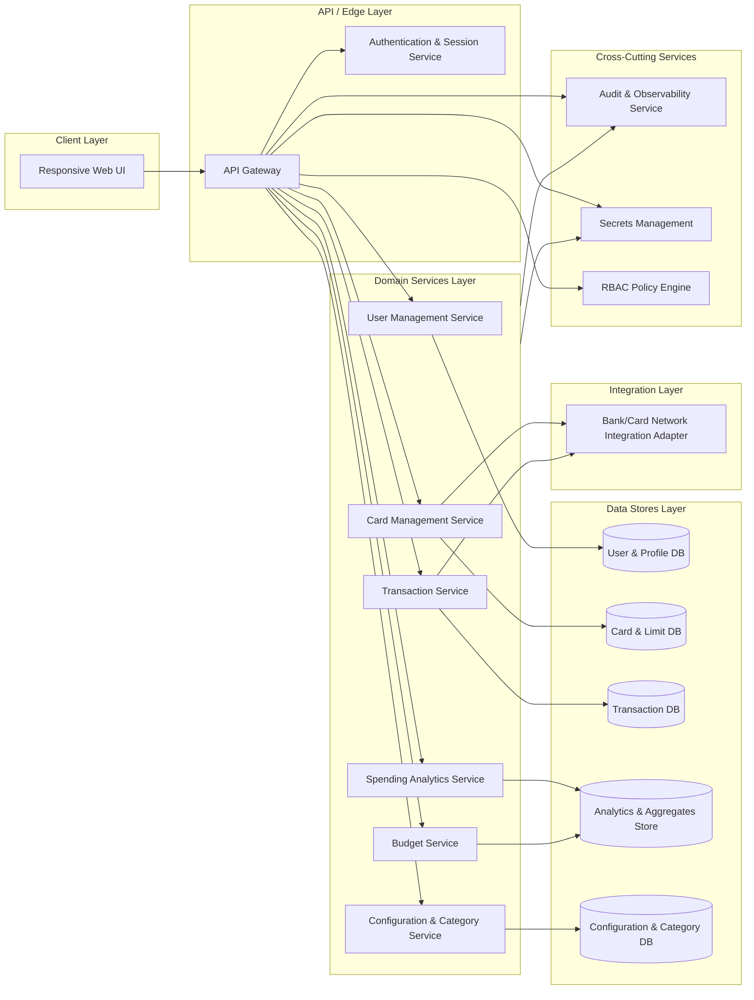

# High-Level Design (HLD) – QE-3350 – Monthly Spending Summary Dashboard

## 1. Architecture Overview

### 1.1 Objectives
Design an enterprise-grade, responsive dashboard solution that provides users with:
- Monthly credit card spending visibility
- Card-level credit utilization insights
- Detailed transaction exploration with rich filtering/search
- Spending analytics and budgeting views
- Recent transaction highlights

The solution must support multiple credit cards per user and provide mobile, tablet, and desktop-friendly UX.

### 1.2 Logical Architecture
The system is organized into the following layers:
- Client Layer (Web & Mobile Web UI)
- API / Edge Layer (API Gateway + Authentication)
- Domain Services Layer (Card, Transaction, Analytics, Budget, User Profile)
- Data Stores Layer (Operational Database, Analytics Store, Configuration Store)
- Integration Layer (External Card/Bank Data Providers)
- Cross-Cutting Concerns (Security, Compliance, Observability, Resiliency)

### 1.3 Mermaid Component Diagram

## 2. Component Descriptions

### 2.1 Client Layer

**Responsive Web UI**
- Single-page application (SPA) or modular web frontend.
- Provides:
  - Dashboard summary (total monthly spend, total credit limit, available credit, outstanding amount, utilization percentage, number of transactions).
  - Card management views for multiple cards per user (card name, issuing institution, masked card number, limits, outstanding, billing/due dates).
  - Transaction table with paging, sorting, searching, filtering (merchant, category, bank, card, date range, amount, date).
  - Spending analytics visualizations (category-wise spending, monthly trend, card-wise distribution, category breakdown by standard categories like dining, fuel, shopping, etc.).
  - Budget tracking views (monthly budget, current spend, remaining budget, utilization, progress bar).
  - Recent transactions widget showing latest five transactions.
- Implements responsive layout via CSS frameworks (e.g., Flexbox/Grid, media queries) and/or responsive UI library.
- Communicates only through the API Gateway using secure HTTPS.

### 2.2 API / Edge Layer

**API Gateway**
- Single entry point for all client requests.
- Performs request routing to domain services, rate limiting, preliminary input validation (schema, size, type), and response shaping.
- Handles CORS, content negotiation (JSON), and versioning of APIs.
- Enforces authentication and authorization by delegating to the Authentication & Session Service and RBAC Policy Engine.

**Authentication & Session Service**
- Manages user authentication (e.g., OIDC/OAuth2, SSO) and session tokens.
- Issues short-lived access tokens; supports refresh tokens via controlled endpoints.
- Associates authenticated identities with user profiles in User & Profile DB.

### 2.3 Domain Services Layer

**User Management Service**
- Manages user profile metadata required to operate the dashboard (e.g., profile identifiers, preferences, default date ranges, preferred categories display order).
- Provides identity-to-user mapping for RBAC and personalization.

**Card Management Service**
- Manages logical representation of credit cards in the system.
- Stores non-sensitive card attributes: card name, issuer, masked number (no full card number), credit limit, available credit, current outstanding, billing and due dates.
- Computes per-card utilization percentage and aggregates across cards.
- Supports retrieval of cards for an authenticated user and summary metrics required by the dashboard.
- Integrates with Bank/Card Network Integration Adapter to synchronize card limits, outstanding amounts, and billing cycles when integrated data sources exist. Where real-time external integration is out of scope, fields are populated using batch processes or upstream services; this is treated as an integration boundary.

**Transaction Service**
- Manages transaction records per card and user.
- Stores transaction attributes: transaction date/time, merchant name (normalized), category, card used, amount, payment status, remarks.
- Exposes endpoints for:
  - Listing transactions with pagination.
  - Filtering by merchant, category, bank/issuer, card, date range.
  - Sorting by amount and date.
- Ensures transaction data is retrieved only for the authenticated user according to RBAC rules.

**Spending Analytics Service**
- Computes and persists aggregated spending metrics.
- Supports:
  - Category-wise spending summaries per time window (e.g., current month).
  - Monthly spending trend series over configured historical periods.
  - Card-wise spending distribution and utilization.
  - Category breakdown by fixed category taxonomy (food & dining, fuel, shopping, travel, entertainment, utilities, healthcare, education, miscellaneous).
- Generates pre-aggregated views stored in Analytics & Aggregates Store for efficient querying.

**Budget Service**
- Tracks budgets per user and time period (e.g., monthly budgets).
- Stores user-configurable budget amounts and links them to transaction and analytics data.
- Computes current spend, remaining budget, and budget utilization percentage.
- Provides progress bar metrics and threshold-based indicators (e.g., warning when utilization exceeds configured threshold).

**Configuration & Category Service**
- Maintains category taxonomy and mapping rules for transactions to categories.
- Stores configuration such as default filters, category colors for charts, budget thresholds.
- Provides APIs for the UI to retrieve category and configuration metadata.

### 2.4 Data Stores Layer

**User & Profile DB**
- Relational or document store containing user profiles and settings.
- Keyed by tenant/user identifiers.

**Card & Limit DB**
- Stores card metadata and computed limits, outstanding balances, and billing-related fields.
- Indexed by user ID and card ID for efficient aggregation and retrieval.

**Transaction DB**
- High-volume transactional store optimized for querying by user, card, category, date, and merchant.
- Supports secondary indices and partitioning by user/tenant and time.

**Analytics & Aggregates Store**
- Columnar or OLAP store used to persist pre-computed aggregates and time series (category spending, monthly trend, card distribution, budget metrics).
- Supports efficient group-by and time-series queries.

**Configuration & Category DB**
- Stores configuration entities, category definitions, mapping rules.

### 2.5 Integration Layer

**Bank/Card Network Integration Adapter**
- Abstracts communication with external card providers and bank systems.
- Responsible for ingesting:
  - Card limits and outstanding balances.
  - Transaction feeds (e.g., batch file ingestion, webhooks, message queues).
- Normalizes incoming data to internal schemas and writes into Card & Limit DB and Transaction DB.
- Handles idempotent processing of external transaction events and reconciliation.
- If real-time authorization or payment processing is out of scope, this adapter is restricted to read-only synchronization and does not initiate financial transactions.

### 2.6 Cross-Cutting Services

**Audit & Observability Service**
- Centralized logging and metrics collection.
- Captures:
  - API gateway requests and responses (excluding sensitive data).
  - Domain service operations, including dashboard load, filter changes, chart data queries, budget updates.
  - Errors, timeouts, and retry events.
- Provides dashboards and alerts for operations.

**Secrets Management Service**
- Stores and rotates:
  - API keys and credentials for bank integrations.
  - Database connection strings.
  - Encryption keys used for data-at-rest.
- Integrates with enterprise secrets vault.

**RBAC Policy Engine**
- Evaluates access policies based on user identity and roles.
- Enforces:
  - User-to-card ownership constraints.
  - Access to analytics and budget data only for permitted users.

## 3. Integration Points & Data Flow

### Flow 1: Authentication & Session Establishment
1. User accesses the responsive web UI from a browser on mobile, tablet, or desktop.
2. WEB_UI redirects or calls AUTH via APIGW for login using enterprise identity provider.
3. AUTH validates credentials and issues an access token.
4. WEB_UI stores the token in a secure mechanism (e.g., HTTP-only cookie or secure storage) and uses it for subsequent API calls.
5. APIGW validates tokens on each request and queries POLICYSVC to evaluate RBAC for requested resources.

Scope Coverage:
- Supports secure access required for all dashboard, card, transaction, analytics, and budget features.

### Flow 2: Dashboard Summary Load
1. WEB_UI calls `/dashboard/summary` on APIGW.
2. APIGW authenticates and authorizes the request.
3. APIGW orchestrates:
   - Calls CARDSVC to retrieve card data and limits for the user.
   - Calls TXNSVC to compute or retrieve counts of monthly transactions.
   - Calls ANASVC to retrieve aggregated monthly spend, utilization, and outstanding totals.
4. CARDSVC reads from CARDDB; TXNSVC reads from TXNDB; ANASVC reads from ANALYTICSDB.
5. APIGW composes a summary response containing:
   - Total monthly spend
   - Total credit limit
   - Available credit
   - Outstanding amount
   - Utilization percentage
   - Number of transactions
6. WEB_UI renders dashboard summary cards and KPIs.

Scope Coverage:
- Total Monthly Spend
- Total Credit Limit
- Available Credit
- Outstanding Amount
- Utilization Percentage
- Number of Transactions

### Flow 3: Card Management View
1. WEB_UI calls `/cards` on APIGW to retrieve card list.
2. APIGW validates token and authorizes access.
3. CARDSVC queries CARDDB for all cards associated with the user.
4. CARDSVC returns card attributes including:
   - Card name
   - Issuing institution
   - Masked card number (tokenized/masked only)
   - Credit limit
   - Available credit
   - Current outstanding
   - Billing date
   - Due date
5. WEB_UI displays multiple cards and allows card-level selection.

Scope Coverage:
- Display multiple credit cards (name, bank, masked number, credit limit, available credit, outstanding, billing date, due date).

### Flow 4: Transaction Listing, Filtering & Search
1. WEB_UI calls `/transactions` on APIGW with query parameters (search text, category filter, bank filter, card filter, date range, sort options).
2. APIGW performs validation of query parameters (type, allowed ranges) and authorization.
3. TXNSVC queries TXNDB with filters and sort criteria.
4. TXNSVC returns a paginated list of transactions including:
   - Transaction date/time
   - Merchant name
   - Category
   - Card used
   - Amount
   - Payment status
   - Remarks
5. WEB_UI displays results in a responsive table supporting:
   - Horizontal and vertical layout adaptation for devices.
   - Sorting UI state and filter badges.

Scope Coverage:
- Transaction management fields.
- Search by Merchant.
- Filter by Category, Bank, Card, Date Range.
- Sort by Amount and Date.

### Flow 5: Spending Analytics Visualization
1. WEB_UI calls `/analytics/spending` endpoints via APIGW for:
   - Category-wise spending for current month.
   - Monthly spending trend over configured months.
   - Card-wise spending distribution.
   - Category breakdown.
2. ANASVC queries ANALYTICSDB for the required aggregates.
3. CFGSVC provides category metadata (names, display labels, colors).
4. ANASVC returns structured datasets optimized for charting (e.g., label-value pairs, time series).
5. WEB_UI renders charts using a charting library, mapped to categories such as dining, fuel, shopping, travel, entertainment, utilities, healthcare, education, miscellaneous.

Scope Coverage:
- Category-wise Spending.
- Monthly Spending Trend.
- Card-wise Spending Distribution.
- Category Breakdown with predefined categories.

### Flow 6: Budget Tracking & Progress Bar
1. WEB_UI calls `/budget/summary` via APIGW for the current month.
2. BUDFVC queries Analytics & Aggregates Store for current spend and remaining budget based on configured monthly budget.
3. BUDFVC computes:
   - Monthly budget
   - Current spend
   - Remaining budget
   - Budget utilization percentage.
4. BUDFVC returns metrics and threshold flags.
5. WEB_UI renders progress bar and budget utilization indicators.

Scope Coverage:
- Monthly Budget, Current Spend, Remaining Budget, Budget Utilization %, Progress Bar.

### Flow 7: Recent Transactions Widget
1. WEB_UI calls `/transactions/recent` on APIGW.
2. TXNSVC queries TXNDB for the latest five transactions for the user.
3. TXNSVC returns basic transaction details.
4. WEB_UI displays the five most recent transactions in a compact widget.

Scope Coverage:
- Recent Transactions Widget showing latest five transactions.

### Flow 8: Integration Data Synchronization (Boundary)
1. BANKINT receives transaction or card data from external sources (e.g., secure file drop, message queue, or API call), according to upstream contracts.
2. BANKINT validates and normalizes incoming records.
3. BANKINT writes card and transaction data into CARDDB and TXNDB.
4. Scheduled jobs in ANASVC and BUDFVC recompute analytics and budget metrics.

Scope Coverage:
- Enables up-to-date card and transaction data, necessary for accurate dashboard and analytics behavior.
- Real-time payment authorization or card servicing is not handled; this is out of scope and explicitly excluded from domain services.

## 4. Security & Compliance Features

### 4.1 Transport Security
- All client-to-APIGW communication is over HTTPS/TLS with modern cipher suites.
- API Gateway enforces TLS 1.2+ and HSTS.

### 4.2 Data Encryption
- At-rest encryption for CARDDB, TXNDB, ANALYTICSDB, USERDB via database-level encryption.
- Application-level encryption for selected sensitive attributes (e.g., card identifiers) and storage only of masked card representations.
- Encryption keys managed by Secrets Management Service.

### 4.3 Input Validation
- APIGW validates all request payloads and query parameters:
  - Type, size limits, allowed ranges, whitelists for sort fields.
  - Sanitization of search text to prevent injection attacks.
- Domain services perform business-level validation (e.g., allowed date ranges, card ownership).

### 4.4 Output Filtering
- Responses avoid exposing full card numbers or sensitive identifiers; only masked card details are returned.
- Error messages are generic, without internal identifiers or stack traces.

### 4.5 RBAC/ABAC
- RBAC Policy Engine enforces that users can only view cards and transactions associated with their profile.
- Potential extension to ABAC patterns (e.g., limiting access by device trust level or time-of-day), but this may be implemented in later epics.

### 4.6 Audit Logging
- Audit & Observability Service logs:
  - Login events and token issuance.
  - Access to dashboard summary, card lists, transaction queries, analytics views, budget views.
  - Changes to budget configurations.
- Logs are immutable and centralized, with retention per enterprise policy.

### 4.7 Secrets Management
- Integration credentials for BANKINT, database passwords, and encryption keys stored in Secrets Management Service.
- Automated rotation and access controls enforced via enterprise IAM.

### 4.8 Compliance Mapping
- The system handles financial transaction and card-related information, but stores only masked card identifiers and summary financial metrics.
- Compliance alignment:
  - PCI-like considerations: limiting storage of card data, masking card numbers, protecting transaction data with encryption, access control, and logging.
  - General data protection and privacy: user identifiers and profile data protected via RBAC, encryption, and strict access controls.
- Detailed certification and external regulatory integrations (e.g., dispute resolution workflows, chargeback handling) are treated as out-of-scope boundaries.

## 5. Resiliency & Error Handling

### 5.1 Retry Mechanisms
- APIGW has bounded retries for transient domain service errors.
- BANKINT uses idempotent write operations and retry with backoff when external bank endpoints are temporarily unavailable.

### 5.2 Circuit Breakers
- Circuit breakers configured around BANKINT and non-critical analytics computations to prevent cascading failures.
- When integration endpoints are down, dashboard reads from most recent synchronized data without blocking UI.

### 5.3 Timeouts
- Request timeouts enforced at APIGW and per-service level.
- Read operations for dashboard and analytics bounded to prevent long-running queries; UI shows graceful fallback messages when timeouts occur.

### 5.4 Graceful Degradation
- If analytics service is unavailable, basic transactional views and card summaries remain available; charts may show “Data temporarily unavailable.”
- If BANKINT synchronization is delayed, dashboards use last-known values and clearly indicate data freshness when necessary.

### 5.5 Error Handling Semantics
- Representative HTTP status codes:
  - 200/201: Success (data retrieved or updated).
  - 400: Invalid filters, date ranges, or malformed requests (user-facing message: “Please review your filters and try again.”).
  - 401: Authentication required or token invalid (user redirected to login).
  - 403: Access to requested resource not allowed (masked message: “You do not have permission to view this data.”).
  - 404: Resource not found (e.g., card ID not associated with user).
  - 429: Rate limit exceeded.
  - 500: Internal error (generic user message; detailed info only in logs).
- No stack traces or internal IDs are exposed in responses; detailed diagnostics go to observability systems.

### 5.6 Observability
- Metrics collected for:
  - Request latency and error rates per endpoint.
  - Dashboard load times.
  - Analytics computation duration.
  - Integration success/failure counts.
- Distributed tracing across APIGW, domain services, and BANKINT.

## 6. Validation Report

### 6.1 Requirements Coverage
- Dashboard Summary:
  - Components: Responsive Web UI, API Gateway, Card Management Service, Transaction Service, Spending Analytics Service.
  - Flows: Flow 2 (Dashboard Summary Load).
- Total Monthly Spend:
  - Components: Spending Analytics Service, Analytics & Aggregates Store.
  - Flows: Flow 2.
- Total Credit Limit:
  - Components: Card Management Service, Card & Limit DB.
  - Flows: Flow 2.
- Available Credit:
  - Components: Card Management Service, Card & Limit DB.
  - Flows: Flow 2.
- Outstanding Amount:
  - Components: Card Management Service, Card & Limit DB, Analytics Service (for aggregates).
  - Flows: Flow 2.
- Utilization Percentage:
  - Components: Card Management Service, Spending Analytics Service.
  - Flows: Flow 2.
- Number of Transactions:
  - Components: Transaction Service, Transaction DB.
  - Flows: Flow 2.
- Credit Card Management (display multiple credit cards):
  - Components: Card Management Service, Card & Limit DB, Responsive Web UI.
  - Flows: Flow 3.
- Card Attributes (name, issuer, masked number, limit, available, outstanding, billing/due dates):
  - Components: Card Management Service, Card & Limit DB.
  - Flows: Flow 3.
- Transaction Management (table with date, merchant, category, card used, amount, payment status, remarks):
  - Components: Transaction Service, Transaction DB, Responsive Web UI.
  - Flows: Flow 4.
- Search & Filters (merchant, category, bank, card, date range):
  - Components: Transaction Service, Configuration & Category Service, Transaction DB.
  - Flows: Flow 4.
- Sorting (amount, date):
  - Components: Transaction Service, Transaction DB.
  - Flows: Flow 4.
- Spending Analytics (category-wise, monthly trend, card-wise distribution, category breakdown):
  - Components: Spending Analytics Service, Analytics & Aggregates Store, Configuration & Category Service.
  - Flows: Flow 5.
- Category Taxonomy (food & dining, fuel, shopping, travel, entertainment, utilities, healthcare, education, miscellaneous):
  - Components: Configuration & Category Service, Configuration & Category DB.
  - Flows: Flow 5.
- Budget Tracking (monthly budget, current spend, remaining budget, budget utilization %, progress bar):
  - Components: Budget Service, Spending Analytics Service, Analytics & Aggregates Store.
  - Flows: Flow 6.
- Recent Transactions Widget (latest 5 transactions):
  - Components: Transaction Service, Transaction DB, Responsive Web UI.
  - Flows: Flow 7.
- Responsive Design (mobile, tablet, desktop):
  - Components: Responsive Web UI.
  - Flows: Flow 1 (Authentication) + each data flow where UI adapts layout.

### 6.2 Compliance Status
- Transport Security:
  - Status: Pass.
  - Justification: HTTPS/TLS enforced between client and API Gateway.
- Data Encryption (at-rest and in-transit):
  - Status: Pass.
  - Justification: Encrypted databases and secure transport; card identifiers protected via masking and encryption.
- RBAC and Access Control:
  - Status: Pass.
  - Justification: RBAC Policy Engine ensures user-specific data isolation.
- Audit Logging:
  - Status: Pass.
  - Justification: Centralized logging of authentication and data access events.
- Secrets Management:
  - Status: Pass.
  - Justification: Dedicated Secrets Management Service, key rotation.
- Privacy & Financial Data Protection:
  - Status: Pass-with-conditions.
  - Justification: Design restricts card data exposure and protects transaction info, but detailed regulatory mapping (e.g., confirmed PCI scope assessment, jurisdiction-specific financial regulations) must be confirmed by compliance teams.

### 6.3 Identified Ambiguities & Risks
- Ambiguity/Risk: Source and timeliness of card and transaction data from external providers.
  - Consequence: If synchronization is delayed or inconsistent, dashboard metrics and analytics may be inaccurate or stale.
  - Mitigation: Define strict SLAs with upstream systems, include data freshness indicators in the UI, and implement reconciliation and alerting when data lag exceeds thresholds.

- Ambiguity/Risk: Exact regulatory scope for card and financial data (e.g., PCI boundaries, regional financial privacy laws).
  - Consequence: Misalignment could result in compliance gaps and increased audit findings.
  - Mitigation: Conduct formal compliance review, classify data elements, and adjust storage, masking, and logging rules accordingly.

- Ambiguity/Risk: Budget configuration semantics (per card vs. total portfolio, per category budgets).
  - Consequence: Users may misinterpret budget metrics if configuration semantics are unclear.
  - Mitigation: Define and document budget configuration model, extend Budget Service to support multiple budget dimensions in future epics if required.

- Ambiguity/Risk: Real-time card servicing and payments.
  - Consequence: Users might expect capabilities like payments or disputes from the dashboard, which are not supported by this design.
  - Mitigation: Clearly mark these capabilities as out of scope in UI copy, and provide navigation to other systems where such features exist.

## 7. Explicit Out-of-Scope Acknowledgements
- Real-time payment processing, authorization, or card servicing actions.
- Dispute management, chargeback workflows, or regulatory reporting beyond basic analytics.
- Cross-tenant analytics and benchmarking.
- Storage of full card numbers or sensitive authentication data.

These boundaries are accounted for in component design and risk analysis; any future epic that introduces such capabilities will require extended design of integration, security, and compliance controls.
