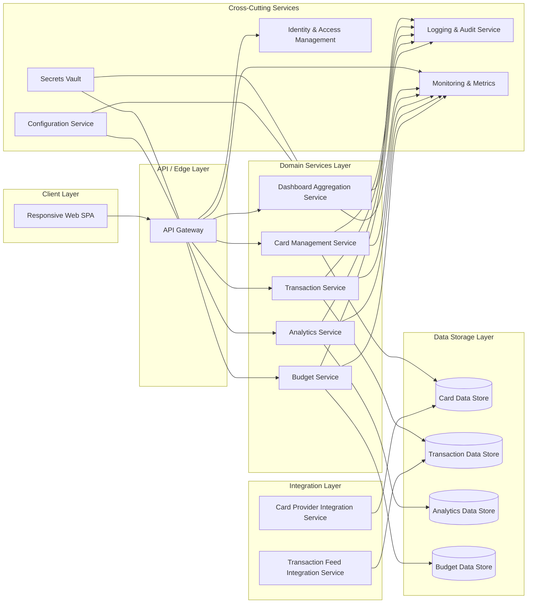

# High-Level Design (HLD) – QE-3350 – Monthly Spending Summary Dashboard

## 1. Architecture Overview

The Monthly Spending Summary Dashboard is an enterprise-grade, multi-channel web application that surfaces aggregated credit card spending, utilization, and budgeting insights. The solution is composed of a responsive client layer, an API/edge layer, domain services for card, transaction, and analytics processing, data storage for card and transaction records, and an integration layer for ingesting card/statement data from upstream systems. Cross-cutting services provide identity, observability, configuration, and security.

### 1.1 Logical Architecture (Text Overview)

- **Client Layer (Presentation)**
  - Responsive Single Page Application (SPA) implementing:
    - Monthly dashboard summary (total spend, credit limit, available credit, outstanding amount, utilization %, number of transactions).
    - Credit card management view for multiple cards and associated details.
    - Transaction management view with sortable/filterable tables.
    - Spending analytics charts (category-wise, monthly trend, card-wise distribution, category breakdown).
    - Budget tracking views (monthly budget, current spend, remaining budget, utilization %, progress bar).
    - Recent transactions widget.
  - Adapts layout for mobile, tablet, and desktop via responsive UI framework.

- **API / Edge Layer**
  - Secure REST/GraphQL API gateway providing:
    - Dashboard summary retrieval endpoint.
    - Credit card list and details endpoint.
    - Transaction search, filter, and sort endpoints.
    - Analytics endpoints (category summaries, trends, distributions).
    - Budget configuration and status endpoints.
  - Performs authentication, authorization, rate limiting, and request validation.

- **Domain Services Layer**
  - **Card Management Service** – manages cards, credit limits, utilization calculation, and billing/due date metadata.
  - **Transaction Service** – handles transaction queries, filtering, sorting, and enrichment (category assignment).
  - **Analytics Service** – computes category-wise spending, monthly trends, card distribution, and category breakdowns.
  - **Budget Service** – manages user budgets, computes remaining budget and utilization percentage.
  - **Dashboard Aggregation Service** – composes data from Card, Transaction, Analytics, and Budget services into dashboard views and recent transactions widget.

- **Data Storage Layer**
  - **Card Data Store** – stores card metadata and financial thresholds.
  - **Transaction Data Store** – stores transaction records with references to cards and merchants.
  - **Analytics Data Store** – persists pre-computed aggregates (optional for performance).
  - **Budget Data Store** – stores budget configurations and usage history.

- **Integration Layer**
  - **Card Provider Integration Service** – ingests card master data (masked numbers, limits, bank, billing cycles) from upstream systems.
  - **Transaction Feed Integration Service** – ingests transaction records from statement/transaction feeds.

- **Cross-Cutting Services**
  - Identity and Access Management (IAM).
  - Centralized logging, auditing, metrics collection.
  - Secrets management.
  - Configuration management.
  - Error handling and resiliency components.

### 1.2 Component Diagram (Mermaid)

## 2. Component Descriptions

### 2.1 Client Layer

#### Responsive Web SPA
- Implements all user-facing features required by the dashboard:
  - Displays monthly summary metrics: total monthly spend, total credit limit, available credit, outstanding amount, utilization percentage, number of transactions.
  - Provides credit card management views for multiple cards, showing card name, issuing bank, masked card number, credit limit, available credit, current outstanding, billing date, and due date.
  - Renders transaction management tables with transaction date, merchant name, category, card used, amount, payment status, and remarks.
  - Supports user controls for search by merchant, filtering by category, bank, card, and date range; supports sorting by amount and date.
  - Shows charts for category-wise spending, monthly spending trend, card-wise spending distribution, and category breakdown using the defined categories.
  - Displays budget tracking information including monthly budget, current spend, remaining budget, budget utilization percentage, and progress visualization.
  - Provides a recent transactions widget that shows the latest five transactions.
- Uses a responsive UI framework (e.g., Bootstrap, Tailwind, or Material) to adapt the layout for mobile, tablet, and desktop.
- Implements front-end input validation (e.g., search, filter parameters) before calling APIs.

### 2.2 API / Edge Layer

#### API Gateway
- Exposes a set of versioned, secure REST/GraphQL endpoints:
  - **GET /dashboard/monthly-summary** – returns aggregated metrics for the selected month.
  - **GET /cards** – lists all cards for the authenticated user.
  - **GET /transactions** – returns paginated transactions with search, filter, and sort capabilities.
  - **GET /analytics/category-spend** – returns category-wise spending data.
  - **GET /analytics/monthly-trend** – returns monthly spending trend data.
  - **GET /analytics/card-distribution** – returns card-wise spending distribution.
  - **GET /analytics/category-breakdown** – detailed spending breakdown per category.
  - **GET /budget/status** – returns the current budget status for the selected month.
  - **POST /budget/config** – allows users to configure or update monthly budgets.
  - **GET /transactions/recent** – returns the latest five transactions.
- Handles cross-cutting concerns:
  - Authenticates requests via IAM (e.g., OAuth2/OIDC) tokens.
  - Enforces authorization policies (RBAC/ABAC) for per-user data segregation.
  - Applies rate limiting and throttling per user/client to protect backend services.
  - Validates and sanitizes query parameters and request bodies.
  - Normalizes error responses to consistent API error formats.

### 2.3 Domain Services Layer

#### Dashboard Aggregation Service
- Aggregates data from Card, Transaction, Analytics, and Budget services to produce:
  - Monthly dashboard summary metrics.
  - Composite data for dashboard widgets (e.g., combining budget and spend, recent transactions with card fields).
- Applies business rules for:
  - Calculating utilization percentage (total outstanding vs total credit limit).
  - Deriving total monthly spend for the selected month.
  - Deriving number of transactions for the selected period.
- Provides caching of commonly requested aggregates for performance.

#### Card Management Service
- Manages card metadata and derived fields:
  - Card name, issuing bank, masked card number, credit limit, available credit.
  - Current outstanding amount based on transaction and statement feeds.
  - Billing date and due date per card.
- Provides APIs or internal interfaces to:
  - Retrieve card lists per user.
  - Update card attributes received from upstream card provider systems.
- Ensures no storage or exposure of full card numbers; only masked identifiers according to security policies.

#### Transaction Service
- Manages transaction records and query capabilities:
  - Stores transaction date, merchant, category, card reference, amount, payment status, and remarks.
  - Provides efficient querying by merchant, category, bank, card, and date range.
  - Supports sorting by amount and date.
- Implements pagination and optimized indexing to support large transaction volumes.
- Enriches incoming transactions with categories and card references using business rules.

#### Analytics Service
- Computes analytic views required by the dashboard:
  - Category-wise spending aggregates for a given period.
  - Monthly spending trend across months.
  - Card-wise spending distribution for the period.
  - Category breakdown using defined categories (Food & Dining, Fuel, Shopping, Travel, Entertainment, Utilities, Healthcare, Education, Miscellaneous).
- Optionally persists pre-computed aggregates to the Analytics Data Store to optimize repeated queries.
- Supports drill-down queries from the dashboard.

#### Budget Service
- Manages user budgets and related metrics:
  - Stores monthly budget configurations per user.
  - Calculates current spend against budget by pulling aggregated amounts from Transaction and Analytics services.
  - Computes remaining budget and utilization percentage.
  - Maps utilization percentage to progress indicators for UI.

#### Cross-Cutting Behavior within Domain Services
- Each service integrates with IAM for user context, Logging/Audit for activity recording, Monitoring for metrics, and Secrets Vault for external integration credentials.

### 2.4 Data Storage Layer

#### Card Data Store
- Relational or document store optimized for card metadata.
- Stores per-user card entities with:
  - Masked card number.
  - Issuing bank.
  - Credit limit and available credit.
  - Current outstanding amount.
  - Billing and due dates.
- Enforces encryption at rest for sensitive fields (e.g., card identifiers, limits).

#### Transaction Data Store
- Time-series or relational database optimized for transaction queries.
- Stores transaction records with indexes on:
  - Date.
  - Merchant.
  - Category.
  - Card reference.
  - Amount.
- Supports partitioning/sharding strategies for scalable historical data storage.

#### Analytics Data Store
- Stores pre-aggregated metrics (category spend, trends, distributions) for performance.
- Can be implemented via a columnar data warehouse or dedicated analytics store.

#### Budget Data Store
- Stores budget configuration and usage per user per period.
- Tracks utilization history for trend analysis.

### 2.5 Integration Layer

#### Card Provider Integration Service
- Periodically ingests card metadata from upstream provider systems via secure APIs or batch feeds.
- Maps provider identifiers to internal card records.
- Applies transformation rules and validation to ensure consistency.
- Does not ingest full card numbers beyond what is required for masked representation.

#### Transaction Feed Integration Service
- Ingests transaction data from statement/transaction feeds.
- Normalizes transaction records, including date, merchant, category, card reference, amount, payment status, and remarks.
- Handles late-arriving or corrected transactions (reversals, adjustments).
- Supports idempotent processing to avoid duplicate transaction entries.

### 2.6 Cross-Cutting Services

#### Identity & Access Management (IAM)
- Provides authentication tokens and user identity context.
- Integrates with the API Gateway.

#### Logging & Audit Service
- Collects structured logs and audit events from all services.
- Captures access and changes to financial data for compliance and traceability.

#### Configuration Service
- Centralizes runtime configuration such as thresholds, feature flags, and external endpoints.

#### Secrets Vault
- Stores credentials/tokens for external card provider and transaction feeds.

#### Monitoring & Metrics
- Collects metrics (latency, error rate, throughput) for all services.
- Triggers alerts on anomalies.

## 3. Integration Points & Data Flow

### Flow 1 – Authentication & Session Establishment
1. User navigates to the dashboard via browser; SPA loads.
2. SPA redirects or interacts with IAM for user authentication (e.g., OIDC login).
3. On successful login, SPA receives a secure token (e.g., JWT) and stores it in a secure browser storage mechanism.
4. SPA attaches the token to subsequent API requests.
5. API Gateway validates the token with IAM before routing the request.

**Scope Mapping:** Required for all authenticated dashboard features (summary, card management, transaction management, analytics, budget tracking, recent transactions, responsive design access across devices).

### Flow 2 – Monthly Dashboard Summary Retrieval
1. SPA calls **GET /dashboard/monthly-summary** with selected month.
2. API Gateway authenticates and authorizes the request.
3. Dashboard Aggregation Service retrieves card list and associated limits/outstanding from Card Management Service.
4. Dashboard Aggregation Service queries Transaction Service for total monthly spend and number of transactions.
5. Dashboard Aggregation Service computes utilization percentage using total credit limit vs outstanding.
6. Dashboard Aggregation Service returns aggregated summary metrics to API Gateway.
7. API Gateway returns structured response to SPA.
8. SPA renders dashboard summary (total monthly spend, credit limit, available credit, outstanding amount, utilization %, number of transactions).

**Scope Mapping:** Dashboard Summary, Total Monthly Spend, Total Credit Limit, Available Credit, Outstanding Amount, Utilization Percentage, Number of Transactions.

### Flow 3 – Credit Card Management View
1. SPA calls **GET /cards** to retrieve all cards for the user.
2. API Gateway authenticates and forwards the request to Card Management Service.
3. Card Management Service fetches card metadata from Card Data Store.
4. Card Management Service calculates or retrieves current outstanding, available credit, billing date, and due date.
5. Response is sent via API Gateway to SPA.
6. SPA renders card list showing card name, issuing bank, masked card number, credit limit, available credit, current outstanding, billing date, and due date.

**Scope Mapping:** Display multiple credit cards and all associated details.

### Flow 4 – Transaction Management (Search, Filter, Sort, Responsive Table)
1. SPA invokes **GET /transactions** with query parameters representing:
   - Search by merchant.
   - Filter by category, bank, card, date range.
   - Sort by amount or date.
2. API Gateway validates and sanitizes query parameters.
3. Transaction Service receives the filtered query and executes against the Transaction Data Store using appropriate indexes.
4. Transaction Service returns paginated transaction results containing date, merchant, category, card used, amount, payment status, and remarks.
5. API Gateway propagates the response to SPA.
6. SPA renders transactions in a responsive table with sorting, filtering and search controls.

**Scope Mapping:** Transaction Management, Search by Merchant, Filters and Sorts, Responsive Table.

### Flow 5 – Spending Analytics (Category, Trend, Card Distribution, Category Breakdown)
1. SPA issues requests to:
   - **GET /analytics/category-spend**.
   - **GET /analytics/monthly-trend**.
   - **GET /analytics/card-distribution**.
   - **GET /analytics/category-breakdown**.
2. API Gateway authenticates and routes to Analytics Service.
3. Analytics Service pulls raw transaction data or pre-computed aggregates from Transaction/Analytics Data Stores.
4. Analytics Service computes:
   - Category-wise spending totals.
   - Monthly spending trend.
   - Card-wise distribution of spending.
   - Category breakdown by defined categories (Food & Dining, Fuel, Shopping, Travel, Entertainment, Utilities, Healthcare, Education, Miscellaneous).
5. Analytics Service returns metric payloads to API Gateway.
6. API Gateway returns responses to SPA.
7. SPA renders charts for each analytic view.

**Scope Mapping:** Spending Analytics, Category-wise Spending, Monthly Spending Trend, Card-wise Spending Distribution, Category Breakdown.

### Flow 6 – Budget Tracking and Progress Visualization
1. SPA calls **GET /budget/status** with selected month.
2. API Gateway authenticates and forwards to Budget Service.
3. Budget Service reads budget configuration from Budget Data Store.
4. Budget Service queries Analytics/Transaction services to determine current spend for the month.
5. Budget Service computes remaining budget and utilization percentage.
6. Budget Service responds with budget metrics.
7. SPA renders:
   - Monthly budget.
   - Current spend.
   - Remaining budget.
   - Budget utilization percentage.
   - Progress bar visualization.

**Scope Mapping:** Budget Tracking, Monthly Budget, Current Spend, Remaining Budget, Budget Utilization %, Progress Bar.

### Flow 7 – Recent Transactions Widget
1. SPA calls **GET /transactions/recent**.
2. API Gateway authenticates and routes to Transaction Service.
3. Transaction Service retrieves latest 5 transactions for the user from Transaction Data Store.
4. Response is returned via API Gateway to SPA.
5. SPA displays the latest five transactions in the recent transactions widget.

**Scope Mapping:** Recent Transactions Widget – latest five transactions.

### Flow 8 – Data Ingestion from External Card/Transaction Systems
1. Card Provider Integration Service consumes card metadata from upstream providers on a schedule or via event-based triggers.
2. For each card record, it validates data and upserts card details into Card Data Store.
3. Transaction Feed Integration Service consumes transaction records from upstream feeds.
4. It normalizes data, assigns categories, and writes transactions into Transaction Data Store.
5. Downstream services (Transaction, Analytics, Dashboard, Budget) operate on this ingested data.

**Scope Mapping:** Ensures dashboard data is populated with accurate card and transaction information required by all in-scope features.

## 4. Security & Compliance Features

Security and compliance measures are aligned with handling financial transaction data and card utilization metrics. No real sample values are stored or exposed; identifiers and card numbers are masked.

### 4.1 Transport Security
- All client-to-API and service-to-service communication uses TLS (HTTPS / mTLS for internal calls).
- Strict TLS configuration with modern cipher suites and certificate pinning where applicable.

### 4.2 Data Encryption
- Encryption at rest for:
  - Card Data Store (card identifiers, limits, balances, billing dates).
  - Transaction Data Store (transaction records, merchant identifiers).
  - Budget and Analytics Data Stores (budget configurations and aggregated spending metrics as required by policy).
- Field-level encryption for sensitive identifiers (e.g., card reference keys).

### 4.3 Input Validation & Output Filtering
- API Gateway enforces:
  - Schema validation for request bodies.
  - Type and range validation for query parameters.
  - Whitelisting of sortable/filterable fields.
- All user-supplied text fields (e.g., remarks, search strings) are sanitized to prevent injection and XSS.
- Responses exclude unnecessary fields (e.g., internal IDs, full card numbers, system notes) to minimize data exposure.

### 4.4 RBAC / ABAC
- IAM enforces per-user access control ensuring:
  - Users can access only their own cards, transactions, budgets, and analytics.
- Role-based policies control administrative features (e.g., budget configuration vs read-only views).
- Attribute-based rules may further restrict access based on account status or geography.

### 4.5 Audit Logging
- Audit logs capture:
  - Logins and authentication events.
  - Access to card and transaction data (view, update, delete events).
  - Budget updates and configuration changes.
- Logs are immutable, time-stamped, and stored in a central log store.

### 4.6 Secrets Management
- External integration credentials for card providers and transaction feeds are stored in the Secrets Vault.
- Services retrieve secrets at runtime via secure channels; secrets are never logged.

### 4.7 Compliance Mapping
- **Financial data handling:** Solution is designed to comply with organizational controls for financial data. Card numbers are masked, and any full PAN handling is delegated to upstream providers (Out of Scope for this Epic).
- **Data protection:** Encryption and access controls align with data protection policies relevant to financial and transactional data.

## 5. Resiliency & Error Handling

### 5.1 Retry Mechanisms
- API Gateway retries internal service calls on transient errors with exponential backoff.
- Integration services use retry strategies for upstream provider/API calls on network timeouts or rate-limit responses.

### 5.2 Circuit Breakers & Timeouts
- Circuit breaker patterns applied between API Gateway and domain services to prevent cascading failures.
- Timeouts configured per endpoint to ensure stuck calls do not exhaust resources.

### 5.3 Graceful Degradation
- If Analytics Service is unavailable, dashboard still shows basic transaction lists and card details, with analytic charts replaced by fallback messages.
- If Budget Service is unavailable, a fallback message indicates budget data is temporarily unavailable while other features remain functional.

### 5.4 Error Handling
- Consistent error response schema:
  - Includes a generic message and correlation ID.
  - Does not expose internal stack traces or sensitive implementation details.
- Common HTTP status mapping:
  - **400 Bad Request** – invalid query parameters or payloads.
  - **401 Unauthorized** – missing/invalid authentication.
  - **403 Forbidden** – user not allowed to access requested data.
  - **404 Not Found** – requested resource not available.
  - **429 Too Many Requests** – rate limiting triggered.
  - **500 Internal Server Error** – unexpected server error with generic user-facing message.
- Errors are logged with appropriate severity and correlation IDs for tracing.

### 5.5 Observability
- Monitoring collects metrics for each endpoint (latency, throughput, error rate).
- Distributed tracing tracks flows across API Gateway and domain services.
- Dashboards and alerting rules are created for anomalies (spikes in error rate, increased latency, failed ingestion jobs).

## 6. Validation Report

### 6.1 Requirements Coverage

Each "Scope (High Level)" item is mapped below to the components and flows that satisfy it.

1. **Dashboard Summary** (Total Monthly Spend, Total Credit Limit, Available Credit, Outstanding Amount, Utilization Percentage, Number of Transactions)
   - Components: SPA, API Gateway, Dashboard Aggregation Service, Card Management Service, Transaction Service, Card Data Store, Transaction Data Store.
   - Flows: Flow 2 (Monthly Dashboard Summary Retrieval), Flow 8 (Data Ingestion) indirectly.

2. **Credit Card Management – Display multiple credit cards with details (Card Name, Issuing Bank, Masked Card Number, Credit Limit, Available Credit, Current Outstanding, Billing Date, Due Date)**
   - Components: SPA, API Gateway, Card Management Service, Card Data Store.
   - Flows: Flow 3 (Credit Card Management View), Flow 8 (Data Ingestion).

3. **Transaction Management – Responsive table including Transaction Date, Merchant Name, Category, Card Used, Amount, Payment Status, Remarks**
   - Components: SPA, API Gateway, Transaction Service, Transaction Data Store.
   - Flows: Flow 4 (Transaction Management), Flow 8 (Data Ingestion).

4. **Search & Filters – Search by Merchant; Filter by Category, Bank, Card, Date Range; Sort by Amount and Date**
   - Components: SPA, API Gateway, Transaction Service, Transaction Data Store.
   - Flows: Flow 4 (Transaction Management).

5. **Spending Analytics – Category-wise Spending**
   - Components: SPA, API Gateway, Analytics Service, Transaction Data Store, Analytics Data Store.
   - Flows: Flow 5 (Spending Analytics), Flow 8 (Data Ingestion).

6. **Spending Analytics – Monthly Spending Trend**
   - Components: SPA, API Gateway, Analytics Service, Transaction Data Store, Analytics Data Store.
   - Flows: Flow 5 (Spending Analytics), Flow 8 (Data Ingestion).

7. **Spending Analytics – Card-wise Spending Distribution**
   - Components: SPA, API Gateway, Analytics Service, Transaction Data Store, Analytics Data Store.
   - Flows: Flow 5 (Spending Analytics), Flow 8 (Data Ingestion).

8. **Spending Analytics – Category Breakdown with defined categories (Food & Dining, Fuel, Shopping, Travel, Entertainment, Utilities, Healthcare, Education, Miscellaneous)**
   - Components: SPA, API Gateway, Analytics Service, Transaction Service, Transaction Data Store, Analytics Data Store.
   - Flows: Flow 5 (Spending Analytics), Flow 8 (Data Ingestion).

9. **Budget Tracking – Monthly Budget, Current Spend, Remaining Budget, Budget Utilization %, Progress Bar**
   - Components: SPA, API Gateway, Budget Service, Analytics Service, Transaction Service, Budget Data Store, Transaction Data Store, Analytics Data Store.
   - Flows: Flow 6 (Budget Tracking), Flow 8 (Data Ingestion).

10. **Recent Transactions Widget – Show latest 5 transactions**
    - Components: SPA, API Gateway, Transaction Service, Transaction Data Store.
    - Flows: Flow 7 (Recent Transactions), Flow 8 (Data Ingestion).

11. **Responsive Design – Mobile, Tablet, Desktop**
    - Components: SPA.
    - Flows: Flow 1 (Authentication & Session) enables access across devices; UI responsiveness is implemented in the client layer.

### 6.2 Compliance Status

- **Transport Security:** Pass
  - TLS enforced on all external and internal calls.
- **Data Encryption:** Pass-with-conditions
  - Assumes underlying platforms support encryption at rest; field-level encryption required for specific identifiers must be implemented according to organizational policies.
- **Input Validation & Output Filtering:** Pass-with-conditions
  - API Gateway and SPA enforce validation and sanitization; must be reviewed against secure coding standards.
- **RBAC/ABAC:** Pass-with-conditions
  - IAM integration provides core access control; fine-grained authorization rules to be fully defined and tested.
- **Audit Logging:** Pass
  - All key financial data access and budget updates are logged in an immutable store.
- **Secrets Management:** Pass
  - Secrets Vault used for external integration credentials; concrete implementation must adhere to vault best practices.
- **Financial Data Handling / Data Protection:** Pass-with-conditions
  - Masked card numbers only and encryption controls are defined; alignment with organization-specific financial data policies to be validated.

### 6.3 Identified Ambiguities / Risks

1. **Ambiguity:** Exact upstream systems and protocols for card and transaction ingestion are not fully specified.
   - **Consequence:** Integration services may require rework if provider APIs or batch formats differ significantly from assumptions.
   - **Mitigation:** Define integration contracts and mapping rules in a separate integration design; use configurable adapters to support multiple providers.

2. **Ambiguity:** Rules for assigning transaction categories (e.g., merchant category mapping) are not described.
   - **Consequence:** Inconsistent or inaccurate category breakdown and analytics; dashboards may misrepresent spending patterns.
   - **Mitigation:** Establish a category mapping engine with clear rules, leveraging merchant category codes where available; maintain configurable mappings in the Configuration Service.

3. **Ambiguity:** Organizational compliance frameworks (e.g., specific financial regulations) are not enumerated.
   - **Consequence:** Some required controls (e.g., regional data residency or retention policies) might be overlooked.
   - **Mitigation:** Perform a compliance requirements review with security/governance teams and update the design with any additional controls.

4. **Risk:** Performance and data volume expectations (number of transactions, cards, concurrent users) are not specified.
   - **Consequence:** Undersized infrastructure or non-optimized data models may lead to slow queries and degraded user experience.
   - **Mitigation:** Conduct performance sizing based on projected load; apply indexing, partitioning, caching, and stress testing before production.

5. **Risk:** Multi-tenant vs single-tenant architecture is not explicitly defined.
   - **Consequence:** Tenant separation might be insufficient if multi-tenant usage is assumed later without proper isolation.
   - **Mitigation:** Decide tenancy model early and incorporate tenant identifier into data schemas and access control rules.

## 7. Out of Scope Acknowledgement

The Epic description implies handling of card and transaction data for analytics and dashboard visualization. The following boundaries are explicitly out of scope for this HLD:

- Full card number (PAN) storage or processing – assumed to be handled by upstream card provider systems in accordance with their own compliance obligations.
- Payment initiation, authorization, or settlement workflows – the dashboard only visualizes spending and utilization.
- Dispute management, chargeback processing, or fraud detection – these are not mentioned in the scope and must be addressed in separate epics.

These out-of-scope areas are acknowledged to prevent unintended expansion of responsibilities within this design.
