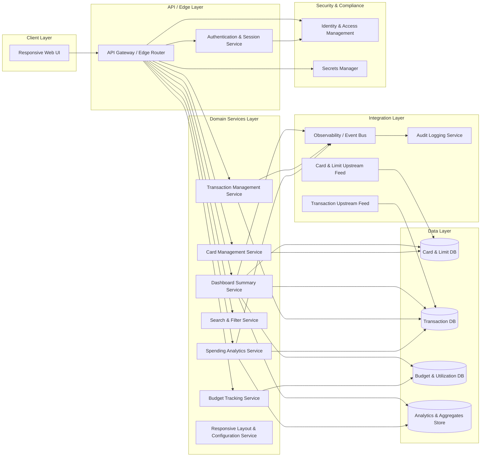

# High-Level Design (HLD) – QE-3380 – Monthly Spending Summary Dashboard

## 1. Architecture Overview

The Monthly Spending Summary Dashboard is a secure, responsive, multi-channel web application that consolidates credit-card-related spending, balances, and analytics into a single view. It exposes UI capabilities for:
- Summary KPIs (monthly spend, credit limits, outstanding, utilization, transaction counts)
- Multi-card management with masked card identifiers
- Transaction browsing, filtering, and sorting
- Spending analytics (category-wise, card-wise, trends, breakdown)
- Budget tracking, including utilization and progress visualization
- Recent transactions widget
- Responsive layouts for mobile, tablet, and desktop

The solution is built using a layered enterprise architecture with the following logical layers:
- **Client Layer** – Browser-based UI (desktop/tablet/mobile) consuming secured APIs.
- **API / Edge Layer** – RESTful or GraphQL endpoints handling authentication, authorization, request validation, and aggregation of data from domain services.
- **Domain Services Layer** – Business services handling card management, transaction management, analytics, and budget tracking.
- **Data Layer** – Relational store(s) for cards, transactions, budgets, plus an analytical/aggregation store or materialized views for performant dashboards.
- **Integration Layer** – Interfaces to upstream credit-card systems or batch feeds to ingest card limits, outstanding, and transactions; and outbound interfaces to observability and audit platforms.
- **Cross-Cutting Concerns** – Security, compliance, logging, monitoring, alerting, configuration, and secrets management.

The architecture is designed to be extensible for future features while strictly staying within the current dashboard, analytics, and budgeting capabilities. Any functionality outside analytics and visualization (e.g., payment execution, card onboarding workflows, dispute management) is out of scope and is not implemented by this design.

## 2. Architecture Diagram (Mermaid)

## 3. Component Descriptions

### 3.1 Client Layer

**Responsive Web UI (WebApp)**  
Single-page or multi-page front-end implemented with a modern framework (e.g., React, Angular, Vue). Responsibilities:
- Render dashboard summary KPIs: monthly spend, total credit limit, available credit, outstanding amount, utilization percentage, number of transactions.
- Display multiple credit cards with masked card identifiers and associated attributes (issuing bank, limits, billing/due dates, current outstanding).
- Provide interactive transaction tables with sorting, filtering, and searching.
- Render spending analytics charts (category-wise, monthly trend, card-wise distribution, category breakdown).
- Render budget tracking widgets (monthly budget, current spend, remaining budget, utilization percentage, progress bar).
- Show recent transactions widget (latest 5 transactions) with link-through to full transaction view.
- Implement responsive layouts (breakpoints, adaptive components) to support mobile, tablet, and desktop experiences.
- Handle client-side input validation (filter forms, search fields) and invoke APIs via secure HTTPS calls.
- Does not store sensitive card or transaction data locally beyond the active session; relies on server responses.

### 3.2 API / Edge Layer

**API Gateway / Edge Router (APIGW)**  
Responsibilities:
- Terminate TLS connections from the web client.
- Route incoming API requests to appropriate domain services (Dashboard, Card, Transaction, Analytics, Budget, Filter services).
- Enforce global request limits and basic rate limiting to protect backend services.
- Apply coarse-grained authorization policies based on user identity and scopes.
- Perform initial request validation (schema, allowed methods, header checks).

**Authentication & Session Service (AuthService)**  
Responsibilities:
- Authenticate users via IAM (e.g., OAuth2/OIDC) and issue secure access tokens or sessions.
- Manage session lifecycles, token refresh, and logout.
- Provide authenticated user context (user ID, roles, card associations) to downstream services.
- Support secure cookie or token-based authentication without persisting credentials in the UI.

### 3.3 Domain Services Layer

**Dashboard Summary Service (DashSvc)**  
Responsibilities:
- Aggregate card, transaction, and budget data for the summary dashboard.
- Compute KPIs: total monthly spend, total credit limit, available credit, outstanding amount, utilization percentage, number of transactions.
- Execute time-bound queries to isolate the current month’s transactions and spending.
- Fetch recent transactions (latest 5) and format for the widget.
- Call analytics and budget services to enrich dashboard data with charts and utilization metrics.
- Output consolidated view to the Web UI via API endpoints.

**Card Management Service (CardSvc)**  
Responsibilities:
- Retrieve card-level information per user: card name, issuing bank, masked card number, credit limit, available credit, current outstanding, billing date, due date.
- Enforce masking logic so that only partial card numbers are exposed (e.g., last 4 digits) to the UI.
- Associate cards to the authenticated user and prevent access to cards not owned by the user.
- Integrate with upstream card feeds to update limits and outstanding amounts.
- Provide card data aggregations needed by Dashboard Summary Service and Analytics Service.
- Does not perform card issuance, payments, or disputes (explicitly out of scope).

**Transaction Management Service (TxnSvc)**  
Responsibilities:
- Manage retrieval of transactions belonging to the authenticated user’s cards.
- Support paging and sorting operations for responsive tables.
- Provide transaction attributes: date, merchant, category, card used, amount, payment status, remarks.
- Ensure that only transactions associated with user-owned cards are accessible.
- Apply server-side validation to filter criteria (date ranges, categories, bank/card filters).
- Publish relevant events to observability/audit for critical operations (e.g., access to large amounts).
- Does not perform transaction authorization or settlement (out of scope).

**Search & Filter Service (FilterSvc)**  
Responsibilities:
- Implement search by merchant and filters (category, bank, card, date range).
- Normalize filter input (e.g., standardized category names, banks, card IDs) to avoid inconsistent queries.
- Construct query specifications or call stored procedures optimizing transaction table queries.
- Prevent risky or malformed queries (e.g., overly broad date ranges causing performance issues) via guardrails.

**Spending Analytics Service (AnalyticSvc)**  
Responsibilities:
- Generate analytics views for:
  - Category-wise spending.
  - Monthly spending trend.
  - Card-wise spending distribution.
  - Category breakdown.
- Use analytical store or materialized views for performant aggregations over transaction history.
- Apply business rules for category grouping as defined (Food & Dining, Fuel, Shopping, Travel, Entertainment, Utilities, Healthcare, Education, Miscellaneous).
- Provide data series formatted for chart components in the Web UI.
- Support multi-dimensional filters (by period, category, card) limited to what the epic defines.
- Does not perform predictive analytics, recommendations, or credit scoring (out of scope).

**Budget Tracking Service (BudgetSvc)**  
Responsibilities:
- Store and retrieve user-defined monthly budgets per card or overall coverage.
- Compute current spend vs. budget using transaction data, delivering remaining budget and utilization percentage.
- Provide data model for progress bars and budget utilization visualizations.
- Enforce basic validation rules for budget values (e.g., non-negative, maximum thresholds as per business policy).

**Responsive Layout & Configuration Service (LayoutSvc)**  
Responsibilities:
- Provide configuration for layouts and widgets per device type (mobile, tablet, desktop).
- Control feature toggles or different levels of detail depending on screen size.
- Return layout metadata to the Web UI to aid responsive rendering (optional; can be embedded configuration).

### 3.4 Data Layer

**Card & Limit DB (CardDB)**  
Responsibilities:
- Store user-card relationships and metadata (card name, issuing bank, masked identifier, credit limit, available credit, outstanding, billing/due dates).
- Ensure card numbers are stored in a tokenized or encrypted format and never returned in full through APIs.
- Maintain audit fields for changes to credit limits or outstanding amounts.

**Transaction DB (TxnDB)**  
Responsibilities:
- Persist transaction records linked to cards and users, including transaction date, merchant, category, amount, payment status, remarks.
- Support indexes on date, card, category, and merchant to enable efficient filtering and sorting.
- Provide partitioning or sharding strategies as needed for high-volume transaction data.

**Budget & Utilization DB (BudgetDB)**  
Responsibilities:
- Store budget definitions per user (monthly budget, per-card budget where applicable).
- Track actual spend aggregated per budget period to support utilization calculations.
- Maintain history of prior budgets where needed.

**Analytics & Aggregates Store (AnalyticStore)**  
Responsibilities:
- Maintain pre-computed aggregates and data cubes for performance-critical analytical queries.
- Support views for category-wise spending, monthly trends, card-wise distributions, and category breakdowns.
- Can be implemented as a separate data warehouse schema or within the primary relational DB.

### 3.5 Integration Layer

**Card & Limit Upstream Feed (CardFeed)**  
Responsibilities:
- Ingest card limit and outstanding data from upstream card systems (batch or streaming).
- Normalize incoming data into CardDB structures.
- Detect and reconcile discrepancies between upstream data and dashboard view.
- Does not re-implement core card-system logic.

**Transaction Upstream Feed (TxnFeed)**  
Responsibilities:
- Ingest authorized and posted transactions from upstream systems.
- Transform raw transaction feed into normalized transaction records with required attributes.
- Maintain ordering and idempotency guarantees.

**Observability / Event Bus (ObsBus)**  
Responsibilities:
- Receive events from domain services, including dashboard access, high-value transactions viewed, filter operations, and budget updates.
- Forward events to monitoring, logging, and analytics platforms.

**Audit Logging Service (AuditLogSvc)**  
Responsibilities:
- Persist audit records for user interactions that are sensitive or compliance-relevant (e.g., viewing card utilization across cards, accessing detailed transaction views).
- Support tamper-evident storage and retention policies as required by organizational standards.

### 3.6 Security & Compliance Layer

**Identity & Access Management (IAM)**  
Responsibilities:
- Provide user identities, roles, and scopes.
- Support OAuth2/OIDC for web access.

**Secrets Manager (SecretMgr)**  
Responsibilities:
- Store and rotate secrets for DB connections, API keys, and service credentials.

## 4. Integration Points & Data Flows

### Flow 1 – User Authentication & Session Establishment

1. User accesses the dashboard URL from a browser; WebApp loads initial resources.
2. WebApp redirects the user or calls AuthService via APIGW for authentication.
3. AuthService delegates authentication to IAM using secure protocols (e.g., OIDC).
4. Upon success, IAM issues tokens or session artifacts consumed by AuthService.
5. AuthService returns a secure token/session to the WebApp via APIGW.
6. WebApp stores token in a secure manner (e.g., httpOnly cookie or in-memory storage) and uses it for subsequent API calls.

Scope mapping: Enables secure access for all dashboard, card management, transaction management, analytics, filters, budget tracking, and responsive features.

### Flow 2 – Dashboard Summary Retrieval

1. WebApp calls DashSvc via APIGW to load the dashboard summary for the current month.
2. APIGW validates the request and attaches user context from AuthService.
3. DashSvc queries CardDB to retrieve user’s cards, limits, available credit, outstanding amounts.
4. DashSvc queries TxnDB for transactions within the current month, linked to user’s cards.
5. DashSvc queries BudgetDB for current budget definitions and aggregated spend.
6. DashSvc computes:
   - Total monthly spend by summing relevant transactions.
   - Total credit limit by aggregating card limits.
   - Available credit by summing limits minus outstanding per card.
   - Outstanding amount by aggregating card outstanding values.
   - Utilization percentage (e.g., outstanding / total limit).
   - Number of transactions.
7. DashSvc fetches latest 5 transactions (recent transactions widget) from TxnDB.
8. DashSvc calls AnalyticSvc for analytic data required on the main dashboard.
9. DashSvc returns consolidated summary payload to WebApp.
10. WebApp renders dashboard summary, utilization, and recent transactions.

Scope mapping: Covers summary dashboard, total monthly spend, total credit limit, available credit, outstanding amount, utilization percentage, number of transactions, and recent transactions widget.

### Flow 3 – Card Management Display

1. WebApp calls CardSvc via APIGW to retrieve card list and details.
2. APIGW verifies user authorization for card data.
3. CardSvc queries CardDB for the user’s cards and metadata.
4. CardSvc applies masking to card numbers and ensures no full card numbers are returned.
5. CardSvc returns card list with fields: card name, issuing bank, masked card number, credit limit, available credit, current outstanding, billing date, due date.
6. WebApp renders card management section and binds card information to UI components.

Scope mapping: Covers display of multiple credit cards and related attributes as required by the epic.

### Flow 4 – Transaction Management, Filters & Search

1. WebApp calls TxnSvc via APIGW, including paging and filter parameters.
2. APIGW validates query parameters and enforces limits (e.g., page size).
3. TxnSvc delegates filter construction to FilterSvc.
4. FilterSvc normalizes filter conditions (category, bank, card, date range) and search term (merchant).
5. FilterSvc builds a query or specification for TxnDB.
6. TxnSvc executes the query against TxnDB, retrieving the relevant transaction set with attributes: transaction date, merchant name, category, card used, amount, payment status, remarks.
7. TxnSvc sorts results as requested (by amount, by date) and applies pagination.
8. TxnSvc publishes relevant observability events to ObsBus (e.g., filter usage patterns).
9. TxnSvc returns results to WebApp.
10. WebApp renders the responsive table, displaying transactions and enabling user interaction.

Scope mapping: Covers transaction table, search by merchant, filters by category/bank/card/date range, sorting by amount/date.

### Flow 5 – Spending Analytics Charts

1. WebApp calls AnalyticSvc via APIGW for chart data (category-wise spending, monthly trend, card-wise distribution, category breakdown).
2. APIGW validates the request and passes user context.
3. AnalyticSvc reads transaction data from TxnDB or pre-aggregated data from AnalyticStore.
4. AnalyticSvc groups and aggregates data by category, month, card, and other relevant dimensions.
5. AnalyticSvc maps categories into defined groups (Food & Dining, Fuel, Shopping, Travel, Entertainment, Utilities, Healthcare, Education, Miscellaneous).
6. AnalyticSvc returns chart-ready series to WebApp (e.g., labels and values).
7. WebApp renders chart components for each analytics view.

Scope mapping: Covers category-wise spending, monthly spending trend, card-wise spending distribution, and category breakdown charts.

### Flow 6 – Budget Tracking & Progress Visualization

1. WebApp calls BudgetSvc via APIGW to retrieve or update monthly budget information.
2. APIGW validates the request and ensures the user is authorized to modify budgets.
3. BudgetSvc reads budget definitions from BudgetDB.
4. BudgetSvc aggregates current spend from TxnDB or AnalyticStore for the budget period.
5. BudgetSvc computes remaining budget and budget utilization percentage.
6. BudgetSvc returns data suitable for progress bar visualization (e.g., target, current, percentage).
7. WebApp renders budget widgets and progress bars for the user.

Scope mapping: Covers monthly budget, current spend, remaining budget, budget utilization percentage, and progress bar.

### Flow 7 – Responsive Layout Handling

1. WebApp detects device type via viewport dimensions or user agent.
2. WebApp optionally calls LayoutSvc via APIGW to retrieve layout configuration.
3. LayoutSvc returns layout metadata such as widget arrangement, level of detail, and breakpoints.
4. WebApp adjusts layout and component visibility for mobile, tablet, or desktop.

Scope mapping: Covers responsive design requirements for mobile-friendly, tablet-friendly, and desktop-friendly views.

## 5. Security & Compliance Features

Security and compliance features are aligned with the handling of card-related and transaction data, but without implementing payment processing or storing full card numbers.

### 5.1 Transport Security

- All client-server communication uses HTTPS with modern TLS (e.g., TLS 1.2+).
- APIGW terminates TLS; internal service calls also use TLS where required by policy.

### 5.2 Data Encryption & Storage

- Card numbers are stored in an encrypted or tokenized format in CardDB; APIs only expose masked values.
- Transaction amounts and other attributes are stored in secure, access-controlled databases.
- Credentials, connection strings, and API keys are never stored in source code; they are retrieved from SecretMgr.

### 5.3 Authentication & Authorization (RBAC/ABAC)

- IAM enforces user authentication via OAuth2/OIDC.
- RBAC: Users can view only their own cards and transactions.
- ABAC: Additional attribute-based constraints may use user properties (e.g., account status) to restrict access.
- APIGW and domain services validate user context on every API call.

### 5.4 Input Validation & Output Filtering

- Edge and domain layers validate all filter and search inputs for type, range, and length.
- Merchant search and remark fields are treated as untrusted input; server-side validation and encoding are applied before display.
- Output encoding is applied by WebApp to prevent cross-site scripting.

### 5.5 Audit Logging & Observability

- AuditLogSvc records key user operations (e.g., viewing aggregated utilization across cards, access to detailed transaction views, budget changes).
- Logs contain identifiers and contextual information but avoid storing full card numbers or sensitive personal details.
- Observability events are published to ObsBus for monitoring performance, usage, and errors.

### 5.6 Secrets Management

- SecretMgr manages database credentials, tokens for upstream card/transaction feeds, and signing keys.
- Secrets are rotated according to organizational policy and are never hard-coded.

### 5.7 Compliance Mapping

Based on the epic’s requirements, the system handles card and transaction data but does not perform payment processing or store full PANs in clear text.

- **PCI-DSS**: 
  - **Compliance status**: Pass-with-conditions.
  - Conditions: Assumes underlying infrastructure (network segmentation, key management, logging) is PCI-DSS compliant. This design supports masking, encryption, and access controls but does not define full PCI-DSS operational controls.
- **Data Protection / Privacy**:
  - **Compliance status**: Pass.
  - Design avoids storing or displaying full card numbers and focuses on aggregated and masked views.

## 6. Resiliency & Error Handling

### 6.1 Retry Mechanisms

- Idempotent reads from CardFeed and TxnFeed are retried with exponential backoff on transient errors.
- Internal service calls from APIGW to domain services can benefit from client-side retries with backoff for non-fatal errors.

### 6.2 Circuit Breakers & Timeouts

- APIGW configures timeouts per backend service (CardSvc, TxnSvc, DashSvc, AnalyticSvc, BudgetSvc).
- Circuit breakers trip when repeated errors occur, preventing cascading failures.

### 6.3 Graceful Degradation

- If AnalyticsService is unavailable, dashboard still shows summary KPIs and transactions but omits charts, displaying a fallback message.
- If BudgetSvc fails, dashboard hides budget widgets and progress bars, while logging the issue.
- If upstream feeds are delayed, dashboard uses last available data with appropriate timestamps displayed.

### 6.4 Error Handling & Status Codes

- **4xx errors** (e.g., 400, 401, 403, 404) are used for invalid input and unauthorized access. Messages are generic and do not expose implementation details.
- **5xx errors** (e.g., 500, 503) indicate server issues; user-facing messages encourage retry and avoid exposing stack traces.
- Detailed error context is logged to observability platforms and audit services where needed, not returned to clients.

### 6.5 Observability

- DashSvc, CardSvc, TxnSvc, AnalyticSvc, and BudgetSvc emit metrics (latency, error rates, throughput).
- Logs and traces are correlated across APIGW and domain services to enable root-cause analysis.

## 7. Validation Report

### 7.1 Requirements Coverage

Each **Scope (High Level)** item from the epic is mapped to components and flows.

1. **Dashboard Summary (Monthly Spend, Limits, Utilization, Transactions)**
   - Components: WebApp, DashSvc, CardSvc, TxnSvc, CardDB, TxnDB, BudgetDB.
   - Flows: Flow 2 (Dashboard Summary Retrieval).

2. **Total Monthly Spend**
   - Components: DashSvc, TxnSvc, TxnDB.
   - Flows: Flow 2.

3. **Total Credit Limit**
   - Components: DashSvc, CardSvc, CardDB.
   - Flows: Flow 2.

4. **Available Credit**
   - Components: DashSvc, CardSvc, CardDB.
   - Flows: Flow 2.

5. **Outstanding Amount**
   - Components: DashSvc, CardSvc, CardDB.
   - Flows: Flow 2.

6. **Utilization Percentage**
   - Components: DashSvc, CardSvc, CardDB.
   - Flows: Flow 2.

7. **Number of Transactions**
   - Components: DashSvc, TxnSvc, TxnDB.
   - Flows: Flow 2.

8. **Credit Card Management – Display Multiple Credit Cards & Attributes**
   - Components: WebApp, CardSvc, CardDB.
   - Flows: Flow 3.

9. **Transaction Management – Responsive Table with Details**
   - Components: WebApp, TxnSvc, FilterSvc, TxnDB.
   - Flows: Flow 4.

10. **Filters and Search – Merchant, Category, Bank, Card, Date Range; Sorting by Amount/Date**
    - Components: WebApp, TxnSvc, FilterSvc, TxnDB.
    - Flows: Flow 4.

11. **Spending Analytics – Category-wise, Monthly Trend, Card-wise Distribution, Category Breakdown**
    - Components: WebApp, AnalyticSvc, AnalyticStore, TxnDB.
    - Flows: Flow 5.

12. **Category Breakdown – Predefined Categories (Food & Dining, Fuel, etc.)**
    - Components: AnalyticSvc, AnalyticStore.
    - Flows: Flow 5.

13. **Budget Tracking – Monthly Budget, Current Spend, Remaining Budget, Budget Utilization %, Progress Bar**
    - Components: WebApp, BudgetSvc, BudgetDB, TxnDB or AnalyticStore.
    - Flows: Flow 6.

14. **Recent Transactions Widget – Latest 5 Transactions**
    - Components: WebApp, DashSvc, TxnSvc, TxnDB.
    - Flows: Flow 2.

15. **Responsive Design – Mobile Friendly, Tablet Friendly, Desktop Friendly**
    - Components: WebApp, LayoutSvc.
    - Flows: Flow 7.

### 7.2 Compliance Status

- **Transport Security**: Pass — HTTPS/TLS enforced at APIGW and internal services as needed.
- **Data Encryption (Card Data)**: Pass-with-conditions — encryption/tokenization assumed; key management specifics depend on organizational KMS.
- **Access Control (RBAC/ABAC)**: Pass — IAM and service-level checks defined; enforcement of policies assumed to be configured properly.
- **PCI-DSS Aspects (Card-Related Data Handling)**: Pass-with-conditions — design aligns with masking/encryption but does not define all operational PCI controls (network, physical, process).
- **Audit Logging & Monitoring**: Pass — audit events and observability pathways defined; requires proper platform configuration.

### 7.3 Identified Ambiguities / Risks

1. **Ambiguity: Upstream Card & Transaction Data Interfaces**
   - Consequence: Without clearly defined feed formats and SLAs, dashboard data may be stale or inconsistent across cards and transactions.
   - Mitigation: Define interface contracts (schemas, frequencies, error handling) with upstream providers; include data freshness indicators in the UI.

2. **Ambiguity: Budget Scope (Per Card vs Overall)**
   - Consequence: Users might expect budgets per category or per card, while the current design may implement only overall monthly or per-card budgets, causing confusion.
   - Mitigation: Clarify supported budget types in requirements; design APIs and UI so that unsupported budget dimensions are clearly indicated or disabled.

3. **Risk: Performance Under High Transaction Volume**
   - Consequence: Filters and sorts over large datasets may degrade user experience or time out.
   - Mitigation: Use indexed queries, pagination, and pre-aggregations in AnalyticStore; implement performance testing and scaling strategies.

4. **Risk: Compliance Gaps If PCI-DSS Controls Are Not Implemented in Infrastructure**
   - Consequence: Card-related data may be at risk if encryption, logging, and network protections are not configured.
   - Mitigation: Coordinate with security and infrastructure teams to implement required PCI-DSS controls and perform regular audits.

5. **Ambiguity: Handling of Multi-Currency Transactions**
   - Consequence: Monthly spend and analytics may be incorrect if transactions span multiple currencies and conversion rules are not defined.
   - Mitigation: Define currency handling policies (e.g., normalize into a base currency using institution-approved FX rates) and update analytics logic accordingly.

6. **Risk: Data Privacy Expectations for Merchant & Remark Fields**
   - Consequence: Merchant and remark text may contain sensitive information in some jurisdictions.
   - Mitigation: Apply appropriate data minimization and masking rules; clarify retention and display policies with compliance teams.
