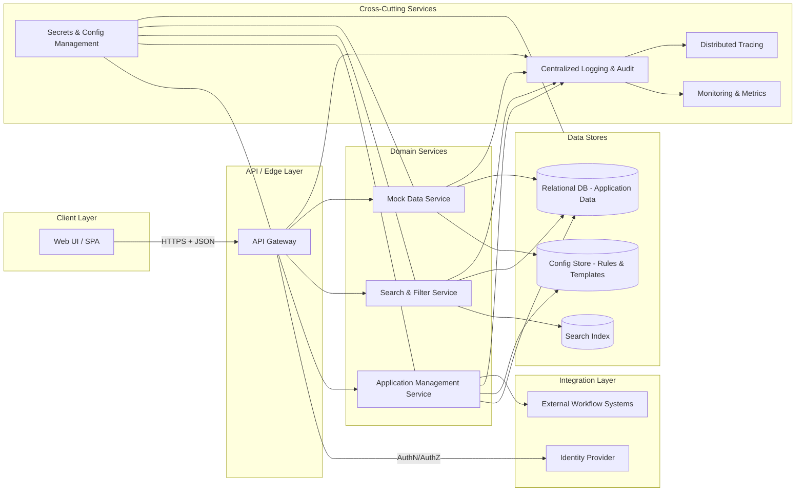

# High-Level Design (HLD) – QE-3398 Application Data Management

## 1. Architecture Overview

This HLD describes an enterprise-grade Application Data Management capability that enables users to view, search, filter, create, edit, and validate financing application records, backed by a robust data model and modern UI. The architecture is layered to support scalability, security, maintainability, and future extension.

### 1.1 Logical Architecture Layers

1. **Client Layer (Presentation/UI)**  
   - Web front-end for application list, detail views, search & filter.  
   - Responsive UI components providing data grids, forms, validation messaging, and mock/demo data views.

2. **API / Edge Layer**  
   - RESTful/GraphQL API gateway exposing application data operations (list, search, filter, create, update, validate).  
   - Handles authentication, authorization, throttling, request/response validation, and response shaping.

3. **Domain Services Layer**  
   - Application Management Service implementing business rules for financing applications (creation, editing, validation, integrity checks).  
   - Search & Filter Service handling query construction, pagination, and sorting for application lists.  
   - Mock Data Service generating demo application records covering diverse business scenarios.

4. **Data Stores Layer**  
   - Primary relational database (e.g., PostgreSQL/SQL Server) hosting normalized application data model.  
   - Optional search index (e.g., Elasticsearch/OpenSearch) for performant search/filter across large datasets.  
   - Configuration store (e.g., key/value service) for validation rules, UI configuration, and mock data templates.

5. **Integration Layer**  
   - Integration with identity provider (IdP) for user authentication and SSO.  
   - Optional integration endpoints for upstream/downstream systems that will consume application data (e.g., review & approval workflows), modeled as external interfaces but not implemented here if out of scope.

6. **Cross-Cutting Concerns**  
   - Centralized logging, audit, metrics, and tracing.  
   - Error handling, retries, circuit breakers, and timeouts for downstream dependencies.  
   - Secrets management and configuration management.  
   - Input validation, output filtering, and data protection controls.

### 1.2 Mermaid Component Diagram

## 2. Component Descriptions

### 2.1 Web UI / SPA (UI)
- Provides application list, detail view, search, and filter capabilities in a responsive interface.  
- Implements client-side form handling for create and edit operations.  
- Displays validation errors originating from domain services and performs basic client-side validation (required fields, formats).  
- Supports pagination and sorting for application lists to meet performance expectations.  
- Allows switching between real application data and mock/demo data views, without exposing any real PII/PHI/PCI values in demo mode.  
- Explicitly excludes backend business logic decisions (e.g., approval workflows) which are handled in external systems (represented by ExtWF).

### 2.2 API Gateway (APIGW)
- Serves as the single entry point for client interactions with application data.  
- Exposes versioned REST/GraphQL endpoints for:  
  - Listing applications with pagination, filters, and sort order.  
  - Searching applications by various criteria.  
  - Creating and updating application records.  
  - Triggering server-side validation.  
- Performs authentication via the IdP and enforces authorization via RBAC policies.  
- Validates incoming requests (schema, types, required fields) and sanitizes outputs.  
- Implements rate limiting, request timeouts, and circuit breaker policies for downstream services.  
- Logs all key events (access, changes, errors) with correlation IDs.

### 2.3 Application Management Service (AMS)
- Encapsulates business logic for financing application data management.  
- Implements create and edit operations, enforcing data integrity across related entities (e.g., applicant, financing terms, collateral).  
- Executes server-side validation rules (completeness, consistency, format validation) defined in the config store.  
- Ensures no data loss or corruption during navigation or editing by implementing transactional updates and optimistic concurrency control.  
- Coordinates with Mock Data Service when real data is not available or demo mode is enabled, while clearly segregating mock data from production data sets.  
- Publishes domain events (e.g., ApplicationCreated, ApplicationUpdated, ValidationFailed) for future integration with external workflow systems; the actual workflow decisioning is out of scope and occurs in ExtWF.

### 2.4 Search & Filter Service (SFS)
- Provides optimized search and filter capabilities over application records, supporting multiple attributes (e.g., status, product type, date ranges).  
- Manages queries against the search index and/or database, using pagination, sorting, and appropriate indexing strategies to achieve list load time SLA (< 2 seconds for up to 100 records).  
- Performs query validation to prevent malformed requests and potential injection attacks.  
- Returns only the fields necessary for UI list views, minimizing payload size and exposure of sensitive details.  
- Maintains synchronization between the relational database and the search index via change data capture (CDC) or event-driven updates.

### 2.5 Mock Data Service (MDS)
- Generates synthetic application records for demonstration and testing scenarios.  
- Uses templates and rule sets stored in the config store to cover at least the required number of unique business scenarios.  
- Ensures generated data uses placeholders and statistically representative values without any real customer identifiers, financial account numbers, or other sensitive data.  
- Provides APIs for regenerating, refreshing, or resetting mock data sets.  
- Segregates mock data into distinct schemas/tenants or tagged records to prevent co-mingling with production data.

### 2.6 Relational Database (RDB)
- Stores the canonical financing application data model, including core entities (Application, Applicant, Product, Terms, Collateral, etc.).  
- Enforces referential integrity via foreign keys and constraints to ensure completeness and consistency.  
- Implements transaction isolation levels appropriate to prevent dirty reads and lost updates.  
- Stores audit fields (createdBy, createdAt, updatedBy, updatedAt) and status history for applications.  
- Sensitive data fields are encrypted at rest using column-level or tablespace-level encryption, as appropriate to the data classification.

### 2.7 Search Index (IDX)
- Hosts denormalized document representations of application records optimized for search operations.  
- Provides full-text search, faceted filtering, and aggregations needed for fast data exploration.  
- Synchronizes from RDB based on events emitted by AMS or CDC processes.  
- Can be sharded and replicated for scalability and availability.  
- Does not store sensitive fields that are not required for search; instead uses pseudonymized or tokenized identifiers where possible.

### 2.8 Config Store (CFG)
- Holds configuration for validation rules (required fields, ranges, formats), mock data templates, and UI feature flags.  
- Provides dynamic reload capability so that rules can be updated without redeploying services.  
- Stores only non-sensitive configuration; secrets and keys are managed separately in the secrets management system.  
- Versioned configurations allow auditing of rule changes over time.

### 2.9 Identity Provider (IdP)
- Authenticates users of the Web UI and issues tokens (e.g., OAuth2/OIDC).  
- Supports SSO and federation with enterprise directories.  
- Provides user identity attributes used for RBAC decisions in the API Gateway and domain services.  
- Does not store application data; only identity and access-related information.

### 2.10 External Workflow Systems (ExtWF)
- Represent downstream systems that perform review, scoring, and approval of financing applications.  
- Consume application events and data via integration interfaces provided by AMS.  
- All workflow rules, scoring algorithms, and approval decisions are out of scope for this epic; this HLD only ensures application data is managed robustly and is available for consumption.

### 2.11 Cross-Cutting Services (LOG, MON, TRC, SEC)
- **LOG**: Centralized logging service that stores structured logs from all components, including correlation IDs and user identifiers (non-sensitive, e.g., staff IDs) as permitted by policy.  
- **MON**: Monitoring system tracking KPIs like application list response time, error rates, and validation failure counts.  
- **TRC**: Distributed tracing to visualize end-to-end flows for requests.  
- **SEC**: Secrets and configuration management (e.g., vault), managing database credentials, tokens, and keys with strict access controls.

## 3. Integration Points & Data Flow

### 3.1 Flow 1 – User Authentication & Session Establishment

1. User navigates to the Web UI.  
2. UI redirects unauthenticated users to the IdP for login.  
3. User authenticates using enterprise credentials; IdP issues an access token and optional refresh token.  
4. UI stores the token in a secure browser storage mechanism (e.g., HTTP-only cookie or secure storage).  
5. Subsequent UI requests include the token when calling the API Gateway over HTTPS.  
6. API Gateway validates the token signature and claims (expiry, audience, scopes) via IdP or local validation.  
7. API Gateway applies RBAC policies based on user roles and attributes before allowing access.

**Scope Coverage:** Supports secure access for viewing/searching/filtering and creating/editing application records; lays foundation for responsive and secure UI interactions.

### 3.2 Flow 2 – Application List View, Search & Filter

1. User opens the application list page in the UI.  
2. UI sends a request to API Gateway with pagination parameters, filter criteria, and sort options.  
3. API Gateway validates the request (schema, types, allowed filters) and forwards to Search & Filter Service.  
4. Search & Filter Service translates filters into search index queries and/or optimized SQL queries.  
5. SFS queries Search Index (for full-text, complex filters) and/or RDB (for transactional consistency) as configured.  
6. SFS returns a paginated list of applications with summary fields only.  
7. API Gateway shapes the response (e.g., removing unnecessary fields) and returns it to the UI.  
8. UI renders the list, including filters and sorting controls.  
9. Monitoring and tracing record response times; logs track query usage patterns.

**Scope Coverage:** Directly addresses viewing, searching, filtering application records and performance expectations for loading up to 100 records.

### 3.3 Flow 3 – Application Creation & Editing with Validation

1. User navigates to the Create or Edit Application page in UI.  
2. UI loads form metadata (field labels, allowed values) from APIs backed by the Config Store.  
3. User enters application details; UI performs basic client-side validation (required fields, simple formats).  
4. On submit, UI sends the application payload to API Gateway over HTTPS.  
5. API Gateway validates schema and user permissions, then forwards the request to Application Management Service.  
6. AMS loads relevant validation rules from the Config Store and executes comprehensive validation checks (completeness, referential integrity, business rule consistency).  
7. If validation passes, AMS persists the changes in a single ACID transaction to the RDB, and emits events for index updates and downstream workflows.  
8. A background process or event consumer updates Search Index to reflect new/updated application records.  
9. AMS returns a success response with updated application metadata to the API Gateway.  
10. API Gateway forwards a success response to UI; UI shows confirmation and updated values.  
11. If validation fails, AMS returns structured error details; API Gateway forwards them; UI displays contextual error messages while preserving user input.  

**Scope Coverage:** Supports creation and editing, ensures data integrity and validation at all stages, and contributes to user experience for data exploration.

### 3.4 Flow 4 – Mock Data Generation & Demo Mode

1. An authorized user enables demo mode or requests mock data via the UI.  
2. UI sends a request to API Gateway to generate or refresh mock application data.  
3. API Gateway validates that the caller has appropriate permissions and forwards the request to Mock Data Service.  
4. MDS retrieves mock templates and rules from Config Store.  
5. MDS generates synthetic application records covering diverse scenarios and stores them either:  
   - In a dedicated schema/tenant in the RDB, or  
   - In a tagged dataset clearly separated from production records.  
6. MDS emits events to update the Search Index with mock records where appropriate.  
7. API Gateway returns confirmation to UI; UI provides controls for users to switch between mock/demo views and real data views.  
8. Logs and metrics track usage of mock data features and coverage of scenarios.

**Scope Coverage:** Addresses enabling mock data generation for demonstration purposes and supports data exploration scenarios without exposing real sensitive data.

### 3.5 Flow 5 – Observability, Audit, and Performance Monitoring

1. Each request through the API Gateway is tagged with a correlation ID and user identity reference.  
2. Domain services (AMS, SFS, MDS) propagate correlation IDs to logging and tracing.  
3. Structured logs are emitted to LOG, including operation type, latency, outcome (success/failure), and high-level identifiers (e.g., application IDs).  
4. MON aggregates metrics: request counts, latency distributions, error rates, validation failure rates, and successful completion of list loads under SLA.  
5. TRC enables visualization of flows from UI through Edge Layer and Domain Services to Data Stores.  
6. Alerts are configured on key metrics (e.g., list view latency > 2 seconds, spike in validation failures) to maintain SLOs.  

**Scope Coverage:** Supports success metrics (performance, data integrity evidenced by error monitoring) and ensures that issues can be detected and addressed quickly.

## 4. Security & Compliance Features

Security and compliance are implemented across all layers, focused on protecting financing application data while enabling demo/mock usage safely.

### 4.1 Transport Security
- All client-to-API and service-to-service communications use TLS (HTTPS for external traffic, mTLS for internal services where feasible).  
- Certificates are managed centrally via SEC; automated renewal processes prevent outages.

### 4.2 Data Encryption & Protection
- Sensitive fields in the RDB are encrypted at rest using database-native or external key management solutions.  
- Backups and replicas are encrypted.  
- Search Index stores only non-sensitive or pseudonymized identifiers; when necessary, tokenization is applied.  
- Mock Data Service ensures that mock datasets contain no real PII/PHI/PCI; synthetic values are generated algorithmically.

### 4.3 Input Validation & Output Filtering
- API Gateway enforces schema validation, type checks, length limits, and canonicalization of inputs.  
- Domain services perform business-level validation to prevent inconsistent states.  
- Output filtering ensures that list views return limited fields; sensitive details are available only where necessary and only to authorized users.  
- Client-side validation complements server-side checks but does not replace them.

### 4.4 RBAC / ABAC
- Role-based access control implemented at API Gateway level, with roles like Viewer, Editor, Admin, and DemoUser.  
- Attribute-based policies can further restrict access (e.g., by region or product line).  
- Only authorized roles can create/edit applications or manage mock data; viewing may be broader but still controlled.

### 4.5 Audit Logging
- Create, update, and validation operations are logged with who, when, and what changed (field-level diffs where permissible).  
- Audit logs are immutable and retained per policy.  
- Access to audit data is restricted and monitored.

### 4.6 Secrets Management
- Database credentials, IdP client secrets, encryption keys, and API tokens are stored in a dedicated secrets management solution.  
- Access to secrets is granted via least privilege and is audited.  
- No secrets are hard-coded in code or configuration files; rotation procedures are defined.

### 4.7 Compliance Mapping

Based on the epic description, the system handles financing application data but no explicit regulatory frameworks are specified. The design adopts general good practices:
- Data protection aligned with enterprise information security policies.  
- Logging and monitoring suitable for internal governance.  
- Where financing data may include personal information, privacy regulations (e.g., data minimization, access controls) are supported through encryption, RBAC, and controlled exposure.

Specific named regulations (e.g., PCI DSS, HIPAA) are not explicitly implicated by the provided scope and are therefore not directly mapped, but the design can be extended to support them if required.

## 5. Resiliency & Error Handling

### 5.1 Retry Mechanisms
- Domain services use exponential backoff retries when communicating with Data Stores or dependent services (e.g., Search Index), avoiding retries for non-idempotent operations.  
- API Gateway does not automatically retry client requests to avoid duplicate writes; clients can retry based on idempotency tokens.

### 5.2 Circuit Breakers & Timeouts
- Circuit breakers prevent cascading failures when Search Index or RDB experiences issues.  
- Timeouts are configured for all external calls from API Gateway and domain services, tuned to expected response times.  
- When the search index is unavailable, SFS can degrade to database-only queries with limited features.

### 5.3 Graceful Degradation
- If mock data generation fails, system falls back to existing demo data or displays a controlled error without impacting production data.  
- If Search Index is down, UI may present limited filtering options or warn users about partial functionality while still allowing basic list views from RDB.  
- Validation services always prioritize data integrity; in case of failure, operations fail fast with clear error messages rather than proceeding with potentially corrupt data.

### 5.4 Error Handling & Exposure
- Errors are categorized into client errors (4xx) and server errors (5xx).  
- Client errors: Include validation failures, unauthorized access, forbidden operations, and not found resources; messages are clear but avoid exposing internal implementation details.  
- Server errors: Include timeouts, internal exceptions, and dependency outages; responses provide generic messages to clients while detailed technical information is logged internally.  
- Correlation IDs are included in responses to help support trace issues across logs and traces.

### 5.5 Observability
- Metrics on response times, error rates, validation outcomes, and resource usage are collected by MON.  
- TRC provides span-level visibility across UI, Edge, Domain, and Data Stores layers.  
- Dashboards and alerts enable proactive identification of performance regressions relative to SLAs (e.g., list load time).

## 6. Validation Report

### 6.1 Requirements Coverage

Scope (High Level) items interpreted from the epic goals:

1. **Allow users to view, search, and filter financing applications**  
   - **Components:** UI, APIGW, SFS, RDB, IDX, LOG, MON, TRC.  
   - **Flows:** Flow 2 (Application List View, Search & Filter), Flow 5 (Observability, Audit, and Performance Monitoring).

2. **Support creation and editing of application records**  
   - **Components:** UI, APIGW, AMS, RDB, CFG, LOG, MON, TRC.  
   - **Flows:** Flow 3 (Application Creation & Editing with Validation), Flow 5.

3. **Ensure data integrity and validation at all stages**  
   - **Components:** AMS, RDB, CFG, APIGW, LOG, MON.  
   - **Flows:** Flow 3 (validation rules and transactional persistence), Flow 5 (monitoring and audit).

4. **Provide a responsive, modern UI for data exploration**  
   - **Components:** UI, SFS, APIGW, MON, TRC.  
   - **Flows:** Flow 2 (performance-optimized list and search), Flow 5 (monitoring performance metrics).

5. **Enable mock data generation for demonstration purposes**  
   - **Components:** UI, APIGW, MDS, CFG, RDB, IDX, LOG, MON.  
   - **Flows:** Flow 4 (Mock Data Generation & Demo Mode), Flow 5 (observability of demo usage).

All identified scope items are covered by at least one component and one integration flow.

### 6.2 Compliance Status

- **Transport Security:** **Pass** – TLS enforced, certificate management via SEC.  
- **Data Encryption at Rest:** **Pass-with-conditions** – Design specifies column/tablespace encryption and protected backups; actual implementation requires selecting and configuring concrete tools and key management policies.  
- **Input Validation & Output Filtering:** **Pass** – API Gateway and domain services implement robust validation and filtering; UI complements but does not replace server-side validation.  
- **RBAC/ABAC:** **Pass-with-conditions** – RBAC roles and ABAC attributes are defined conceptually; detailed role catalog and access policy definitions must be completed in implementation.  
- **Audit Logging:** **Pass** – All create/update/validation operations are logged with appropriate fields and immutable storage; access control to audit data is defined.  
- **Secrets Management:** **Pass** – All secrets managed in SEC with least privilege and audit; rotation procedures described.  
- **Privacy/Data Protection:** **Pass-with-conditions** – Design aligns with good practices; specific regulatory requirements (e.g., retention periods, data subject rights) must be mapped during implementation.  
- **Mock Data Governance:** **Pass** – Explicit design for synthetic data, segregation from production, and prohibition of real PII/PHI/PCI in demo datasets.

### 6.3 Identified Ambiguities/Risks

1. **Ambiguity/Risk:** Exact data classification and regulatory obligations for financing application data are not explicitly defined.  
   - **Consequence:** Incomplete alignment with required regulations (e.g., privacy laws, financial regulations) could lead to compliance gaps or over/under-protection of data.  
   - **Mitigation:** Conduct a data classification and regulatory impact assessment; update encryption, access controls, logging, and retention policies accordingly.

2. **Ambiguity/Risk:** Integration boundaries with downstream workflow systems (ExtWF) are high-level only.  
   - **Consequence:** Misalignment on data exchange formats, event coverage, or timing could lead to inefficiencies or rework in later epics focused on review/approval workflows.  
   - **Mitigation:** Define detailed event schemas and integration contracts in subsequent epics; maintain backward compatibility where possible.

3. **Ambiguity/Risk:** Exact performance SLA (beyond example of list load in <2 seconds for 100 records) for search, create/edit operations, and validation is not fully specified.  
   - **Consequence:** Infrastructure sizing and tuning may be suboptimal, leading to performance issues under load.  
   - **Mitigation:** Establish detailed performance targets and conduct load testing; adjust indexing strategies, caching, and capacity accordingly.

4. **Ambiguity/Risk:** User roles and permissions (RBAC/ABAC) are conceptually defined but not mapped to organizational roles.  
   - **Consequence:** Inconsistent enforcement of who can edit applications, manage mock data, or access detailed views could create security or usability issues.  
   - **Mitigation:** Perform access control design workshops with stakeholders; create a role catalog and policy matrix; implement and test authorization rules.

5. **Ambiguity/Risk:** Strategy for handling large data volumes beyond the initial 100-record list performance metric is not detailed.  
   - **Consequence:** System may not scale well as the number of application records grows significantly.  
   - **Mitigation:** Plan for scalable search index and database sharding/partitioning; implement data archiving strategies and capacity planning.
