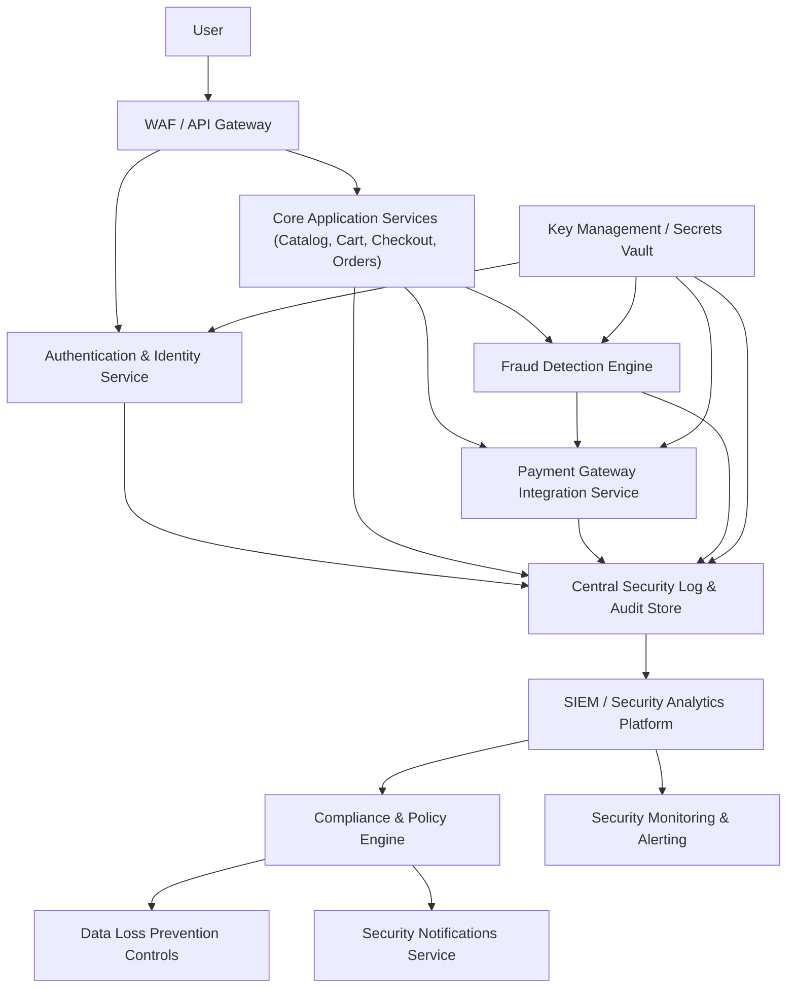

#### 1. High-Level Design

- Architecture Overview & Component Diagram:

- Component Descriptions:
  - WAF / API Gateway: First-line defense for injection, XSS, CSRF, and brute-force attacks; manages TLS termination and mTLS to backend where required.
  - Authentication & Identity: Manages credentials, tokens, MFA; enforces RBAC/ABAC policies.
  - Core Application Services: Execute business logic; integrated with security policies and fraud checks.
  - Payment Gateway Integration: Encapsulates PCI DSS-compliant payment processing; uses tokenization and avoids storing full PAN.
  - Fraud Detection Engine: Evaluates transactions using rules and possibly heuristic scoring; integrated inline for high-risk operations.
  - Key Management / Secrets Vault: Centralized management of encryption keys and secrets for AES-256 at rest and TLS certificates.
  - Security Log & Audit Store: Central, tamper-evident logging for all security-relevant events.
  - SIEM & Security Analytics: Aggregates logs, detects anomalies, correlates events, and triggers alerts.
  - Compliance & Policy Engine: Encodes regulatory requirements and maps them to controls; used to generate compliance reports.
  - DLP Controls: Prevents sensitive data leakage through logs, exports, and external interfaces.
  - Security Notifications: Sends alerts on suspicious activities, policy violations, and required user actions.
  - Security Monitoring & Alerting: Manages detections, dashboards, and incident workflows.

- Integration Points & Data Flow:
  - Authentication & Authorization:
    - WAF routes auth requests to AUTH; tokens issued and validated for subsequent calls.
    - RBAC enforced in APP based on roles (consumer, seller, admin); ABAC extends controls with contextual attributes (geo, device, risk score).
  - Payments:
    - APP sends payment requests to PAY over TLS 1.3; PAY interacts with external gateway.
    - FRAUD evaluates transactions prior to or concurrent with PAY; suspicious ones may be challenged or blocked.
  - Logging & Monitoring:
    - All security events (logins, failed attempts, permission changes, payment failures, fraud flags) logged to LOG.
    - SIEM consumes LOG events; CMP uses SIEM data to generate compliance reports and enforce policies.

- Security & Compliance Features:
  - Encryption:
    - TLS 1.3 enforced for all external and internal traffic handling sensitive data.
    - AES-256 encryption at rest for user data, payment tokens, and auth tokens, keys managed by KMS.
  - Input Validation & Output Filtering:
    - WAF and APP validate inputs (length, format, whitelists) and sanitize outputs to prevent injection attacks.
  - RBAC/ABAC:
    - RBAC roles cover user types; ABAC conditions (time, device, IP reputation) applied for risk-based control.
  - Audit Logging:
    - Detailed audit logs of access to sensitive operations and changes to security policies, with immutable storage.
  - Compliance:
    - PCI DSS alignment:
      - Card data never stored in raw form; tokens used; access strictly controlled and logged.
    - Privacy:
      - Minimized user data in logs; data masking and pseudonymization where possible.
    - Data retention:
      - Logs retained per policy; payment-related data retention aligned with legal requirements and business needs.

- Resiliency & Error Handling:
  - Circuit Breakers:
    - Between APP and PAY/FRAUD to avoid blocking core flows; fail-closed for critical security decisions (e.g., cannot bypass fraud engine by failure).
  - Retry Mechanisms:
    - Network-safe retries for external gateway calls; idempotent tokens used to prevent duplicate charges.
  - Fallback Patterns:
    - If FRAUD service is partially degraded, system can revert to minimal rules-only mode while logging degraded state; risky transactions may be slowed or blocked rather than allowed silently.

#### 2. Validation Report

- Requirements Coverage:
  - Strong encryption in transit and at rest:
    - Covered: TLS 1.3, AES-256 with KMS.
  - PCI DSS controls for payments:
    - Covered: tokenization, PAY isolation, access controls, logging.
  - Fraud detection for accounts and transactions:
    - Covered: FRAUD engine integrated into payment and account flows.
  - Performance under 100,000 concurrent users with no NFR degradation:
    - Covered: WAF and APP remain horizontally scalable; fraud checks optimized; circuit breakers to control latency.
  - 99.9% uptime for security services:
    - Covered: high-availability deployments and monitoring via SIEM/MON.

- Compliance Status:
  - Data retention:
    - Pass: security logs and payment data retention policies applied centrally.
  - Privacy:
    - Pass: minimized logging of PII, DLP and masking.
  - Regulatory adherence:
    - Pass (Design Target): CMP and SIEM architecture supports adaptable policies for evolving regulations.

- Identified Ambiguities/Risks:
  - Ambiguity:
    - Specific fraud scenarios and thresholds not explicitly stated in epic.
  - Risk:
    - Overly aggressive fraud rules could increase false positives, impacting conversion.
  - Mitigation:
    - Start with conservative rules, A/B test, and tune thresholds based on SIEM analytics and business feedback.

