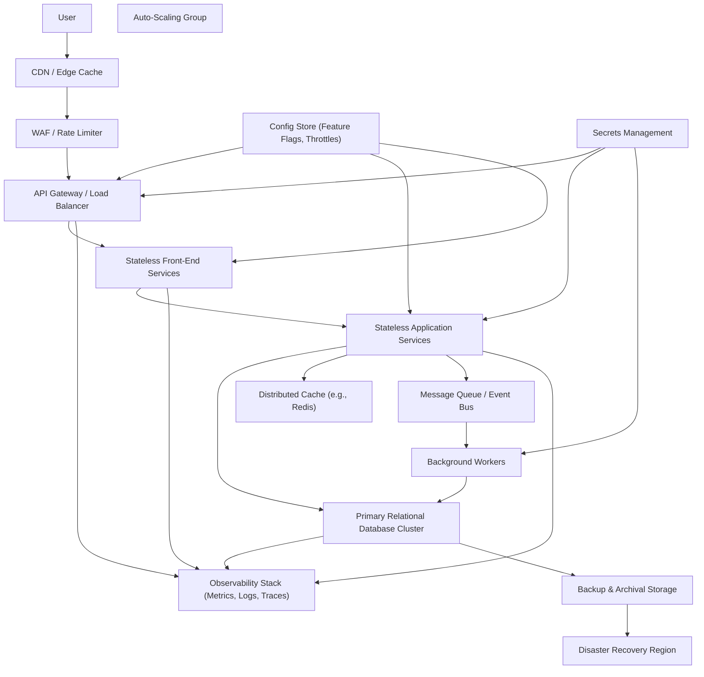

#### 1. High-Level Design

- Architecture Overview & Component Diagram:

- Component Descriptions:
  - CDN / Edge Cache: Serves static assets close to users; reduces latency to meet 2s page load target.
  - WAF / Rate Limiter: Protects platform and enforces per-IP/per-user limits to maintain stable performance under peak load.
  - API Gateway / Load Balancer: Routes requests to FE and APP tiers; supports auto-scaling and blue/green deployments.
  - Stateless Front-End & Application Services: Horizontally scalable services that handle web and API logic; no sticky sessions.
  - Distributed Cache: Caches hot data (catalog, session tokens, configuration) to reduce DB load and improve response times.
  - Relational Database Cluster: Primary data store (orders, users, payments) with read replicas to offload read traffic.
  - MQ/Event Bus: Decouples synchronous requests from long-running operations (notifications, analytics).
  - Observability Stack: Collects metrics (latency, throughput), logs, and traces; enables 99.9% uptime and quick root-cause analysis.
  - Config Store: Central store for performance-related config (timeouts, thresholds, feature flags for performance experiments).
  - DR Region & Backup: Provides disaster recovery capabilities and backup storage for continuity.
  - Background Workers: Asynchronously processes jobs (emails, reports) to avoid impacting synchronous SLAs.

- Integration Points & Data Flow:
  - Request Path:
    - User  CDN/WAF  GW  FE/APP  DB/CACHE.
    - For catalog and order tracking, heavy reads go first to CACHE; on miss, query DB and backfill cache.
  - Async Work:
    - APP publishes events to MQ (e.g., order placed, payment completed), JOB workers consume and process without blocking user responses.
  - Observability:
    - All services emit metrics (p95 latency, error rates), logs, and traces to OBS for alerting and SLO tracking.

- Security & Compliance Features:
  - TLS 1.3 everywhere between U and GW and between components via service mesh or secure connections.
  - Data at rest in DB and BKP encrypted with AES-256 via SM-managed keys.
  - RBAC for operations staff managing scaling policies, DB clusters, and config in CF.
  - Audit logging of scaling events, configuration changes, DR failover tests.

- Resiliency & Error Handling:
  - Circuit Breakers:
    - Between FE/APP and downstream dependencies (DB, external gateways) to prevent cascading failures.
  - Retries:
    - Idempotent operations (e.g., fetching catalog) retry with exponential backoff; writes use exactly-once semantics via idempotency keys.
  - Failover:
    - DR region configured with warm standby DB; regular DR drills practiced with documented RTO/RPO.
  - Graceful Degradation:
    - If cache fails, system falls back to DB with rate-limited traffic.
    - Non-critical features (e.g., recommendations) disabled under high load via CF flags.

#### 2. Validation Report

- Requirements Coverage:
  - 100,000 concurrent users:
    - Covered: auto-scaling stateless services, caching, and load balancing address concurrency target.
  - Page load 2s, checkout 5s:
    - Covered: CDN, caching, and queue-based offloading of non-critical work.
  - 99.9% uptime:
    - Covered: multi-AZ deployment, DR region, monitoring and alerting.
  - Graceful degradation and resilience:
    - Covered: circuit breakers, feature flags, fallbacks.

- Compliance Status:
  - Data retention:
    - Pass: backups and logs managed per enterprise standards; not altered by this epic.
  - Privacy:
    - Pass: no new data categories introduced; secure channels enforced (TLS 1.3).

- Identified Ambiguities/Risks:
  - Ambiguity:
    - Exact SLOs per service (e.g., catalog vs checkout) not explicitly prioritized.
  - Risk:
    - Misconfigured caching may cause stale data (e.g., prices, inventory).
  - Mitigation:
    - Define service-level SLOs and adopt strict cache invalidation rules for critical data; test thoroughly under peak load scenarios.

