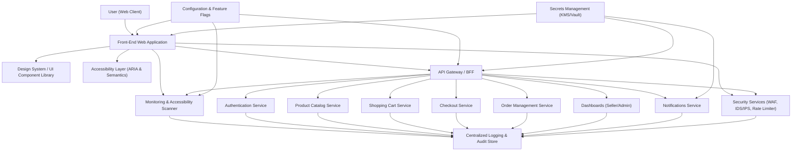

#### 1. High-Level Design

- Architecture Overview & Component Diagram:

- Component Descriptions:
  - Design System / UI Component Library: Shared WCAG 2.1 AA-compliant UI components (buttons, forms, modals, navigation) with enforced contrast, font sizes, focus styles.
  - Accessibility Layer: ARIA roles, landmarks, live regions, semantic HTML templates, keyboard navigation behaviors, and screen reader-specific hints.
  - Front-End Web Application: Implements user flows (registration, catalog, cart, checkout, orders, dashboards) using accessibility-compliant components and patterns.
  - API Gateway / BFF: Exposes backend APIs optimized for front-end consumption; handles request shaping, response normalization, and cross-cutting concerns.
  - Core Services (AUTH, CAT, CART, CHK, ORD, DASH, NOTI): Existing domain services whose UI touchpoints must meet accessibility standards.
  - Monitoring & Accessibility Scanner: Automated accessibility test runners (e.g., axe-core-based) integrated into CI/CD and runtime monitors for regressions.
  - Security Services: WAF, rate limiting, and security filters ensuring inputs/outputs are validated and sanitized.
  - Centralized Logging & Audit Store: Stores audit events for accessibility configuration changes and user-facing accessibility issues (e.g., reported via feedback).
  - Configuration & Feature Flags: Controls rollout of accessibility improvements (e.g., high contrast mode, font scaling) and blue/green A11y changes.
  - Secrets Management: Manages credentials for monitoring tools, APIs used by accessibility scanners or observability components.

- Integration Points & Data Flow:
  - UI to Core Services:
    - All user-facing flows (auth, catalog, cart, checkout, orders, dashboards) are accessed via the Front-End Web Application.
    - The FE enforces consistent layout, heading hierarchy, and landmarks; calls GW/BFF for data and renders responses using accessible components.
  - Accessibility Enhancements:
    - Accessibility Layer hooks into routing and component lifecycle to manage focus order, skip links, and dynamic announcements (e.g., cart updated).
    - Design System enforces color contrast, component states (hover, focus, error), and scalable typography.
  - Monitoring & Accessibility Checks:
    - CI/CD runs automated WCAG 2.1 AA checks on key pages (registration, login, catalog, cart, checkout, order tracking, dashboards).
    - MON sends results to LOG, with metrics surfaced in dashboards.
  - Security & Compliance:
    - SEC layer validates input (forms, query parameters) and sanitizes outputs returned to FE, reducing XSS risks inherent to dynamic UI updates.
    - Audit logs capture accessibility-related configuration changes and toggling of features (e.g., enabling new A11y mode).

- Security & Compliance Features:
  - Encryption:
    - TLS 1.3 enforced for all traffic between U, FE, GW, and backend services.
    - Sensitive user preferences (e.g., assistive preferences, display modes) stored encrypted at rest with AES-256 via SM-backed keys.
  - RBAC/ABAC:
    - RBAC used for dashboards and admin interfaces; ABAC policies ensure only authorized roles modify accessibility configurations or content templates.
  - Input/Output Security:
    - Input validation on all accessible forms (e.g., registration, checkout) with both client-side and server-side validation.
    - Output encoding for dynamic content (product names, descriptions, user-generated content such as reviews) to avoid injection in assistive technologies.
  - Audit Logging:
    - Records:
      - Changes to design system tokens (colors, sizes).
      - Enabling/disabling A11y-related feature flags.
      - Access to admin dashboards used to manage content and settings.
  - Compliance:
    - Accessibility requirements mapped to WCAG 2.1 AA criteria.
    - Data retention and privacy aligned with PRD: accessibility-related logs retained per enterprise policy; personal data minimized in logs.

- Resiliency & Error Handling:
  - Circuit Breakers:
    - GW uses circuit breakers for non-critical services (e.g., MON, NOTI) to ensure accessibility features dont degrade core transaction flows.
  - Retry Mechanisms:
    - FE applies idempotent re-tries for loading A11y configuration (e.g., theme, preferences) from CONF; fallback to defaults when unavailable.
    - MON retries sending accessibility scan results; if unreachable, stores locally then replays later.
  - Fallback Patterns:
    - If design system assets fail to load, FE falls back to plain HTML with minimal styling while preserving core accessibility semantics.
    - If MON is unavailable, tests run locally and results are uploaded asynchronously.

#### 2. Validation Report

- Requirements Coverage:
  - Accessibility compliance across primary journeys:
    - Covered: registration/login, catalog browsing, cart, checkout, order tracking, dashboards by using a unified Design System and A11y Layer.
  - Keyboard navigation and screen reader support:
    - Covered: focus management, skip links, ARIA roles, and semantic HTML in UI layer.
  - Performance coexistence:
    - Covered: A11y features implemented mostly at build-time (static semantics) and lightweight runtime behaviors, consistent with 2s page loads and 5s checkout.
  - Continuous monitoring of accessibility regressions:
    - Covered: MON and CI/CD integration capturing metrics and regressions.
  - Integration with all core services:
    - Covered: FE and GW integration points ensure A11y is applied horizontally across services.

- Compliance Status:
  - Data Retention:
    - Pass: A11y logs and monitoring data planned in alignment with centralized LOG retention policies; minimal PII.
  - Privacy:
    - Pass: A11y preferences stored with encryption and minimal data; no sensitive categories inferred without consent.
  - WCAG 2.1 AA:
    - Pass (Design Target): Architecture enables compliance; final implementation still requires detailed component-level testing.

- Identified Ambiguities/Risks:
  - Ambiguity:
    - Exact set of assistive preferences to store (e.g., font size, contrast mode) not explicitly defined.
  - Risk:
    - Potential performance impact from additional JS for focus and ARIA management.
  - Mitigation:
    - Define a limited, prioritized set of A11y preferences and implement as part of Design System tokens.
    - Use server-rendered HTML with minimal client-side enhancements and monitor performance via MON to ensure NFR targets (2s/5s) are maintained.

