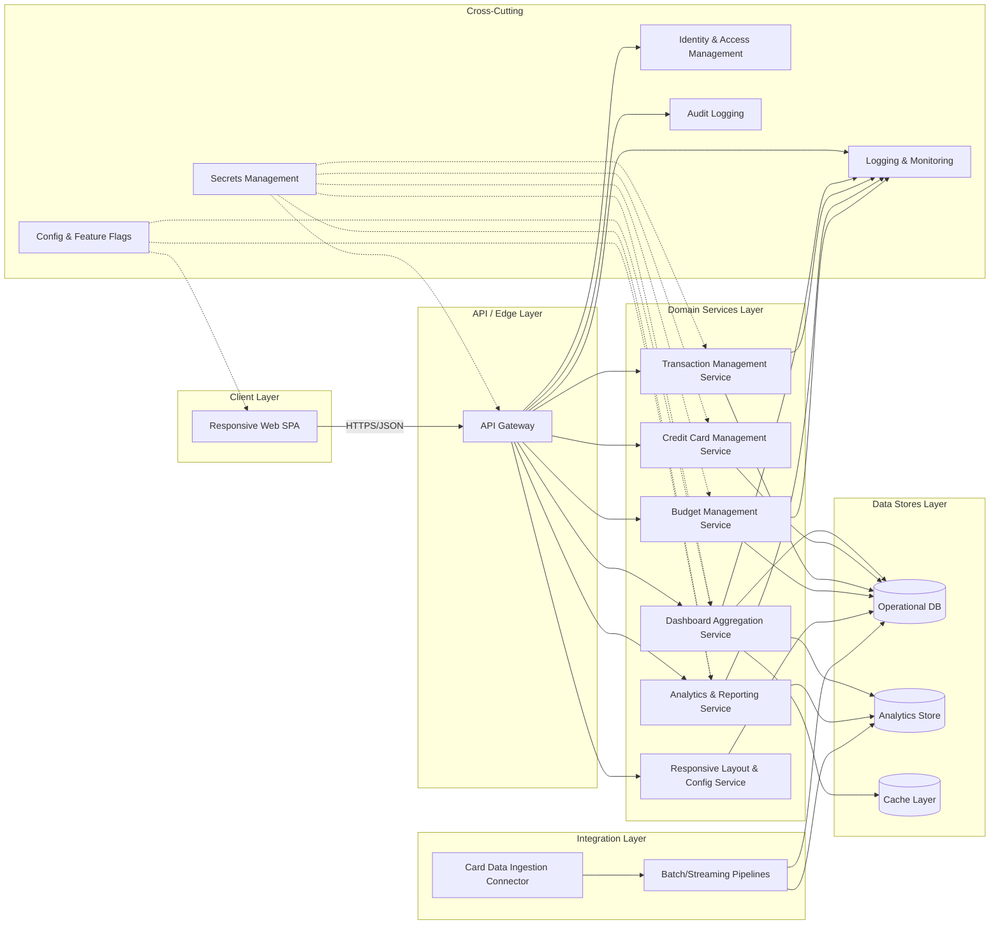

# High-Level Design (HLD) – QE-3538 – Monthly Spending Summary Dashboard

## 1. Architecture Overview

The solution is a responsive, enterprise-grade web dashboard that surfaces credit card spending, utilization, budgeting, and transaction analytics for end-users. It is architected as a multi-tier system with a secure client layer, API/edge layer, domain services, data stores, and integration layer.

### 1.1 Logical Architecture (Text Overview)

- **Client Layer**
  - Responsive single-page application (SPA) for web and mobile browsers.
  - Supports dashboard summary widgets, credit card list views, transaction tables, charts, filters, and budgeting visuals.

- **API / Edge Layer**
  - **API Gateway** exposing REST/GraphQL endpoints for dashboard data, card metadata, transaction feeds, filters, and analytics.
  - Centralized authN/authZ, throttling, request/response validation, and routing.

- **Domain Services Layer**
  - **Dashboard Aggregation Service** – computes total monthly spend, utilization, outstanding amounts, and aggregates KPIs per user and per card.
  - **Credit Card Management Service** – manages card metadata (names, issuers, masked identifiers, limits, billing/due dates).
  - **Transaction Management Service** – manages transactional data, including categories, payment status, and supports search/filter/sort.
  - **Analytics & Reporting Service** – builds category-wise, card-wise, and monthly trend analytics, plus category breakdowns.
  - **Budget Management Service** – maintains budgets, tracks current spend and remaining budget, and computes utilization.
  - **Responsive Layout & Configuration Service** – manages layout presets and widget configurations for different device form factors.

- **Data Stores Layer**
  - **Operational Database** (e.g., relational DB) for users, cards, transactions, budgets, and configuration metadata.
  - **Analytics Store** (e.g., columnar/OLAP or timeseries DB) optimized for aggregations and charts.
  - **Cache Layer** (e.g., Redis) for frequently accessed read models (dashboard KPIs, card lists, analytics snapshots).

- **Integration Layer**
  - **Card Data Ingestion Connector** – integrates with upstream systems (e.g., issuer/bank APIs or internal card systems) to ingest card limits, outstanding amounts, transactions, and billing data.
  - **Batch/Streaming Ingestion Pipelines** – ETL/ELT or streaming jobs to process incoming transactional events, enrich with categories, and project them into read models.

- **Cross-Cutting Concerns**
  - Centralized identity and access management.
  - Logging, tracing, metrics, and auditing.
  - Configuration and feature flags for dashboard widgets.
  - Secrets management via enterprise vault.

### 1.2 Mermaid Component Diagram

## 2. Component Descriptions

### 2.1 Client Layer

- **Responsive Web SPA**
  - Implements the dashboard UI for desktop, tablet, and mobile form factors.
  - Provides widgets for monthly spend summary, credit utilization, card list, transaction table, charts, and recent transactions.
  - Implements client-side routing, state management, and caching of recent views.
  - Handles local input validation (filters, search, date ranges) before invoking APIs.
  - Uses accessible design patterns and responsive layouts (CSS grid/flex, breakpoints) to adapt to different screen sizes.

### 2.2 API / Edge Layer

- **API Gateway**
  - Single entry point for client requests over HTTPS.
  - Terminates TLS and enforces authentication and authorization.
  - Routes requests to appropriate domain services (dashboard, transactions, analytics, budgets, card management).
  - Performs request throttling and basic input validation (schema, size limits).
  - Normalizes error responses and propagates correlation IDs for observability.

### 2.3 Domain Services

- **Dashboard Aggregation Service (DAS)**
  - Provides aggregated KPIs for the main dashboard summary (monthly spend, credit limit, available credit, outstanding amount, utilization, transaction counts).
  - Applies business rules for monthly cut-offs and defines how utilization is calculated.
  - Uses caches and precomputed aggregates to ensure low latency.

- **Credit Card Management Service (CCMS)**
  - Maintains card metadata for each user, including issuer, masked identifiers, limits, current available credit, billing date, and due date.
  - Exposes APIs to retrieve all cards for a user and to synchronize card attributes from ingested data.
  - Ensures card identifiers are consistently masked in all responses.

- **Transaction Management Service (TMS)**
  - Stores and serves transaction records with attributes like timestamp, merchant, category, card reference, amount, payment status, and remarks.
  - Provides paginated, sortable, and filterable endpoints for transaction tables.
  - Supports search by merchant and filtering by category, bank, card, date range, and sorting by amount/date.

- **Analytics & Reporting Service (ARS)**
  - Computes and exposes analytics for:
    - Category-wise spending for the selected period.
    - Monthly spending trends.
    - Card-wise spending distribution.
    - Category breakdown using a well-defined category taxonomy.
  - Generates pre-aggregated views for charts to minimize query time.

- **Budget Management Service (BMS)**
  - Manages user-level budgets for spending.
  - Computes current spend vs budget, remaining budget, and utilization percentage.
  - Provides APIs for the dashboard to render budget progress bars and alerts.

- **Responsive Layout & Config Service (RLS)**
  - Manages configuration for widget ordering, visibility, and layout per device type.
  - Stores feature flags to enable/disable certain analytics or widgets per user segment.

### 2.4 Data Stores

- **Operational Database (ODB)**
  - Stores normalized entities: users, cards, card-to-user relationships, transactions, budgets, and configurations.
  - Enforces referential integrity and supports transactional updates from ingestion and user operations.

- **Analytics Store (ADS)**
  - Stores denormalized, aggregate, and time-series data optimized for analytical queries.
  - Supports materialized views for category-wise spending, trends, and distribution charts.

- **Cache Layer (CACHE)**
  - Caches frequently accessed dashboard summaries and analytics snapshots.
  - Used by DAS and ARS to provide sub-second response times.

### 2.5 Integration Layer

- **Card Data Ingestion Connector (CDI)**
  - Connects to upstream card transaction sources (internal systems or external providers) through secure interfaces.
  - Pulls or receives card limit, available credit, outstanding balances, billing cycles, and transactions.

- **Batch/Streaming Pipelines (PIPE)**
  - Processes incoming data to enrich, categorize, and upsert into ODB and ADS.
  - Handles late-arriving data and ensures idempotent processing.

### 2.6 Cross-Cutting Components

- **Identity & Access Management (IAM)**
  - Provides user authentication and token issuance.
  - Integrates with the API Gateway and domain services for authorization checks.

- **Logging & Monitoring (LOG)**
  - Centralizes application logs, metrics, and distributed traces.
  - Exposes dashboards for operations to monitor latency and error rates.

- **Audit Logging (AUD)**
  - Records security-relevant and business-critical events (e.g., access to card data, report generation).

- **Config & Feature Flags (CONF)**
  - Central store for runtime configuration and feature toggles.

- **Secrets Management (SECRETS)**
  - Stores credentials, API keys, encryption keys, and connection strings securely.

## 3. Integration Points & Data Flow

### 3.1 Flow 1 – User Authentication and Session Establishment

1. User navigates to the dashboard via browser.
2. SPA redirects unauthenticated users to IAM for login.
3. IAM authenticates the user and issues a token.
4. SPA stores the token in a secure, HTTP-only context and attaches it to subsequent API calls.
5. API Gateway validates the token on each request and checks authorization policies.

**Scope Coverage**: Required for secure access to dashboard summary, card management, transaction views, analytics, and budgeting features.

### 3.2 Flow 2 – Dashboard Summary Retrieval (Monthly Spend & KPIs)

1. SPA loads the main dashboard view and calls the API Gateway `/dashboard/summary` endpoint.
2. API Gateway authenticates and routes the request to the Dashboard Aggregation Service.
3. DAS retrieves or computes:
   - Total monthly spend.
   - Total credit limit.
   - Available credit.
   - Outstanding amount.
   - Utilization percentage.
   - Number of transactions.
4. DAS uses CACHE where possible; on cache miss, it queries ODB and ADS.
5. DAS normalizes units and rounding rules and returns the aggregated metrics to the API Gateway.
6. API Gateway returns the response to the SPA, which renders the summary widgets.

**Scope Coverage**: Dashboard Summary, Total Monthly Spend, Total Credit Limit, Available Credit, Outstanding Amount, Utilization Percentage, Number of Transactions.

### 3.3 Flow 3 – Credit Card Management View

1. SPA invokes `/cards` endpoint via API Gateway.
2. API Gateway routes to CCMS.
3. CCMS queries ODB for all cards linked to the user.
4. CCMS returns card attributes: card name, issuing institution, masked card identifier, credit limit, available credit, current outstanding, billing date, and due date.
5. SPA renders the card list widget, ensuring masked identifiers are shown.

**Scope Coverage**: Credit Card Management, display multiple credit cards with names, issuer, masked identifiers, limits, available credit, outstanding, billing/due dates.

### 3.4 Flow 4 – Transaction Table, Filters, and Search

1. User navigates to the transactions view or scrolls within the dashboard to the transactions table.
2. SPA calls `/transactions` endpoint with pagination, filter, and sort parameters (merchant search term, category, bank, card, date range, sort key).
3. API Gateway validates parameters and routes to TMS.
4. TMS queries ODB for matching transactions.
5. TMS returns paginated results with: transaction timestamp, merchant descriptor, category, card reference label, amount, payment status, and remarks.
6. SPA renders the results in a responsive, sortable table.
7. Subsequent filter changes trigger incremental or debounced calls to `/transactions` with updated parameters.

**Scope Coverage**: Transaction Management (table with specified columns), search by merchant, filter by category/bank/card/date range, sort by amount/date.

### 3.5 Flow 5 – Analytics and Charts

1. SPA invokes analytics endpoints via API Gateway:
   - `/analytics/spend-by-category`.
   - `/analytics/monthly-trend`.
   - `/analytics/card-distribution`.
2. API Gateway routes requests to ARS.
3. ARS queries ADS for pre-aggregated data across categories, months, and cards.
4. ARS returns datasets suitable for chart rendering (labels, series, values) using standardized schemas.
5. SPA renders category-wise spending, monthly trends, card-wise distribution, and category breakdown visuals.

**Scope Coverage**: Category-wise Spending, Monthly Spending Trend, Card-wise Spending Distribution, Category Breakdown.

### 3.6 Flow 6 – Budget Tracking and Progress Bar

1. SPA calls `/budget/summary` via API Gateway.
2. API Gateway routes to BMS.
3. BMS retrieves budget configurations and current spend from ODB and/or ADS.
4. BMS computes remaining budget and utilization metrics.
5. BMS returns values used by the SPA to render budget widgets and progress bars.

**Scope Coverage**: Monthly Budget, Current Spend, Remaining Budget, Budget Utilization %, Progress Bar.

### 3.7 Flow 7 – Recent Transactions Widget

1. SPA calls `/transactions/recent?limit=5` via API Gateway.
2. API Gateway routes to TMS.
3. TMS fetches the latest 5 transactions for the user.
4. SPA renders them in the recent transactions widget.

**Scope Coverage**: Recent Transactions Widget showing latest 5 transactions.

### 3.8 Flow 8 – Responsive Layout Handling

1. SPA detects device characteristics (viewport, orientation) and determines layout variant.
2. SPA fetches layout configuration from RLS if server-side configuration is needed.
3. SPA rearranges widgets and adjusts density (e.g., columns, font sizes) depending on device form factor.

**Scope Coverage**: Responsive Design for mobile, tablet, desktop.

### 3.9 Flow 9 – Data Ingestion and Aggregation

1. Upstream systems provide card-related data via CDI.
2. CDI normalizes messages and passes them to PIPE.
3. PIPE performs enrichment (e.g., category assignment based on merchant), deduplication, and transformation.
4. PIPE persists transactional data into ODB and aggregates into ADS.
5. Cache invalidation or refresh signals are triggered to keep dashboard summaries up to date.

**Scope Coverage**: Supports accurate dashboard summary, analytics, card management, and budgets by ensuring underlying data is consistently ingested and processed.

## 4. Security & Compliance Features

### 4.1 Transport Security

- All client-to-server communication uses HTTPS with modern TLS configurations.
- Mutual TLS or token-based authentication is enforced between internal services where required.

### 4.2 Data Encryption

- At-rest encryption for ODB and ADS using enterprise key management.
- Sensitive card-related attributes stored in masked or tokenized forms where necessary.
- Secrets for integration endpoints are stored only in the enterprise secrets manager.

### 4.3 Input Validation & Output Filtering

- API Gateway and domain services enforce strict input validation:
  - Schema validation for query parameters and payloads.
  - Size limits on text fields like remarks.
  - Whitelisting of sort keys and filters.
- Output filtering ensures that only necessary fields are exposed and that card identifiers remain masked.

### 4.4 Access Control (RBAC/ABAC)

- IAM issues tokens with user identity and roles.
- Services enforce that only the authenticated user can access their own dashboard data.
- Role-based restrictions can control administrative operations or extended analytics.

### 4.5 Audit Logging

- Accesses to card and transaction data are logged with user identifiers and purpose.
- Administrative actions and configuration changes are recorded.

### 4.6 Secrets Management

- All credentials for upstream integrations and databases are stored in a centralized secrets store.
- Rotation policies ensure regular rotation of keys and passwords.

### 4.7 Compliance Mapping

- The design assumes compliance with general data protection principles.
- Card numbers displayed in the UI are always masked; raw identifiers are not exposed via APIs.

## 5. Resiliency & Error Handling

### 5.1 Retry Mechanisms & Circuit Breakers

- API Gateway and domain services use retry policies for idempotent downstream calls.
- Circuit breakers prevent cascading failures when data stores or analytics components are unavailable.

### 5.2 Timeouts and Rate Limiting

- Timeouts set at each network boundary (SPA → API Gateway, API Gateway → services, services → data stores/integrations).
- Rate limiting at the API Gateway protects services from abuse and accidental overuse.

### 5.3 Graceful Degradation

- When analytics services are unavailable, the dashboard can still render core KPIs from cached or partial data.
- If budgets are temporarily unavailable, a clear message is shown, and non-critical widgets are hidden or marked as unavailable.
- Recent transactions widget can fall back to cached results.

### 5.4 Error Handling and Response Semantics

- Standardized error responses:
  - `400` for invalid client inputs.
  - `401/403` for authentication/authorization failures.
  - `404` for resources not found.
  - `429` for rate limit exceeded.
  - `5xx` for server or upstream failures.
- Error bodies avoid including sensitive internal details; they carry correlation IDs for debugging.

### 5.5 Observability

- Distributed tracing across API Gateway and services to track flows end to end.
- Metrics around latency, error rates, and cache hit ratios.
- Dashboards and alerts for operational thresholds (e.g., ingestion lag, chart generation latency).

## 6. Validation Report

### 6.1 Requirements Coverage

- **Dashboard Summary** – Implemented by **DAS**, exposed through **Flow 2**; uses **ODB**, **ADS**, and **CACHE**.
- **Total Monthly Spend** – Part of **DAS** computations in **Flow 2**.
- **Total Credit Limit** – Computed by **DAS** combining card limits from **CCMS** in **Flow 2**.
- **Available Credit** – Retrieved from **CCMS** and aggregated in **DAS** in **Flow 2**.
- **Outstanding Amount** – Aggregated by **DAS** using transactional and card state data in **Flow 2**.
- **Utilization Percentage** – Calculated within **DAS** in **Flow 2** using limits and outstanding amounts.
- **Number of Transactions** – Counted in **DAS** using **ODB/ADS** in **Flow 2**.

- **Credit Card Management (display multiple cards)** – Provided by **CCMS** via **Flow 3**, backed by **ODB**.
- **Card Name** – Field in **CCMS** responses via **Flow 3**.
- **Issuing Bank** – Field in **CCMS** responses via **Flow 3**.
- **Card Number (masked)** – Provided by **CCMS**, masking enforced at service and UI layers via **Flow 3**.
- **Credit Limit** – Exposed in **CCMS** and aggregated by **DAS** in **Flows 2 & 3**.
- **Available Credit** – Exposed via **CCMS** and used by **DAS** in **Flows 2 & 3**.
- **Current Outstanding** – Field in **CCMS** responses via **Flow 3**.
- **Billing Date** – Field in **CCMS** responses via **Flow 3**.
- **Due Date** – Field in **CCMS** responses via **Flow 3**.

- **Transaction Management Table** – Implemented by **TMS** via **Flow 4**, backed by **ODB**.
- **Transaction Date** – Column provided by **TMS** via **Flow 4**.
- **Merchant Name** – Column provided by **TMS** via **Flow 4**.
- **Category** – Column provided by **TMS** via **Flow 4**, aligned with **ARS** category taxonomy.
- **Card Used** – Column provided by **TMS** via **Flow 4**.
- **Amount** – Column provided by **TMS** via **Flow 4**.
- **Payment Status** – Column provided by **TMS** via **Flow 4**.
- **Remarks** – Column provided by **TMS** via **Flow 4**.

- **Search by Merchant** – Implemented via **TMS** filtered queries in **Flow 4**.
- **Filter by Category** – Implemented via **TMS** in **Flow 4**.
- **Filter by Bank** – Implemented via **TMS** with card/bank filters in **Flow 4**.
- **Filter by Card** – Implemented via **TMS** in **Flow 4**.
- **Filter by Date Range** – Implemented via **TMS** in **Flow 4**.
- **Sort by Amount** – Implemented via **TMS** (order by) in **Flow 4**.
- **Sort by Date** – Implemented via **TMS** in **Flow 4**.

- **Category-wise Spending** – Implemented by **ARS** via **Flow 5**, using **ADS**.
- **Monthly Spending Trend** – Implemented by **ARS** via **Flow 5**.
- **Card-wise Spending Distribution** – Implemented by **ARS** via **Flow 5**.
- **Category Breakdown (with specified categories)** – Implemented by **ARS** via **Flow 5**, using a predefined category taxonomy.

- **Budget Tracking (Monthly Budget)** – Implemented by **BMS** via **Flow 6**.
- **Current Spend** – Computed by **BMS** via **Flow 6**.
- **Remaining Budget** – Computed by **BMS** via **Flow 6**.
- **Budget Utilization %** – Computed by **BMS** via **Flow 6**.
- **Progress Bar** – Rendered in SPA using **BMS** responses via **Flow 6**.

- **Recent Transactions Widget (latest 5 transactions)** – Implemented by **TMS** via **Flow 7**.

- **Responsive Design (Mobile/Tablet/Desktop)** – Implemented by **SPA** and optionally **RLS** via **Flow 8**.

### 6.2 Compliance Status

- **Transport Security** – **Pass**: HTTPS/TLS enforced for all client and service communications.
- **Data Encryption at Rest** – **Pass-with-conditions**: Requires concrete selection and configuration of encrypted storage and key rotation policies.
- **Input Validation & Output Filtering** – **Pass**: Defined at API Gateway and service layers.
- **Access Control (RBAC/ABAC)** – **Pass-with-conditions**: Requires IAM integration and policy definition for roles and attributes.
- **Audit Logging** – **Pass-with-conditions**: Requires finalization of event schemas and retention policies.
- **Secrets Management** – **Pass**: Centralized secrets manager mandated; implementation specifics to be finalized.
- **Data Protection/Privacy Alignment** – **Pass-with-conditions**: Masking of identifiers and absence of real sample data are enforced; jurisdiction-specific requirements must be confirmed.

### 6.3 Identified Ambiguities/Risks

1. **Ambiguity/Risk**: Exact monthly boundary and time zone for "monthly" computations.
   - **Consequence**: Mismatched totals compared to external statements, leading to user confusion or support incidents.
   - **Mitigation**: Define canonical time zone and month boundary (e.g., statement cycle vs calendar month) and document it in business rules.

2. **Ambiguity/Risk**: Source-of-truth for transactions and card limits (internal vs external providers).
   - **Consequence**: Inconsistencies between external statements and dashboard data if synchronization fails.
   - **Mitigation**: Establish SLAs and reconciliation procedures for ingestion pipelines and define ownership of data corrections.

3. **Ambiguity/Risk**: Category taxonomy and how merchants are mapped to categories.
   - **Consequence**: Misleading analytics if categories change over time or are inconsistently applied.
   - **Mitigation**: Maintain a centralized category mapping service/table and version the taxonomy; define how reclassification affects historical data.

4. **Ambiguity/Risk**: Budget behavior when multiple cards or accounts are present.
   - **Consequence**: Users may misunderstand whether budgets are per-card, per-bank, or aggregated across all cards.
   - **Mitigation**: Specify budget scope (per user vs per card) and reflect this clearly in the UI and API contracts.

5. **Ambiguity/Risk**: Handling of partial outages (e.g., analytics down but core data available).
   - **Consequence**: Broken or partially rendered dashboard confusing users.
   - **Mitigation**: Implement explicit fallback states and user-facing messaging when certain widgets are unavailable.

6. **Ambiguity/Risk**: Legal and compliance obligations for card-related data.
   - **Consequence**: Potential regulatory non-compliance if masking/encryption or consent handling is insufficient.
   - **Mitigation**: Engage compliance/legal teams to validate final storage, processing, and display patterns for card-related data.
